- 任务
	- [流量管理](https://istio.io/latest/docs/tasks/traffic-management/)
		- [请求路由](https://istio.io/latest/docs/tasks/traffic-management/request-routing/)
		  id:: 62638d0b-1d62-4986-bc05-43098be840e2
		  collapsed:: true
			- 前置准备
				- 访问bookinfo
				  id:: 62638d0b-8892-4c54-b53c-439a6660ef62
					- 查找istio-ingressgateway的NodePort端口：
					  ~~~shell
					  [root@k8s-master-22 ~]# kubectl get svc -n istio-system
					  NAME                   TYPE           CLUSTER-IP      EXTERNAL-IP   PORT(S)                                                                      AGE
					  grafana                ClusterIP      10.10.194.35    <none>        3000/TCP                                                                     11d
					  istio-egressgateway    ClusterIP      10.10.175.208   <none>        80/TCP,443/TCP                                                               11d
					  istio-ingressgateway   LoadBalancer   10.10.29.102    <pending>     15021:31622/TCP,80:31606/TCP,443:32649/TCP,31400:31288/TCP,15443:32075/TCP   11d
					  istiod                 ClusterIP      10.10.204.13    <none>        15010/TCP,15012/TCP,443/TCP,15014/TCP                                        11d
					  jaeger-collector       ClusterIP      10.10.111.47    <none>        14268/TCP,14250/TCP,9411/TCP                                                 11d
					  kiali                  ClusterIP      10.10.28.105    <none>        20001/TCP,9090/TCP                                                           11d
					  prometheus             ClusterIP      10.10.189.192   <none>        9090/TCP                                                                     11d
					  tracing                ClusterIP      10.10.208.37    <none>        80/TCP,16685/TCP                                                             11d
					  zipkin                 ClusterIP      10.10.9.194     <none>        9411/TCP                                                                     11d
					  ~~~
					- 通过浏览器请求 /productpage   完整地址： http://192.168.162.22:31606/productpage
				- 打开kiali面板
				  id:: 62638d0b-abac-4fa7-bb9a-8d08efa0a4f6
					- ~~~shell
					  istioctl dashboard kiali --address 192.168.162.22
					  
					  # 实际执行结果
					  [root@k8s-master-22 ~]# istioctl dashboard kiali --address 192.168.162.22
					  http://192.168.162.22:20001/kiali
					  Failed to open browser; open http://192.168.162.22:20001/kiali in your browser.
					  ~~~
			- 应用目标规则
				- id:: 62638d0b-25b9-4026-8323-d21e1daf5501
				  ~~~shell
				  # 应用目标规则
				  kubectl apply -f samples/bookinfo/networking/destination-rule-all.yaml
				  
				  # 查看目标规则
				  kubectl get destinationrules -o yaml
				  
				  # 删除目标规则
				  kubectl delete -f samples/bookinfo/networking/destination-rule-all.yaml
				  ~~~
				- ~~~yml
				  apiVersion: networking.istio.io/v1alpha3
				  kind: DestinationRule
				  metadata:
				    name: productpage
				  spec:
				    host: productpage
				    subsets:
				    - name: v1
				      labels:
				        version: v1
				  ---
				  apiVersion: networking.istio.io/v1alpha3
				  kind: DestinationRule
				  metadata:
				    name: reviews
				  spec:
				    host: reviews
				    subsets:
				    - name: v1
				      labels:
				        version: v1
				    - name: v2
				      labels:
				        version: v2
				    - name: v3
				      labels:
				        version: v3
				  ---
				  apiVersion: networking.istio.io/v1alpha3
				  kind: DestinationRule
				  metadata:
				    name: ratings
				  spec:
				    host: ratings
				    subsets:
				    - name: v1
				      labels:
				        version: v1
				    - name: v2
				      labels:
				        version: v2
				    - name: v2-mysql
				      labels:
				        version: v2-mysql
				    - name: v2-mysql-vm
				      labels:
				        version: v2-mysql-vm
				  ---
				  apiVersion: networking.istio.io/v1alpha3
				  kind: DestinationRule
				  metadata:
				    name: details
				  spec:
				    host: details
				    subsets:
				    - name: v1
				      labels:
				        version: v1
				    - name: v2
				      labels:
				        version: v2
				  ---
				  
				  ~~~
			- 应用虚拟服务之前
				- 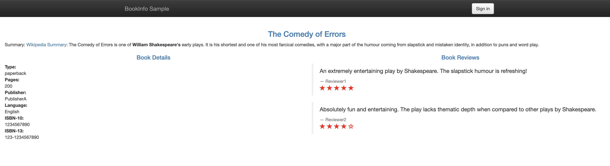
				- 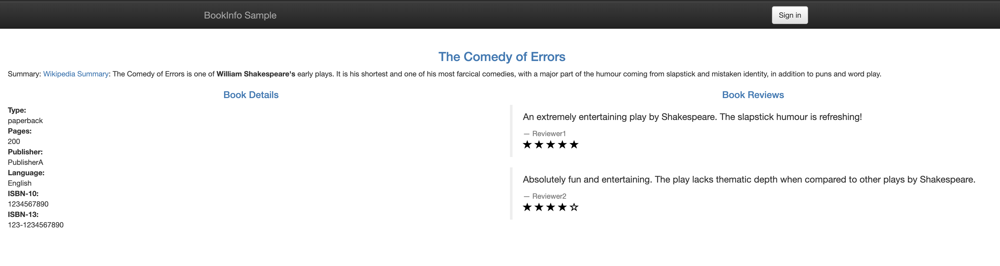
				- 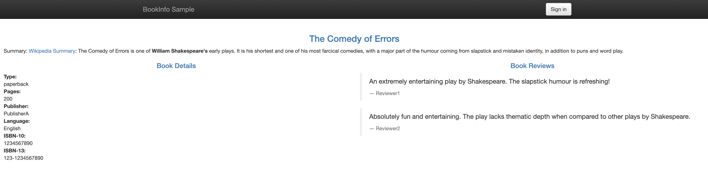
			- 应用虚拟服务
				- ~~~shell
				  # 应用虚拟服务
				  kubectl apply -f samples/bookinfo/networking/virtual-service-all-v1.yaml
				  
				  # 实际执行结果
				  [root@k8s-master-22 istio]# kubectl apply -f samples/bookinfo/networking/virtual-service-all-v1.yaml
				  virtualservice.networking.istio.io/productpage created
				  virtualservice.networking.istio.io/reviews created
				  virtualservice.networking.istio.io/ratings created
				  virtualservice.networking.istio.io/details created
				  
				  # 查看虚拟服务
				  kubectl get virtualservices -o yaml
				  
				  # 删除虚拟服务
				  kubectl delete -f samples/bookinfo/networking/virtual-service-all-v1.yaml
				  ~~~
				- ~~~yaml
				  apiVersion: networking.istio.io/v1alpha3
				  kind: VirtualService
				  metadata:
				    name: productpage
				  spec:
				    hosts:
				    - productpage
				    http:
				    - route:
				      - destination:
				          host: productpage
				          subset: v1
				  ---
				  apiVersion: networking.istio.io/v1alpha3
				  kind: VirtualService
				  metadata:
				    name: reviews
				  spec:
				    hosts:
				    - reviews
				    http:
				    - route:
				      - destination:
				          host: reviews
				          subset: v1
				  ---
				  apiVersion: networking.istio.io/v1alpha3
				  kind: VirtualService
				  metadata:
				    name: ratings
				  spec:
				    hosts:
				    - ratings
				    http:
				    - route:
				      - destination:
				          host: ratings
				          subset: v1
				  ---
				  apiVersion: networking.istio.io/v1alpha3
				  kind: VirtualService
				  metadata:
				    name: details
				  spec:
				    hosts:
				    - details
				    http:
				    - route:
				      - destination:
				          host: details
				          subset: v1
				  ---
				  
				  ~~~
				- 只出现v1版本
					- 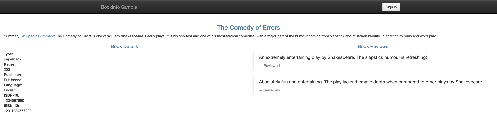{:height 177, :width 716}
				- 如果只应用了虚拟服务，没有应用目标规则
					- 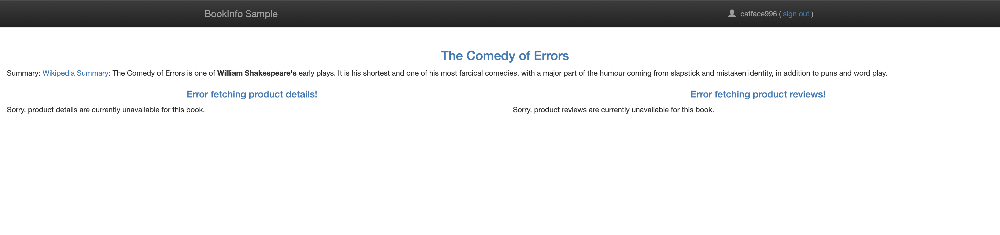
			- 应用虚拟服务之后，测试新的路由
				- 通过浏览器请求 /productpage   完整地址： http://192.168.162.22:31606/productpage
				- 验证结果，无论请求多少次，始终是v1版本
					- 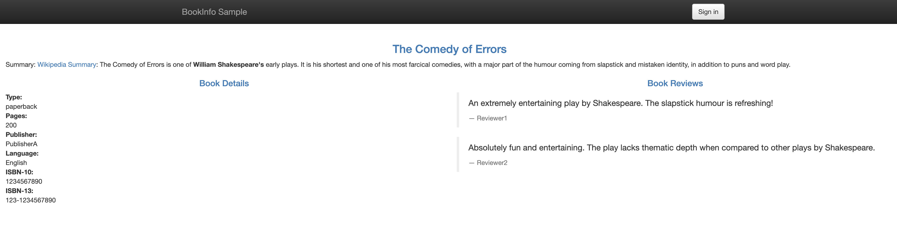
					-
			- 基于用户身份的路由
				- 启用基于用户的路由
					- ~~~shell
					  kubectl apply -f samples/bookinfo/networking/virtual-service-reviews-test-v2.yaml
					  
					  # 实际执行结果
					  [root@k8s-master-22 istio]# kubectl apply -f samples/bookinfo/networking/virtual-service-reviews-test-v2.yaml
					  virtualservice.networking.istio.io/reviews configured
					  ~~~
					- ~~~yaml
					  apiVersion: networking.istio.io/v1alpha3
					  kind: VirtualService
					  metadata:
					    name: reviews
					  spec:
					    hosts:
					      - reviews
					    http:
					    - match:
					      - headers:
					          end-user:
					            exact: jason
					      route:
					      - destination:
					          host: reviews
					          subset: v2
					    - route:
					      - destination:
					          host: reviews
					          subset: v1
					  
					  ~~~
				- 未登录
					- 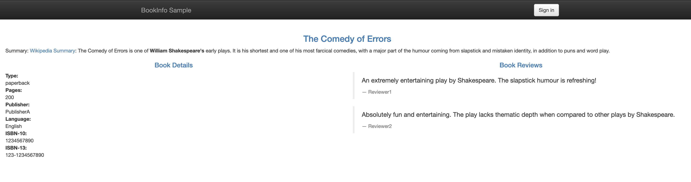
				- 使用jason登录
					- 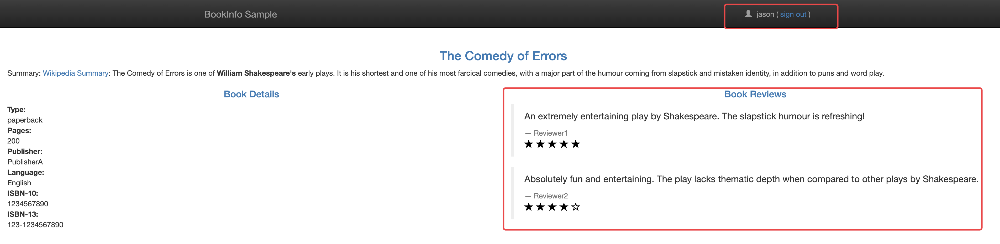
				- 使用其他任何用户登录，例如：catface996
					- 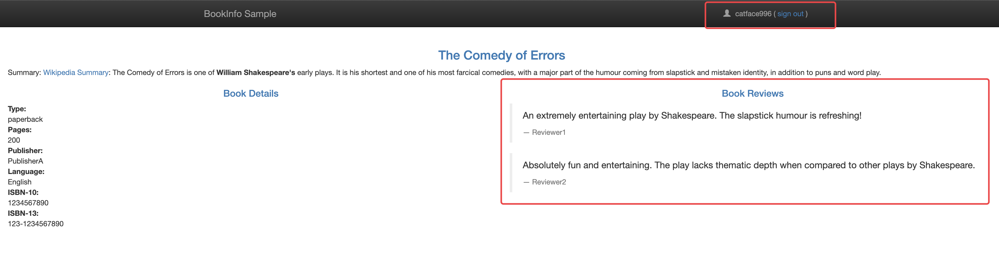
			- 了解发生了什么
			- 清理
				- ~~~shell
				  kubectl delete -f samples/bookinfo/networking/virtual-service-all-v1.yaml
				  ~~~
		- [故障注入](https://istio.io/latest/zh/docs/tasks/traffic-management/fault-injection/)
		  id:: 6264e673-0dc2-4025-9229-96f2cb81461a
			- 开始之前
				- ✔️已经装好istio。
				- ✔️已经部署Bookinfo，并应用了默认的目标规则。
				  collapsed:: true
					- ((62638d0b-25b9-4026-8323-d21e1daf5501))
				- TODO  在流量管理概念文档中查看有关 ((6264e77a-3345-4ce0-a63f-2bae8b1149fb)) 的讨论。
				- TODO 通过自行配置请求路由任务或运行一下命令来初始化应用程序版本路由。
				  collapsed:: true
				  :LOGBOOK:
				  CLOCK: [2022-04-24 Sun 16:20:06]--[2022-04-24 Sun 16:20:07] =>  00:00:01
				  :END:
					- ~~~shell
					  kubectl apply -f samples/bookinfo/networking/virtual-service-all-v1.yaml
					  kubectl apply -f samples/bookinfo/networking/virtual-service-reviews-test-v2.yaml
					  ~~~
				- 经过上面的配置，下面是请求的流程：
					- productpage → reviews:v2 → ratings (针对 jason 用户)
						- TODO 浏览器访问，kiali展示
					- productpage → reviews:v1 (其他用户)
						- TODO 浏览器访问，kiali展示
				- ((62638d0b-8892-4c54-b53c-439a6660ef62)) 和 ((62638d0b-abac-4fa7-bb9a-8d08efa0a4f6))
			- 注入HTTP延迟故障
				- 创建故障注入规则以延迟来自测试用户jason的流量
				  collapsed:: true
					- ~~~shell
					  # 查看 virtual-service-ratings-test-delay.yaml
					  [root@k8s-master-22 istio]# cat samples/bookinfo/networking/virtual-service-ratings-test-delay.yaml
					  apiVersion: networking.istio.io/v1alpha3
					  kind: VirtualService
					  metadata:
					    name: ratings
					  spec:
					    hosts:
					    - ratings
					    http:
					    - match:
					      - headers:
					          end-user:
					            exact: jason
					      fault:
					        delay:
					          percentage:
					            value: 100.0
					          fixedDelay: 7s
					      route:
					      - destination:
					          host: ratings
					          subset: v1
					    - route:
					      - destination:
					          host: ratings
					          subset: v1
					          
					  # 应用延迟
					  kubectl apply -f samples/bookinfo/networking/virtual-service-ratings-test-delay.yaml
					  ~~~
				- 确认规则已经创建
				  collapsed:: true
					- ~~~shell
					  kubectl get virtualservice ratings -o yaml
					  
					  # 确认结果
					  [root@k8s-master-22 istio]# kubectl get virtualservice ratings -o yaml
					  apiVersion: networking.istio.io/v1beta1
					  kind: VirtualService
					  metadata:
					    annotations:
					      kubectl.kubernetes.io/last-applied-configuration: |
					        {"apiVersion":"networking.istio.io/v1alpha3","kind":"VirtualService","metadata":{"annotations":{},"name":"ratings","namespace":"default"},"spec":{"hosts":["ratings"],"http":[{"fault":{"delay":{"fixedDelay":"7s","percentage":{"value":100}}},"match":[{"headers":{"end-user":{"exact":"jason"}}}],"route":[{"destination":{"host":"ratings","subset":"v1"}}]},{"route":[{"destination":{"host":"ratings","subset":"v1"}}]}]}}
					    creationTimestamp: "2022-04-24T04:46:10Z"
					    generation: 3
					    name: ratings
					    namespace: default
					    resourceVersion: "102703"
					    uid: 5df5c140-d41c-4d31-ab5f-3b4885155f28
					  spec:
					    hosts:
					    - ratings
					    http:
					    - fault:
					        delay:
					          fixedDelay: 7s
					          percentage:
					            value: 100
					      match:
					      - headers:
					          end-user:
					            exact: jason
					      route:
					      - destination:
					          host: ratings
					          subset: v1
					    - route:
					      - destination:
					          host: ratings
					          subset: v1
					  ~~~
			- 测试延迟配置
				- 通过浏览器打开Bookinfo应用。
				- 使用用户jason登录到、productpage页面。
				- 查看页面的响应时间。
				- 结果：
					- 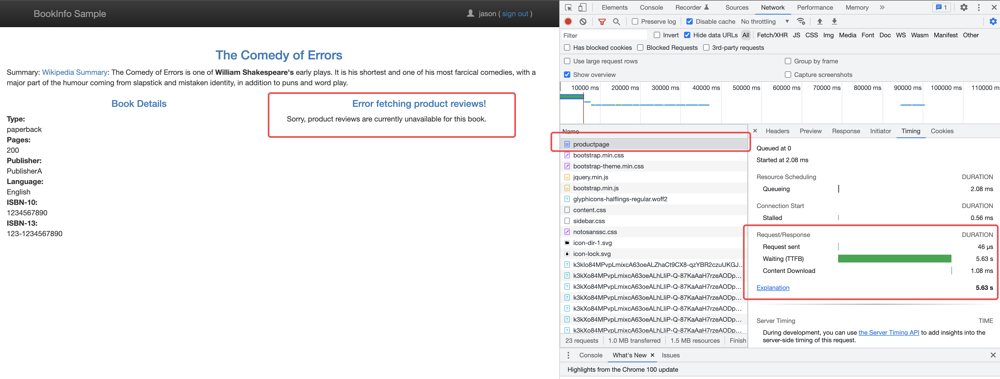
					- 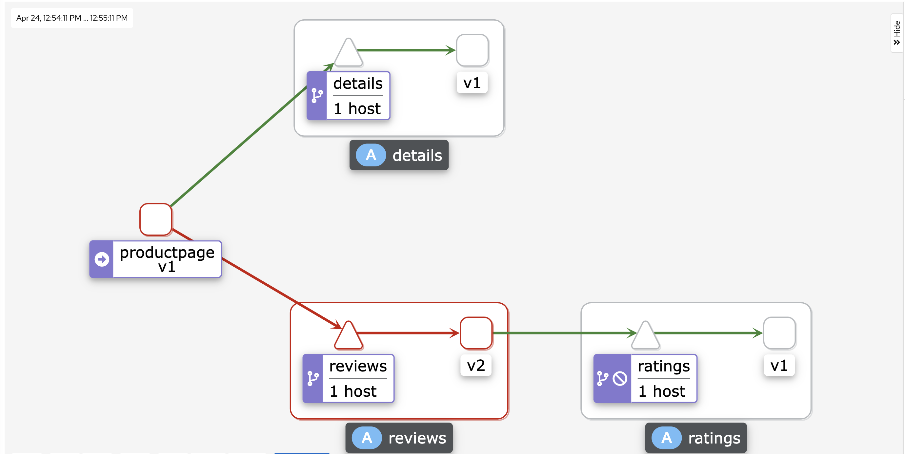
					-
			- 理解原理
				- productpage -- 3s * 2 --> reviews -- 10s --> ratings
			- 错误修复
				- 增加productpage与reviews服务之间的超时或降低reviews与ratings的超时。
				- 终止并重启修复后端额微服务。
				- 确认/productpage页面正常响且没有任何错误。
			- 注入HTTP abort故障
				- 为用户jason创建一个发送HTTP abort的故障注入规则
				  ~~~shell
				  # 查看待应用的abort配置
				  [root@k8s-master-22 istio]# cat  samples/bookinfo/networking/virtual-service-ratings-test-abort.yaml
				  apiVersion: networking.istio.io/v1alpha3
				  kind: VirtualService
				  metadata:
				    name: ratings
				  spec:
				    hosts:
				    - ratings
				    http:
				    - match:
				      - headers:
				          end-user:
				            exact: jason
				      fault:
				        abort:
				          percentage:
				            value: 100.0
				          httpStatus: 500
				      route:
				      - destination:
				          host: ratings
				          subset: v1
				    - route:
				      - destination:
				          host: ratings
				          subset: v1
				          
				  # 应用配置        
				  kubectl apply -f samples/bookinfo/networking/virtual-service-ratings-test-abort.yaml
				  ~~~
				- 确认规则已经创建
				  ~~~shell
				  kubectl get virtualservice ratings -o yaml
				  
				  ## 查看结果
				  [root@k8s-master-22 istio]# kubectl get virtualservice ratings -o yaml
				  apiVersion: networking.istio.io/v1beta1
				  kind: VirtualService
				  metadata:
				    annotations:
				      kubectl.kubernetes.io/last-applied-configuration: |
				        {"apiVersion":"networking.istio.io/v1alpha3","kind":"VirtualService","metadata":{"annotations":{},"name":"ratings","namespace":"default"},"spec":{"hosts":["ratings"],"http":[{"fault":{"abort":{"httpStatus":500,"percentage":{"value":100}}},"match":[{"headers":{"end-user":{"exact":"jason"}}}],"route":[{"destination":{"host":"ratings","subset":"v1"}}]},{"route":[{"destination":{"host":"ratings","subset":"v1"}}]}]}}
				    creationTimestamp: "2022-04-24T04:46:10Z"
				    generation: 4
				    name: ratings
				    namespace: default
				    resourceVersion: "104859"
				    uid: 5df5c140-d41c-4d31-ab5f-3b4885155f28
				  spec:
				    hosts:
				    - ratings
				    http:
				    - fault:
				        abort:
				          httpStatus: 500
				          percentage:
				            value: 100
				      match:
				      - headers:
				          end-user:
				            exact: jason
				      route:
				      - destination:
				          host: ratings
				          subset: v1
				    - route:
				      - destination:
				          host: ratings
				          subset: v1
				  ~~~
			- 测试终止配置
				- 用浏览器打开Bookinfo应用。
				- 使用用户jason登录到/productpage页面。
					- 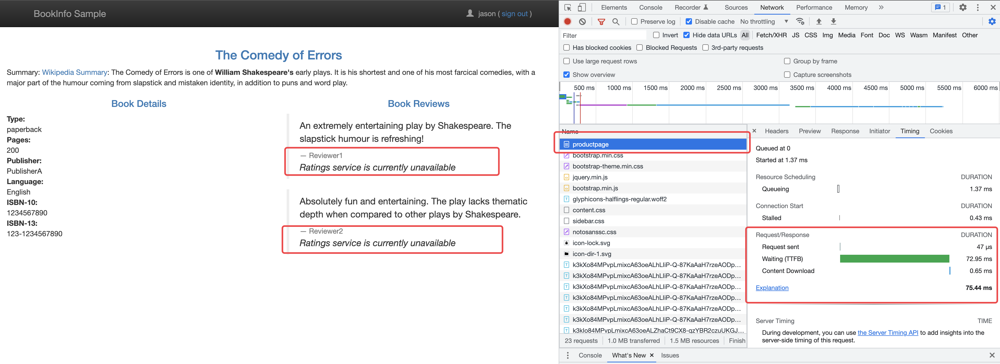
					- 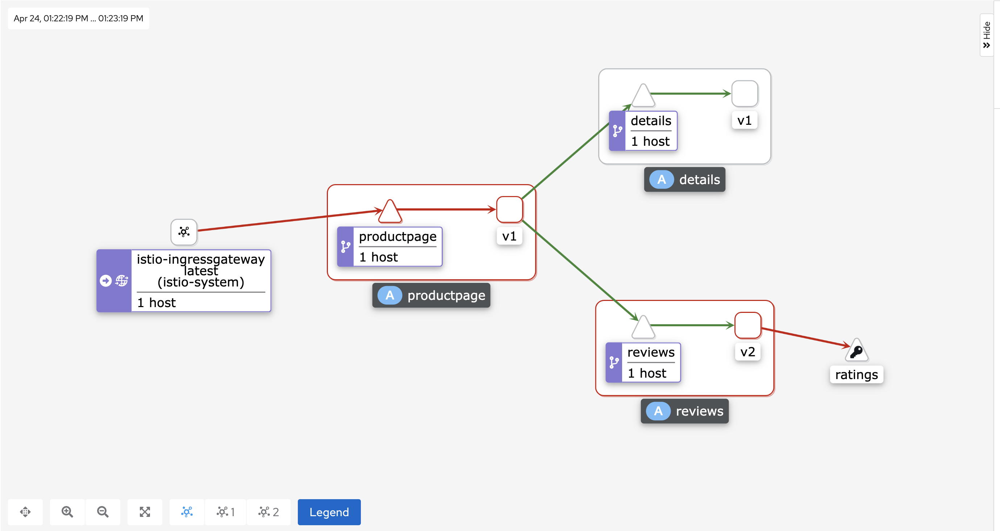
				- 使用匿名用户打开Bookinfo。
					- 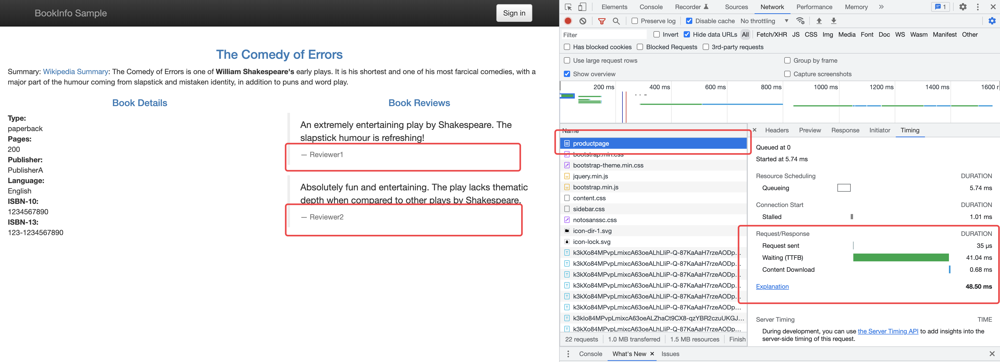
					- 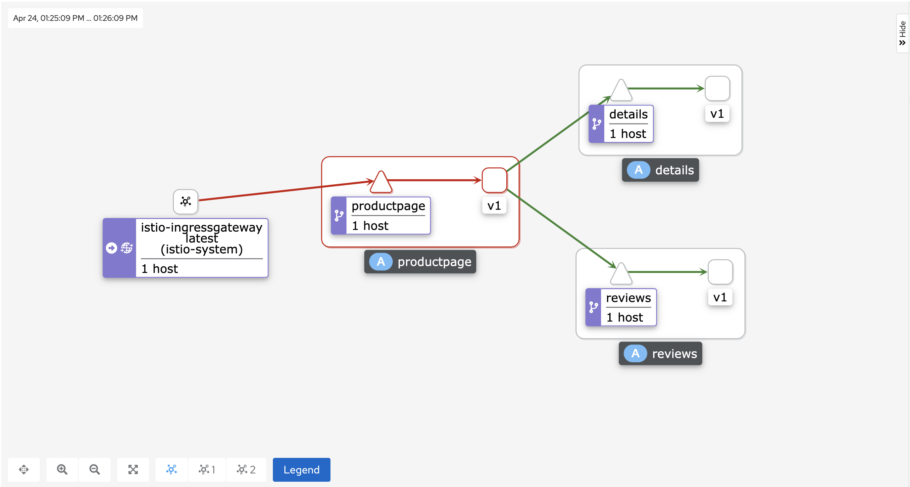
			- 清理
				- ~~~shell
				  kubectl delete -f samples/bookinfo/networking/virtual-service-all-v1.yaml
				  ~~~
		-
- 概念
	- [流量管理](https://istio.io/latest/zh/docs/concepts/traffic-management)
		- [故障注入](https://istio.io/latest/zh/docs/concepts/traffic-management/#fault-injection)
		  id:: 6264e77a-3345-4ce0-a63f-2bae8b1149fb
			- 描述
				- 可以使用 Istio 的故障注入机制来为整个应用程序测试故障恢复能力。
				- Istio 允许在应用层注入错误。这使您可以注入更多相关的故障，例如 HTTP 错误码，以获得更多相关的结果。
			- 故障分类
				- 延迟：延迟是时间故障。它们模拟增加的网络延迟或一个超载的上游服务。
				- 终止：终止是崩溃失败。他们模仿上游服务的失败。终止通常以 HTTP 错误码或 TCP 连接失败的形式出现。
			- 注意
				- Istio 故障恢复功能对应用程序来说是完全透明的。在返回响应之前，应用程序不知道 Envoy sidecar 代理是否正在处理被调用服务的故障。这意味着，如果在应用程序代码中设置了故障恢复策略，那么您需要记住这**两个策略都是独立工作**的，否则会发生冲突。例如，假设您设置了两个超时，一个在虚拟服务中配置，另一个在应用程序中配置。应用程序为服务的 API 调用设置了 2 秒超时。而您在虚拟服务中配置了一个 3 秒超时和重试。在这种情况下，应用程序的超时会先生效，因此 Envoy 的超时和重试尝试会失效。
			-
- 例子
  collapsed:: true
	- [图书应用](https://istio.io/latest/docs/examples/bookinfo/)
		- 没有istio的版本
			- 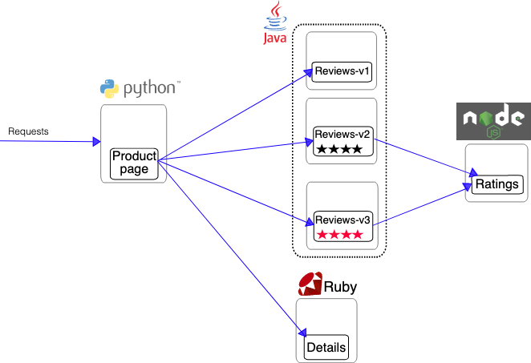
			-
		- 部署了istio的版本
			- 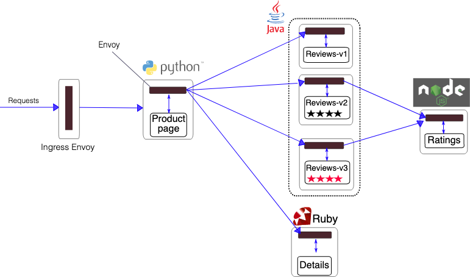
			-
-