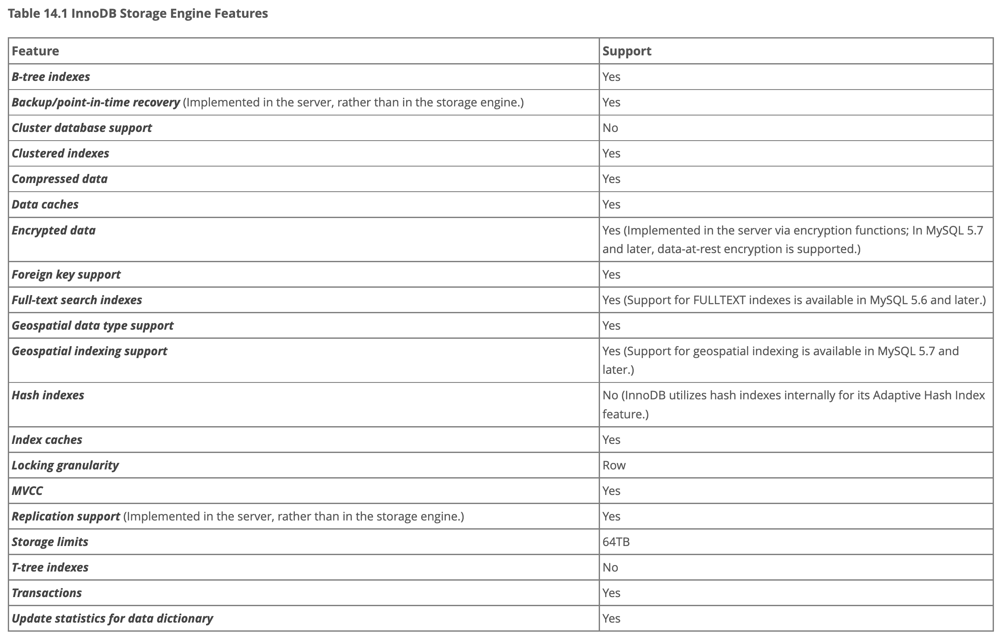

title:: 14.1 InnoDB 简介

-
- [[14.1.1 使用 InnoDB 表的好处]]
- [[14.1.2 InnoDB Tables 的最佳实践]]
- [[14.1.3验证 InnoDB 是默认存储引擎]]
- [[14.1.4与 InnoDB 进行测试和基准测试]]
- [[14.1.5关闭 InnoDB]]
- 在 MySQL 5.7中，InnoDB 是默认的 MySQL 存储引擎。
- InnoDB 的主要优势
	- 它的 DML 操作遵循 [[ACID]模型，事务具有提交，回滚和崩溃恢复功能，以保护用户数据。
	- 行级锁，多用户的高并发读取性能。
	- 基于主键的查询优化。
	- 为了保持数据的完整性，InnoDB 支持 foreignkey 约束。使用外键时，将检查插入、更新和删除，以确保它们不会导致相关表之间的不一。
	- 
-
-
-
-
-
-