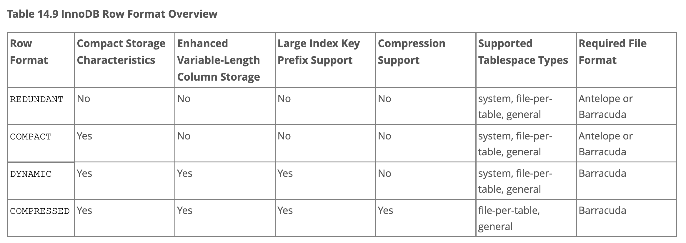
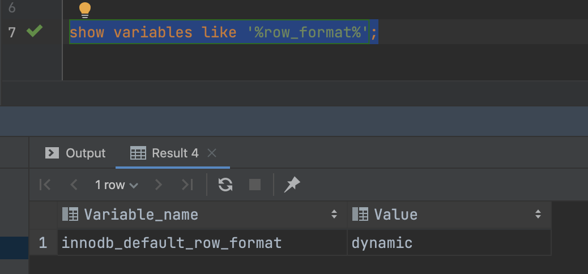

title:: 14.11 InnoDB Row Formats

- 官方文档
  collapsed:: true
	- 
	- 查看默认的行格式
		- ``` sql
		  	  show variables like '%row_format%';
		  ```
	- 
	- ## REDUNDANT 行格式
		- 该REDUNDANT格式提供与旧版本 MySQL 的兼容性。
		- 两种文件格式 (和)REDUNDANT都支持行 格式。有关更多信息，请参阅第 [[14.10 InnoDB 文件格式管理]]。
		- 使用冗余行格式的表将前768个字节的可变长度列值(VARCHAR、 VARBINARY、 BLOB 和 TEXT 类型)存储在 B-tree 节点中的索引记录中，其余的存储在overflow-page中。大于或等于768字节的固定长度列被编码为可变长度列，存储在 off-page。例如utf8mb4，如果字符集的最大字节长度大于3，CHAR (255)列可以超过768字节。
		- 如果列的值为768字节或更少，则不使用 overflow page，并且 i/o 中可能会节省一些资源，因为该值完全存储在 b 树节点中。这对于相对较短的 BLOB 列值非常有效，但可能会导致 b 树节点填充数据而不是键值，从而降低效率。具有许多 BLOB 列的表可能会导致 b- 树节点太满，并且包含太少的行，这使得整个索引的效率低于行较短或列值存储在页外的情况。
		- ### REDUNDANT 行格式存储特性
			- 每个索引记录都包含一个6字节的标头。标头用于链接连续的记录，并用于行级锁定。
			- 聚集索引中的记录包含所有用户定义列的字段。此外，还有一个6字节的事务 ID 字段和一个7字节的滚动指针字段。
			- 如果没有为表定义主键，则每个聚集索引记录还包含一个6字节的行 ID 字段。
			- 每个辅助索引记录都包含为聚集索引键定义的、不在辅助索引中的所有主键列。
			- 记录包含指向该记录的每个字段的指针。如果记录中字段的总长度小于128字节，则指针为一个字节; 否则为两个字节。指针的数组称为记录目录。指针指向的区域是记录的数据部分。
			- 在内部，固定长度的字符列，例如 CHAR(10)以固定长度格式存储。尾随空格不会从 VARCHAR列中截断。
			- 大于或等于 768 字节的固定长度列被编码为可变长度列，可以在页外存储。例如，CHAR(255)如果字符集的最大字节长度大于 3，则列可以超过 768 个字节，就像 utf8mb4.
			- SQL NULL值在记录目录中保留一个或两个字节。如果存储在可变长度列中， SQLNULL值会在记录的数据部分保留零字节。对于定长列，该列的定长保留在记录的数据部分。为值保留固定空间NULL 允许将列从原位更新 NULL为非NULL值，而不会导致索引页碎片。
	- ## COMPACT 行格式
		- COMPACT 行格式与 REDUNDANT 行格式相比减少了约20% 的行存储空间，代价是增加某些操作的 CPU 使用。如果您的工作负载典型地受到缓存命中率和磁盘速度的限制，那么 COMPACT 格式可能会更快。如果工作负载受到 CPU 速度的限制，紧凑格式可能会更慢。
		- COMPACT 行格式受 InnoDB 文件格式(Antelope 和 Barracuda)的支持。有关更多信息，请参阅第[[14.10 InnoDB 文件格式管理]]。
		- 使用 COMPACT 行格式的表将前768字节的可变长度列值(VARCHAR、 VARBINARY、 BLOB 和 TEXT 类型)存储在 B-tree 节点中的索引记录中，其余的存储在溢出页面中。大于或等于768字节的固定长度列被编码为可变长度列，存储在 off-page。例如utf8mb4，如果字符集的最大字节长度大于3，CHAR (255)列可以超过768字节。
		- ###  COMPACT 行格式存储特性
		  id:: 629065f5-80aa-4b96-943f-21a434c01396
			- 每个索引记录都包含一个5字节的标头，前面可能有一个可变长度的标头。标头用于链接连续的记录，并用于行级锁定。
			- 记录头的可变长度部分包含一个用于指示 NULL 列的位向量。如果索引中可以为 NULL 的列数为 n，则位向量占用(n/8)向上取整个字节。(例如，如果有9到16列可以为 NULL，则位向量使用两个字节。)NULL 列不占用除此向量中位以外的其他空间。记录头的可变长度部分还包含可变长度列的长度。根据列的最大长度，每个长度需要一个或两个字节。如果索引中的所有列都不为 NULL 并且具有固定长度，则记录标头没有可变长度部分。
			- 对于每个非 null 可变长度字段，记录头包含列的长度，单位为一个或两个字节。如果列的一部分存储在外部溢出页面中，或者最大长度超过255字节且实际长度超过127字节，则只需要两个字节。对于外部存储的列，2字节长度表示内部存储部件的长度，加上指向外部存储部件的20字节指针。内部部分是768字节，所以长度是768 + 20。20字节的指针存储列的真实长度。
			- 记录头后面跟着非 null 列的数据内容。
			- 聚集索引中的记录包含所有用户定义列的字段。此外，还有一个6字节的事务 ID 字段和一个7字节的滚动指针字段。
			- 如果没有为表定义主键，则每个聚集索引记录还包含一个6字节的行 ID 字段。
			- 每个二级索引记录包含为聚集索引键定义但不在二级索引中的所有主键列。如果任何主键列是可变长度的，则每个二级索引的记录头都有一个可变长度部分来记录它们的长度，即使二级索引是在固定长度列上定义的。
			- 在内部，对于非变长字符集，定长字符列(如CHAR(10))以固定长度格式存储。
			- 尾随空格不会从 VARCHAR列中截断。
			- 在内部，对于可变长度的字符集如 utf8mb3和 utf8mb4，InnoDB 尝试通过修剪尾随空格以 n 字节存储 CHAR (n)。如果 CHAR (n)列值的字节长度超过 n 个字节，尾随空间将被裁减到列值字节长度的最小值。CHAR (n)列的最大长度为字节长度 × n 的最大字符数。
			- 为 CHAR (n)保留最少 n 个字节。在许多情况下，保留最小空间 n 可以在不导致索引页碎片的情况下执行列更新。相比之下，当使用 REDUNDANT 行格式时，CHAR (n)列占用最大字符字节长度 × n。
			- 大于或等于768字节的固定长度列被编码为可变长度字段，可以存储在 off-page 中。例如utf8mb4，如果字符集的最大字节长度大于3，CHAR (255)列可以超过768字节。
	- ## DYNAMIC Row Format
		- DYNAMIC 行格式提供了与 COMPACT 行格式相同的存储特性，但增加了针对长可变长列的增强存储能力，并支持大索引键前缀。
		- Barracuda 文件格式支持 DYNAMIC 行格式，参见[[14.10 InnoDB 文件格式管理]]。
		- 当用 ROW _ format = DYNAMIC 创建表时，InnoDB 可以完全用 off-page 存储长可变长度的列值(对于 VARCHAR、 VARBINARY、 BLOB 和 TEXT 类型) ，聚集索引记录只包含指向溢出页面的20字节指针。大于或等于768字节的固定长度字段被编码为可变长度字段。例如utf8mb4，如果字符集的最大字节长度大于3，CHAR (255)列可以超过768字节。
		- 列是否存储在页外取决于页面大小和行的总大小。当一行太长时，选择最长的列进行页外存储，直到聚集索引记录适合B 树页面。 TEXT和BLOB小于或等于 40 字节的列存储在行中。
		- DYNAMIC 行格式保持了在索引节点中存储整个行的效率(COMPACT 和 REDUNDANT 格式也是如此) ，但 DYNAMIC 行格式避免了用大量长列数据字节填充 b 树节点的问题。DYNAMIC 行格式的基本思想是，如果长数据值的一部分存储在页面之外，那么将整个值存储在页面之外通常是最有效的。使用 DYNAMIC 格式，较短的列可能保留在 b 树节点中，从而最小化给定行所需的溢出页面数。
		- DYNAMIC 行格式支持最高可达3072字节的索引键前缀。此特性由 innodb _ large _ prefix 变量控制，该变量默认启用。有关更多信息，请参见 innodb _ large _ prefix 变量描述。
		- 使用了 DYNAMIC 行格式的表，可以存储在 system tablespaces，file-per-tablespaces 和 general tablespaces。为使 DYNAMIC行格式的表存储在 system tablespaces，要么禁用 innodb_file_per_table并且使用常规的 CREATE TABLE 或者 ALTER TABLE 语句，要么在 CREATE TABLE 或者 ALTER TABLE 时使用 TABLESPACE [=] innodb_system 选项。Innodb _ file _ per _ table 和 innodb _ file _ format 变量不适用于一般表空间，也不适用于使用 TABLESPACE [ = ] innodb _ system 表选项在系统表空间中存储 DYNAMIC 表。
		- ### DYNAMIC 行格式的特性
			- 同 COMPACT 行格式的特性。
	- ## COMPRESSED 行格式
		- COMPRESSED 行格式提供了与 DYNAMIC 行格式相同的存储特性和功能，但增加了对表格和索引数据压缩的支持。
		- Barracuda 文件格式支持 COMPRESSED 行格式，参见[[14.10 InnoDB 文件格式管理]]。
		- COMPRESSED 行格式使用类似于 DYNAMIC 行格式的 off-page 存储的内部细节，对表和索引数据进行压缩并使用更小的页面大小，从而提供额外的存储和性能考虑。使用 COMPRESSED 行格式，key _ block _ size 选项控制在聚集索引中存储多少列数据，以及在溢出页上存储多少列数据。有关 COMPRESSED 行格式的详细信息，请参阅第[[14.9 InnoDB 表和页面压缩]]。
		- COMPRESSED 行格式支持最高可达3072字节的索引键前缀。此特性由 innodb _ large _ prefix 变量控制，该变量默认启用。有关更多信息，请参见 innodb _ large _ prefix 变量描述。
		- 使用 COMPRESSED 行格式的表可以在file-per-table tablespaces 或 general tablespaces 中创建。system-tablespace 不支持 COMPRESSED 行格式。为了在 file-per-table tablespaces 中存储压缩表，必须启用 innodb _ file _ per _ table 变量，并且 innodb _ file _ format 必须设置为 Barracuda。Innodb _ file _ per _ table 和 innodb _ file _ format 变量不适用于 general tablespaces。general tablespaces 支持所有行格式，但需要注意的是，由于物理页面大小不同，压缩表和未压缩表不能在同一 general tablespaces 中共存。有关详细信息，请参阅第[[14.6.3.3 通用表空间]]。
		- ###  压缩行格式存储特性
			- COMPRESSED 行格式是 COMPACT 行格式的变体。有关存储特性，请参见 ((629065f5-80aa-4b96-943f-21a434c01396)) 。
			-
		-
		-
- 源码
	-
	-
	- rem0types.h