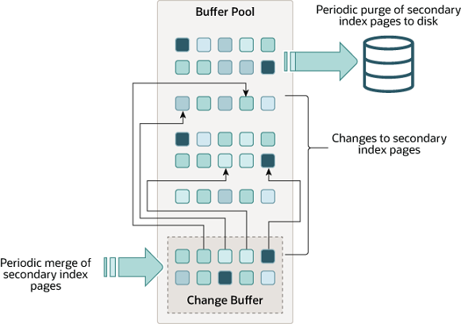

title:: 14.5.2 更改缓冲池

- 更改缓冲区是一种特殊的数据结构，当次要索引页不在缓冲池中时，缓存这些页的更改。缓冲的更改可能来自 INSERT、 UPDATE 或 DELETE 操作(DML) ，稍后当通过其他读取操作将页加载到缓冲池时，这些更改将被合并。
- 
- 与聚集索引不同，二级索引通常是非唯一的，并且插入到二级索引的顺序相对随机。同样，删除和更新可能会影响索引树中不相邻的辅助索引页。当受影响的页面被其他操作读入缓冲池时，在稍后合并缓存的更改，可以避免从磁盘将次要索引页面读入缓冲池所需的大量随机访问 i/o。
- 在系统大部分处于空闲状态或缓慢关闭期间运行的清除操作会定期将更新后的索引页写入磁盘。与将每个值立即写入磁盘相比，清除操作可以更有效地为一系列索引值写入磁盘块。
- 当有许多受影响的行和许多二级索引需要更新时，更改缓冲区合并可能需要几个小时。在此期间，磁盘 i/o 会增加，这可能导致磁盘绑定查询的速度显著减慢。更改缓冲区合并也可能在事务提交后继续发生，甚至在服务器关闭和重新启动之后(参见14.22.2节“强制 InnoDB 恢复”获得更多信息)。
- 在内存中，更改缓冲区占用缓冲池的一部分。在磁盘上，更改缓冲区是系统表空间的一部分，当数据库服务器关闭时，将缓冲索引更改。
- 缓存在更改缓冲区中的数据类型由 innodb _ change _ buffering 变量控制。有关更多信息，请参见配置更改缓冲区。您还可以配置最大更改缓冲区大小。有关详细信息，请参阅配置更改缓冲区最大大小。
- 如果辅助索引包含降序索引列，或者主键包含降序索引列，则不支持更改缓冲。
	- 为什么降序索引，不支持更改缓冲区？？
- 有关更改缓冲区的常见问题的答案，请参阅 a. 16节“ MySQL 5.7 FAQ: InnoDB 更改缓冲区”。
- ## 配置更改缓冲
	- 当对表执行 INSERT、 UPDATE 和 DELETE 操作时，索引列的值(特别是二级键的值)通常是按未排序的顺序排列的，需要大量 i/o 来更新二级索引。当相关页面不在缓冲池中时，更改缓冲区缓存将更改为辅助索引条目，从而避免了不立即从磁盘读取页面的昂贵 i/o 操作。当页面加载到缓冲池中时，缓冲区更改将被合并，更新的页面稍后将刷新到磁盘。主线程在服务器接近空闲和缓慢关闭期间合并缓冲的更改。
	- 因为它可以减少磁盘的读写，所以对于 i/o 限制的工作负载来说，更改缓冲最有价值; 例如，具有大量 DML 操作(如批量插入)的应用程序可以从更改缓冲中获益。
	- 但是，更改缓冲区占用缓冲池的一部分，从而减少了可用于缓存数据页的内存。如果工作集几乎与缓冲池匹配，或者如果表的二级索引相对较少，那么禁用更改缓冲区可能是有用的。如果工作数据集完全适合缓冲池，则更改缓冲区不会增加额外的开销，因为它只应用于不在缓冲池中的页。
	- InnoDB _ change _ buffering 变量控制 InnoDB 执行更改缓冲的范围。您可以启用或禁用插入、删除操作(当索引记录最初标记为删除时)和清除操作(当索引记录被物理删除时)的缓冲。更新操作是插入和删除的组合。默认 innodb _ change _ buffering 值就是全部。
		- 允许 innodb _ change _ buffering 值包括:
			- all 所有
				- 默认值: 缓冲区插入、删除标记操作和清除。
			- none 没有
				- 不要缓冲任何操作。
			- inserts 插入
				- 缓冲区插入操作。
			- deletes 删除
				- 缓冲区删除标记操作。
			- changes 更改
				- 对插入和删除标记操作进行缓冲。
			- purges 清洗
				- 缓冲发生在后台的物理删除操作。
	- 你可以在 MySQL 选项文件中设置 innodb _ change _ buffering 变量(mysqloption 文件中的 my.cn f 或 my.ini) ，或者使用 SET GLOBAL 语句动态更改它，这需要足够的特权来设置全局系统变量。请参阅第[[5.1.8.1 系统变量特权]]。更改设置会影响新操作的缓冲; 合并现有的缓冲条目不会受到影响。
- ## 配置更改缓冲区的最大大小
	- Innodb _ change _ buffer _ max _ size 变量允许将更改缓冲区的最大大小配置为缓冲池总大小的百分比。默认情况下，innodb _ change _ buffer _ max _ size 设置为25。最大设置为50。
	- 考虑在 MySQL 服务器上增加重量插入、更新和删除活动的 innodb change buffer max size，其中变更缓冲区合并不能跟上新的变更缓冲区条目的步伐，导致变更缓冲区达到其最大大小限制。
	- 考虑减少 MySQL 服务器上用于报告的静态数据的 innodb change buffer max size，或者如果更改缓冲区消耗了太多与缓冲池共享的内存空间，导致页面比预期提前老化出缓冲池。
	- 用具有代表性的工作负载测试不同的设置，以确定最佳配置。Innodb _ change _ buffer _ max _ size 变量是动态的，这允许在不重新启动服务器的情况下修改设置。
- ## 监察更改缓冲区
	- 略
	-
-
-