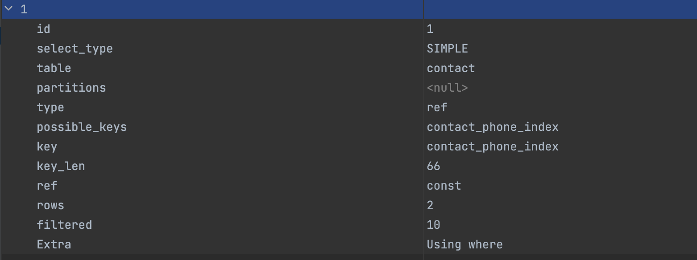
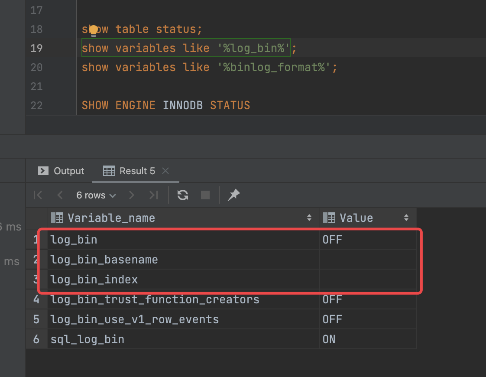

- 使用 READ COMMITTED 有额外的效果:
	- 对于 UPDATE 或 DELETE 语句，InnoDB 只为它更新或删除的行持有锁。在 MySQL 评估 WHERE 条件之后，释放不匹配行的记录锁。这大大降低了死锁的可能性，但它们仍然可能发生。
	- 对于 UPDATE 语句，如果一行已经锁定，InnoDB 执行“半一致”读取，将最新提交的版本返回给 MySQL，以便 MySQL 能够确定该行是否与 UPDATE 的 WHERE 条件匹配。如果该行匹配(必须更新) ，则 MySQL 再次读取该行，这次 InnoDB 要么锁定该行，要么等待锁定该行。
- 问题
	- 在使用 select for update 或者 update 语句时，执行计划中有使用到索引，并且所有使用的 where 过滤，查询返回的 rows 是否就是被锁定的 rows？
- 验证准备
	- 创建联系人表
		- ```sql
		  create table if not exists contact
		  (
		      id                bigint                                 not null comment 'ID'
		          primary key,
		      contact_name      varchar(16)                            not null comment '姓名',
		      phone             varchar(16)                            not null comment '电话',
		      province          varchar(16)                            not null comment '省份',
		      city              varchar(16)                            not null comment '城市',
		      county            varchar(16)                            not null comment '区县',
		      address_in_detail varchar(64)                            not null comment '详细地址',
		      created           datetime     default CURRENT_TIMESTAMP not null comment '创建时间',
		      updated           datetime     default CURRENT_TIMESTAMP not null comment '修改时间',
		      remark            varchar(128) default ''                not null comment '备注'
		  )
		      comment '联系人';
		  
		  ```
	- 在 phone 字段上创建普通索引
		- ```mysql
		  create index contact_phone_index
		      on contact (phone);
		  ```
	- 准备两条 phone 字段的值相同的记录
		- ```sql
		  INSERT INTO catface.contact (id, contact_name, phone, province, city, county, address_in_detail, created, updated, remark) VALUES (121212, '大猫', '17767675656', '山东省', '潍坊市', '奎文区', '不知道的地方', '2022-05-23 14:54:19', '2022-05-23 14:54:22', 'no');
		  INSERT INTO catface.contact (id, contact_name, phone, province, city, county, address_in_detail, created, updated, remark) VALUES (232323, '大猫', '17767675656', '浙江省', '杭州市', '西湖区', '山脚下的小草屋', '2022-05-23 14:55:23', '2022-05-23 14:55:25', 'no');
		  ```
	- 分别准备两个更新语句，在两个事务中执行
		- ```sql
		  -- 语句 1，在事务 1 中执行
		  update contact set remark = 'trx-1' where phone = '17767675656' and province = '山东省' ;
		  ```
		- ```sql
		  -- 语句 2，在事务 2 中执行
		  update contact set remark = 'trx-2' where phone = '17767675656' and province = '浙江省' ;
		  ```
	- 执行计划
		- ```sql
		  -- 待执行的 sql
		  explain select * from contact where phone = '17767675656' and province = '山东省' ;
		  ```
		- 
		-
	- 常用命令
		- ```shell
		  ## 重启 mysql
		  systemctl restart mysqld.service
		  ```
	- 常用 sql
		- ```sql
		  -- 查看会话的隔离级别
		  SELECT @@tx_isolation;
		  
		  
		  -- 设置会话的隔离级别为 read committed
		  set session transaction isolation level read committed;
		  
		  -- 查看 InnoDB 引擎的状态
		  SHOW ENGINE INNODB STATUS
		  
		  -- 查看 mysql 系统环境变量
		  show variables like '%log_bin%';
		  show variables like '%binlog_format%';
		  ```
- 验证场景
	- WHERE 条件中有**命中**索引
		- DONE 在repeatable-read隔离级别下，未开启 binlog
		  collapsed:: true
			- 结论：事务 1 **阻塞** 事务 2
			- 步骤
			  collapsed:: true
				- 会话 1 中执行事务 1
				- 会话 2 中执行事务 2，并检查是否被阻塞
		- DONE 在 repeatable-read 隔离级别下，开启 binlog，且binlog 的格式是 ROW（ROW 是 5.7.7 之后的默认格式）
		  collapsed:: true
			- 结论：事务 1 **阻塞** 事务 2
			- 步骤
				- 会话 1 中执行事务 1
				- 会话 2 中执行事务 2，并检查是否被阻塞
		- DONE 在 read-committed 隔离级别下，开启 binlog，且binlog 的格式是 ROW
		  collapsed:: true
		  :LOGBOOK:
		  CLOCK: [2022-05-24 Tue 12:30:50]--[2022-05-24 Tue 12:30:51] =>  00:00:01
		  :END:
			- 结论： 事务 1 **阻塞** 事务 2
			- 参考 [log_bin](https://dev.mysql.com/doc/refman/5.7/en/replication-options-binary-log.html#option_mysqld_log-bin)
			  ```properties
			  log_bin=mysql-bin
			  ```
			- 参考 [binlog_format](https://dev.mysql.com/doc/refman/5.7/en/replication-options-binary-log.html#sysvar_binlog_format)
			  ```properties
			  binglog-format=ROW
			  ```
			- 步骤
				- 检查 binlog 是否开启
				- 检查 binlog-format 格式
				- 会话 1 和会话 2 均更改为 read-committed 隔离级别
				- 会话 1 中执行事务 1
				- 会话 2 中执行事务 2，并检查是否被阻塞
		- DONE 在 read-committed 隔离级别下，开启 binlog，且 binlog 格式为 MIXED
		  collapsed:: true
			- 结论：事务 1 **阻塞**事务 2
		- DONE 在 read-committed 隔离级别下，开启 binlog，且 binlog 格式为 STATEMENT
		  collapsed:: true
			- [HY000][1665] Cannot execute statement: impossible to write to binary log since BINLOG_FORMAT = STATEMENT and at least one table uses a storage engine limited to row-based logging. InnoDB is limited to row-logging when transaction isolation level is READ COMMITTED or READ UNCOMMITTED.
		- DONE 在 read-committed 隔离级别下，不开启 binlog
		  collapsed:: true
			- 结论：事务 1 **阻塞**事务 2
			- 步骤
				- 检查 binlog 是否开启
				  collapsed:: true
					- 
				- 会话 1 和会话 2 均更改为 read-committed 隔离级别
				- 会话 1 中执行事务 1
				- 会话 2 中执行事务 2，并检查是否被阻塞
	- WHERE 条件中**未命中**索引（可删除 phone 字段上的索引）
		- DONE 在repeatable-read隔离级别下，未开启 binlog
		  collapsed:: true
		  :LOGBOOK:
		  CLOCK: [2022-05-23 Mon 23:06:46]--[2022-05-23 Mon 23:06:48] =>  00:00:02
		  :END:
			- 结论：事务 1 **阻塞** 事务 2
			- 步骤
				- 会话 1 中执行事务 1
				- 会话 2 中执行事务 2，并检查是否被阻塞
		- DONE 在 repeatable-read 隔离级别下，开启 binlog，且binlog 的格式是 ROW（ROW 是 5.7.7 之后的默认格式）
		  collapsed:: true
			- 结论：事务 1 **阻塞** 事务 2
			- 步骤
				- 会话 1 中执行事务 1
				- 会话 2 中执行事务 2，并检查是否被阻塞
		- DONE 在 read-committed 隔离级别下，开启 binlog，且binlog 的格式是 ROW
		  collapsed:: true
			- 结论： 事务 1 **不阻塞** 事务 2
			- 参考 [log_bin](https://dev.mysql.com/doc/refman/5.7/en/replication-options-binary-log.html#option_mysqld_log-bin)
			  ```properties
			  log_bin=mysql-bin
			  ```
			- 参考 [binlog_format](https://dev.mysql.com/doc/refman/5.7/en/replication-options-binary-log.html#sysvar_binlog_format)
			  ```properties
			  binglog-format=ROW
			  ```
			- 步骤
				- 检查 binlog 是否开启
				- 检查 binlog-format 格式
				- 会话 1 和会话 2 均更改为 read-committed 隔离级别
				- 会话 1 中执行事务 1
				- 会话 2 中执行事务 2，并检查是否被阻塞
		- DONE 在 read-committed 隔离级别下，开启 binlog，且 binlog 格式为 MIXED
		  collapsed:: true
			- 结论：事务 1 **不阻塞**事务 2
			- 原因：READ COMMITTED隔离级别 仅支持基于行的二进制日志记录 。如果使用READ COMMITTED with binlog_format=MIXED，服务器会**自动使用基于行的日志记录**。
		- DONE 在 read-committed 隔离级别下，开启 binlog，且 binlog 格式为 STATEMENT
		  collapsed:: true
			- [HY000][1665] Cannot execute statement: impossible to write to binary log since BINLOG_FORMAT = STATEMENT and at least one table uses a storage engine limited to row-based logging. InnoDB is limited to row-logging when transaction isolation level is READ COMMITTED or READ UNCOMMITTED.
		- DONE 在 read-committed 隔离级别下，不开启 binlog
		  collapsed:: true
			- 结论：事务 1 **不阻塞**事务 2
			- 步骤
				- 检查 binlog 是否开启
				  collapsed:: true
					- 
				- 会话 1 和会话 2 均更改为 read-committed 隔离级别
				- 会话 1 中执行事务 1
				- 会话 2 中执行事务 2，并检查是否被阻塞