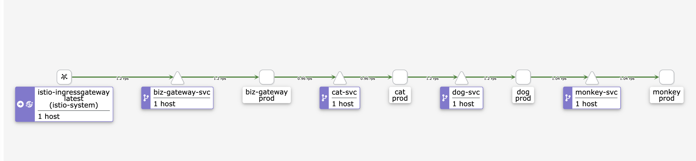

- 希望达成的目标
	- 业务网关做 prod、gray 决策
	- 动态修改用户所属 prod、gray
- 流量拓扑图
	- 
	-
- 代码及配置
	- SpringCloudGateway
		- 参考: https://github.com/spring-cloud/spring-cloud-release/wiki/Spring-Cloud-Hoxton-Release-Notes#hoxtonsr9
	- istio-demo-app
		- 用于部署 cat、dog、monkey 服务的源代码
		- github 地址： https://github.com/catface996/istio-demo-app
		- gitee地址： https://gitee.com/catface996/istio-demo-app
	- spring-cloud-gateway-istio 代码讲解
		- 源码地址
			- github 地址： https://github.com/catface996/spring-cloud-gateway-istio
			- gitee 地址： https://gitee.com/catface996/spring-cloud-gateway-istio
		- token转 userId
		- 根据 userId 决策 prod、gray
		- env=prod/gray 写入 request header 并传递
		- 7 层反向代理，代理后端 cat-svc
	- Deployment 配置说明
	- Service 配置说明
	- istio-gateway 配置说明
	- Destination Rule 配置说明
	- Virtual Service 配置说明
- 实施步骤及验证
	- ((62638d0b-abac-4fa7-bb9a-8d08efa0a4f6))
	- 打开jaejer 面板
	  id:: 6270bfa9-1172-4762-91d1-3013d8da52ac
		- [官方文档](https://istio.io/latest/zh/docs/tasks/observability/distributed-tracing/jaeger/)
		- ```shell
		  istioctl dashboard jaeger --address 192.168.162.22
		  ```
	- 部署Deployment
	  collapsed:: true
		- ```shell
		  ## 进入 ladder/code/istio/spring-cloud-gateway 后执行以下命令
		  
		  kubectl apply -f deployment.yaml
		  ```
		- 
		- 
	- 部署Service
	  collapsed:: true
		- ```shell
		  ## 进入 ladder/code/istio/spring-cloud-gateway 后执行以下命令
		  
		  kubectl apply -f service.yaml
		  ```
		- 
	- 绑定 spring-cloud-gateway 的 Virtual Service 和 istio-ingressgateway
	  collapsed:: true
		- ```shell
		  ## 进入 ladder/code/istio/spring-cloud-gateway 后执行以下命令
		  
		  kubectl apply -f biz-gateway-vs-bind-gateway.yaml
		  ```
		- 
	- 配置本地 hosts，通过 curl 访问 http://gateway.catface996.com:31606/cat/sayHello
	  collapsed:: true
		- 为什么要访问 /cat/sayHello   /cat 是用来在 spring cloud gateway 中做服务路由的前缀。
		- {:height 438, :width 716}
		- 
		- ```shell
		  curl http://gateway.catface996.com:31606/cat/sayHello
		  
		  ## 每秒访问一次
		  watch -n 1 curl -o /dev/null -s -w %{http_code} http://gateway.catface996.com:31606/cat/sayHello
		  ```
		- 
		- 
	- 部署 Destination Rule
	  collapsed:: true
		- ```shell
		  ## 进入 ladder/code/istio/spring-cloud-gateway 后执行以下命令
		  
		  kubectl apply -f destination-rule.yaml
		  ```
		- {:height 240, :width 716}
		- 
	- 部署 Virtual Service
	  collapsed:: true
		- ```shell
		  ## 进入 ladder/code/istio/spring-cloud-gateway 后执行以下命令
		  
		  kubectl apply -f virtual-service.yaml
		  ```
		- {:height 266, :width 716}
		- 
	- 不携带 token 访问
	  collapsed:: true
		- ```shell
		  curl http://gateway.catface996.com:31606/cat/sayHello
		  
		  ## 每秒访问一次
		  watch -n 1 curl -o /dev/null -s -w %{http_code} http://gateway.catface996.com:31606/cat/sayHello
		  ```
		- 
	- 针对不同的用户做灰度验证
		- 携带 token=def 访问
			- ```shell
			  curl -H "token:def" http://gateway.catface996.com:31606/cat/sayHello
			  
			  ## 实际执行结果
			  ➜  ~ curl -H "token:def" http://gateway.catface996.com:31606/cat/sayHello
			  TraceId: 4ae5015e98e9ebd521c067d04412ea18  header env(gray), I'm cat(gray) --> TraceId: 4ae5015e98e9ebd521c067d04412ea18  header env(gray), I'm dog(prod) --> TraceId: 4ae5015e98e9ebd521c067d04412ea18  header env(gray), I'm monkey(gray) --> %
			  ```
			- 开始有gray环境的流量
			- {:height 180, :width 685}
			- spring-cloud-gateway 日志
			- 
			- cat-dp-gray 日志
			- 
			- 全部变成 gray 环境的流量
			- 
		- 携带 token=abc 访问
			- ```shell
			  ## 使用 token=abc 访问 prod 环境
			  curl -H "token:abc" http://gateway.catface996.com:31606/cat/sayHello
			   
			  ## 实际执行结果
			  ➜  ~ curl -H "token:abc" http://gateway.catface996.com:31606/cat/sayHello
			  TraceId: cdae51d0a2153947487817ab4db3d405  header env(prod), I'm cat(prod) --> TraceId: cdae51d0a2153947487817ab4db3d405  header env(prod), I'm dog(prod) --> TraceId: cdae51d0a2153947487817ab4db3d405  header env(prod), I'm monkey(prod) --> %
			  ```
			- 逐渐有prod 环境的流量
			- {:height 221, :width 685}
			- spring-cloud-gateway 日志
			- 
			- cat-dp-prod 日志
			- 
			- 全部变成 prod 环境的流量
			- 
	- 修改用户所属环境再验证，将 token=abc 的用户流量，动态引导到 gray环境
		- ```shell
		  ## 将 token=abc 动态的从 prod 环境引导到 gray 环境
		  curl http://gateway.catface996.com:31606/setUserEnvironment -X POST -d '{"userId": "123","environment":"gray"}' --header "Content-Type: application/json"
		  
		  ## 实际执行结果
		  ➜  ~ curl http://gateway.catface996.com:31606/setUserEnvironment -X POST -d '{"userId": "123","environment":"gray"}' --header "Content-Type: application/json"
		  success%
		  ➜  ~
		  
		  ```
		- ```shell
		  ## 使用 token=abc 访问 sayHello
		  curl -H "token:abc" http://gateway.catface996.com:31606/cat/sayHello
		  
		  ## 实际执行结果
		  ➜  ~ curl -H "token:abc" http://gateway.catface996.com:31606/cat/sayHello
		  TraceId: b69805a2baf8e55fa6bd4a51df3eb709  header env(gray), I'm cat(gray) --> TraceId: b69805a2baf8e55fa6bd4a51df3eb709  header env(gray), I'm dog(prod) --> TraceId: b69805a2baf8e55fa6bd4a51df3eb709  header env(gray), I'm monkey(gray) --> %
		  ➜  ~
		  ```
		- 
		- 开始有 gray 的流量
		- 