# Java Platform, Standard Edition (Java SE) 8
	- [link](https://docs.oracle.com/javase/8/javase-books.htm)
	- [Java Platform Standard Edition 8 Documentation](https://docs.oracle.com/javase/8/docs/)
- JVM参数
  collapsed:: true
	- 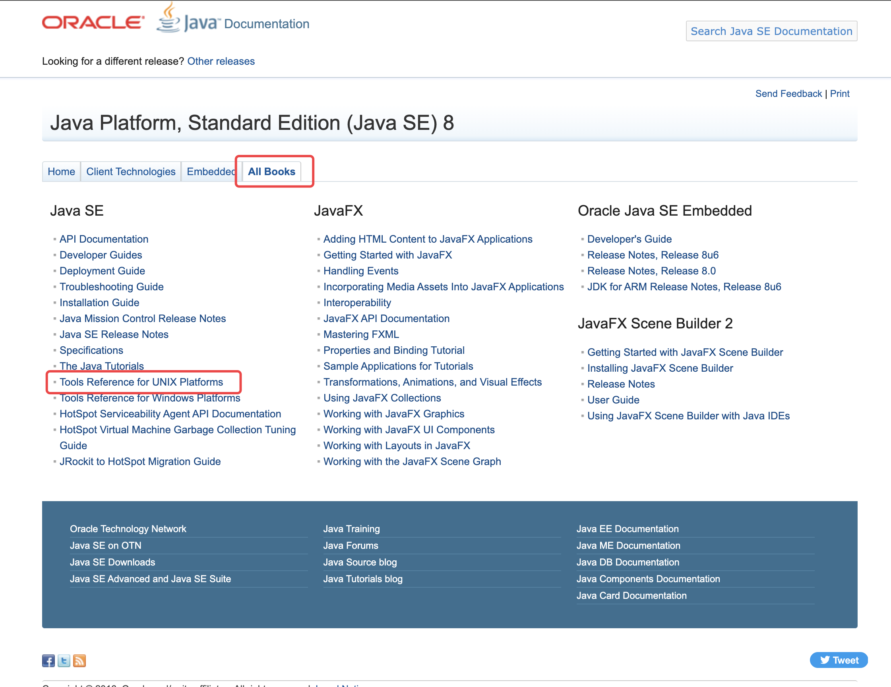
	- 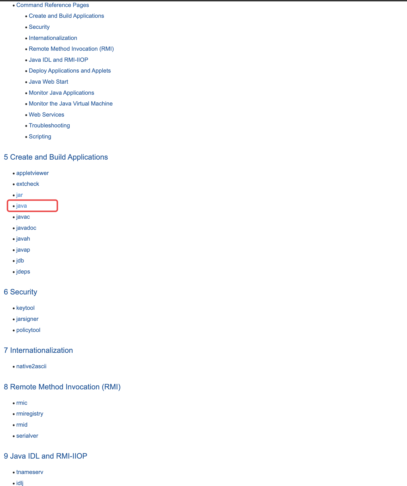
	- 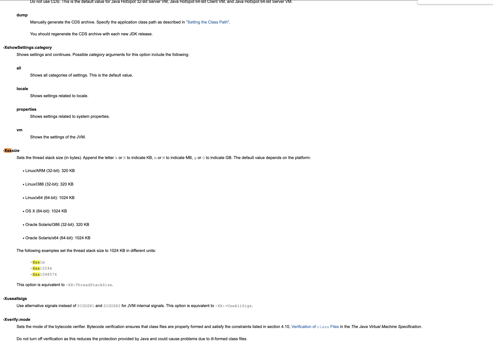
	-
- ## Xss
  collapsed:: true
	- ### 问题
	  collapsed:: true
		- 设置为1M是否在线程创建后，就会分配1M？
		- 一个线程栈的栈帧有多大？
		- 哪些因素会影响栈帧的大小？
		- 1M可以支持的方法调用深度是多少？
	- ### 验证 每个线程递归深度为400，每次创建1000个线程
	  collapsed:: true
		- 开始之前的内存
			- 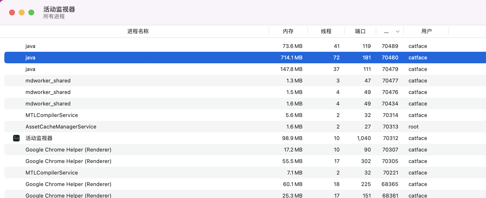
			- 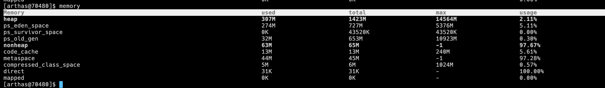
		- 创建1000个线程之后的内存
			- 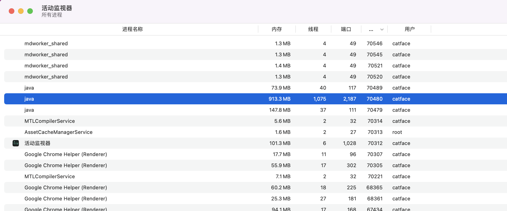
			- 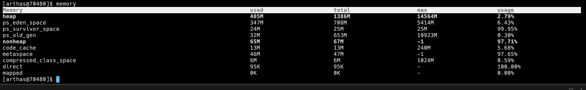
		- 创建2000个线程之后的内存
			- 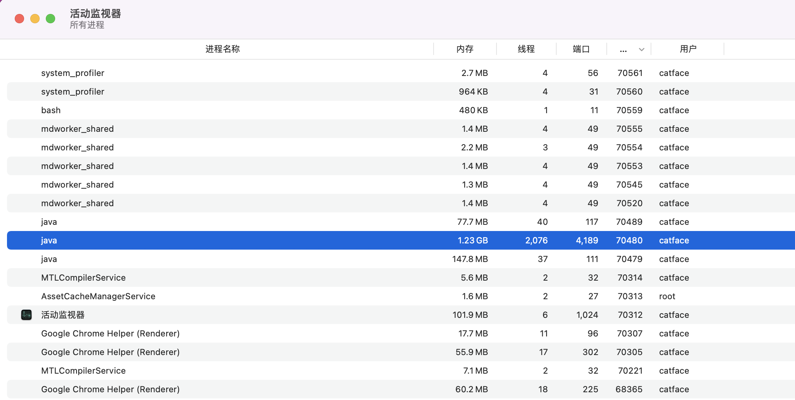
			- 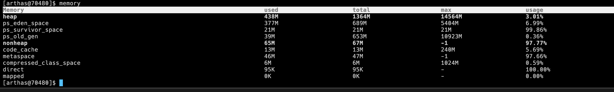
		- 创建3000个线程之后的内存
			- 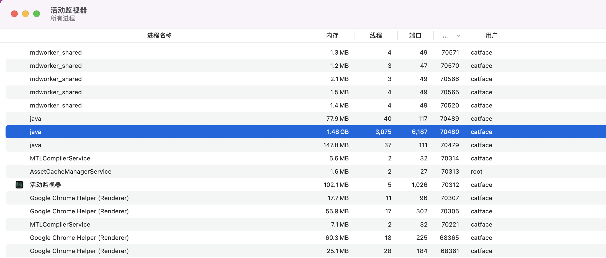
			- 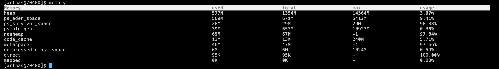
			- 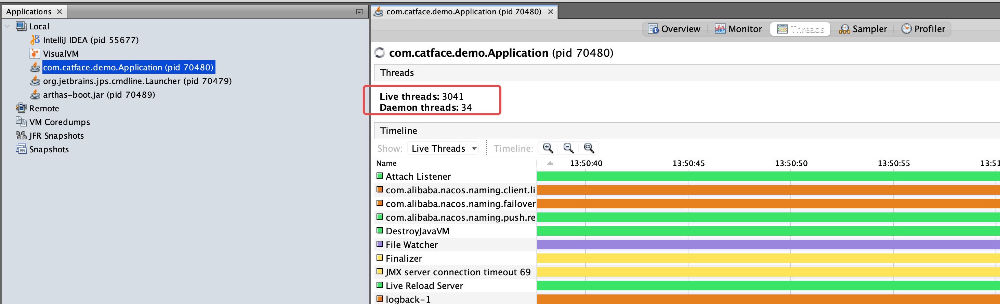
			-
	- 参考
		- [JVM 系列 - 内存区域 - Java 虚拟机栈（三）](https://www.jianshu.com/p/ecfcc9fb1de7)
		- [JVM设置栈大小](https://blog.csdn.net/weixin_44594041/article/details/108837968)
- ## 栈帧
	-
	- 参考
		- [JVM栈帧](https://www.cnblogs.com/jhxxb/p/11001238.html)
		- [Java Virtaul Machine Stacks](https://docs.oracle.com/javase/specs/jvms/se8/html/jvms-2.html#jvms-2.5)
		- [Frames](https://docs.oracle.com/javase/specs/jvms/se8/html/jvms-2.html#jvms-2.6)
		- [HotSpot栈帧实现](https://zhuanlan.zhihu.com/p/332248004)
		- 
		-
		-