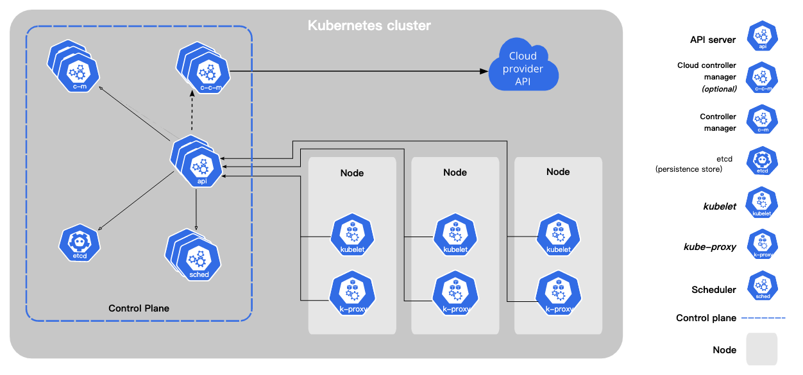

- 概念
	- 概述
	  collapsed:: true
		- [官网地址](https://kubernetes.io/zh/docs/concepts/overview/)
		- Kubernetes是什么?
		  collapsed:: true
		  id:: 62638d0b-8cf5-412e-b7e3-eb6a3d29b788
			- [官网地址](https://kubernetes.io/zh/docs/concepts/overview/what-is-kubernetes/)
			- 时光回溯
			  
				- 传统部署时代
					- 例如：安装Oracle
						- 针对操作系统准备安装包(下载或者U盘拷贝)
						- 安装Oracle需要的基础类库
						- 配置操作系统的相应配置
						- 执行安装检查，安装命令
						- 安装失败之后，要完全卸载
				- 虚拟化部署时代
					- 只是做了物理资源隔离，安装一个Oracle仍旧是个复杂的过程。
				- 容器部署时代
					- 敏捷应用程序的创建和部署
						- 关注点在如何构建应用程序的镜像以及启动镜像时的参数配置
					- 持续开发、集成和部署
					- 关注开发和运维的分离
					- 可观察性
					- 跨开发、测试和生产环境的一致性
						- 可以使用同样的构建产物，在不同的环境上运行，只是启动参数的差异。
					- 跨云和操作系统发型版本的可移植性
						- 容器运行环境解决了不同的云和操作系统之间的差异
					- 以应用程序为中心的管理
					- 松耦合、分布式、弹性、解放的微服务
						- 应用跟硬件，操作系统，网络都没有关系
						- 弹性：副本数可伸缩
					- 资源隔离
						- 每个应用使用的资管互不影响
					- 资源利用
						- 一个应用的资源利用不是固定的，例如启动一个应用的最低配置和最大需要的配置等。
			- 为什么需要Kubernetes,它能做什么?
				- 服务发现和负载均衡
					- 微服务的两大基石
						- RPC
						- 消息
				- 存储编排
				- 自动部署和回滚
				- 自动完成装箱计算
					- 背包问题
				- 自我修复
					- 传统部署方案需要写定时任务来做应用健康检查和自我修复
				- 秘钥与配置管理
			- Kubernetes不是什么
			  collapsed:: true
				- 不限制支持的应用类型。
				- 不部署源代码,也不构建你的应用程序。
				-
				-
		- Kubernetes组件
		  id:: 62638d0b-2509-439b-a1e1-df37b3aa61e2
		  collapsed:: true
			- [官网地址](https://kubernetes.io/zh/docs/concepts/overview/components/)
			- 
			- 控制平面组件(Control Plane Components)
				- kube-apiserver
					- 该组件公开了 Kubernetes API
					- 支持水平扩展
						- x轴扩展 增加副本数 ✔️
						- y轴扩展 功能、业务拆分成不同的微服务
						- z轴扩展 数据分片，租户隔离
				- [[etcd]]
					- etcd 是兼具一致性和高可用性的键值数据库
						- ((6263b38c-6891-4342-9190-7b68c9b803ee)) 一致性 ✔️
						- ((6263b398-d03f-403d-a306-39fb4491a41b)) 高可用 ✔️
						- ((6263b3ab-4843-43de-97ba-a431f053b10a)) 分区容错 X
				- kube-scheduler
					- 负责监视新创建的、未指定运行节点的 Pods，选择节点让 Pod 在上面运行。
					- 调度决策考虑的因素包括
						- 单个 Pod 和 Pod 集合的资源需求
						- 硬件/软件/策略约束
						- 亲和性和反亲和性规范
						- 数据位置
						- 工作负载间的干扰和最后时限
				- kube-controller-manager
				  collapsed:: true
					- 节点控制器（Node Controller）: 负责在节点出现故障时进行通知和响应
					- 任务控制器（Job controller）: 监测代表一次性任务的 Job 对象，然后创建 Pods 来运行这些任务直至完成
					- 端点控制器（Endpoints Controller）: 填充端点(Endpoints)对象(即加入 Service 与 Pod)
					- 服务帐户和令牌控制器（Service Account & Token Controllers）: 为新的命名空间创建默认帐户和 API 访问令牌
				- cloud-controller-manager
				  collapsed:: true
					- 节点控制器（Node Controller）: 用于在节点终止响应后检查云提供商以确定节点是否已被删除
					- 路由控制器（Route Controller）: 用于在底层云基础架构中设置路由
					- 服务控制器（Service Controller）: 用于创建、更新和删除云提供商负载均衡器
			- Node组件
				- kubelet
					- 一个在集群中每个节点上运行的代理。
					- 它保证容器（containers）都 运行在 Pod 中。
					- kubelet 接收一组通过各类机制提供给它的 PodSpecs，确保这些 PodSpecs 中描述的容器处于运行状态且健康。
					- kubelet 不会管理不是由 Kubernetes 创建的容器。
				- kube-proxy
					- 是集群中每个节点上运行的网络代理
					- 维护节点上的网络规则
					- 如果操作系统提供了数据包过滤层并可用的话，kube-proxy 会通过它(例如[[iptables]])来实现网络规则。否则， kube-proxy 仅转发流量本身。
				- 容器运行时(Container Runtime)
				  collapsed:: true
					- [[Docker]]
					- [[containerd]]
					- [[CRI-O]]
			- 插件(Addon
				- DNS
					- 集群 DNS 是一个 DNS 服务器，和环境中的其他 DNS 服务器一起工作，它为 Kubernetes 服务提供 DNS 记录。
					- Kubernetes 启动的容器自动将此 DNS 服务器包含在其 DNS 搜索列表中。
				- Web界面(仪表盘)
				- 容器资源监控
				- 集群层面日志
		- KubernetesAPI
		  collapsed:: true
			- [官网地址](https://kubernetes.io/zh/docs/concepts/overview/kubernetes-api/)
			- OpenAPI规范
				- OpenAPI V2
				- OpenAPI V3
		- 使用Kubernetes对象
		  id:: 62638d0b-9f49-4406-a924-d4ea728d6efb
			- [官网地址]((https://kubernetes.io/zh/docs/concepts/overview/working-with-objects/))
			- 理解Kubernetes对象
			  id:: 62638d0b-62aa-4e9f-9892-128653b42c87
			  collapsed:: true
				- [官网地址](https://kubernetes.io/zh/docs/concepts/overview/working-with-objects/kubernetes-objects/)
				- 总结
					- Kubernetes 对象是持久化的实体
					- Kubernetes 使用这些实体去表示整个集群的状态
					- 达成的效果
						- 哪些容器化应用在运行（以及在哪些节点上）
						- 可以被应用使用的资源
						- 关于应用运行时表现的策略，比如重启策略、升级策略，以及容错策略
					- Kubernetes 对象是 “目标性记录” —— 一旦创建对象，Kubernetes 系统将持续工作以确保对象存在。 通过创建对象，本质上是在告知 Kubernetes 系统，所需要的集群工作负载看起来是什么样子的， 这就是 Kubernetes 集群的 期望状态（Desired State）。
						- ~~~sql
						  select amount from wallet where user_id = 123456;
						  100
						  
						  update wallet set amount = amount+10 where user_id = 123456;
						  
						  or 
						  
						  update wallet set amount = 100+10 where user_id = 123456; 
						  ~~~
					- 所有对Kubernetes对象的操作，最终都是通过使用 Kubernetes API
				- 对象规约（Spec）与状态（Status）
					- Spec： 对象期望状态（Desired State）
					- Status：对象当前状态（Current State）
				- 描述 Kubernetes 对象
					- 多数情况下是使用yaml文件描述。
				- 必需字段
					- apiVersion - 创建该对象所使用的 Kubernetes API 的版本
						- 例如：apps/v1
					- kind - 想要创建的对象的类别
						- 例如：Pod，Deployment，Service
					- metadata - 帮助唯一性标识对象的一些数据，包括一个 name 字符串、UID 和可选的 namespac
					- spec - 你所期望的该对象的状态，对象 spec 的精确格式对每个 Kubernetes 对象来说是不同的。
			- Kubernetes对象管理
			  id:: 62638d0b-2d2a-4742-b172-68791f409b92
			  collapsed:: true
				- [官网地址](https://kubernetes.io/zh/docs/concepts/overview/working-with-objects/object-management/)
				- 管理技巧
					- 
				- 指令式命令
					- [官方文档](https://kubernetes.io/zh/docs/tasks/manage-kubernetes-objects/imperative-command/)
					- 例子
					  kubectl create deployment nginx --image nginx
					- 权衡
						- 与对象配置相比的有点：
							- 命令简单，易学且易于记忆。
							- 命令仅需一步即可对集群进行更改。
						- 与对象配置相比的缺点：
							- 命令不便于与变更审查流程的集成。
							- 命令不提供与更改关联的审核跟踪。
							- 除了实时内容外，命令不提供记录原。
							- 明星不提供用于创建新对象的模板。
				- 指令式对象配置
					- [官方文档](https://kubernetes.io/zh/docs/tasks/manage-kubernetes-objects/imperative-config/)
					- 例子
						- kubectl create -f nginx.yaml
						- kubectl delete -f nginx.yaml -f redis.yaml
						- kubectl replace -f nginx.yaml
					- 权衡
						- 与执行令式命令相比
							- 优点：
								- 对象配置可以存储在源控制系统中，比如Git。
								- 对象配置可以与流程集成，例如在推送和审计之前检查更新。
								- 对象配置提供了用于创建新对象的模板。
							- 缺点：
								- 对象配置需要对对象架构有基本的了解。(不算缺点)
								- 对象配置需要额外的步骤来编写yaml文件。
						- 与声明式对象配置相比：
							- 优点：
								- 指令式对象配置行为更加简单易懂。
								- 从 Kubernetes 1.5 版本开始，指令对象配置更加成熟。
							- 缺点：
								- 指令式对象配置更适合文件，而非目录。
								- 对活动对象的更新，必须反应在配置文件中，否则会在下一次替换时丢失。(比如副本数，文件中为3，手动调整为6后，重新发布，又变回了3)
				- 声明式对象配置
					- [官方文档](https://kubernetes.io/zh/docs/tasks/manage-kubernetes-objects/declarative-config/)
					- 例子
						- kubectl diff -f configs/
						  kubectl apply -f configs/
						- kubectl diff -R -f configs/
						  kubectl apply -R -f configs/
					- 权衡
						- 与指令式对象配置相比
							- 优点：
								- 对活动对象所做的更改即使未合并到配置文件中，也会被保留下来。
								- 声明性对象配置更好地支持对目录进行操作并自动检测每个文件的操作类型(创建，修补，删除)。
							- 缺点：
								- 声明式对象配置难于调试并且出现异常时结果难以解释。
								- 使用diff产生的部分更新会创建复杂的合并和布丁操作。
				- 分析工作场景，选择合适的方案
					- 运维中要解决的问题
						- 1.审计，谁在什么时间做了什么操作，达到了什么效果
						- 2.可重复执行，相同的操作重复执行，结果不变
						- 3.可回滚
							- 便捷且安全的回滚方案，支持单个应用和多个相关应用的回滚。
							- 命令如何回滚，配置如何回滚？
						- 4.版本控制，版本差异的比对
						- 5.CI/CD
						-
			- 对象名称和IDs
			  collapsed:: true
			  id:: 62638d0b-e442-4e7d-bf15-8874f56955cb
				- [官网地址](https://kubernetes.io/zh/docs/concepts/overview/working-with-objects/names/)
				- 名称 集群中的每一个对象都有一个名称 来标识在同类资源中的唯一性。
					- DNS子域名
						- 不能超过253个字符
						- 只能包含小写字母、数字，以及'-' 和 '.'
						- 须以字母数字开头
						- 须以字母数字结尾
					- RFC 1123
						- 最多 63 个字符
						- 只能包含小写字母、数字，以及 '-'
						- 须以字母数字开头
						- 须以字母数字结尾
					- RFC 1035
					- 路径分段名称
				- UIDs 每个 Kubernetes 对象也有一个UID 来标识在整个集群中的唯一性。
			- 命名空间
			  id:: 62638d0b-7c8b-424a-be77-3df5bd50c77f
			  collapsed:: true
				- [官网地址](https://kubernetes.io/zh/docs/concepts/overview/working-with-objects/namespaces/)
				- 作用
					- 将同一集群中的资源划分为相互隔离的组。
				- 限制
					- 同一命名空间内的资源名称要唯一，但命名空间时没有这个要求。
					- 作用于Demployment、Service等。
					- 对StorageClass、Node、PersistentVolume等不适应。
				- 何时使用多个命名空间
					- 命名空间适用于存在很多跨多个团队或项目的用户的场景。
					- 命名空间不能相互嵌套，每个 Kubernetes 资源只能在一个名字空间中。
					- 命名空间是在多个用户之间划分集群资源的一种方法。
					- 不必使用多个名字空间来分隔仅仅轻微不同的资源，例如同一软件的不同版本： 应该使用标签 来区分同一名字空间中的不同资源。
				- 使用命名空间
					- 查看命名空间
						- ~~~shell
						  ## 待执行的命令
						  kubectl get namespace
						  
						  ## 执行结果
						  [root@k8s-master-22 ~]# kubectl get namespaces
						  NAME              STATUS   AGE
						  default           Active   13d
						  istio-system      Active   13d
						  kube-node-lease   Active   13d
						  kube-public       Active   13d
						  kube-system       Active   13d
						  [root@k8s-master-22 ~]#
						  ~~~
						- Kubernetes会创建四个初始的命名空间
							- default 没有指明使用其它名字空间的对象所使用的默认名字空间
							- kube-system Kubernetes 系统创建对象所使用的名字空间
							- kube-public 这个命名空间是自动创建的，所有用户都可以读取它。
							- kube-node-lease 此命名空间用于与各个节点相关的租约对象。允许kubelet发送心跳到api-server
					- 为操作指定命名空间
						- 例如
							- ~~~shell
							  kubectl run nginx --image=nginx --namespace=<insert-namespace-name-here>
							  kubectl get pods --namespace=<insert-namespace-name-here>
							  
							  ## 实际执行结果
							  kubectl get pod --namespace=kube-system
							  [root@k8s-master-22 ~]# kubectl get pod --namespace=kube-system
							  NAME                                       READY   STATUS    RESTARTS        AGE
							  calico-kube-controllers-6fd7b9848d-4zlm5   1/1     Running   3 (4h40m ago)   13d
							  calico-node-5c694                          1/1     Running   3 (4h40m ago)   13d
							  calico-node-qgtxj                          1/1     Running   3 (4h40m ago)   13d
							  coredns-7f6cbbb7b8-r4px6                   1/1     Running   3 (4h39m ago)   13d
							  coredns-7f6cbbb7b8-snbdj                   1/1     Running   3 (4h39m ago)   13d
							  etcd-k8s-master-22                         1/1     Running   4 (25m ago)     13d
							  kube-apiserver-k8s-master-22               1/1     Running   6 (24m ago)     13d
							  kube-controller-manager-k8s-master-22      1/1     Running   4 (25m ago)     13d
							  kube-proxy-c964g                           1/1     Running   3 (4h40m ago)   13d
							  kube-proxy-sdqxg                           1/1     Running   3 (4h40m ago)   13d
							  kube-scheduler-k8s-master-22               1/1     Running   4 (25m ago)     13d
							  ~~~
					- 设置默认的命名空间
						- 当前默认命名空间为default
						  ~~~shell
						  kubectl get pod
						  ## 实际执行结果
						  [root@k8s-master-22 ~]# kubectl get pod
						  NAME                              READY   STATUS    RESTARTS        AGE
						  cat-dp-58cf7df488-gf8h4           2/2     Running   6 (4h42m ago)   13d
						  details-v1-79f774bdb9-jd7tv       2/2     Running   6 (4h42m ago)   13d
						  dog-dp-b6c8757d4-dts8v            2/2     Running   6 (4h42m ago)   13d
						  productpage-v1-6b746f74dc-slrjm   2/2     Running   6 (4h42m ago)   13d
						  ratings-v1-b6994bb9-pnnss         2/2     Running   6 (4h42m ago)   13d
						  reviews-v1-545db77b95-8xl8k       2/2     Running   6 (4h42m ago)   13d
						  reviews-v2-7bf8c9648f-wklnd       2/2     Running   6 (4h42m ago)   13d
						  reviews-v3-84779c7bbc-ckb87       2/2     Running   6 (4h42m ago)   13d
						  
						  kubectl get pod -n default
						  ## 实际执行结果
						  [root@k8s-master-22 ~]# kubectl get pod -n default
						  NAME                              READY   STATUS    RESTARTS        AGE
						  cat-dp-58cf7df488-gf8h4           2/2     Running   6 (4h43m ago)   13d
						  details-v1-79f774bdb9-jd7tv       2/2     Running   6 (4h43m ago)   13d
						  dog-dp-b6c8757d4-dts8v            2/2     Running   6 (4h43m ago)   13d
						  productpage-v1-6b746f74dc-slrjm   2/2     Running   6 (4h43m ago)   13d
						  ratings-v1-b6994bb9-pnnss         2/2     Running   6 (4h43m ago)   13d
						  reviews-v1-545db77b95-8xl8k       2/2     Running   6 (4h43m ago)   13d
						  reviews-v2-7bf8c9648f-wklnd       2/2     Running   6 (4h43m ago)   13d
						  reviews-v3-84779c7bbc-ckb87       2/2     Running   6 (4h43m ago)   13d
						  ~~~
						- 设置默认的命名空间为kube-system
						  ~~~shell
						  kubectl config set-context --current --namespace=kube-system
						  
						  ## 实际执行结果
						  [root@k8s-master-22 ~]# kubectl config set-context --current --namespace=kube-system
						  Context "kubernetes-admin@kubernetes" modified.
						  
						  ## 查看当前命名空间
						  kubectl config view --minify | grep namespace:
						  
						  ## 实际执行结果
						  [root@k8s-master-22 ~]# kubectl config view --minify | grep namespace:
						      namespace: kube-system
						      
						  ## 查看pod
						  kubectl get pod
						  
						  ## 实际执行结果
						  [root@k8s-master-22 ~]# kubectl get pod
						  NAME                                       READY   STATUS    RESTARTS        AGE
						  calico-kube-controllers-6fd7b9848d-4zlm5   1/1     Running   3 (4h47m ago)   13d
						  calico-node-5c694                          1/1     Running   3 (4h47m ago)   13d
						  calico-node-qgtxj                          1/1     Running   3 (4h47m ago)   13d
						  coredns-7f6cbbb7b8-r4px6                   1/1     Running   3 (4h47m ago)   13d
						  coredns-7f6cbbb7b8-snbdj                   1/1     Running   3 (4h47m ago)   13d
						  etcd-k8s-master-22                         1/1     Running   4 (32m ago)     13d
						  kube-apiserver-k8s-master-22               1/1     Running   6 (32m ago)     13d
						  kube-controller-manager-k8s-master-22      1/1     Running   4 (32m ago)     13d
						  kube-proxy-c964g                           1/1     Running   3 (4h47m ago)   13d
						  kube-proxy-sdqxg                           1/1     Running   3 (4h47m ago)   13d
						  kube-scheduler-k8s-master-22               1/1     Running   4 (32m ago)     13d
						  
						  ## 还原默认的命名空间为default
						  kubectl config set-context --current --namespace=default
						  ## 查看当前默认的命名空间
						  kubectl config view --minify | grep namespace:
						  ~~~
						-
				- 命名空间和DNS
					- 创建一个服务(Service)，就会创建一个对应的DNS条目。
						- 条目形式： 该条目的形式是 <服务名称>.<名字空间名称>.svc.cluster.local
						- 解析：容器如果只使用服务名，它将被解析到本地名字空间的服务。
				- 并非所有的对象都在命名空间中
					- 大多数资源都位于某个命名空间中。
						- Deployment
						- Pod
						- Service
					- 底层资源一般不在命名空间中
						- 节点
						- 持久化卷
					- 查看在命名空间和不在命名空间中的资源
						- ~~~shell
						  # 位于名字空间中的资源
						  kubectl api-resources --namespaced=true
						  
						  # 不在名字空间中的资源
						  kubectl api-resources --namespaced=false
						  ~~~
						- 实际的执行结果
							- 在命名空间中的资源
							  ~~~shell
							  [root@k8s-master-22 ~]# kubectl api-resources --namespaced=true
							  NAME                        SHORTNAMES   APIVERSION                     NAMESPACED   KIND
							  bindings                                 v1                             true         Binding
							  configmaps                  cm           v1                             true         ConfigMap
							  endpoints                   ep           v1                             true         Endpoints
							  events                      ev           v1                             true         Event
							  limitranges                 limits       v1                             true         LimitRange
							  persistentvolumeclaims      pvc          v1                             true         PersistentVolumeClaim
							  pods                        po           v1                             true         Pod
							  podtemplates                             v1                             true         PodTemplate
							  replicationcontrollers      rc           v1                             true         ReplicationController
							  resourcequotas              quota        v1                             true         ResourceQuota
							  secrets                                  v1                             true         Secret
							  serviceaccounts             sa           v1                             true         ServiceAccount
							  services                    svc          v1                             true         Service
							  controllerrevisions                      apps/v1                        true         ControllerRevision
							  daemonsets                  ds           apps/v1                        true         DaemonSet
							  deployments                 deploy       apps/v1                        true         Deployment
							  replicasets                 rs           apps/v1                        true         ReplicaSet
							  statefulsets                sts          apps/v1                        true         StatefulSet
							  localsubjectaccessreviews                authorization.k8s.io/v1        true         LocalSubjectAccessReview
							  horizontalpodautoscalers    hpa          autoscaling/v1                 true         HorizontalPodAutoscaler
							  cronjobs                    cj           batch/v1                       true         CronJob
							  jobs                                     batch/v1                       true         Job
							  leases                                   coordination.k8s.io/v1         true         Lease
							  networkpolicies                          crd.projectcalico.org/v1       true         NetworkPolicy
							  networksets                              crd.projectcalico.org/v1       true         NetworkSet
							  endpointslices                           discovery.k8s.io/v1            true         EndpointSlice
							  events                      ev           events.k8s.io/v1               true         Event
							  wasmplugins                              extensions.istio.io/v1alpha1   true         WasmPlugin
							  istiooperators              iop,io       install.istio.io/v1alpha1      true         IstioOperator
							  destinationrules            dr           networking.istio.io/v1beta1    true         DestinationRule
							  envoyfilters                             networking.istio.io/v1alpha3   true         EnvoyFilter
							  gateways                    gw           networking.istio.io/v1beta1    true         Gateway
							  serviceentries              se           networking.istio.io/v1beta1    true         ServiceEntry
							  sidecars                                 networking.istio.io/v1beta1    true         Sidecar
							  virtualservices             vs           networking.istio.io/v1beta1    true         VirtualService
							  workloadentries             we           networking.istio.io/v1beta1    true         WorkloadEntry
							  workloadgroups              wg           networking.istio.io/v1alpha3   true         WorkloadGroup
							  ingresses                   ing          networking.k8s.io/v1           true         Ingress
							  networkpolicies             netpol       networking.k8s.io/v1           true         NetworkPolicy
							  poddisruptionbudgets        pdb          policy/v1                      true         PodDisruptionBudget
							  rolebindings                             rbac.authorization.k8s.io/v1   true         RoleBinding
							  roles                                    rbac.authorization.k8s.io/v1   true         Role
							  authorizationpolicies                    security.istio.io/v1beta1      true         AuthorizationPolicy
							  peerauthentications         pa           security.istio.io/v1beta1      true         PeerAuthentication
							  requestauthentications      ra           security.istio.io/v1beta1      true         RequestAuthentication
							  csistoragecapacities                     storage.k8s.io/v1beta1         true         CSIStorageCapacity
							  telemetries                 telemetry    telemetry.istio.io/v1alpha1    true         Telemetry
							  ~~~
							- 不在命名空间中的资源
							  ~~~shell
							  [root@k8s-master-22 ~]# kubectl api-resources --namespaced=false
							  NAME                              SHORTNAMES   APIVERSION                             NAMESPACED   KIND
							  componentstatuses                 cs           v1                                     false        ComponentStatus
							  namespaces                        ns           v1                                     false        Namespace
							  nodes                             no           v1                                     false        Node
							  persistentvolumes                 pv           v1                                     false        PersistentVolume
							  mutatingwebhookconfigurations                  admissionregistration.k8s.io/v1        false        MutatingWebhookConfiguration
							  validatingwebhookconfigurations                admissionregistration.k8s.io/v1        false        ValidatingWebhookConfiguration
							  customresourcedefinitions         crd,crds     apiextensions.k8s.io/v1                false        CustomResourceDefinition
							  apiservices                                    apiregistration.k8s.io/v1              false        APIService
							  tokenreviews                                   authentication.k8s.io/v1               false        TokenReview
							  selfsubjectaccessreviews                       authorization.k8s.io/v1                false        SelfSubjectAccessReview
							  selfsubjectrulesreviews                        authorization.k8s.io/v1                false        SelfSubjectRulesReview
							  subjectaccessreviews                           authorization.k8s.io/v1                false        SubjectAccessReview
							  certificatesigningrequests        csr          certificates.k8s.io/v1                 false        CertificateSigningRequest
							  bgpconfigurations                              crd.projectcalico.org/v1               false        BGPConfiguration
							  bgppeers                                       crd.projectcalico.org/v1               false        BGPPeer
							  blockaffinities                                crd.projectcalico.org/v1               false        BlockAffinity
							  caliconodestatuses                             crd.projectcalico.org/v1               false        CalicoNodeStatus
							  clusterinformations                            crd.projectcalico.org/v1               false        ClusterInformation
							  felixconfigurations                            crd.projectcalico.org/v1               false        FelixConfiguration
							  globalnetworkpolicies                          crd.projectcalico.org/v1               false        GlobalNetworkPolicy
							  globalnetworksets                              crd.projectcalico.org/v1               false        GlobalNetworkSet
							  hostendpoints                                  crd.projectcalico.org/v1               false        HostEndpoint
							  ipamblocks                                     crd.projectcalico.org/v1               false        IPAMBlock
							  ipamconfigs                                    crd.projectcalico.org/v1               false        IPAMConfig
							  ipamhandles                                    crd.projectcalico.org/v1               false        IPAMHandle
							  ippools                                        crd.projectcalico.org/v1               false        IPPool
							  ipreservations                                 crd.projectcalico.org/v1               false        IPReservation
							  kubecontrollersconfigurations                  crd.projectcalico.org/v1               false        KubeControllersConfiguration
							  flowschemas                                    flowcontrol.apiserver.k8s.io/v1beta1   false        FlowSchema
							  prioritylevelconfigurations                    flowcontrol.apiserver.k8s.io/v1beta1   false        PriorityLevelConfiguration
							  ingressclasses                                 networking.k8s.io/v1                   false        IngressClass
							  runtimeclasses                                 node.k8s.io/v1                         false        RuntimeClass
							  podsecuritypolicies               psp          policy/v1beta1                         false        PodSecurityPolicy
							  clusterrolebindings                            rbac.authorization.k8s.io/v1           false        ClusterRoleBinding
							  clusterroles                                   rbac.authorization.k8s.io/v1           false        ClusterRole
							  priorityclasses                   pc           scheduling.k8s.io/v1                   false        PriorityClass
							  csidrivers                                     storage.k8s.io/v1                      false        CSIDriver
							  csinodes                                       storage.k8s.io/v1                      false        CSINode
							  storageclasses                    sc           storage.k8s.io/v1                      false        StorageClass
							  volumeattachments                              storage.k8s.io/v1                      false        VolumeAttachment
							  ~~~
				- 自动打标签
					- Kubernetes 控制面会为所有命名空间设置一个不可变更的 标签 kubernetes.io/metadata.name，只要 NamespaceDefaultLabelName 这一 特性被启用。标签的值是名字空间的名称。
			- 标签和选择算符
			  id:: 62651b7d-b442-4f84-be47-244febb2f08b
			  collapsed:: true
				- [官方文档](https://kubernetes.io/zh/docs/concepts/overview/working-with-objects/labels/)
				- 介绍
					- 作用范围：附加到Kubernetes对象，例如Pods，Deployment等。
					- 用途：
						- 对用户有意义。
						- 不直接对核心系统有语义含义。
						- 用于组合和选择对象的子集。
					- 规范：
						- 每个对象可以定义一组建/值标签。
						- 每个建对于给定的对象必须是唯一的。
					- 动机
						- 标签使用户能够以松散耦合的方式将他们自己的组织结构映射到系统对象，而无需客户端存储这些映射。  --即可以动态的，按照客户的要求来组织对象的集合，而非固定的记录对象集合。
						- 服务部署和批处理流水线通常是多维实体（例如，多个分区或部署、多个发行序列、多个层，每层多个微服务）。
						- 示例标签：
							- "release" : "stable", "release" : "canary"
							- "environment" : "dev", "environment" : "qa", "environment" : "production"
							- "tier" : "frontend", "tier" : "backend", "tier" : "cache"
							- "partition" : "customerA", "partition" : "customerB"
							- "track" : "daily", "track" : "weekly"
					- 语法和字符集
						- 标签 是键值对。有效的标签键有两个段：可选的前缀和名称，用斜杠（/）分隔。 名称段是必需的，必须小于等于 63 个字符，以字母数字字符（[a-z0-9A-Z]）开头和结尾， 带有破折号（-），下划线（_），点（ .）和之间的字母数字。 前缀是可选的。如果指定，前缀必须是 DNS 子域：由点（.）分隔的一系列 DNS 标签，总共不超过 253 个字符， 后跟斜杠（/）。
						- kubernetes.io/ 和 k8s.io/ 前缀是为 Kubernetes 核心组件保留的。
						- 有效标签值：
							- 必须为 63 个字符或更少（可以为空）
							  除非标签值为空，必须以字母数字字符（[a-z0-9A-Z]）开头和结尾
							  包含破折号（-）、下划线（_）、点（.）和字母或数字。
					- 标签选择算符
						- 基于等值的需求
							- 等于
								- ~~~shell
								  kubectl get pod -l app=cat
								  ~~~
							- 不等于
								- ~~~shell
								  kubectl get pod -l app!=cat
								  ~~~
						- 基于集合的需求
							- in
								- ~~~shell
								  ## 选取cat和dog
								  kubectl get pod -l "app in (cat,dog)"
								  
								  ## 实际执行结果
								  [root@k8s-master-22 deployment]# kubectl get pod -l "app in (cat,dog)"
								  NAME                      READY   STATUS    RESTARTS   AGE
								  cat-dp-58cf7df488-dcs4g   2/2     Running   0          25m
								  cat-dp-58cf7df488-hk4fb   2/2     Running   0          26m
								  dog-dp-b6c8757d4-t5vnv    2/2     Running   0          26m
								  ~~~
							- notin
								- ~~~shell
								  ## 选取非cat，非dog
								  kubectl get pod -l "app notin (cat,dog)"
								  
								  ## 实际执行结果
								  [root@k8s-master-22 deployment]# kubectl get pod -l "app notin (cat,dog)"
								  NAME                              READY   STATUS    RESTARTS         AGE
								  details-v1-79f774bdb9-jd7tv       2/2     Running   12 (3h59m ago)   13d
								  monkey-dp-65686cb678-pvk87        2/2     Running   0                7m17s
								  productpage-v1-6b746f74dc-slrjm   2/2     Running   12 (3h59m ago)   13d
								  ratings-v1-b6994bb9-pnnss         2/2     Running   12 (3h58m ago)   13d
								  reviews-v1-545db77b95-8xl8k       2/2     Running   12 (3h59m ago)   13d
								  reviews-v2-7bf8c9648f-wklnd       2/2     Running   12 (3h59m ago)   13d
								  reviews-v3-84779c7bbc-ckb87       2/2     Running   12 (3h59m ago)   13d
								  ~~~
							- exist
								- ~~~shell
								  ## 选取存在env标签的pod
								  kubectl get pod -l env
								  
								  ## 执行结果
								  [root@k8s-master-22 deployment]# kubectl get pod -l env
								  NAME                         READY   STATUS    RESTARTS   AGE
								  cat-dp-58cf7df488-dcs4g      2/2     Running   0          54m
								  cat-dp-58cf7df488-hk4fb      2/2     Running   0          55m
								  dog-dp-b6c8757d4-t5vnv       2/2     Running   0          55m
								  monkey-dp-65686cb678-pvk87   2/2     Running   0          35m
								  [root@k8s-master-22 deployment]#
								  
								  ## 选取不存在env标签的pod
								  kubectl get pod -l "! env"
								  
								  ## 实际执行结果
								  [root@k8s-master-22 deployment]# kubectl get pod -l "! env"
								  NAME                              READY   STATUS    RESTARTS       AGE
								  details-v1-79f774bdb9-jd7tv       2/2     Running   26 (15h ago)   15d
								  productpage-v1-6b746f74dc-slrjm   2/2     Running   26 (15h ago)   15d
								  ratings-v1-b6994bb9-pnnss         2/2     Running   26 (15h ago)   15d
								  reviews-v1-545db77b95-8xl8k       2/2     Running   26 (15h ago)   15d
								  reviews-v2-7bf8c9648f-wklnd       2/2     Running   26 (15h ago)   15d
								  reviews-v3-84779c7bbc-ckb87       2/2     Running   26 (15h ago)   15d
								  
								  ~~~
						- 多条件&&
							- ~~~shell
							  ## 选取app=cat并且env=prod的pod
							  kubectl get pod -l app=cat,env=prod
							  
							  ## 实际执行结果
							  [root@k8s-master-22 deployment]# kubectl get pod -l app=cat,env=prod
							  NAME                          READY   STATUS    RESTARTS   AGE
							  cat-dp-prod-7b4c9b4f8-6wrh8   2/2     Running   0          73s
							  cat-dp-prod-7b4c9b4f8-8k7hf   2/2     Running   0          73s
							  
							  ## 选取不带env标签的pod
							  kubectl get pod -l "! env"
							  
							  ## 实际执行结果
							  [root@k8s-master-22 deployment]# kubectl get pod -l "! env"
							  NAME                              READY   STATUS    RESTARTS         AGE
							  details-v1-79f774bdb9-jd7tv       2/2     Running   12 (4h50m ago)   13d
							  productpage-v1-6b746f74dc-slrjm   2/2     Running   12 (4h50m ago)   13d
							  ratings-v1-b6994bb9-pnnss         2/2     Running   12 (4h49m ago)   13d
							  reviews-v1-545db77b95-8xl8k       2/2     Running   12 (4h50m ago)   13d
							  reviews-v2-7bf8c9648f-wklnd       2/2     Running   12 (4h50m ago)   13d
							  reviews-v3-84779c7bbc-ckb87       2/2     Running   12 (4h50m ago)   13d
							  ~~~
					- API
						- LIST和WATCH过滤
						- 在API对象中设置引用
							- Service和ReplicationController
							- 支持基于集合需求的资源
							- 选择节点集
								- 用途之一 ((626693b3-b90c-4760-9ab8-1149688fb7a7))
								-
					-
				-
			- 注释
			  id:: 62651b7d-3a50-4826-a4c4-df4994311b15
			  collapsed:: true
				- [官方文档](https://kubernetes.io/zh/docs/concepts/overview/working-with-objects/annotations/)
				- 为对象附加元数据
					- ~~~shell
					  ## 例如
					  annotations:
					      author: catface996
					      
					  ## 在cat-dp-gray.yaml 中配置    
					  [root@k8s-master-22 deployment]# cat cat-dp-gray.yaml
					  apiVersion: apps/v1
					  kind: Deployment
					  metadata:
					    name: cat-dp-gray
					    annotations:
					      author: catface996
					  spec:
					    selector:
					      matchLabels:
					        app: cat
					        env: gray
					    replicas: 2
					    template:
					      metadata:
					        labels:
					          app: cat
					          env: gray
					      spec:
					        containers:
					          - name: cat-ct-gray
					            image: catface996/spring-cloud-istio-demo:latest
					            ports:
					              - containerPort: 9001
					                protocol: TCP
					                
					  ## 配置生效后
					  [root@k8s-master-22 deployment]# kubectl describe deployment cat-dp-gray
					  Name:                   cat-dp-gray
					  Namespace:              default
					  CreationTimestamp:      Mon, 25 Apr 2022 08:15:44 -0400
					  Labels:                 <none>
					  Annotations:            author: catface996
					                          deployment.kubernetes.io/revision: 1
					  Selector:               app=cat,env=gray
					  Replicas:               2 desired | 2 updated | 2 total | 2 available | 0 unavailable
					  StrategyType:           RollingUpdate
					  MinReadySeconds:        0
					  RollingUpdateStrategy:  25% max unavailable, 25% max surge
					  Pod Template:
					    Labels:  app=cat
					             env=gray
					    Containers:
					     cat-ct-gray:
					      Image:        catface996/spring-cloud-istio-demo:latest
					      Port:         9001/TCP
					      Host Port:    0/TCP
					      Environment:  <none>
					      Mounts:       <none>
					    Volumes:        <none>
					  Conditions:
					    Type           Status  Reason
					    ----           ------  ------
					    Progressing    True    NewReplicaSetAvailable
					    Available      True    MinimumReplicasAvailable
					  OldReplicaSets:  <none>
					  NewReplicaSet:   cat-dp-gray-79545bc67d (2/2 replicas created)
					  Events:
					    Type    Reason             Age   From                   Message
					    ----    ------             ----  ----                   -------
					    Normal  ScalingReplicaSet  24m   deployment-controller  Scaled up replica set cat-dp-gray-79545bc67d to 2
					                
					  
					  ~~~
				- 常用的例子
					- 由声明性配置所管理的字段。 将这些字段附加为注解，能够将它们与客户端或服务端设置的默认值、 自动生成的字段以及通过自动调整大小或自动伸缩系统设置的字段区分开来。
					- 构建、发布或镜像信息（如时间戳、发布 ID、Git 分支、PR 数量、镜像哈希、仓库地址）。
					- 指向日志记录、监控、分析或审计仓库的指针。
					- 可用于调试目的的客户端库或工具信息：例如，名称、版本和构建信息。
					- 用户或者工具/系统的来源信息，例如来自其他生态系统组件的相关对象的 URL。
					- 轻量级上线工具的元数据信息：例如，配置或检查点。
					- 负责人员的电话或呼机号码，或指定在何处可以找到该信息的目录条目，如团队网站。
					- 从用户到最终运行的指令，以修改行为或使用非标准功能。
				- 语法和字符集
					- 注意： kubernetes.io/ 和 k8s.io/ 前缀是为Kubernetes核心组件保留的。
			- Finalizers
			  collapsed:: true
				- [官方文档](https://kubernetes.io/zh/docs/concepts/overview/working-with-objects/finalizers/)
			- 字段选择器
			  id:: 62651b7d-d25d-4ace-bdbd-ed29a6460b46
			  collapsed:: true
				- [官方文档](https://kubernetes.io/zh/docs/concepts/overview/working-with-objects/field-selectors/)
				-
			- 属主与附属
			  id:: 62651b7d-55c5-4fbc-aec1-e36c79704a99
			  collapsed:: true
				- [官方文档](https://kubernetes.io/zh/docs/concepts/overview/working-with-objects/owners-dependents/)
			- 推荐使用的标签
			  id:: 62651b7d-3204-4878-85cd-aa7e393cc772
			  collapsed:: true
				- [官方文档](https://kubernetes.io/zh/docs/concepts/overview/working-with-objects/common-labels/)
			-
			-
	- Kubernetes架构
	- 容器
	- 工作负载
	- 服务、负载均衡和联网
	  collapsed:: true
		- [官方文档](https://kubernetes.io/zh/docs/concepts/services-networking/)
		- Ingress
			- [Ingress nginx](https://kubernetes.github.io/ingress-nginx/deploy/)
				- 部署命令：
				  ~~~shell
				  kubectl apply -f https://raw.githubusercontent.com/kubernetes/ingress-nginx/controller-v1.2.0/deploy/static/provider/cloud/deploy.yaml
				  ~~~
				- 使用到的镜像
					- k8s.gcr.io/ingress-nginx/controller:v1.2.0
					- k8s.gcr.io/ingress-nginx/kube-webhook-certgen:v1.1.1
					- registry.cn-hangzhou.aliyuncs.com/google_containers/nginx-ingress-controller:v1.2.0
					- registry.cn-hangzhou.aliyuncs.com/google_containers/kube-webhook-certgen:v1.1.1
					-
		- Ingress控制器
			-
		-
	- 存储
	- 配置
	- 安全
	- 策略
	- 调度，抢占和驱逐
		- [官方文档](https://kubernetes.io/zh/docs/concepts/scheduling-eviction/)
		- 调度
			- 将Pods指派到节点
			  id:: 626693b3-b90c-4760-9ab8-1149688fb7a7
				- [官方文档](https://kubernetes.io/zh/docs/concepts/scheduling-eviction/assign-pod-node/)
				-
		-
	- 集群管理
	- 扩展Kubernetes
	-
	-
- 任务
	- [官方文档](https://kubernetes.io/zh/docs/tasks/)
	- 运行应用
		- [官方文档](https://kubernetes.io/zh/docs/tasks/run-application/)
		- Pod 水平自动扩缩
			- [官方文档](https://kubernetes.io/zh/docs/tasks/run-application/horizontal-pod-autoscale/)
	-
-