- [官方文档](https://dev.mysql.com/doc/)
	- [MySQL Server 5.7 Reference Manual](https://dev.mysql.com/doc/refman/5.7/en/)
	  collapsed:: true
		- 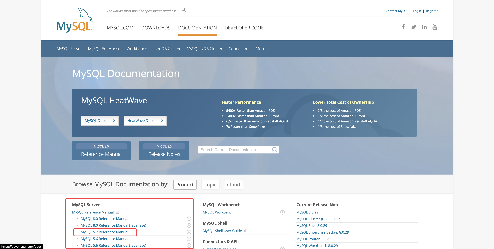
	- [[2 安装和升级 MySQL]]
	  collapsed:: true
		- 2.1 [通用安装指南](https://dev.mysql.com/doc/refman/5.7/en/general-installation-issues.html)
			- 2.1.1 [支持的平台](https://dev.mysql.com/doc/refman/5.7/en/platform-support.html)
			  collapsed:: true
				- MySQL platform support evolves over time; please refer to https://www.mysql.com/support/supportedplatforms/database.html for the latest updates.
				- 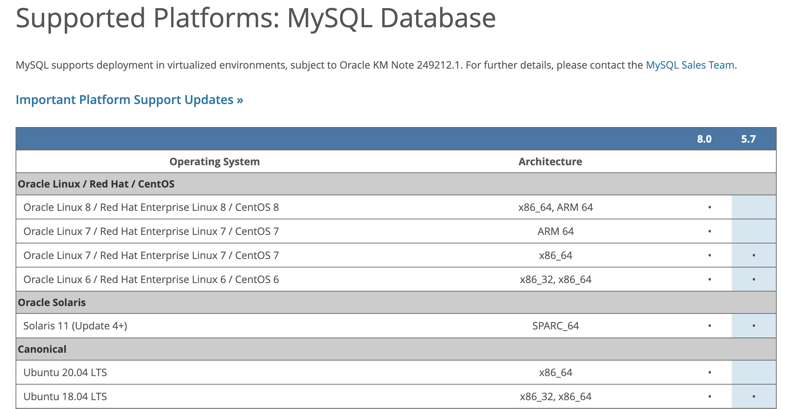
				- **结论：CentOS 7.9 x86_64 与 MySQL 5.7 版本兼容**
			- 2.1.2 要安装哪个 MySQL 版本和发行版
				- 首先，决定是安装一个开发版本还是一个通用可用性(General Availability，GA)版本。开发版本具有最新的特性，但不推荐用于生产用途。GA 释放，也称为生产或稳定释放，是为了生产使用。我们建议使用最新的 GA 版本。
				- MySQL 版本命名规则。
				- 版本演进规则  mN （里程碑按本）-> RC（Release Candidate  发布候选版本）-> GA（General Availability 一般可用性(GA)或生产版本），GA 是最稳定的。
				- 自行编译是的配置项参考 [MySQL 源码配置选项](https://dev.mysql.com/doc/refman/5.7/en/source-configuration-options.html)
				- **结论：选择 5.7系列的最大 GA 版本**
			- 2.1.3 [如何获得 MySQL](https://dev.mysql.com/doc/refman/5.7/en/getting-mysql.html)
			  collapsed:: true
				- 下载地址： https://dev.mysql.com/downloads/
					- 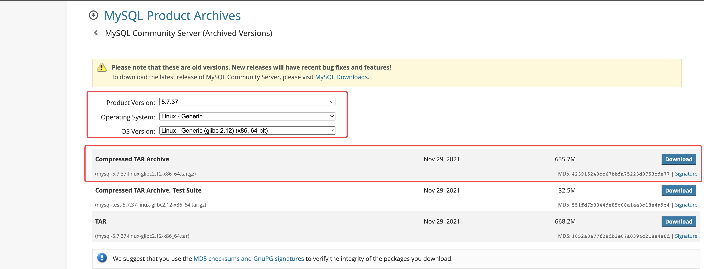
					- https://downloads.mysql.com/archives/get/p/23/file/mysql-5.7.37-linux-glibc2.12-x86_64.tar.gz
				- 对于使用 Yum 作为包管理系统的基于 rpm 的 Linux 平台，可以使用 MySQL Yum Repository 安装 MySQL。有关详细信息，请参阅2.5.1节“[使用 MySQL Yum 仓库在 Linux 上安装 MySQL](https://dev.mysql.com/doc/refman/5.7/en/linux-installation-yum-repo.html)”。
			- 2.1.4 使用 md5校验和或 GnuPG 验证包完整性（略）
			- 2.1.5 [安装布局](https://dev.mysql.com/doc/refman/5.7/en/installation-layouts.html)
				- 第2.9.3节，“ [MySQL 源代码安装布局](https://dev.mysql.com/doc/refman/5.7/en/source-installation-layout.html)”
				- 表2.3，“[通用 Unix/Linux 二进制包的 MySQL 安装布局](https://dev.mysql.com/doc/refman/5.7/en/binary-installation.html#binary-installation-layout)”
					- 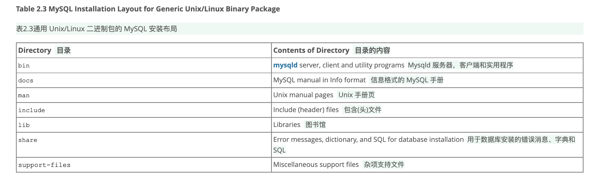
					- ```shell
					  $> groupadd mysql
					  $> useradd -r -g mysql -s /bin/false mysql
					  $> cd /usr/local
					  $> tar zxvf /path/to/mysql-VERSION-OS.tar.gz
					  $> ln -s full-path-to-mysql-VERSION-OS mysql
					  $> cd mysql
					  $> mkdir mysql-files
					  $> chown mysql:mysql mysql-files
					  $> chmod 750 mysql-files
					  $> bin/mysqld --initialize --user=mysql
					  $> bin/mysql_ssl_rsa_setup
					  $> bin/mysqld_safe --user=mysql &
					  # Next command is optional
					  $> cp support-files/mysql.server /etc/init.d/mysql.server
					  ```
					- 安装步骤
						- 创建一个 mysql 用户和组
							- ```shell
							  ## 添加用户组
							  groupadd mysql
							  
							  ## 添加用户，不支持登录
							  useradd -r -g mysql -s /bin/false mysql
							  ```
						- 获取并解压发行版
							- ```shell
							  cd /usr/local
							  
							  tar zxvf /path/to/mysql-VERSION-OS.tar.gz
							  
							  ln -s full-path-to-mysql-VERSION-OS mysql
							  
							  ## 加入环境变量
							  export PATH=$PATH:/usr/local/mysql/bin
							  ## 或者
							  vim /etc/profile 
							  ## 在文件末尾追加
							  export PATH=$PATH:/usr/local/mysql/bin
							  ```
						- ((627cafde-1d3f-48e2-b80c-aff69361923c))
			- 2.1.6 Compiler-Specific Build Characteristics
		- 2.2 Installing MySQL on Unix/Linux Using Generic Binaries
		- 2.3 Installing MySQL on Microsoft Windows
		- 2.4 Installing MySQL on macOS
		- [2.5 Installing MySQL on Linux](https://dev.mysql.com/doc/refman/5.7/en/linux-installation.html)
		  collapsed:: true
			- [2.5.1 Installing MySQL on Linux Using the MySQL Yum Repository](https://dev.mysql.com/doc/refman/5.7/en/linux-installation-yum-repo.html)
		- 2.6 Installing MySQL Using Unbreakable Linux Network (ULN)
		- 2.7 Installing MySQL on Solaris
		- 2.8 Installing MySQL on FreeBSD
		- 2.9 Installing MySQL from Source
		- [2.10安装后的设置和测试](https://dev.mysql.com/doc/refman/5.7/en/postinstallation.html)
		  id:: 627cafde-1d3f-48e2-b80c-aff69361923c
			- [初始化数据目录](https://dev.mysql.com/doc/refman/5.7/en/data-directory-initialization.html)
				- 数据目录初始化概述
					- ```shell
					  cd /usr/local/mysql
					  
					  mkdir mysql-files
					  
					  chown mysql:mysql mysql-files
					  
					  chmod 750 mysql-files
					  
					  bin/mysqld --initialize --user=mysql
					  ```
				- 数据目录初始化过程
				- 数据目录初始化期间的服务器操作
				- 初始化后的根密码分配
					- 启动服务器
						- ```shell
						  ## 启动服务器
						  
						  /bin/mysqld --user=mysql
						  ```
					- 连接服务器（本地连接）
						- ```shell
						  mysql -u root -p
						  ```
					- 更改新的 root 密码
						- ```shell
						  ALTER USER 'root'@'localhost' IDENTIFIED BY 'catface996';
						  ```
					- 创建新的用户
						- ```shell
						  CREATE USER 'root'@'%' IDENTIFIED BY 'catface996';
						  ```
			- 启动服务器
				- ```shell
				  ## 启动服务器
				  
				  /bin/mysqld --user=mysql
				  ```
			- 测试服务器
			- 远程连接到 MySQL 服务器
				- 关闭防火墙
					- ```shell
					  systemctl stop firewalld
					  
					  firewall-cmd --state
					  ```
			- 保护初始化 MySQL 账户
			- [自动启动和停止 MySQL](https://dev.mysql.com/doc/refman/5.7/en/automatic-start.html)
		- 2.11 Upgrading MySQL
		- 2.12 Downgrading MySQL
		- 2.13 Perl Installation Notes
	- [[5 服务器管理]]
	  collapsed:: true
		- [5.1 MySQL 服务器](https://dev.mysql.com/doc/refman/5.7/en/mysqld-server.html)
			- [5.1.7服务器系统变量](https://dev.mysql.com/doc/refman/5.7/en/server-system-variables.html)
				- basedir
				  collapsed:: true
					- 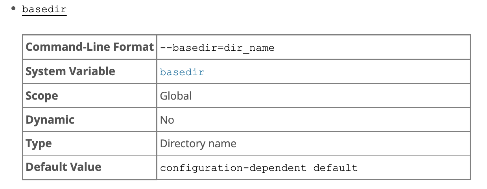
				- bind_address
				  collapsed:: true
					- 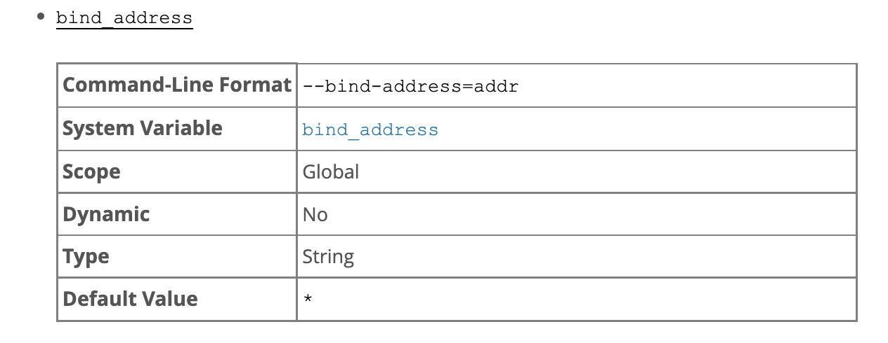
					- 如果地址是 * ，则服务器在所有服务器主机 ipv4接口上接受 TCP/IP 连接，如果服务器主机支持 IPv6，则在所有 ipv6接口上接受 TCP/IP 连接。使用此地址允许所有服务器接口上的 ipv4和 ipv6连接。这个值是默认值。
					- 如果地址是0.0.0.0，服务器接受所有服务器主机 ipv4接口上的 TCP/IP 连接。
				- character_set_client
				  collapsed:: true
					- 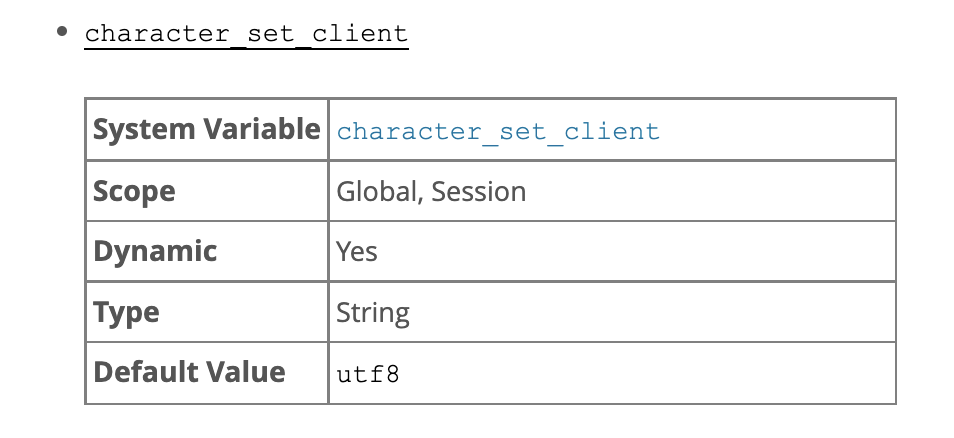
				- character_set_connection
				  collapsed:: true
					- 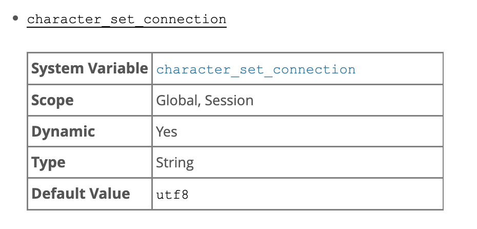
				- character_set_database  --需要修改
				  collapsed:: true
					- 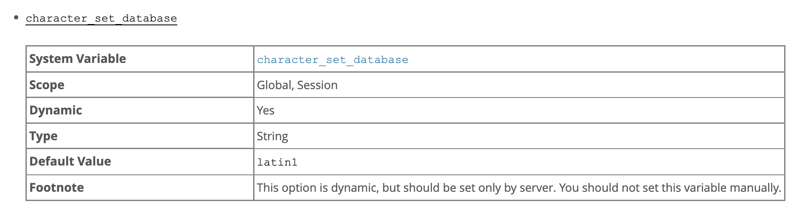
				- character_set_results
				  collapsed:: true
					- 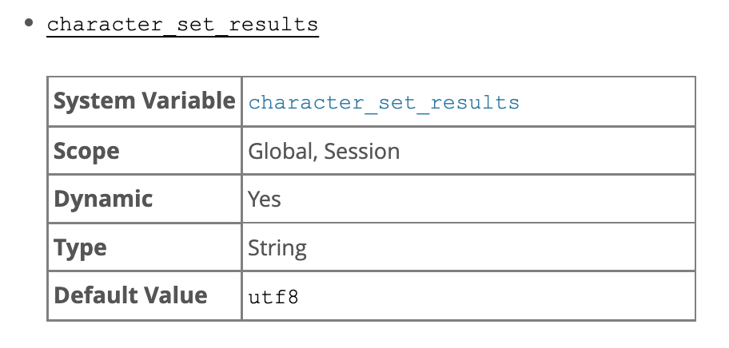
				- character_set_server   --需要修改
				  collapsed:: true
					- 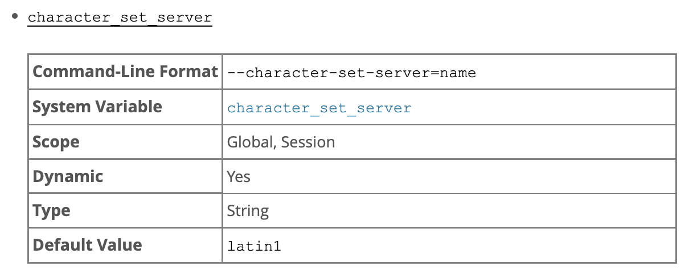
				- collation_connection
				  collapsed:: true
					- 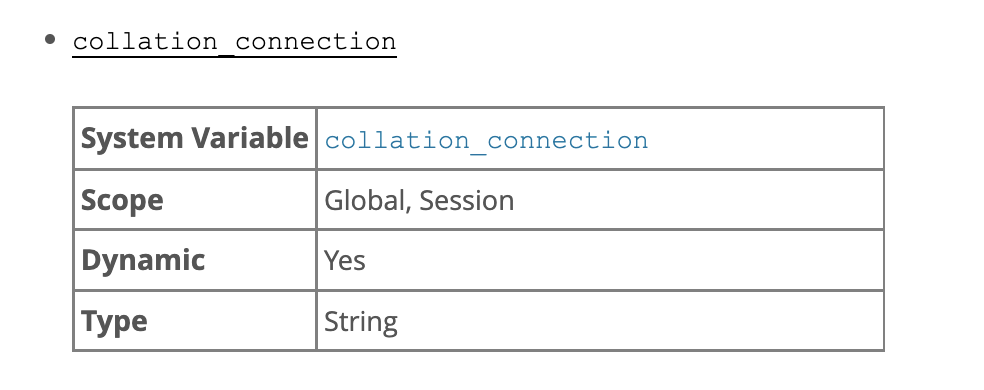
				- collation_database
				  collapsed:: true
					- 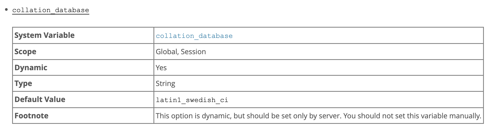
				- collation_server
				  collapsed:: true
					- 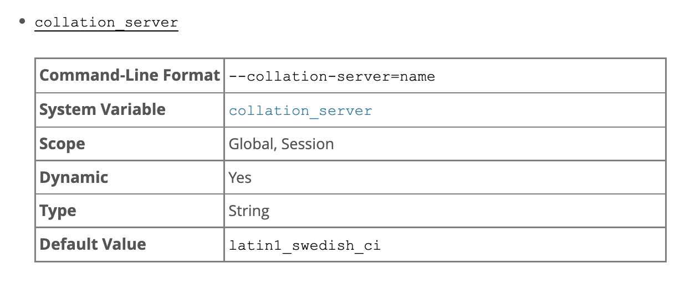
		- 5.2 The MySQL Data Directory
		- 5.3 The mysql System Database
		- 5.4 MySQL Server Logs
		- 5.5 MySQL Server Plugins
		- 5.6 MySQL Server Loadable Functions
		- 5.7 Running Multiple MySQL Instances on One Machine
		- 5.8 Debugging MySQL
	- [[14 InnoDB 存储引擎]]
- 概念
  collapsed:: true
	- 优化器
	  collapsed:: true
		- 基于规则的优化（RBO）
		- 基于成本的优化（CBO）
	- 搜索树 又称 排序树
	  collapsed:: true
		- 基于比较的排序和查找
		- 如何实现比较器
	- 有序表
	  collapsed:: true
		- 有序表的接口
		  collapsed:: true
			- ```java
			  java.util.NavigableMap
			  
			      /**
			       * Returns the greatest key strictly less than the given key, or
			       * {@code null} if there is no such key.
			       *
			       * @param key the key
			       * @return the greatest key less than {@code key},
			       *         or {@code null} if there is no such key
			       * @throws ClassCastException if the specified key cannot be compared
			       *         with the keys currently in the map
			       * @throws NullPointerException if the specified key is null
			       *         and this map does not permit null keys
			       */
			      K lowerKey(K key);
			  
			      /**
			       * Returns the greatest key less than or equal to the given key,
			       * or {@code null} if there is no such key.
			       *
			       * @param key the key
			       * @return the greatest key less than or equal to {@code key},
			       *         or {@code null} if there is no such key
			       * @throws ClassCastException if the specified key cannot be compared
			       *         with the keys currently in the map
			       * @throws NullPointerException if the specified key is null
			       *         and this map does not permit null keys
			       */
			      K floorKey(K key);
			  
			      /**
			       * Returns the least key greater than or equal to the given key,
			       * or {@code null} if there is no such key.
			       *
			       * @param key the key
			       * @return the least key greater than or equal to {@code key},
			       *         or {@code null} if there is no such key
			       * @throws ClassCastException if the specified key cannot be compared
			       *         with the keys currently in the map
			       * @throws NullPointerException if the specified key is null
			       *         and this map does not permit null keys
			       */
			      K ceilingKey(K key);
			  
			      /**
			       * Returns the least key strictly greater than the given key, or
			       * {@code null} if there is no such key.
			       *
			       * @param key the key
			       * @return the least key greater than {@code key},
			       *         or {@code null} if there is no such key
			       * @throws ClassCastException if the specified key cannot be compared
			       *         with the keys currently in the map
			       * @throws NullPointerException if the specified key is null
			       *         and this map does not permit null keys
			       */
			      K higherKey(K key);
			  
			  
			  // 具体实现
			  java.util.TreeMap
			  java.util.concurrent.ConcurrentSkipListMap
			  
			  ```
	- 哈希表
	- [[B树]] 和 [[B+树]]
	- 磁盘的数据与读取
	  collapsed:: true
		- 块设备
	- Linux 的 Page Cache
	  collapsed:: true
		- 参考文档： https://zhuanlan.zhihu.com/p/68071761
	- MySQL 的 InnoDB 的 page
	- 获取数据地址的方式
	  collapsed:: true
		- 计算获得
			- hash
			- 基地址+偏移量
		- 查询获得
			- 链表节点中的指向下一个节点的指针，即要访问的数据的地址作为数据存储在某个位置
	- Redolog
	  collapsed:: true
		- 属于 InnoDB 引擎
		- 顺序写效率高
		- WAL （write ahead log  预写日志）
	- Undolog
	  collapsed:: true
		- 属于 InnoDB 引擎
		- 逻辑日志，非物理日志
	- binlog
	  collapsed:: true
		- 属于 mysql servier，所有的存储引擎均可以产生 binlog
	- 字符集
	  collapsed:: true
		- 字符集的选择可以精确到字段
		- 建议默认的字符集为 utf8mb4
	- Row Format
	  collapsed:: true
		- 6 byte row_id
	- 常见技术名称
	  collapsed:: true
		- 回表
			- 通过索引获取到 ID集合后，根据 ID 集合查询记录集合
		- 索引覆盖
			- 查询条件和返回结果均通过索引即可获取，即不需要回表
		- 索引下推
			- 通过索引过滤掉不符合条件的记录
				- 即索引项部分匹配，在匹配的所有索引项中，再做部分过滤
				- ```sql
				  select * from test_table where colum1 like 'A%'；
				  
				  // 组合索引 colum2，colum3，colum4
				  select * from test_table where colum2 = 2 and colum4 = 3;
				  ```
	- 隔离级别
	  collapsed:: true
		- MySQL Server 层不管理事务，事务是由存储引擎实现的。
		- InnoDB 的事务隔离级别
		- 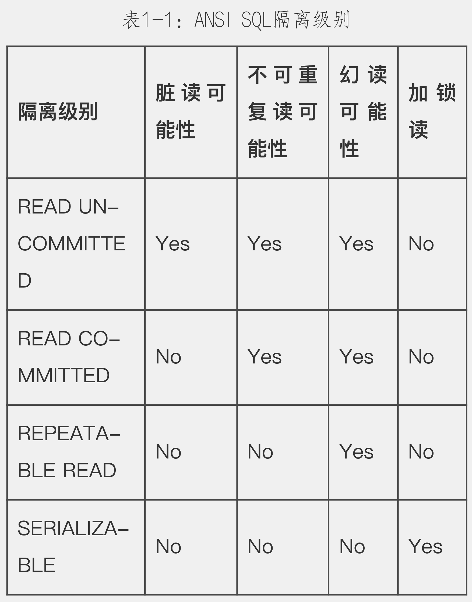
	- 死锁
	  collapsed:: true
		- InnoDB目前处理死锁的方法是，将持有最少行级排他锁的事务进行回滚（这是相对比较简单的死锁回滚算法）
		-
	- 主从复制
	  collapsed:: true
		- 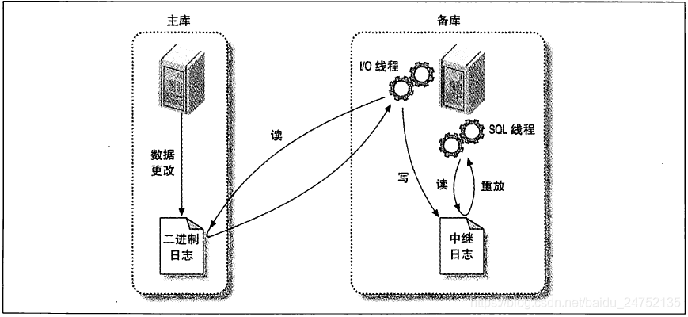
		- 主节点
			- 生成 binLog（server 级别的日志），innodb 存储引擎级别的日志是 undo log 和 redo log
		- 从节点
			- 监听主节点的 binLog
				- IO 线程，接收主节点 binLog，并写入到中继日志
				- SQL 线程，读取中继日志，并重放到从库
	- 慢查询
	  collapsed:: true
		- 慢查询日志
		- long_query_time 配置
		- 响应时间可以精确到微妙
- 查询场景
  collapsed:: true
	- 等值查询 = ，in
	- 非等值 !=，not in
	- 范文查询 between，>，>=，<，<=
		- 根据主键做范围查询  找到起始主键，做顺序读
		- 根据其他字段做范围查询 找到起始索引片，做顺序读主键集合，但是回表的时候不一定是顺序的
	- 模糊匹配 like
- 常见业务场景
  collapsed:: true
	- 频繁插入数据，且插入的数据不同。
	- 频繁的对同一张表进行读取，且读取的数据不相同。
	- 频繁的对同一张表的同一行数据进行读取。
	- 按照时间排序的分页查询。
	- 不带 where 条件的 SQL 查询。
	- 订阅 binLog，触发查询，同步到 es。
- 问题
  collapsed:: true
	- 脏读，不可重复读，幻读
	  collapsed:: true
		- 幻读产生的根本原因，当前读和快照读混合使用导致。如果都是当前读，不会产生幻读
		- 脏读
			- READ-COMMITED，解决了脏读
		- 不可重复读
			- 多次执行相同的查询，获得的查询结果不一致
			- REPEATABLE-READ，解决了不可重复读 （MVCC）
		- 幻读
			- 例如：
				- ```sql
				  // t1 时刻 事务 1
				  update test_table set colum1 = 2 where colum1 =1;
				  
				  //  t2时刻 事务 2
				  insert into test_table (colum1) value (1);
				  commit；
				  
				  // t3 时刻 事务 1
				  select * from test_table where colum1 = 1; // 仍旧有数据
				  ```
			- REPEATABLE-READ +（行级锁，间隙锁，临键锁）解决了幻读
	- 读写分离的主从数据库，即使硬件配置相同，主从的MySQL 的系统配置是否一致？
	- 如何判断一张表的某个字段是否适合建立索引？
	  collapsed:: true
		- 基数(Distinct Value) /  记录数(Count) > 80%
		- 基数计算 [[Hyperloglog]]
	- 主从同步效率问题
	  collapsed:: true
		- MTS
		- 组提交
	- 读写分离模式下写节点和读节点的隔离模式要保持一致吗？
	  collapsed:: true
		- 写节点 可重复读（Repeatable Read）
		- 读节点 读已提交（Read Committed） ？？
	- 读写混合的集中模式及结局方案
	  collapsed:: true
		- 读读
		- 读写
			- MVCC 解决
				- 快照读
					- select
				- 当前读
					- select lock in share mode
					- select for update
					- insert
					- update
					- delete
				- 实现方式
					- 隐藏字段
					  collapsed:: true
						- DB_TRX_ID  最近的修改事务 ID
						- DB_ROLL_PTR  指向当前记录的上一个版本
							- 每条被更改的记录都有一个undolog 链表，链表的头是所有旧数据中最新的一条，链尾是被更改记录的所有版本中最旧的数据。undolog 不会无限膨胀，会有 purge 线程来清理。
						- DB_ROW_ID  隐藏主键（如果有自定义主键，则为自定义主键）
						-
					- ReadView 判断事务对数据的可见性
						- 数据结构
							- trx_list   当前活跃的事务 ID
							- up_limit_id 活跃事务中最小的事务 ID
							- low_limit_id 当前系统尚未分配的事务 ID
						- 可见性算法
							- 可重复读，是指在之前读取的基础上，再次读取的数据不会发生变化，如果之前未发生读取，只是开启了事务，在首次读取之前，其他事务提交的数据对当前事务是可见的。
		- 写写
		  collapsed:: true
			- 解决写入丢失
- 扩展
  collapsed:: true
	- [[MySQL军规]]
	- [[阿里云 RDS MySQL]]
- [[使用MySQL 源码搭建 Debug环境]]
- [[计算聚集索引容纳记录数及缓存读取方案]]
- [[MySQL 索引遍历]]
- [[MySQL源码]]
- [[SQL语法解析]]
- 参考
	- [数据结构可视化工具](https://www.cs.usfca.edu/~galles/visualization/Algorithms.html)
- 样例数据库
  collapsed:: true
	- https://dev.mysql.com/doc/index-other.html
	- 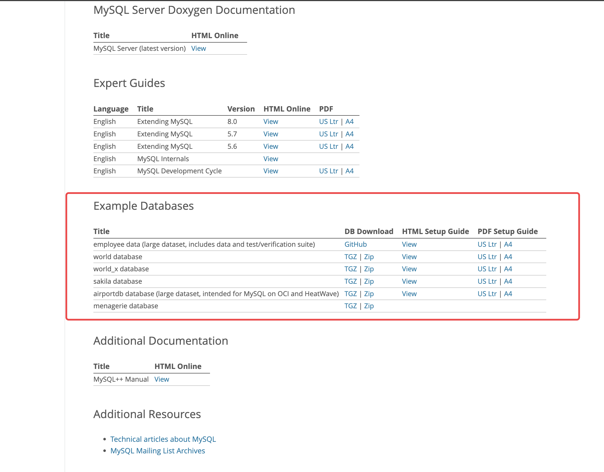
	-
- 排查故障
	- 建议先使用 SHOW_STATUS 和 SHOW PROCESSLIST
	- Q：相同查询语句的大部分查询的性能表现良好，偶尔会出现性能下降，例如，1万次查询中，只有两次查询耗时1s，其他查询耗时100ms。
		- A1：可能是某次查询是缓存失效，压力传递到了MySQL。
		- A2：可能是在某一时刻，MySQL在做备份。
		- A3：可能某次查询出现了锁等待。
		- A4：在某一时刻出现了大量脏块的刷新。