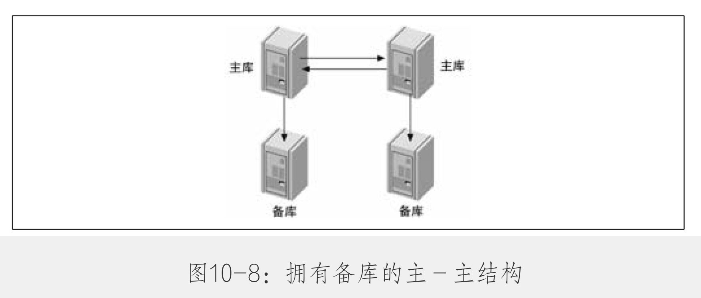
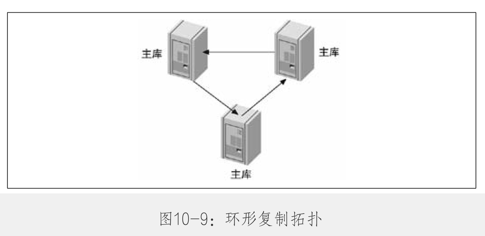
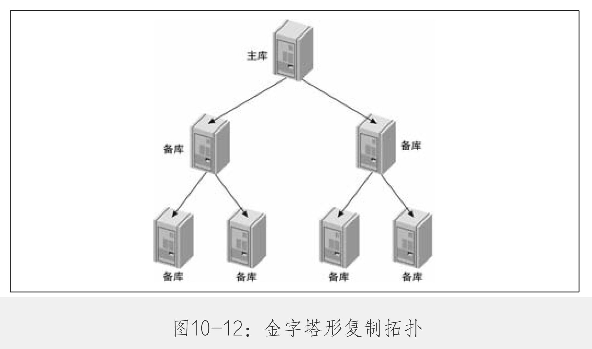

- MySQL支持两种复制方式
	- 基于行的复制
	- 基于语句的复制
- 复制概述
	- 复制解决的问题
	  collapsed:: true
		- 数据分布
		- 负载均衡
			- DNS轮询
			- [[LVS]]
			- 备份
		- 高可用性和故障切换
		- MySQL升级测试
	- 复制如何工作
	  collapsed:: true
		- 1.在主库上把数据更改记录到binLog
		- 2.备库将主库上的binLog复制到自己的中级日志（Relay Log）
		- 3.备库读取中级日志的事件，将其重放到备库数据之上。
		- 
		- **注意** MySQl会按事务提交的顺序而非语句的执行顺序来记录binLog。在记录binLog后，主库（Server层）会告诉存储引擎可以提交事务了。
		- 只有一个SQL线程来重放中继日志中的事件。
- 配置复制
	- 配置步骤
	  collapsed:: true
		- 1.在每台服务器上创建复制账号。
		- 2.配置主库和备库。
		- 3.通知备库连接到主库并从主库复制数据。
	- 创建复制账号
	  collapsed:: true
		- ```shell
		  GRANT REPLICATION SLAVE, REPLICATION CLIENT ON *.* TO repl@'192.168.0.%' IDENTIFIED BY 'p4ssword',
		  ```
		- 配置主库和备库
			- 主库开启binLog，必须明确server_id
			- 备库要设置为readonly，设置relay_log的位置
	- 启动复制
	  collapsed:: true
		- 在备库操作，告诉备库如何连接到主库并重放主库的binLog。通过CHANGE MASTER TO 语句来完成。
	- 从另一个服务器开始复制
	  collapsed:: true
		- 使用冷备份
		- 使用热备份
		- 使用mysqldump
		- 使用快照或备份
	- 推荐的复制配置
	  collapsed:: true
		- sync_binlog=1
		- 在备库上，为中继日志指定绝对路径
		- 在备库上skip_salve_start，阻止备库在崩溃后自动启动复制。
		- 在备库上设置read_only
- 复制的原理
	- 基于语句的复制（逻辑复制）
		- 实现简单
		- 有些语句重复执行效果不一致，例如带时间戳函数的
	- 基于行的复制
		- 最大的好处是，可以正确的复制每一行
		- 基于行的复制在备库上开销小，因为可能是一个复杂的sql将简单的结果保存到数据库
		- 如果是做的全表更新，基于行的复制开销会大，例如批量更新了备注字段
	- 基于行或基于语句：那种更优
		- 基于语句的复制模式的有点
			- 逻辑复制能在多种情况下工作，例如主备表上定义不同但是数据类型兼容（生产环境应该避免）
			- 逻辑复制是基于执行SQL语句，出现问题容易排查
		- 基于语句的复制模式的缺点
			- 使用了触发器或者存储过程，容易出问题
		- 基于行的复制模式的优点
			- 几乎没有基于行的复制模式无法处理的场景。只有主备schema不一致时才会出问题。
			- 同时记录变更前的数据和变更后的数据，有助于数据恢复。
			- 无需建立执行计划，基于行的复制占用更少的CPU。
		- 基于行的复制模式的缺点
			- 由于语句并没有在日志里记录，无法判断执行了哪些SQL。
			- 以近似黑盒的方式在备库执行，出现问题不容易排查。
	- 复制文件
		- 复制使用到binLog文件、中继日志文件。
		- mysql-bin.index
		- mysql-relay-bin-index
		- master.info
		- relay-log.info
	- 发送复制时间到其他备库
		- log_slave_updates选项可以让备库编程其他服务器的主库。
		- 
		- 服务器ID是用来打破无限循环的，特别是在主-主模式下。
	- 复制过滤器
		- 大部分时间不使用这些配置
- 复制拓扑
	- 基本原则
		- 一个MySQL备库实例只能有一个主库。
		- 每个备库必须有唯一的服务器ID。
		- 一个主库可以有多个备库。
		- 如果打开了log_slave_updates选项，一个备库可以把其主库上的数据变化传播到其他备库。
	- 一主库多备库
		- 少量写，大量读，这种配置非常有用。
		- 
		- 用途
			- 为不同的角色使用不同的备库（例如添加不同的索引或者使用不同的存储引擎）
			- 把一台备库当做待用的主库，除了复制，没有其他数据传输
			- 将一台备库放到远程数据中心，用作灾难恢复
			- 延迟一个或多个备库，以备灾难恢复
			- 使用其中一个备库，作为备份、培训、开发或者测试使用服务器
	- 主动-主动模式下的主-主复制
		- 主-主复制（也叫双主复制或双向复制）包含两台服务器，每一个都配置成对方的主库或者备库，换句话说，他们是一对主库。
		- 
		- 这种配置最大的问题是如何解决冲突，例如自增问题。
		- MySQL不支持多主复制
	- 主动-被动模式下的主-主复制
		- 
		- 这种方式是的反复切换主动和被动服务器非常方便，因为服务器的配置是对称的。这使得故障转移和故障恢复很容易。
	- 拥有备库的主-主结构
		- 
		- 这种配置的有点是增加了冗余，对不不同地理位置的复制拓扑，能够消除站点单点失效的问题。
	- 环形复制
	  collapsed:: true
		- 双主结构实际上是环形的一种特例。环形结构可以有三个或者更多的主库。每个服务器都是它之前的服务器的备库，是在它之后的服务器的主库。
		- 
		- 
		-
	- 主库、分发主库以及备库
	  collapsed:: true
		- 
		- 很难说当备库数据达到多少时需要一个分发主库。按照通用准则，如果主库接近满负载，不应该为其建立10个以上的备库。
	- 树或金字塔型
		- 如果要讲主库复制到大量的备库中，建议使用金字塔型。
		- 这种设计更好的减轻了主库的负担。它的缺点是中间层出现的任何错误都会影响到多个服务器。
		- 
	- 定制的复制方案
		- 选择性复制
		- 分离功能
			- OLTP
			- OLAP
		- 数据归档
		- 将备库用作全文检索
		- 只读备库
		- 模拟多主库复制
		- 创建日志服务器
- 复制和容量规划
	- 写操作通常是复制的瓶颈，并且很难使用复制来扩展写操作。
	- 读写分离规划，不是针对负载的线性扩展，每扩展一个备库，备库需要承担复制的写入和分担的查询，不是100%用于查询。ou
	- 为什么复制无法扩展写操作
		- 糟糕的服务器容量比例的根本原因是不能像分发读操作那样把写操作同等地分发到更多服务器上。换句话说，复制只能扩展读，无法扩展写。
		- 对数据进行分区是唯一可以扩展写入的方法。
	- 备库什么时候开始延迟
		- 如果备库在中午12:00停看止，在1:00中开启，并在2:00追上主库，备库在一个小时内完成了2个小时的变更，说明复制可以在双倍速度下运行。
	- 规划冗余容量
		- 拥有多余容量的服务器可以更好的处理负载尖峰
- 复制管理和维护
	- 监控复制
	- 测量备库延迟
		- 一个大事务可能导致延迟波动
	- 确定主备是否一致
	- 从主库重新同步备库
	- 改变主库
		- 计划内的提升
		- 计划外的提升
		- 确定期望的日志位置
	- 在一个主-主配置中交换角色
- 复制的问题和解决方案
- 复制有多快
- MySQL复制的高级特性
- 其他复制技术
- 总结