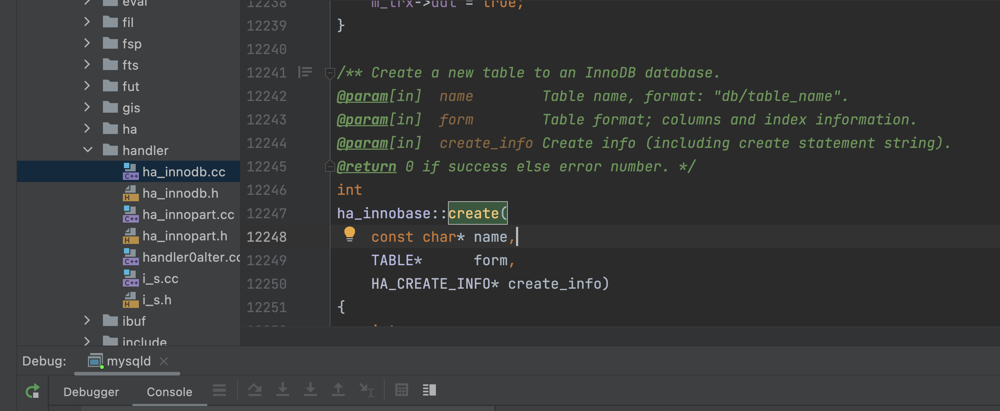

- fil 文件 fil0fil.cc
- fsp 文件空间 fsp0fsp.cc
- 表 table.cc
  collapsed:: true
	- table.cc
	- table.cc:   370: alloc_table_share: enter: table: 'catface'.'contact'
	- table.cc:   704: open_table_def: enter: table: 'catface'.'contact'  path: './catface/contact'
	- table.cc:  1711: open_binary_frm: info: default_part_db_type = 0
	- table.cc:  1931: open_binary_frm: info: extra segment size is 39 bytes
	- table.cc:  2133: open_binary_frm: info: Found format section
	- table.cc:  2147: open_binary_frm: info: format_section_length: 19, format_section_flags: 0
	- table.cc:  2171: open_binary_frm: info: tablespace: '<null>'
	- table.cc:  2236: open_binary_frm: info: i_count: 0  i_parts: 0  index: 2  n_length: 86  int_length: 0  com_length: 74  gcol_screen_length: 0
	- table.cc:  3111: open_table_from_share: enter: name: 'catface.contact'  form: 0x7fe4ac80ea20
	- table.cc:  5987: Field_iterator_table_ref::set_field_iterator: info: field_it for 'contact' is Field_iterator_table
- page 结构 page0page.cc
- buf 缓冲 buf0buf.cc
- inbuf 插入缓冲区 ibuf0ibuf.cc
- lock 锁 lock0lock.cc
- 数据 data0data.cc
- record 结构 rem0rec.cc]
- row 行 row0row.cc
  collapsed:: true
	- row0sel.cc select
	- row0ins.cc insert
	- row0upd.cc update
- trx 事务 trx0trx.cc
- mysys
  collapsed:: true
	- charset.cc 更改字符集
	- mf_qsort.cc 快速排序
- 调试 debug_sync
  collapsed:: true
	- 参考文档：
		- https://zhuanlan.zhihu.com/p/408987341
		- https://dev.mysql.com/doc/internals/en/debug-sync-facility.html
		- https://dev.mysql.com/doc/internals/en/debug-sync-activation-deactivation.html
- 编写自定义存储引擎
  collapsed:: true
	- 官方文档：
		- https://dev.mysql.com/doc/internals/en/custom-engine.ht
	- handler.h 中定义了存储引擎需要实现方法，例如：
		- virtual void drop_table(const char *name);
		- virtual int create(const char *name, TABLE *form, HA_CREATE_INFO *info)=0;
	- innodb 创建表的方法入口
		- ha_innodb.cc  -->  ha_innobase::create(  12247行
		- 
		-
	-
- 代码主流程
  collapsed:: true
	- ```shell
	   User enters "INSERT" statement     /* client */
	   |
	   |
	   Message goes over TCP/IP line      /* vio, various */
	   |
	   |
	   Server parses statement            /* sql */
	   |
	   |
	   Server calls low-level functions   /* mysys */
	   |
	   |
	   Handler stores in file             /* myisam */
	  ```
- mysqld 程序入口
	- mysqld.cc
		- int main(int argc, char **argv)
- 常见 DML 操作
  collapsed:: true
	- 参考文档： https://dev.mysql.com/doc/internals/en/guided-tour-chunk.html
	- insert
		- 文件： sql_insert.cc
		- 方法： bool Sql_cmd_insert::mysql_insert(THD *thd,TABLE_LIST *table_list)
	-