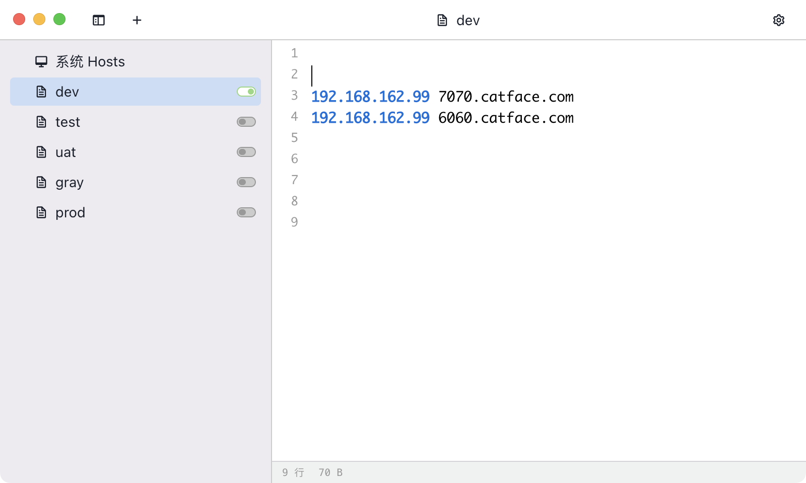

- # 目标
	- 通过nginx对指定域名下的流量，做镜像流量，并负载到另外的域名
- # 准备
	- 安装nginx并配置反向代理，次配置是各自接收流量
		- 安装教程（略）
		- ```conf
		  server {
		    listen 80;
		    server_name 7070.catface.com;
		    location / {
		      proxy_pass http://localhost:7070;
		    }
		  }
		  
		  server {
		    listen 80;
		    server_name  6060.catface.com;
		    location / {
		      proxy_pass   http://localhost:6060;
		    }
		  }
		  ```
	- 部署两个用于接收流量的服务
		- 安装JDK（1.8）
			- 略
		- 启动APP
			- [liveness-0.0.1-SNAPSHOT.jar](../assets/liveness-0.0.1-SNAPSHOT_1665556085671_0.jar)
			- 启动命令
				- ```shell
				  nohup java -jar liveness-0.0.1-SNAPSHOT.jar --server.port=7070 --management.port=7700 &
				  ```
				- ```shell
				  nohup java -jar liveness-0.0.1-SNAPSHOT.jar --server.port=6060 --management.port=6600 &
				  ```
			- 启动后，两个应用的日志都会集中到同一个nohup.out文件中
		- **注意**
			- 相同的流量，在7070.catface.com和6060.catface.com上返回结果不能相同，已验证nginx没有使用镜像流量的返回结果做响应结果。
			- 部署应用的服务器的防火墙
- # 验证
	- 本地hosts
		- 域名通过配置hosts解析到部署APP的服务器
		- 
	- 分别访问 7070.catface.com 和 6060.catface.com 验证各自的返回结果
		- 访问6060.catface.com
			- http://6060.catface.com/status2
			- 
			- 执行结果
				- 
		- 访问7070.catface.com
			- http://7070.catface.com/status2
			- 
			- 执行结果
				- 
	- 配置镜像规则
		- 7070.catface.com 流量镜像到 6060.catface.com
		- ```conf
		  server {
		    listen 80;
		    server_name 7070.catface.com;
		    location / {
		    mirror /mirror;
		      proxy_pass http://localhost:7070;
		    }
		    location = /mirror {
		      internal;
		      proxy_pass http://localhost:6060$request_uri;
		    }
		  }
		  
		  server {
		    listen 80;
		    server_name  6060.catface.com;
		    location / {
		      proxy_pass   http://localhost:6060;
		    }
		  }
		  ```
	- 验证镜像流量是否被转发到6060.catface.com
		- 直接请求6060.catface.com
			- 
		- 通过请求7070.catface.com间接通过镜像流量请求6060.catface.com
			- 
- [demo app](https://github.com/catface996/liveness-demo/blob/main/jar/liveness-0.0.1-SNAPSHOT.jar)
- # 注意
	- GET，PUT，POST等方法的支持
	- 是否正常转发了header
	- 是否正常转发了body
- # 参考
	- [Nginx流量镜像使用技巧](https://cloud.tencent.com/developer/article/1495449)
	- [Nginx流量镜像-官方](https://nginx.org/en/docs/http/ngx_http_mirror_module.html)