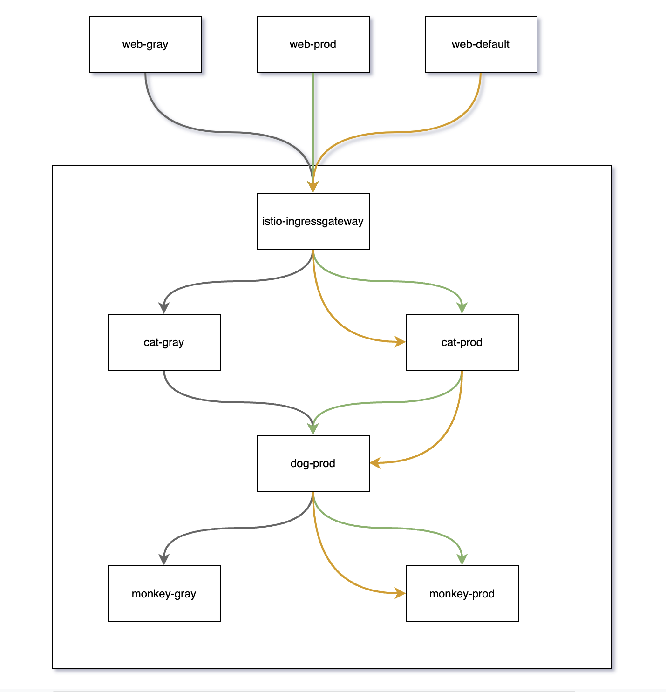

- 设计目标
	- 三个应用
	  collapsed:: true
		- cat
			- prod（default）
			- gray
		- dog
			- prod（default）
		- monkey
			- prod（defualt）
			- gray
	- 应用的代代码介绍
		- 源码地址
			- https://github.com/catface996/istio-demo-app
		- 源码介绍
			- DemoController
			  collapsed:: true
				- ```java
				  package com.example.istio.controller;
				  
				  import java.util.Enumeration;
				  
				  import javax.servlet.http.HttpServletRequest;
				  
				  import brave.Tracer;
				  import com.example.istio.api.DemoApi;
				  import lombok.extern.slf4j.Slf4j;
				  import org.springframework.beans.factory.annotation.Autowired;
				  import org.springframework.beans.factory.annotation.Value;
				  import org.springframework.web.bind.annotation.GetMapping;
				  import org.springframework.web.bind.annotation.ResponseBody;
				  import org.springframework.web.bind.annotation.RestController;
				  
				  /**
				   * @author by 大猫
				   * @date 2022/2/22 5:43 PM catface996 出品
				   */
				  @Slf4j
				  @RestController
				  public class DemoController {
				  
				      @Value("${spring.application.name}")
				      private String appName;
				  
				      @Value("${next}")
				      private Boolean next;
				  
				      @Value("${env}")
				      private String env;
				  
				      private DemoApi demoApi;
				  
				      @Autowired
				      private Tracer tracer;
				  
				      @ResponseBody
				      @GetMapping(value = "/sayHello")
				      public String sayHello(HttpServletRequest request) {
				          String headerEnv = request.getHeader("env");
				          Enumeration<String> headers = request.getHeaderNames();
				          while (headers.hasMoreElements()) {
				              String headerName = headers.nextElement();
				              log.info("{} -- > {}", headerName, request.getHeader(headerName));
				          }
				          String headerInfo = "header env(" + headerEnv + ")";
				          String current = headerInfo + ", I'm " + appName + "(" + env + ")";
				          log.info(current);
				          String response = "";
				          if (next) {
				              response = demoApi.sayHello();
				          }
				          String traceId = tracer.currentSpan().context().traceIdString();
				          return "TraceId: " + traceId + "  " + current + " --> " + response;
				      }
				  
				      @Autowired
				      public void setDemoApi(DemoApi demoApi) {
				          this.demoApi = demoApi;
				      }
				  }
				  ```
			- DemoApi
				- ```java
				  package com.example.istio.api;
				  
				  import org.springframework.cloud.openfeign.FeignClient;
				  import org.springframework.web.bind.annotation.GetMapping;
				  
				  /**
				   * @author by 大猫
				   * @date 2022/2/22 8:38 PM
				   * <p>
				   * Copyright 2021  catface996, Inc. All rights reserved.
				   */
				  @FeignClient(url = "${service.url}", name = "demoApi", fallbackFactory = DemoApiFallback.class)
				  public interface DemoApi {
				  
				      /**
				       * 打招呼接口
				       *
				       * @return 打招呼的回应
				       */
				      @GetMapping(value = "/sayHello")
				      String sayHello();
				  }
				  ```
		- deployment 配置介绍
			- ```yaml
			  apiVersion: apps/v1
			  kind: Deployment
			  metadata:
			    name: cat-dp-prod
			    annotations:
			      author: catface996
			  spec:
			    selector:
			      matchLabels:
			        app: cat
			        env: prod
			    replicas: 1
			    template:
			      metadata:
			        labels:
			          app: cat
			          env: prod
			      spec:
			        containers:
			          - name: cat-ct-prod
			            image: catface996/spring-cloud-istio-demo:latest
			            ports:
			              - containerPort: 8080
			                protocol: TCP
			            env:
			            - name: SPRING_OPTS
			              value: --spring.application.name=cat --server.port=8080 --env=gray --next=true --service.url=http://dog-svc
			            - name: JAVA_OPTS
			              value: -Xmx512M -Xms512M
			            resources:
			              requests:
			                cpu: "100m"
			                memory: "512Mi"
			              limits:
			                cpu: "200m"
			                memory: "1024Mi"
			  ```
	- 调用链路
		- 
- 实施步骤
	- ((62638d0b-abac-4fa7-bb9a-8d08efa0a4f6))方便查看 pod 日志和 Istio 配置。
	- 部署 Deploymnet，并验证是否部署成功。
	- 部署 Service，并验证部署是否成功。
	- 绑定 cat-svc 到 istio-ingressgateway。
	- 本地配置 hosts，域名映射到 istio-ingressgate 所在主机 IP。
	- 通过域名访问 cat-svc 的 sayHello 接口。
	- 配置 cat、dog、monkey 的 Destination Rule 和 Virtual 再访问 cat-prod、cat-gray。
	- 删除 cat-gray deploymnet后，访问 cat-gray。
	- 分布式追踪
		- 概述 https://istio.io/latest/zh/docs/tasks/observability/distributed-tracing/overview/
	- Istio 最佳实践。
		- 流量管理最佳实践 https://istio.io/latest/zh/docs/ops/best-practices/traffic-management/
	-
	-