- 设计目标
	- 三个应用
		- cat
			- prod（default）
			- gray
		- dog
			- prod（default）
		- monkey
			- prod（defualt）
			- gray
	- 调用链路
		- 
	- 应用的代代码介绍
		- 源码地址
			- https://github.com/catface996/istio-demo-app
		- 源码介绍
			- DemoController
			  collapsed:: true
				- ```java
				  package com.example.istio.controller;
				  
				  import java.util.Enumeration;
				  
				  import javax.servlet.http.HttpServletRequest;
				  
				  import brave.Tracer;
				  import com.example.istio.api.DemoApi;
				  import lombok.extern.slf4j.Slf4j;
				  import org.springframework.beans.factory.annotation.Autowired;
				  import org.springframework.beans.factory.annotation.Value;
				  import org.springframework.web.bind.annotation.GetMapping;
				  import org.springframework.web.bind.annotation.ResponseBody;
				  import org.springframework.web.bind.annotation.RestController;
				  
				  /**
				   * @author by 大猫
				   * @date 2022/2/22 5:43 PM catface996 出品
				   */
				  @Slf4j
				  @RestController
				  public class DemoController {
				  
				      @Value("${spring.application.name}")
				      private String appName;
				  
				      @Value("${next}")
				      private Boolean next;
				  
				      @Value("${env}")
				      private String env;
				  
				      private DemoApi demoApi;
				  
				      @Autowired
				      private Tracer tracer;
				  
				      @ResponseBody
				      @GetMapping(value = "/sayHello")
				      public String sayHello(HttpServletRequest request) {
				          String headerEnv = request.getHeader("env");
				          Enumeration<String> headers = request.getHeaderNames();
				          while (headers.hasMoreElements()) {
				              String headerName = headers.nextElement();
				              log.info("{} -- > {}", headerName, request.getHeader(headerName));
				          }
				          String headerInfo = "header env(" + headerEnv + ")";
				          String current = headerInfo + ", I'm " + appName + "(" + env + ")";
				          log.info(current);
				          String response = "";
				          if (next) {
				              response = demoApi.sayHello();
				          }
				          String traceId = tracer.currentSpan().context().traceIdString();
				          return "TraceId: " + traceId + "  " + current + " --> " + response;
				      }
				  
				      @Autowired
				      public void setDemoApi(DemoApi demoApi) {
				          this.demoApi = demoApi;
				      }
				  }
				  ```
			- DemoApi
			  collapsed:: true
				- ```java
				  package com.example.istio.api;
				  
				  import org.springframework.cloud.openfeign.FeignClient;
				  import org.springframework.web.bind.annotation.GetMapping;
				  
				  /**
				   * @author by 大猫
				   * @date 2022/2/22 8:38 PM
				   * <p>
				   * Copyright 2021  catface996, Inc. All rights reserved.
				   */
				  @FeignClient(url = "${service.url}", name = "demoApi", fallbackFactory = DemoApiFallback.class)
				  public interface DemoApi {
				  
				      /**
				       * 打招呼接口
				       *
				       * @return 打招呼的回应
				       */
				      @GetMapping(value = "/sayHello")
				      String sayHello();
				  }
				  ```
			- application.properties
			  collapsed:: true
				- ```properties
				  spring.application.name=cat
				  server.port=9001
				  next=false
				  env=prod
				  service.url=http://localhost:9002
				  spring.sleuth.baggage.remote-fields=env
				  ```
		- Deployment 配置介绍
		  collapsed:: true
			- ```yaml
			  apiVersion: apps/v1
			  kind: Deployment
			  metadata:
			    name: cat-dp-prod
			    annotations:
			      author: catface996
			  spec:
			    selector:
			      matchLabels:
			        app: cat
			        version: prod
			    replicas: 1
			    template:
			      metadata:
			        labels:
			          app: cat
			          version: prod
			      spec:
			        containers:
			          - name: cat-ct-prod
			            image: catface996/spring-cloud-istio-demo:latest
			            ports:
			              - containerPort: 8080
			                protocol: TCP
			            env:
			            - name: SPRING_OPTS
			              value: --spring.application.name=cat --server.port=8080 --env=prod --next=true --service.url=http://dog-svc
			            - name: JAVA_OPTS
			              value: -Xmx512M -Xms512M
			            resources:
			              requests:
			                cpu: "100m"
			                memory: "512Mi"
			              limits:
			                cpu: "200m"
			                memory: "1024Mi"
			  ```
		- Service 配置介绍
		  collapsed:: true
			- ```yaml
			  apiVersion: v1
			  kind: Service
			  metadata:
			    name: cat-svc
			  spec:
			    selector:
			      app: cat
			    type: NodePort
			    ports:
			      - protocol: TCP
			        name: http-port
			        port: 80
			        targetPort: 8080
			        nodePort: 31080
			  ---
			  apiVersion: v1
			  kind: Service
			  metadata:
			    name: dog-svc
			  spec:
			    selector:
			      app: dog
			    internalTrafficPolicy: Cluster
			    ports:
			      - protocol: TCP
			        name: http-port
			        port: 80
			        targetPort: 8080
			  ---
			  apiVersion: v1
			  kind: Service
			  metadata:
			    name: monkey-svc
			  spec:
			    selector:
			      app: monkey
			    internalTrafficPolicy: Cluster
			    ports:
			      - protocol: TCP
			        name: http-port
			        port: 80
			        targetPort: 8080
			  ```
		- Destination Rule 配置介绍
		  collapsed:: true
			- ```yaml
			  kind: DestinationRule
			  apiVersion: networking.istio.io/v1alpha3
			  metadata:
			    name: cat-dr
			  spec:
			    host: cat-svc
			    subsets:
			      - name: prod
			        labels:
			          version: prod
			      - name: gray
			        labels:
			          version: gray
			  ---
			  kind: DestinationRule
			  apiVersion: networking.istio.io/v1alpha3
			  metadata:
			    name: dog-dr
			  spec:
			    host: dog-svc
			    subsets:
			      - name: prod
			        labels:
			          version: prod
			      - name: gray
			        labels:
			          version: gray
			  ---
			  kind: DestinationRule
			  apiVersion: networking.istio.io/v1alpha3
			  metadata:
			    name: monkey-dr
			  spec:
			    host: monkey-svc
			    subsets:
			      - name: prod
			        labels:
			          version: prod
			      - name: gray
			        labels:
			          version: gray
			  ```
		- Virtual Service 配置介绍
		  collapsed:: true
			- ```yaml
			  apiVersion: networking.istio.io/v1alpha3
			  kind: VirtualService
			  metadata:
			    name: cat-vs
			  spec:
			    hosts:
			    - "cat.catface996.com"
			    gateways:
			    - cat-gateway
			    http:
			    ## gray 路由规则
			    - match:
			      - headers:
			          env:
			            exact: gray
			      route:
			      - destination:
			          host: cat-svc
			          subset: gray
			    ## prod 路由规则
			    - match:
			      - headers:
			          env:
			            exact: prod
			      route:
			      - destination:
			          host: cat-svc
			          subset: prod
			    ## 默认 路由规则
			    - route:
			      - destination:
			          host: cat-svc
			          subset: prod
			  ---
			  apiVersion: networking.istio.io/v1alpha3
			  kind: VirtualService
			  metadata:
			    name: dog-vs
			  spec:
			    hosts:
			    - "dog-svc"
			    http:
			    ## gray 路由规则
			    # - match:
			    #   - headers:
			    #       env:
			    #         exact: gray
			    #   route:
			    #   - destination:
			    #       host: dog-svc
			    #       subset: gray
			    ## prod 路由规则
			    - match:
			      - headers:
			          env:
			            exact: prod
			      route:
			      - destination:
			          host: dog-svc
			          subset: prod
			    ## 默认路由规则      
			    - route:
			      - destination:
			          host: dog-svc
			          subset: prod
			  ---
			  apiVersion: networking.istio.io/v1alpha3
			  kind: VirtualService
			  metadata:
			    name: monkey-vs
			  spec:
			    hosts:
			    - "monkey-svc"
			    http:
			    ## gray 路由规则
			    - match:
			      - headers:
			          env:
			            exact: gray
			      route:
			      - destination:
			          host: monkey-svc
			          subset: gray
			    ## prod 路由规则
			    - match:
			      - headers:
			          env:
			            exact: prod
			      route:
			      - destination:
			          host: monkey-svc
			          subset: prod
			    ## 默认路由规则      
			    - route:
			      - destination:
			          host: monkey-svc
			          subset: prod
			  ```
		- Gateway 配置介绍
		  collapsed:: true
			- ```yaml
			  kind: Gateway
			  apiVersion: networking.istio.io/v1alpha3
			  metadata:
			    name: cat-gateway
			  spec:
			    servers:
			      - port:
			          number: 80
			          protocol: HTTP
			          name: http
			        hosts:
			          - 'cat.catface996.com'
			    selector:
			      istio: ingressgateway
			  ---
			  apiVersion: networking.istio.io/v1alpha3
			  kind: VirtualService
			  metadata:
			    name: cat-vs
			  spec:
			    hosts:
			    - "cat.catface996.com"
			    gateways:
			    - cat-gateway
			    http:
			    ## 默认路由到 cat-svc
			    - route:
			      - destination:
			          host: cat-svc
			  ```
- 实施步骤
	- ((62638d0b-abac-4fa7-bb9a-8d08efa0a4f6))方便查看 pod 日志和 Istio 配置。
	- 部署 Deploymnet，并验证是否部署成功。
		- ```yaml
		  kubectl apply -f deployment.yaml
		  ```
		- 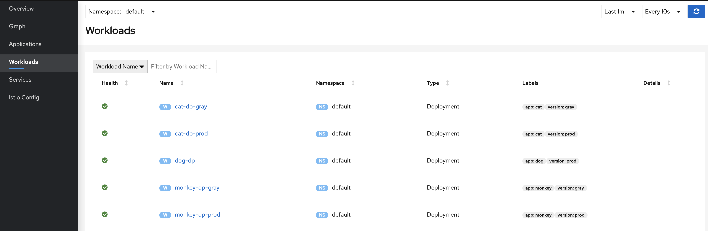
	- 部署 Service，并验证部署是否成功。
		- ```yaml
		  kubectl apply -f service.yaml
		  ```
		- 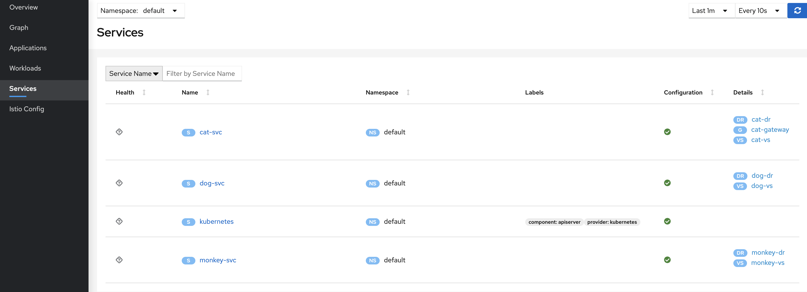
		- 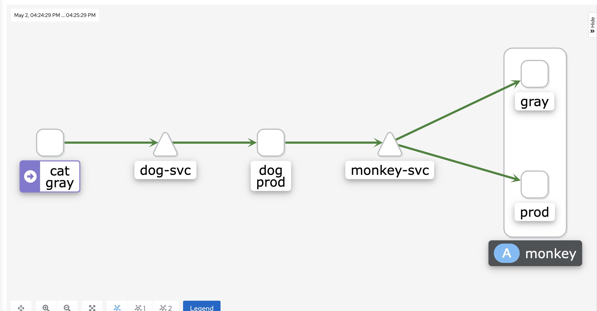
	- 绑定 cat-svc 到 istio-ingressgateway。
		- ```yaml
		  kubectl apply -f cat-vs-bind-gateway.yaml
		  ```
		- 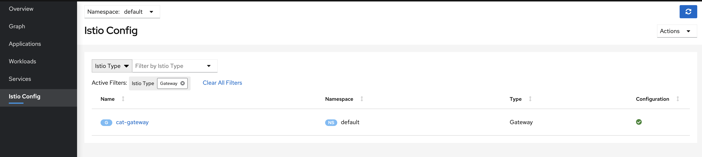
		- 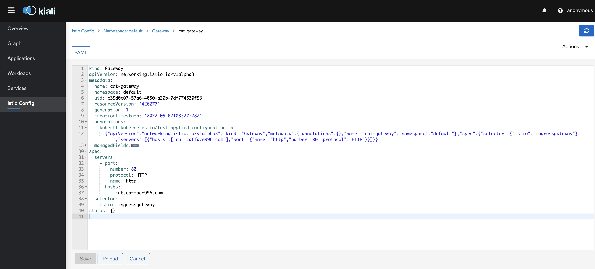
	- 本地配置 hosts，域名映射到 istio-ingressgate 所在主机 IP。
		- 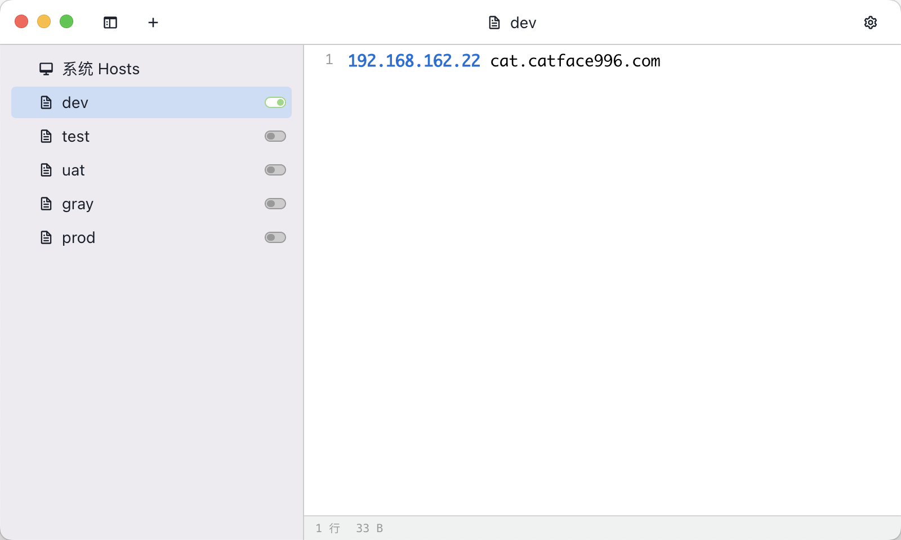{:height 438, :width 716}
		- 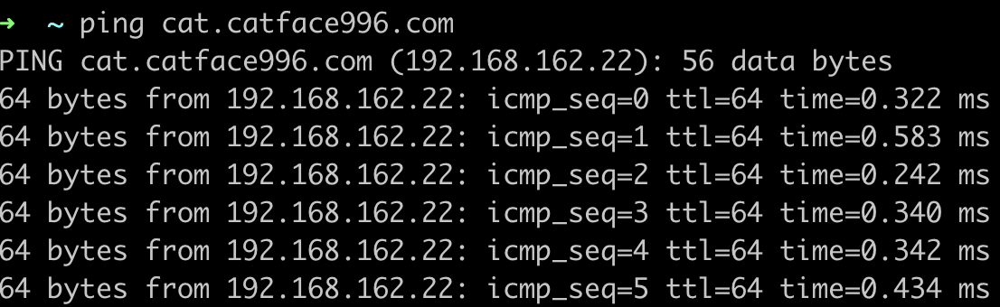
		- 访问 sayHello 接口
			- ```shell
			  watch -n 1 curl -o /dev/null -s -w %{http_code} http://cat.catface996.com:31606/sayHello
			  ```
			- ```shell
			  ## 执行结果
			  Every 1.0s: curl -o /dev/null -s -w %{http_code} http://cat.catface996.com:31606/sayHello                                                                       catfacedeMacBook-Pro.local: Mon May  2 16:59:21 2022
			  
			  200
			  ```
		- 查看 Kiali 面板的流量分布
			- 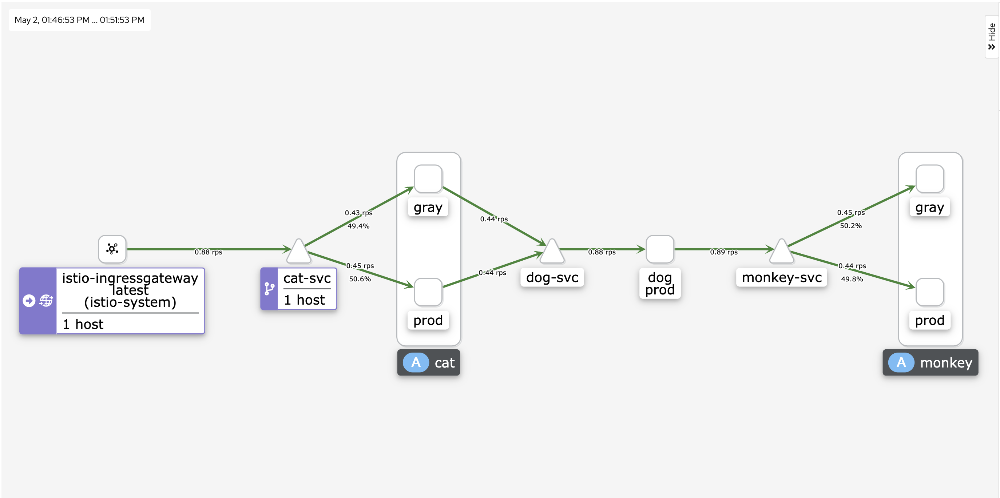
	- 配置 cat、dog、monkey 的 Destination Rule 和 Virtual 再访问 http://cat.catface996.com/sayHello
		- 部署 DestinationRule。
			- 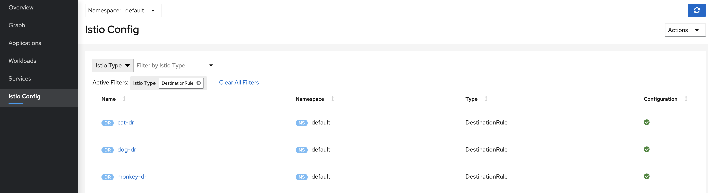
			- 
		- 部署 VirtualService，cat-vs 会被覆盖成最新配置。
			- 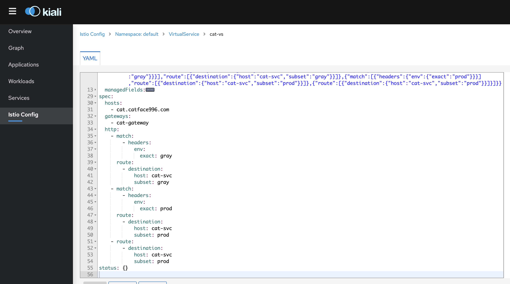
	- 模拟 prod 环境访问
		- ```shell
		  curl -H "env:prod" http://cat.catface996.com:31606/sayHello
		  
		  watch -n 1 curl  -H "env:prod" -o /dev/null -s -w %{http_code} http://cat.catface996.com:31606/sayHello
		  ```
		- ```shell
		  ## 实际执行结果
		  ➜  ~ curl -H "env:prod" http://cat.catface996.com:31606/sayHello
		  
		  TraceId: c3649361381b78c737d7acdf9f349bc4  header env(prod), I'm cat(prod) --> TraceId: c3649361381b78c737d7acdf9f349bc4  header env(prod), I'm dog(prod) --> TraceId: c3649361381b78c737d7acdf9f349bc4  header env(prod), I'm monkey(prod) --> %
		  ```
		- 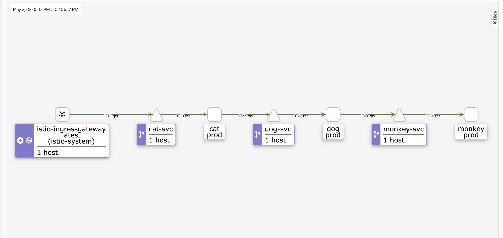{:height 347, :width 716}
	- 模拟 gray 环境访问
		- ```shell
		  curl -H "env:gray" http://cat.catface996.com:31606/sayHello
		  
		  watch -n 1 curl  -H "env:gray" -o /dev/null -s -w %{http_code} http://cat.catface996.com:31606/sayHello
		  ```
		- ```shell
		  ## 实际执行结果
		  ➜  ~ curl -H "env:gray" http://cat.catface996.com:31606/sayHello
		  
		  TraceId: 92ccc0d3098b9800cd35e1a8d16d1522  header env(gray), I'm cat(gray) --> TraceId: 92ccc0d3098b9800cd35e1a8d16d1522  header env(gray), I'm dog(prod) --> TraceId: 92ccc0d3098b9800cd35e1a8d16d1522  header env(gray), I'm monkey(gray) --> %
		  ```
		- 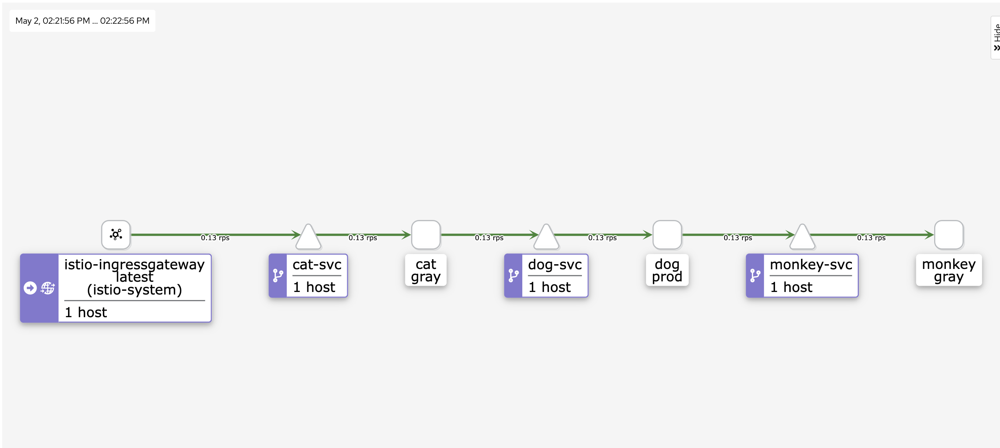
	- 模拟默认环境访问
		- ```shell
		  curl http://cat.catface996.com:31606/sayHello
		  ```
		- ```shell
		  ## 实际执行结果
		  ➜  ~ curl http://cat.catface996.com:31606/sayHello
		  TraceId: 74010fde37a5848fcf536fac3a77aee7  header env(null), I'm cat(prod) --> TraceId: 74010fde37a5848fcf536fac3a77aee7  header env(null), I'm dog(prod) --> TraceId: 74010fde37a5848fcf536fac3a77aee7  header env(null), I'm monkey(prod) --> %
		  ```
		- 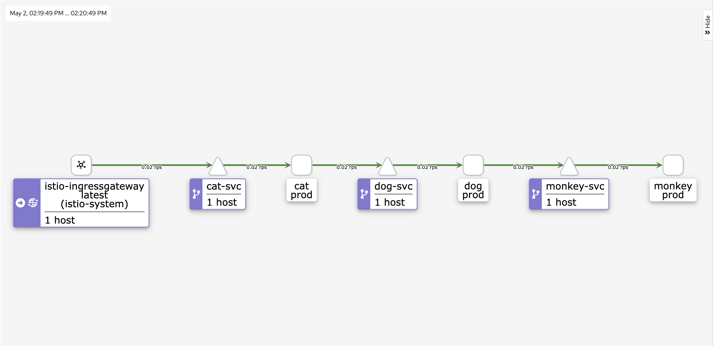
	- 部署不传播 header env的版本。
		- 请求 sayHello 接口后，dog 会接受 env 的参数，却不再向下传递 env 参数给 monkey。
		- ```shell
		  ➜  ~ curl -H "env:gray" http://cat.catface996.com:31606/sayHello
		  
		  TraceId: 080d1ac815d8e67354571046d8d7311a  header env(gray), I'm cat(gray) --> TraceId: 080d1ac815d8e67354571046d8d7311a  header env(gray), I'm dog(prod) --> TraceId: 080d1ac815d8e67354571046d8d7311a  header env(null), I'm monkey(prod) --> %
		  ```
	- 分布式追踪
		- 概述 https://istio.io/latest/zh/docs/tasks/observability/distributed-tracing/overview/
	- Istio 最佳实践。
		- 流量管理最佳实践 https://istio.io/latest/zh/docs/ops/best-practices/traffic-management/
	-