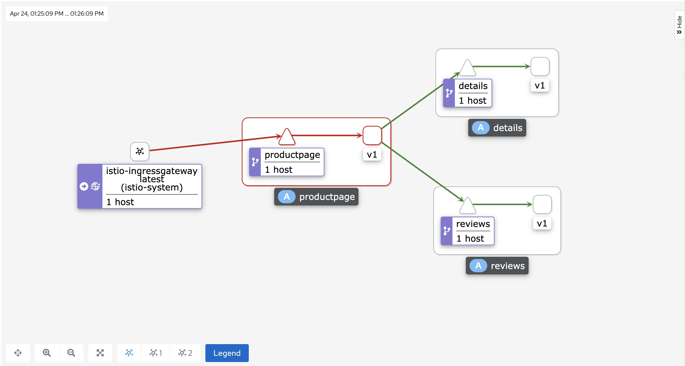
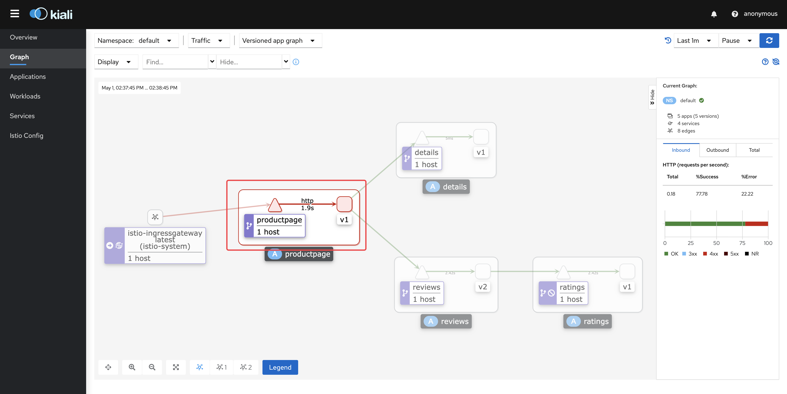
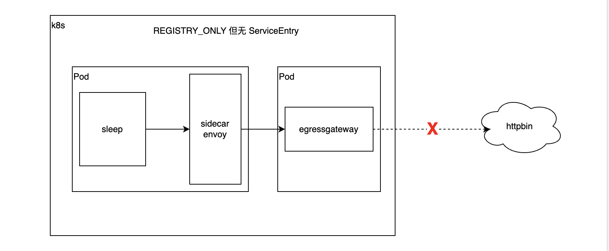
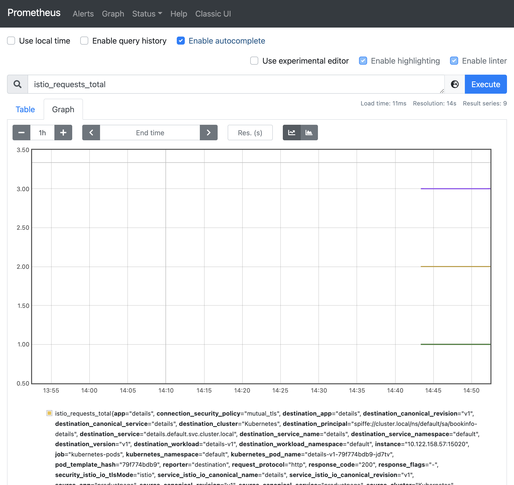
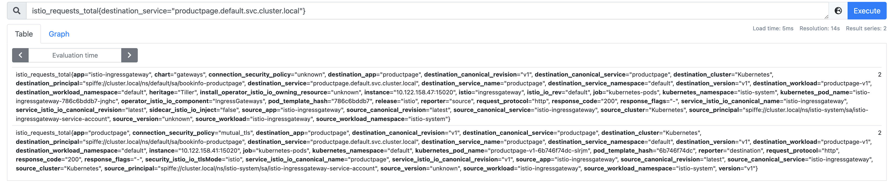

- 任务
	- 流量管理
		- [官方文档](https://istio.io/latest/docs/tasks/traffic-management/)
		- 请求路由
		  collapsed:: true
		  id:: 62638d0b-1d62-4986-bc05-43098be840e2
			- [官方文档](https://istio.io/latest/docs/tasks/traffic-management/request-routing/)
			- 前置准备
				- 访问Bookinfo
				  id:: 62638d0b-8892-4c54-b53c-439a6660ef62
					- 查找istio-ingressgateway的NodePort端口：
					  ~~~shell
					  [root@k8s-master-22 ~]# kubectl get svc -n istio-system
					  NAME                   TYPE           CLUSTER-IP      EXTERNAL-IP   PORT(S)                                                                      AGE
					  grafana                ClusterIP      10.10.194.35    <none>        3000/TCP                                                                     11d
					  istio-egressgateway    ClusterIP      10.10.175.208   <none>        80/TCP,443/TCP                                                               11d
					  istio-ingressgateway   LoadBalancer   10.10.29.102    <pending>     15021:31622/TCP,80:31606/TCP,443:32649/TCP,31400:31288/TCP,15443:32075/TCP   11d
					  istiod                 ClusterIP      10.10.204.13    <none>        15010/TCP,15012/TCP,443/TCP,15014/TCP                                        11d
					  jaeger-collector       ClusterIP      10.10.111.47    <none>        14268/TCP,14250/TCP,9411/TCP                                                 11d
					  kiali                  ClusterIP      10.10.28.105    <none>        20001/TCP,9090/TCP                                                           11d
					  prometheus             ClusterIP      10.10.189.192   <none>        9090/TCP                                                                     11d
					  tracing                ClusterIP      10.10.208.37    <none>        80/TCP,16685/TCP                                                             11d
					  zipkin                 ClusterIP      10.10.9.194     <none>        9411/TCP                                                                     11d
					  ~~~
					- 通过浏览器请求 /productpage   完整地址： http://192.168.162.22:31606/productpage
				- 打开kiali面板
				  id:: 62638d0b-abac-4fa7-bb9a-8d08efa0a4f6
					- ```shell
					  istioctl dashboard kiali --address 192.168.162.22
					  ```
					- ```shell
					  # 实际执行结果
					  [root@k8s-master-22 ~]# istioctl dashboard kiali --address 192.168.162.22
					  http://192.168.162.22:20001/kiali
					  Failed to open browser; open http://192.168.162.22:20001/kiali in your browser.
					  ell
					  istioctl dashboard kiali --address 192.168.162.22
					  
					  # 实际执行结果
					  [root@k8s-master-22 ~]# istioctl dashboard kiali --address 192.168.162.22
					  http://192.168.162.22:20001/kiali
					  Failed to open browser; open http://192.168.162.22:20001/kiali in your browser.
					  ```
			- 应用目标规则
				- id:: 62638d0b-25b9-4026-8323-d21e1daf5501
				  ~~~shell
				  # 应用目标规则
				  kubectl apply -f samples/bookinfo/networking/destination-rule-all.yaml
				  
				  # 查看目标规则
				  kubectl get destinationrules -o yaml
				  
				  # 删除目标规则
				  kubectl delete -f samples/bookinfo/networking/destination-rule-all.yaml
				  ~~~
				- ~~~yml
				  apiVersion: networking.istio.io/v1alpha3
				  kind: DestinationRule
				  metadata:
				    name: productpage
				  spec:
				    host: productpage
				    subsets:
				    - name: v1
				      labels:
				        version: v1
				  ---
				  apiVersion: networking.istio.io/v1alpha3
				  kind: DestinationRule
				  metadata:
				    name: reviews
				  spec:
				    host: reviews
				    subsets:
				    - name: v1
				      labels:
				        version: v1
				    - name: v2
				      labels:
				        version: v2
				    - name: v3
				      labels:
				        version: v3
				  ---
				  apiVersion: networking.istio.io/v1alpha3
				  kind: DestinationRule
				  metadata:
				    name: ratings
				  spec:
				    host: ratings
				    subsets:
				    - name: v1
				      labels:
				        version: v1
				    - name: v2
				      labels:
				        version: v2
				    - name: v2-mysql
				      labels:
				        version: v2-mysql
				    - name: v2-mysql-vm
				      labels:
				        version: v2-mysql-vm
				  ---
				  apiVersion: networking.istio.io/v1alpha3
				  kind: DestinationRule
				  metadata:
				    name: details
				  spec:
				    host: details
				    subsets:
				    - name: v1
				      labels:
				        version: v1
				    - name: v2
				      labels:
				        version: v2
				  ---
				  
				  ~~~
			- 应用虚拟服务之前
				- 
				- 
				- 
			- 应用虚拟服务
				- ~~~shell
				  # 应用虚拟服务
				  kubectl apply -f samples/bookinfo/networking/virtual-service-all-v1.yaml
				  
				  # 实际执行结果
				  [root@k8s-master-22 istio]# kubectl apply -f samples/bookinfo/networking/virtual-service-all-v1.yaml
				  virtualservice.networking.istio.io/productpage created
				  virtualservice.networking.istio.io/reviews created
				  virtualservice.networking.istio.io/ratings created
				  virtualservice.networking.istio.io/details created
				  
				  # 查看虚拟服务
				  kubectl get virtualservices -o yaml
				  
				  # 删除虚拟服务
				  kubectl delete -f samples/bookinfo/networking/virtual-service-all-v1.yaml
				  ~~~
				- ~~~yaml
				  apiVersion: networking.istio.io/v1alpha3
				  kind: VirtualService
				  metadata:
				    name: productpage
				  spec:
				    hosts:
				    - productpage
				    http:
				    - route:
				      - destination:
				          host: productpage
				          subset: v1
				  ---
				  apiVersion: networking.istio.io/v1alpha3
				  kind: VirtualService
				  metadata:
				    name: reviews
				  spec:
				    hosts:
				    - reviews
				    http:
				    - route:
				      - destination:
				          host: reviews
				          subset: v1
				  ---
				  apiVersion: networking.istio.io/v1alpha3
				  kind: VirtualService
				  metadata:
				    name: ratings
				  spec:
				    hosts:
				    - ratings
				    http:
				    - route:
				      - destination:
				          host: ratings
				          subset: v1
				  ---
				  apiVersion: networking.istio.io/v1alpha3
				  kind: VirtualService
				  metadata:
				    name: details
				  spec:
				    hosts:
				    - details
				    http:
				    - route:
				      - destination:
				          host: details
				          subset: v1
				  ---
				  
				  ~~~
				- 只出现v1版本
					- {:height 177, :width 716}
				- 如果只应用了虚拟服务，没有应用目标规则
					- 
			- 应用虚拟服务之后，测试新的路由
				- 通过浏览器请求 /productpage   完整地址： http://192.168.162.22:31606/productpage
				- 验证结果，无论请求多少次，始终是v1版本
					- 
					-
			- 基于用户身份的路由
				- 启用基于用户的路由
					- ~~~shell
					  kubectl apply -f samples/bookinfo/networking/virtual-service-reviews-test-v2.yaml
					  
					  # 实际执行结果
					  [root@k8s-master-22 istio]# kubectl apply -f samples/bookinfo/networking/virtual-service-reviews-test-v2.yaml
					  virtualservice.networking.istio.io/reviews configured
					  ~~~
					- ~~~yaml
					  apiVersion: networking.istio.io/v1alpha3
					  kind: VirtualService
					  metadata:
					    name: reviews
					  spec:
					    hosts:
					      - reviews
					    http:
					    - match:
					      - headers:
					          end-user:
					            exact: jason
					      route:
					      - destination:
					          host: reviews
					          subset: v2
					    - route:
					      - destination:
					          host: reviews
					          subset: v1
					  
					  ~~~
				- 未登录
					- 
				- 使用jason登录
					- 
				- 使用其他任何用户登录，例如：catface996
					- 
			- 了解发生了什么
			- 清理
				- ~~~shell
				  kubectl delete -f samples/bookinfo/networking/virtual-service-all-v1.yaml
				  ~~~
		- 故障注入
		  id:: 6264e673-0dc2-4025-9229-96f2cb81461a
		  collapsed:: true
			- [官方文档](https://istio.io/latest/zh/docs/tasks/traffic-management/fault-injection/)
			- 开始之前
				- ✔️已经装好istio。
				- ✔️已经部署Bookinfo，并应用了默认的目标规则。
				  collapsed:: true
					- ((62638d0b-25b9-4026-8323-d21e1daf5501))
				- TODO  在流量管理概念文档中查看有关 ((6264e77a-3345-4ce0-a63f-2bae8b1149fb)) 的讨论。
				- TODO 通过自行配置请求路由任务或运行一下命令来初始化应用程序版本路由。
				  collapsed:: true
				  :LOGBOOK:
				  CLOCK: [2022-04-24 Sun 16:20:06]--[2022-04-24 Sun 16:20:07] =>  00:00:01
				  :END:
					- ~~~shell
					  kubectl apply -f samples/bookinfo/networking/virtual-service-all-v1.yaml
					  kubectl apply -f samples/bookinfo/networking/virtual-service-reviews-test-v2.yaml
					  ~~~
				- 经过上面的配置，下面是请求的流程：
					- productpage → reviews:v2 → ratings (针对 jason 用户)
						- TODO 浏览器访问，kiali展示
					- productpage → reviews:v1 (其他用户)
						- TODO 浏览器访问，kiali展示
				- ((62638d0b-8892-4c54-b53c-439a6660ef62)) 和 ((62638d0b-abac-4fa7-bb9a-8d08efa0a4f6))
			- 注入HTTP延迟故障
				- 创建故障注入规则以延迟来自测试用户jason的流量
				  collapsed:: true
					- ~~~shell
					  # 查看 virtual-service-ratings-test-delay.yaml
					  [root@k8s-master-22 istio]# cat samples/bookinfo/networking/virtual-service-ratings-test-delay.yaml
					  apiVersion: networking.istio.io/v1alpha3
					  kind: VirtualService
					  metadata:
					    name: ratings
					  spec:
					    hosts:
					    - ratings
					    http:
					    - match:
					      - headers:
					          end-user:
					            exact: jason
					      fault:
					        delay:
					          percentage:
					            value: 100.0
					          fixedDelay: 7s
					      route:
					      - destination:
					          host: ratings
					          subset: v1
					    - route:
					      - destination:
					          host: ratings
					          subset: v1
					          
					  # 应用延迟
					  kubectl apply -f samples/bookinfo/networking/virtual-service-ratings-test-delay.yaml
					  ~~~
				- 确认规则已经创建
				  collapsed:: true
					- ~~~shell
					  kubectl get virtualservice ratings -o yaml
					  
					  # 确认结果
					  [root@k8s-master-22 istio]# kubectl get virtualservice ratings -o yaml
					  apiVersion: networking.istio.io/v1beta1
					  kind: VirtualService
					  metadata:
					    annotations:
					      kubectl.kubernetes.io/last-applied-configuration: |
					        {"apiVersion":"networking.istio.io/v1alpha3","kind":"VirtualService","metadata":{"annotations":{},"name":"ratings","namespace":"default"},"spec":{"hosts":["ratings"],"http":[{"fault":{"delay":{"fixedDelay":"7s","percentage":{"value":100}}},"match":[{"headers":{"end-user":{"exact":"jason"}}}],"route":[{"destination":{"host":"ratings","subset":"v1"}}]},{"route":[{"destination":{"host":"ratings","subset":"v1"}}]}]}}
					    creationTimestamp: "2022-04-24T04:46:10Z"
					    generation: 3
					    name: ratings
					    namespace: default
					    resourceVersion: "102703"
					    uid: 5df5c140-d41c-4d31-ab5f-3b4885155f28
					  spec:
					    hosts:
					    - ratings
					    http:
					    - fault:
					        delay:
					          fixedDelay: 7s
					          percentage:
					            value: 100
					      match:
					      - headers:
					          end-user:
					            exact: jason
					      route:
					      - destination:
					          host: ratings
					          subset: v1
					    - route:
					      - destination:
					          host: ratings
					          subset: v1
					  ~~~
			- 测试延迟配置
				- 通过浏览器打开Bookinfo应用。
				- 使用用户jason登录到、productpage页面。
				- 查看页面的响应时间。
				- 结果：
					- 
					- 
					-
			- 理解原理
				- productpage -- 3s * 2 --> reviews -- 10s --> ratings
			- 错误修复
				- 增加productpage与reviews服务之间的超时或降低reviews与ratings的超时。
				- 终止并重启修复后端额微服务。
				- 确认/productpage页面正常响且没有任何错误。
			- 注入HTTP abort故障
				- 为用户jason创建一个发送HTTP abort的故障注入规则
				  ~~~shell
				  # 查看待应用的abort配置
				  [root@k8s-master-22 istio]# cat  samples/bookinfo/networking/virtual-service-ratings-test-abort.yaml
				  apiVersion: networking.istio.io/v1alpha3
				  kind: VirtualService
				  metadata:
				    name: ratings
				  spec:
				    hosts:
				    - ratings
				    http:
				    - match:
				      - headers:
				          end-user:
				            exact: jason
				      fault:
				        abort:
				          percentage:
				            value: 100.0
				          httpStatus: 500
				      route:
				      - destination:
				          host: ratings
				          subset: v1
				    - route:
				      - destination:
				          host: ratings
				          subset: v1
				          
				  # 应用配置        
				  kubectl apply -f samples/bookinfo/networking/virtual-service-ratings-test-abort.yaml
				  ~~~
				- 确认规则已经创建
				  ~~~shell
				  kubectl get virtualservice ratings -o yaml
				  
				  ## 查看结果
				  [root@k8s-master-22 istio]# kubectl get virtualservice ratings -o yaml
				  apiVersion: networking.istio.io/v1beta1
				  kind: VirtualService
				  metadata:
				    annotations:
				      kubectl.kubernetes.io/last-applied-configuration: |
				        {"apiVersion":"networking.istio.io/v1alpha3","kind":"VirtualService","metadata":{"annotations":{},"name":"ratings","namespace":"default"},"spec":{"hosts":["ratings"],"http":[{"fault":{"abort":{"httpStatus":500,"percentage":{"value":100}}},"match":[{"headers":{"end-user":{"exact":"jason"}}}],"route":[{"destination":{"host":"ratings","subset":"v1"}}]},{"route":[{"destination":{"host":"ratings","subset":"v1"}}]}]}}
				    creationTimestamp: "2022-04-24T04:46:10Z"
				    generation: 4
				    name: ratings
				    namespace: default
				    resourceVersion: "104859"
				    uid: 5df5c140-d41c-4d31-ab5f-3b4885155f28
				  spec:
				    hosts:
				    - ratings
				    http:
				    - fault:
				        abort:
				          httpStatus: 500
				          percentage:
				            value: 100
				      match:
				      - headers:
				          end-user:
				            exact: jason
				      route:
				      - destination:
				          host: ratings
				          subset: v1
				    - route:
				      - destination:
				          host: ratings
				          subset: v1
				  ~~~
			- 测试终止配置
				- 用浏览器打开Bookinfo应用。
				- 使用用户jason登录到/productpage页面。
					- 
					- 
				- 使用匿名用户打开Bookinfo。
					- 
					- 
			- 清理
				- ~~~shell
				  kubectl delete -f samples/bookinfo/networking/virtual-service-all-v1.yaml
				  ~~~
		- 流量转移
		  id:: 626600dd-9313-4c88-85f4-59f1c2f17f5d
		  collapsed:: true
			- [官方文档](https://istio.io/latest/zh/docs/tasks/traffic-management/traffic-shifting/)
			- 开始之前
			  collapsed:: true
				- 已经安装好istio。
				- 已经部署好Bookinfo示例应用程序。
				- 已经了解流量管理概念。
			- 应用基于权重的路由
				- 已经配置了默认的目标规则
					- ~~~shell
					  kubectl get dr
					  
					  ## 实际执行结果
					  [root@k8s-master-22 istio]# kubectl get dr
					  NAME          HOST          AGE
					  details       details       2d8h
					  productpage   productpage   2d8h
					  ratings       ratings       2d8h
					  reviews       reviews       2d8h
					  ~~~
				- 将所有流量路由到v1版本
					- ~~~shell
					  kubectl apply -f samples/bookinfo/networking/virtual-service-all-v1.yaml
					  
					  ## 实际执行结果
					  [root@k8s-master-22 istio]# kubectl apply -f samples/bookinfo/networking/virtual-service-all-v1.yaml
					  virtualservice.networking.istio.io/productpage created
					  virtualservice.networking.istio.io/reviews created
					  virtualservice.networking.istio.io/ratings created
					  virtualservice.networking.istio.io/details created
					  ~~~
				- 在浏览器中打开/productpage，验证是否都路由到v1
					- ((62638d0b-8892-4c54-b53c-439a6660ef62))
					- ((62638d0b-abac-4fa7-bb9a-8d08efa0a4f6))
					- 
					- 
				- 使用以下命令把50%的流量从reviews:v1转移到reviews:v3
					- ~~~shell
					  ## 查看50%流量转移到v3的配置
					  cat samples/bookinfo/networking/virtual-service-reviews-50-v3.yaml
					  
					  ## 实际执行结果
					  [root@k8s-master-22 istio]# cat samples/bookinfo/networking/virtual-service-reviews-50-v3.yaml
					  apiVersion: networking.istio.io/v1alpha3
					  kind: VirtualService
					  metadata:
					    name: reviews
					  spec:
					    hosts:
					      - reviews
					    http:
					    - route:
					      - destination:
					          host: reviews
					          subset: v1
					        weight: 50
					      - destination:
					          host: reviews
					          subset: v3
					        weight: 50
					  
					  ## 应用50%流量转移到v3的配置
					  kubectl apply -f samples/bookinfo/networking/virtual-service-reviews-50-v3.yaml
					  
					  ## 实际执行结果
					  [root@k8s-master-22 istio]# kubectl apply -f samples/bookinfo/networking/virtual-service-reviews-50-v3.yaml
					  virtualservice.networking.istio.io/reviews configured
					  ~~~
				- 确认规则已经被替换
					- ~~~shell
					  ## 确认规则已经被替换
					  kubectl get virtualservice reviews -o yaml
					  
					  ## 实际执行结果
					  [root@k8s-master-22 istio]# kubectl get virtualservice reviews -o yaml
					  apiVersion: networking.istio.io/v1beta1
					  kind: VirtualService
					  metadata:
					    annotations:
					      kubectl.kubernetes.io/last-applied-configuration: |
					        {"apiVersion":"networking.istio.io/v1alpha3","kind":"VirtualService","metadata":{"annotations":{},"name":"reviews","namespace":"default"},"spec":{"hosts":["reviews"],"http":[{"route":[{"destination":{"host":"reviews","subset":"v1"},"weight":50},{"destination":{"host":"reviews","subset":"v3"},"weight":50}]}]}}
					    creationTimestamp: "2022-04-25T02:31:32Z"
					    generation: 2
					    name: reviews
					    namespace: default
					    resourceVersion: "139815"
					    uid: 32ac7e0c-444d-4835-b8f7-56c911405c2f
					  spec:
					    hosts:
					    - reviews
					    http:
					    - route:
					      - destination:
					          host: reviews
					          subset: v1
					        weight: 50
					      - destination:
					          host: reviews
					          subset: v3
					        weight: 50
					  ~~~
				- 刷新浏览器中的/productpage页面，约有50%的几率看到红色星级的评价内容。
					- 
					- 
					- 
				- 流量100%路由到reviews:v3
					- ~~~shell
					  ## 查看待应用的配置
					  cat samples/bookinfo/networking/virtual-service-reviews-v3.yaml
					  
					  ## 待应用的配置
					  [root@k8s-master-22 istio]# cat samples/bookinfo/networking/virtual-service-reviews-v3.yaml
					  apiVersion: networking.istio.io/v1alpha3
					  kind: VirtualService
					  metadata:
					    name: reviews
					  spec:
					    hosts:
					      - reviews
					    http:
					    - route:
					      - destination:
					          host: reviews
					          subset: v3
					  
					  ## 应用配置，流量100%路由到v3
					  kubectl apply -f samples/bookinfo/networking/virtual-service-reviews-v3.yaml
					  
					  ## 应用结果
					  [root@k8s-master-22 istio]# kubectl apply -f samples/bookinfo/networking/virtual-service-reviews-v3.yaml
					  virtualservice.networking.istio.io/reviews configured
					  ~~~
					- 
					- 
			- 理解原理
				- 如果想了解支持自动伸缩的版本路由，请查看[使用Istio进行金丝雀部署](https://istio.io/latest/zh/blog/2017/0.1-canary/)
			- 清理
			  collapsed:: true
				- 删除应用的路由规则
				  ~~~shell
				  kubectl delete -f samples/bookinfo/networking/virtual-service-all-v1.yaml
				  ~~~
				-
		- 设置请求超时
		  id:: 626d47b8-40d9-4c81-9b3c-fe5d54b19242
		  collapsed:: true
			- [官方文档](https://istio.io/latest/zh/docs/tasks/traffic-management/request-timeouts/)
			- 观察日志
			- 观察 Kiali 流量面板
				- ((62638d0b-abac-4fa7-bb9a-8d08efa0a4f6))
			- 开始之前
			  collapsed:: true
				- 已经安装 Istio。
				- 部署好示例应用程序 Bookinfo，并应用了默认目标规则。
					- ```shell
					  kubectl apply -f samples/bookinfo/networking/destination-rule-all.yaml
					  ```
				- 初始化应用的路由版本 v1。
					- ```shell
					  kubectl apply -f samples/bookinfo/networking/virtual-service-all-v1.yaml
					  ```
					- 
			- 实施请求超时
				- 任务描述
					- HTTP 请求超时可以用路由规则的 timeout 字段来指定。默认情况下，超时是禁用的，本人无中，会把 reviews 服务的超时设置为 1 秒。为了观察效果，需要在对 ratings 服务的调用上引入 2 秒的延迟。
				- 任务步骤
					- 将请求路由到 reviews 服务的 v2 版本，它会发起 ratings 服务的调用。
						- ```shell
						  kubectl apply -f - <<EOF
						  apiVersion: networking.istio.io/v1alpha3
						  kind: VirtualService
						  metadata:
						    name: reviews
						  spec:
						    hosts:
						      - reviews
						    http:
						    - route:
						      - destination:
						          host: reviews
						          subset: v2
						  EOF
						  ```
						- ```shell
						  ## 查看执行结果
						  [root@k8s-master-22 istio]# kubectl get vs reviews -o json
						  {
						      "apiVersion": "networking.istio.io/v1beta1",
						      "kind": "VirtualService",
						      "metadata": {
						          "annotations": {
						              "kubectl.kubernetes.io/last-applied-configuration": "{\"apiVersion\":\"networking.istio.io/v1alpha3\",\"kind\":\"VirtualService\",\"metadata\":{\"annotations\":{},\"name\":\"reviews\",\"namespace\":\"default\"},\"spec\":{\"hosts\":[\"reviews\"],\"http\":[{\"route\":[{\"destination\":{\"host\":\"reviews\",\"subset\":\"v2\"}}]}]}}\n"
						          },
						          "creationTimestamp": "2022-05-01T06:28:24Z",
						          "generation": 2,
						          "name": "reviews",
						          "namespace": "default",
						          "resourceVersion": "369466",
						          "uid": "c874e324-8277-43f0-9fff-766c9d1a527c"
						      },
						      "spec": {
						          "hosts": [
						              "reviews"
						          ],
						          "http": [
						              {
						                  "route": [
						                      {
						                          "destination": {
						                              "host": "reviews",
						                              "subset": "v2"
						                          }
						                      }
						                  ]
						              }
						          ]
						      }
						  }
						  ```
						- {:height 385, :width 654}
						- 
					- 给对 ratings 服务的调用添加 2 秒的延时
						- ```shell
						  kubectl apply -f - <<EOF
						  apiVersion: networking.istio.io/v1alpha3
						  kind: VirtualService
						  metadata:
						    name: ratings
						  spec:
						    hosts:
						    - ratings
						    http:
						    - fault:
						        delay:
						          percent: 100
						          fixedDelay: 2s
						      route:
						      - destination:
						          host: ratings
						          subset: v1
						  EOF
						  ```
						- ```shell
						  ## 查看执行结果
						  [root@k8s-master-22 istio]# kubectl get vs ratings -o json
						  {
						      "apiVersion": "networking.istio.io/v1beta1",
						      "kind": "VirtualService",
						      "metadata": {
						          "annotations": {
						              "kubectl.kubernetes.io/last-applied-configuration": "{\"apiVersion\":\"networking.istio.io/v1alpha3\",\"kind\":\"VirtualService\",\"metadata\":{\"annotations\":{},\"name\":\"ratings\",\"namespace\":\"default\"},\"spec\":{\"hosts\":[\"ratings\"],\"http\":[{\"fault\":{\"delay\":{\"fixedDelay\":\"2s\",\"percent\":100}},\"route\":[{\"destination\":{\"host\":\"ratings\",\"subset\":\"v1\"}}]}]}}\n"
						          },
						          "creationTimestamp": "2022-05-01T06:28:24Z",
						          "generation": 2,
						          "name": "ratings",
						          "namespace": "default",
						          "resourceVersion": "369661",
						          "uid": "5fb5b48f-4ce0-4871-b9a7-0a6847eb0e59"
						      },
						      "spec": {
						          "hosts": [
						              "ratings"
						          ],
						          "http": [
						              {
						                  "fault": {
						                      "delay": {
						                          "fixedDelay": "2s",
						                          "percent": 100
						                      }
						                  },
						                  "route": [
						                      {
						                          "destination": {
						                              "host": "ratings",
						                              "subset": "v1"
						                          }
						                      }
						                  ]
						              }
						          ]
						      }
						  }
						  ```
						- {:height 374, :width 654}
					- 在浏览器中打开 Bookinfo 的网址 http://192.168.162.22:31606/productpage
						- 这是可以看到 Bookinfo 的页面会正常运行，但是会有 2 秒的延时。
						- 观察浏览器的响应时间。
							- 
						- 观察 Kiali 的流量监控中的响应时间。
							- 
					- 现在给对 reviews 服务的调用增加一个半秒的请求超时
						- ```shell
						  kubectl apply -f - <<EOF
						  apiVersion: networking.istio.io/v1alpha3
						  kind: VirtualService
						  metadata:
						    name: reviews
						  spec:
						    hosts:
						    - reviews
						    http:
						    - route:
						      - destination:
						          host: reviews
						          subset: v2
						      timeout: 0.5s
						  EOF
						  ```
						- ```shell
						  [root@k8s-master-22 istio]# kubectl get vs reviews -o json
						  {
						      "apiVersion": "networking.istio.io/v1beta1",
						      "kind": "VirtualService",
						      "metadata": {
						          "annotations": {
						              "kubectl.kubernetes.io/last-applied-configuration": "{\"apiVersion\":\"networking.istio.io/v1alpha3\",\"kind\":\"VirtualService\",\"metadata\":{\"annotations\":{},\"name\":\"reviews\",\"namespace\":\"default\"},\"spec\":{\"hosts\":[\"reviews\"],\"http\":[{\"route\":[{\"destination\":{\"host\":\"reviews\",\"subset\":\"v2\"}}],\"timeout\":\"0.5s\"}]}}\n"
						          },
						          "creationTimestamp": "2022-05-01T06:28:24Z",
						          "generation": 3,
						          "name": "reviews",
						          "namespace": "default",
						          "resourceVersion": "370431",
						          "uid": "c874e324-8277-43f0-9fff-766c9d1a527c"
						      },
						      "spec": {
						          "hosts": [
						              "reviews"
						          ],
						          "http": [
						              {
						                  "route": [
						                      {
						                          "destination": {
						                              "host": "reviews",
						                              "subset": "v2"
						                          }
						                      }
						                  ],
						                  "timeout": "0.5s"
						              }
						          ]
						      }
						  }
						  ```
						- 
					- 刷新 Bookinfo 页面
						- 
						- 
						- 
			- 回顾理解原理
				- 本任务中，使用 Istio 为对 reviews 微服务的调用配置了半秒的请求超时。默认情况下请求超时是禁用的。reviews 服务在处理请求时会接着调用 ratings 服务，用 Istio 在对 ratings 的调用中注入了两秒钟的延迟，这样就让 reviews 服务要花费超过半秒的时间来完成调用，因此可以观察到超时。
				- 可以观察到，Bookinfo 的页面（调用 reviews 服务来生成页面）没显示评论，而是显示了消息：Sorry, product reviews are currently unavailable for this book. 这就是它收到了来自 reviews 服务的超时错误信息。
				- 如果看过故障注入任务，就会发现 productpage 微服务在调用 reviews 微服务时，还有它自己的应用级的超时（3 秒）设置。注意在本任务中使用 Istio 路由规则设置了半秒的超时。如果将超时设置为大于 3 秒（比如 4 秒），则超时将不会有任何影响，因为这两个超时的限制性更强。更多细节可以参考这里。
				- 还有一点关于 Istio 中超时控制方面的补充说明，除了像本文一样在路由规则中进行超时设置之外，还可以进行请求一级的设置，只需在应用的对外请求中加入 x-envoy-upstream-rq-timeout-ms 请求头即可。在这个请求头中的超时设置单位是毫秒而不是秒。
			- 清理
				- ```shell
				  kubectl delete -f samples/bookinfo/networking/virtual-service-all-v1.yaml
				  ```
		- 熔断
		  id:: 626d4866-06d3-4145-92c3-536ac71e5cdc
		  collapsed:: true
			- [官方文档](https://istio.io/latest/zh/docs/tasks/traffic-management/circuit-breaking/)
			- [[熔断、超时、限流和服务降级]]
			- 观察日志
			- 观察 Kiali 流量面板
			- **注意，将客户端改成两副本，验证熔断发生在调用方还是被调用方。**
			- 开始之前
				- 已经安装好 Istio。
				- 启动 httpbin 样例程序，和调用验证程序fortio
					- ```shell
					  kubectl apply -f samples/httpbin/httpbin.yaml
					  kubectl apply -f samples/httpbin/sample-client/fortio-deploy.yaml
					  ```
					- 访问 httpbin 验证服务是否正常。
					- ```shell
					  ## Fortio pod 名称写入环境变量
					  export FORTIO_POD=$(kubectl get pods -l app=fortio -o 'jsonpath={.items[0].metadata.name}')
					  
					  ## 发送请求到 httpbin
					  kubectl exec "$FORTIO_POD" -c fortio -- /usr/bin/fortio curl -quiet http://httpbin:8000/get
					  ```
			- 配置熔断器
				- 创建一个目标规则，在调用 httpbin 服务时引用熔断设置。
					- 相关配置参考： https://istio.io/latest/zh/docs/reference/config/networking/destination-rule/
					- ```shell
					  kubectl apply -f - <<EOF
					  apiVersion: networking.istio.io/v1alpha3
					  kind: DestinationRule
					  metadata:
					    name: httpbin
					  spec:
					    host: httpbin
					    trafficPolicy:
					      connectionPool:
					        tcp:
					          maxConnections: 1
					        http:
					          http1MaxPendingRequests: 1
					          maxRequestsPerConnection: 1
					      outlierDetection:
					        consecutive5xxErrors: 1
					        interval: 1s
					        baseEjectionTime: 3m
					        maxEjectionPercent: 100
					  EOF
					  ```
					- 
					- 
					- 
					- 
					- ```shell
					  kubectl get destinationrule httpbin -o yaml
					  
					  ## 实际执行结果
					  [root@k8s-master-22 istio]# kubectl get destinationrule httpbin -o yaml
					  apiVersion: networking.istio.io/v1beta1
					  kind: DestinationRule
					  metadata:
					    annotations:
					      kubectl.kubernetes.io/last-applied-configuration: |
					        {"apiVersion":"networking.istio.io/v1alpha3","kind":"DestinationRule","metadata":{"annotations":{},"name":"httpbin","namespace":"default"},"spec":{"host":"httpbin","trafficPolicy":{"connectionPool":{"http":{"http1MaxPendingRequests":1,"maxRequestsPerConnection":1},"tcp":{"maxConnections":1}},"outlierDetection":{"baseEjectionTime":"3m","consecutive5xxErrors":1,"interval":"1s","maxEjectionPercent":100}}}}
					    creationTimestamp: "2022-05-01T07:06:02Z"
					    generation: 1
					    name: httpbin
					    namespace: default
					    resourceVersion: "373457"
					    uid: c08a0ce2-1e32-4a56-a939-5fe64319dc83
					  spec:
					    host: httpbin
					    trafficPolicy:
					      connectionPool:
					        http:
					          http1MaxPendingRequests: 1
					          maxRequestsPerConnection: 1
					        tcp:
					          maxConnections: 1
					      outlierDetection:
					        baseEjectionTime: 3m
					        consecutive5xxErrors: 1
					        interval: 1s
					        maxEjectionPercent: 100
					  ```
			- 增加一个客户端
				- 创建客户端程序以发送流量到 httpbin 服务。这是一个名为 Fortio 的负载测试客户端，它可以控制连接数、并发数及发送 HTTP 请求的延迟。通过 Fortio 能够有效的触发前面在 DestinationRule 中设置的熔断策略。
				- 部署 Fortio
					- ```shell
					  kubectl apply -f samples/httpbin/sample-client/fortio-deploy.yaml
					  ```
				- 登入客户端 Pod 并使用 Fortio 工具调用 httpbin 服务。 -curl 参数表明发送一调用
					- ```shell
					  ## Fortio pod 名称写入环境变量
					  export FORTIO_POD=$(kubectl get pods -l app=fortio -o 'jsonpath={.items[0].metadata.name}')
					  
					  ## 发送请求到 httpbin
					  kubectl exec "$FORTIO_POD" -c fortio -- /usr/bin/fortio curl -quiet http://httpbin:8000/get
					  ```
					- ```shell
					  [root@k8s-master-22 istio]# kubectl exec "$FORTIO_POD" -c fortio -- /usr/bin/fortio curl -quiet http://httpbin:8000/get
					  HTTP/1.1 200 OK
					  server: envoy
					  date: Sun, 01 May 2022 07:06:37 GMT
					  content-type: application/json
					  content-length: 594
					  access-control-allow-origin: *
					  access-control-allow-credentials: true
					  x-envoy-upstream-service-time: 11
					  
					  {
					    "args": {},
					    "headers": {
					      "Host": "httpbin:8000",
					      "User-Agent": "fortio.org/fortio-1.17.1",
					      "X-B3-Parentspanid": "d861adb4976b247c",
					      "X-B3-Sampled": "1",
					      "X-B3-Spanid": "7ffacb2a78bae025",
					      "X-B3-Traceid": "863e0cafcbfd1d23d861adb4976b247c",
					      "X-Envoy-Attempt-Count": "1",
					      "X-Forwarded-Client-Cert": "By=spiffe://cluster.local/ns/default/sa/httpbin;Hash=7018eb01d9bcdb00fe3a959e8089af029d84ff79baf45874f3f82e293fb3dfcf;Subject=\"\";URI=spiffe://cluster.local/ns/default/sa/default"
					    },
					    "origin": "127.0.0.6",
					    "url": "http://httpbin:8000/get"
					  }
					  ```
			- 触发熔断
				- 发送并发数为 2 的连接（-c 2），请求 20 次（-n 20）
					- ```shell
					  kubectl exec "$FORTIO_POD" -c fortio -- /usr/bin/fortio load -c 2 -qps 0 -n 20 -loglevel Warning http://httpbin:8000/get
					  ```
					- ```shell
					  ## 执行结果
					  [root@k8s-master-22 istio]# kubectl exec "$FORTIO_POD" -c fortio -- /usr/bin/fortio load -c 2 -qps 0 -n 20 -loglevel Warning http://httpbin:8000/get
					  07:08:59 I logger.go:127> Log level is now 3 Warning (was 2 Info)
					  Fortio 1.17.1 running at 0 queries per second, 2->2 procs, for 20 calls: http://httpbin:8000/get
					  Starting at max qps with 2 thread(s) [gomax 2] for exactly 20 calls (10 per thread + 0)
					  07:08:59 W http_client.go:806> [0] Non ok http code 503 (HTTP/1.1 503)
					  07:08:59 W http_client.go:806> [1] Non ok http code 503 (HTTP/1.1 503)
					  07:08:59 W http_client.go:806> [0] Non ok http code 503 (HTTP/1.1 503)
					  07:08:59 W http_client.go:806> [0] Non ok http code 503 (HTTP/1.1 503)
					  07:08:59 W http_client.go:806> [1] Non ok http code 503 (HTTP/1.1 503)
					  Ended after 78.824577ms : 20 calls. qps=253.73
					  Aggregated Function Time : count 20 avg 0.0071720148 +/- 0.006819 min 0.000503002 max 0.029940748 sum 0.143440296
					  # range, mid point, percentile, count
					  >= 0.000503002 <= 0.001 , 0.000751501 , 5.00, 1
					  > 0.001 <= 0.002 , 0.0015 , 15.00, 2
					  > 0.002 <= 0.003 , 0.0025 , 20.00, 1
					  > 0.003 <= 0.004 , 0.0035 , 30.00, 2
					  > 0.004 <= 0.005 , 0.0045 , 50.00, 4
					  > 0.005 <= 0.006 , 0.0055 , 55.00, 1
					  > 0.006 <= 0.007 , 0.0065 , 80.00, 5
					  > 0.012 <= 0.014 , 0.013 , 90.00, 2
					  > 0.018 <= 0.02 , 0.019 , 95.00, 1
					  > 0.025 <= 0.0299407 , 0.0274704 , 100.00, 1
					  # target 50% 0.005
					  # target 75% 0.0068
					  # target 90% 0.014
					  # target 99% 0.0289526
					  # target 99.9% 0.0298419
					  Sockets used: 7 (for perfect keepalive, would be 2)
					  Jitter: false
					  Code 200 : 15 (75.0 %)
					  Code 503 : 5 (25.0 %)
					  Response Header Sizes : count 20 avg 172.65 +/- 99.68 min 0 max 231 sum 3453
					  Response Body/Total Sizes : count 20 avg 678.4 +/- 252.5 min 241 max 825 sum 13568
					  All done 20 calls (plus 0 warmup) 7.172 ms avg, 253.7 qps
					  ```
				- 并发连接数提高到 3 个
					- ```shell
					  kubectl exec "$FORTIO_POD" -c fortio -- /usr/bin/fortio load -c 3 -qps 0 -n 30 -loglevel Warning http://httpbin:8000/get
					  ```
					- ```shell
					  [root@k8s-master-22 istio]# kubectl exec "$FORTIO_POD" -c fortio -- /usr/bin/fortio load -c 3 -qps 0 -n 30 -loglevel Warning http://httpbin:8000/get
					  07:15:41 I logger.go:127> Log level is now 3 Warning (was 2 Info)
					  Fortio 1.17.1 running at 0 queries per second, 2->2 procs, for 30 calls: http://httpbin:8000/get
					  Starting at max qps with 3 thread(s) [gomax 2] for exactly 30 calls (10 per thread + 0)
					  07:15:41 W http_client.go:806> [0] Non ok http code 503 (HTTP/1.1 503)
					  07:15:41 W http_client.go:806> [2] Non ok http code 503 (HTTP/1.1 503)
					  07:15:41 W http_client.go:806> [2] Non ok http code 503 (HTTP/1.1 503)
					  07:15:41 W http_client.go:806> [2] Non ok http code 503 (HTTP/1.1 503)
					  07:15:41 W http_client.go:806> [2] Non ok http code 503 (HTTP/1.1 503)
					  07:15:41 W http_client.go:806> [2] Non ok http code 503 (HTTP/1.1 503)
					  07:15:41 W http_client.go:806> [2] Non ok http code 503 (HTTP/1.1 503)
					  07:15:41 W http_client.go:806> [0] Non ok http code 503 (HTTP/1.1 503)
					  07:15:41 W http_client.go:806> [2] Non ok http code 503 (HTTP/1.1 503)
					  07:15:41 W http_client.go:806> [2] Non ok http code 503 (HTTP/1.1 503)
					  07:15:41 W http_client.go:806> [2] Non ok http code 503 (HTTP/1.1 503)
					  07:15:41 W http_client.go:806> [2] Non ok http code 503 (HTTP/1.1 503)
					  07:15:41 W http_client.go:806> [1] Non ok http code 503 (HTTP/1.1 503)
					  Ended after 49.01623ms : 30 calls. qps=612.04
					  Aggregated Function Time : count 30 avg 0.0035842102 +/- 0.002389 min 0.00043694 max 0.007486939 sum 0.107526306
					  # range, mid point, percentile, count
					  >= 0.00043694 <= 0.001 , 0.00071847 , 26.67, 8
					  > 0.001 <= 0.002 , 0.0015 , 36.67, 3
					  > 0.002 <= 0.003 , 0.0025 , 43.33, 2
					  > 0.003 <= 0.004 , 0.0035 , 53.33, 3
					  > 0.004 <= 0.005 , 0.0045 , 63.33, 3
					  > 0.005 <= 0.006 , 0.0055 , 80.00, 5
					  > 0.006 <= 0.007 , 0.0065 , 90.00, 3
					  > 0.007 <= 0.00748694 , 0.00724347 , 100.00, 3
					  # target 50% 0.00366667
					  # target 75% 0.0057
					  # target 90% 0.007
					  # target 99% 0.00743825
					  # target 99.9% 0.00748207
					  Sockets used: 15 (for perfect keepalive, would be 3)
					  Jitter: false
					  Code 200 : 17 (56.7 %)
					  Code 503 : 13 (43.3 %)
					  Response Header Sizes : count 30 avg 130.33333 +/- 114 min 0 max 230 sum 3910
					  Response Body/Total Sizes : count 30 avg 571.36667 +/- 288.9 min 241 max 824 sum 17141
					  All done 30 calls (plus 0 warmup) 3.584 ms avg, 612.0 qps
					  ```
					- 
				- 查询 istio-proxy 状态以了解更多熔断详情
					- ```shell
					  kubectl exec "$FORTIO_POD" -c istio-proxy -- pilot-agent request GET stats | grep httpbin | grep pending
					  ```
					- ```shell
					  [root@k8s-master-22 istio]# kubectl exec "$FORTIO_POD" -c istio-proxy -- pilot-agent request GET stats | grep httpbin | grep pending
					  cluster.outbound|8000||httpbin.default.svc.cluster.local.circuit_breakers.default.remaining_pending: 1
					  cluster.outbound|8000||httpbin.default.svc.cluster.local.circuit_breakers.default.rq_pending_open: 0
					  cluster.outbound|8000||httpbin.default.svc.cluster.local.circuit_breakers.high.rq_pending_open: 0
					  cluster.outbound|8000||httpbin.default.svc.cluster.local.upstream_rq_pending_active: 0
					  cluster.outbound|8000||httpbin.default.svc.cluster.local.upstream_rq_pending_failure_eject: 0
					  cluster.outbound|8000||httpbin.default.svc.cluster.local.upstream_rq_pending_overflow: 24
					  cluster.outbound|8000||httpbin.default.svc.cluster.local.upstream_rq_pending_total: 28
					  ```
					- **upstream_rq_pending_overflow：24**，意味着有 24 个调用被标记 为熔断。
		- Egress
		  collapsed:: true
			- [官方文档](https://istio.io/latest/zh/docs/tasks/traffic-management/egress/)
			- 访问外部服务
			  id:: 62678f97-a882-4d74-a432-bc4ccaef29bd
			  collapsed:: true
				- [官方文档](https://istio.io/latest/zh/docs/tasks/traffic-management/egress/egress-control/)
				- 任务背景
					- 由于默认情况下，来自 Istio-enable Pod 的所有出站流量都会重定向到其 Sidecar 代理，集群外部 URL 的可访问性取决于代理的配置。默认情况下，Istio 将 Envoy 代理配置为允许传递未知服务的请求。尽管这为入门 Istio 带来了方便，但是，通常情况下，配置更严格的控制是更可取的。
					- 三种访问外部服务的方法：
						- 允许envoy代理将请求传递到未在网格内配置的服务。
						- 配置 service entry 以提供对外部服务的受控访问。
						- 对于特定范围的IP，完全绕过Envoy代理。
				- 开始之前
					- k8s集群中完成Istio安装，并且启用Envoy的访问记录。
					- 部署一个sleep示例应用，作为发送请求的测试源。
						- 注意：**需要开启Istio注入**。
						- 提醒：你可以使用任何安装了curl的pod作为测试源。
						- ~~~shell
						  kubectl apply -f samples/sleep/sleep.yaml
						  ~~~
					- 设置环境变量SOURCE_POD，值为你的源pod的名称：
						- 提示：这一步是为了方便后续的操作。
						- ~~~shell
						  export SOURCE_POD=$(kubectl get pod -l app=sleep -o jsonpath={.items..metadata.name})
						  ~~~
				- Envoy转发流量到外部服务
					- 注意：Istio 有一个安装选项， global.outboundTrafficPolicy.mode，它配置 sidecar 对外部服务（那些没有在 Istio 的内部服务注册中定义的服务）的处理方式。如果这个选项设置为 ALLOW_ANY，Istio 代理允许调用未知的服务。如果这个选项设置为 REGISTRY_ONLY，那么 Istio 代理会阻止任何没有在网格中定义的 HTTP 服务或 service entry 的主机。ALLOW_ANY 是默认值，不控制对外部服务的访问，方便你快速地评估 Istio。你可以稍后再配置对外部服务的访问 。
					- **查看 meshConfig.outboundTrafficPolic.mode选项**
					  id:: 6268dcb9-e9a9-419f-9047-6bc7574108b3
						- ~~~shell
						  ## 待执行的命令
						  kubectl get istiooperator installed-state -n istio-system -o jsonpath='{.spec.meshConfig.outboundTrafficPolicy.mode}'
						  
						  ## 实际执行结果
						  [root@k8s-master-22 istio]# kubectl get istiooperator installed-state -n istio-system -o jsonpath='{.spec.meshConfig.outboundTrafficPolicy.mode}'
						  [root@k8s-master-22 istio]#
						  ## 没有输出代表是ALLOW_ANY
						  ~~~
					- 查看集群中的Egress
						- ~~~shell
						  ## 待执行的命令
						  kubectl get svc istio-egressgateway -n istio-system
						  
						  ## 实际执行结果
						  [root@k8s-master-22 istio]# kubectl get svc istio-egressgateway -n istio-system
						  NAME                  TYPE        CLUSTER-IP      EXTERNAL-IP   PORT(S)          AGE
						  istio-egressgateway   ClusterIP   10.10.175.208   <none>        80/TCP,443/TCP   15d
						  ~~~
					- 从SOURCE_POD 向外部HTTPS服务器发送两个请求
						- ~~~shell
						  kubectl exec "$SOURCE_POD" -c sleep -- curl -sSI https://www.baidu.com | grep  "HTTP/"; kubectl exec "$SOURCE_POD" -c sleep -- curl -sI https://www.tencent.com | grep "HTTP/"
						  
						  ## 向百度和腾讯的官网发送请求
						  [root@k8s-master-22 istio]# kubectl exec "$SOURCE_POD" -c sleep -- curl -sSI https://www.baidu.com | grep  "HTTP/"; kubectl exec "$SOURCE_POD" -c sleep -- curl -sI https://www.tencent.com | grep "HTTP/"
						  HTTP/1.1 200 OK
						  HTTP/2 200
						  ~~~
				- 控制对外部服务的访问
					- 更改默认的封锁策略
						- ~~~shell
						  istioctl install <flags-you-used-to-install-Istio> \
						                     --set meshConfig.outboundTrafficPolicy.mode=REGISTRY_ONLY
						                     
						  ## 实际执行的命令
						  istioctl install --set profile=demo -y \
						                     --set meshConfig.outboundTrafficPolicy.mode=REGISTRY_ONLY
						  
						  ## 实际的执行结果
						  [root@k8s-master-22 istio]# istioctl install --set profile=demo -y \
						  >                    --set meshConfig.outboundTrafficPolicy.mode=REGISTRY_ONLY
						  ✔ Istio core installed
						  ✔ Istiod installed
						  ✔ Ingress gateways installed
						  ✔ Egress gateways installed
						  ✔ Installation complete                                                                                                                                                        
						  Making this installation the default for injection and validation.
						  
						  ## 查看meshConfig.outboundTrafficPolicy
						  ## 待执行的命令
						  kubectl get istiooperator installed-state -n istio-system -o jsonpath='{.spec.meshConfig.outboundTrafficPolicy.mode}'
						  ## 实际执行结果
						  [root@k8s-master-22 istio]# kubectl get istiooperator installed-state -n istio-system -o jsonpath='{.spec.meshConfig.outboundTrafficPolicy.mode}'
						  REGISTRY_ONLY
						  ~~~
					- 访问一个外部的http服务
						- ~~~shell
						  ## 访问百度和腾讯
						  kubectl exec "$SOURCE_POD" -c sleep -- curl -sSI http://www.baidu.com | grep  "HTTP/"; kubectl exec "$SOURCE_POD" -c sleep -- curl -sI http://www.tencent.com | grep "HTTP/"
						   
						  ## 实际执行结果
						  [root@k8s-master-22 istio]# kubectl exec "$SOURCE_POD" -c sleep -- curl -sSI http://www.baidu.com | grep  "HTTP/"; kubectl exec "$SOURCE_POD" -c sleep -- curl -sI http://www.tencent.com | grep "HTTP/"
						  HTTP/1.1 502 Bad Gateway
						  HTTP/1.1 502 Bad Gateway
						  ~~~
						- 创建一个ServiceEntry,以允许访问一个外部的HTTP服务
						  collapsed:: true
							- 注意：
								- DNS 解析在下面的服务条目中用作安全措。将解析设置为 NONE会开启了攻击的可能。恶意客户端在真正连接到其他IP时，可能会伪装设置 HOST 头信息为 httpbin.org（与 httpbin.org 不相关）。Istio sidecar 代理将信任 HOST 头信息，并错误地允许通信，甚至将其传递到其他主机的 IP 地址。 该主机可能是恶意的站点，或者网格安全策略禁止的站点。
								- 使用 DNS 解析，Sidecar 代理将忽略原始目标 IP 地址并引导流量到 httpbin.org，并执行 DNS 查询以获取 httpbin.org 的IP地址
							- ~~~shell
							  ## 创建一个外部服务
							  kubectl apply -f - <<EOF
							  apiVersion: networking.istio.io/v1alpha3
							  kind: ServiceEntry
							  metadata:
							    name: baidu-ext
							  spec:
							    hosts:
							    - www.baidu.com
							    ports:
							    - number: 80
							      name: http
							      protocol: HTTP
							    resolution: DNS
							    location: MESH_EXTERNAL
							  EOF
							  
							  ## 实际执行结果
							  [root@k8s-master-22 istio]# kubectl apply -f - <<EOF
							  > apiVersion: networking.istio.io/v1alpha3
							  > kind: ServiceEntry
							  > metadata:
							  >   name: baidu-ext
							  > spec:
							  >   hosts:
							  >   - www.baidu.com
							  >   ports:
							  >   - number: 80
							  >     name: http
							  >     protocol: HTTP
							  >   resolution: DNS
							  >   location: MESH_EXTERNAL
							  > EOF
							  serviceentry.networking.istio.io/baidu-ext created
							  
							  ## 查看ServiceEntry
							  [root@k8s-master-22 istio]# kubectl get se
							  NAME        HOSTS               LOCATION        RESOLUTION   AGE
							  baidu-ext   ["www.baidu.com"]   MESH_EXTERNAL   DNS          13s
							  ~~~
							- ~~~shell
							  kubectl apply -f - <<EOF
							  apiVersion: networking.istio.io/v1alpha3
							  kind: ServiceEntry
							  metadata:
							    name: httpbin-ext
							  spec:
							    hosts:
							    - httpbin.org
							    ports:
							    - number: 80
							      name: http
							      protocol: HTTP
							    resolution: DNS
							    location: MESH_EXTERNAL
							  EOF
							  ~~~
						- 从SOURCE_POD向外部的HTTP服务发出一个请求
							- ~~~shell
							   kubectl exec -it $SOURCE_POD -c sleep -- curl http://www.baidu.com
							   
							   ## 实际执行结果
							   [root@k8s-master-22 istio]#  kubectl exec -it $SOURCE_POD -c sleep -- curl http://www.baidu.com
							  <!DOCTYPE html>
							  <!--STATUS OK--><html> <head><meta http-equiv=content-type content=text/html;charset=utf-8><meta http-equiv=X-UA-Compatible content=IE=Edge><meta content=always name=referrer><link rel=stylesheet type=text/css href=http://s1.bdstatic.com/r/www/cache/bdorz/baidu.min.css><title>百度一下，你就知道</title></head> <body link=#0000cc> <div id=wrapper> <div id=head> <div class=head_wrapper> <div class=s_form> <div class=s_form_wrapper> <div id=lg>  </div> <form id=form name=f action=//www.baidu.com/s class=fm> <input type=hidden name=bdorz_come value=1> <input type=hidden name=ie value=utf-8> <input type=hidden name=f value=8> <input type=hidden name=rsv_bp value=1> <input type=hidden name=rsv_idx value=1> <input type=hidden name=tn value=baidu><span class="bg s_ipt_wr"><input id=kw name=wd class=s_ipt value maxlength=255 autocomplete=off autofocus></span><span class="bg s_btn_wr"><input type=submit id=su value=百度一下 class="bg s_btn"></span> </form> </div> </div> <div id=u1> <a href=http://news.baidu.com name=tj_trnews class=mnav>新闻</a> <a href=http://www.hao123.com name=tj_trhao123 class=mnav>hao123</a> <a href=http://map.baidu.com name=tj_trmap class=mnav>地图</a> <a href=http://v.baidu.com name=tj_trvideo class=mnav>视频</a> <a href=http://tieba.baidu.com name=tj_trtieba class=mnav>贴吧</a> <noscript> <a href=http://www.baidu.com/bdorz/login.gif?login&amp;tpl=mn&amp;u=http%3A%2F%2Fwww.baidu.com%2f%3fbdorz_come%3d1 name=tj_login class=lb>登录</a> </noscript> <script>document.write('<a href="http://www.baidu.com/bdorz/login.gif?login&tpl=mn&u='+ encodeURIComponent(window.location.href+ (window.location.search === "" ? "?" : "&")+ "bdorz_come=1")+ '" name="tj_login" class="lb">登录</a>');</script> <a href=//www.baidu.com/more/ name=tj_briicon class=bri style="display: block;">更多产品</a> </div> </div> </div> <div id=ftCon> <div id=ftConw> <p id=lh> <a href=http://home.baidu.com>关于百度</a> <a href=http://ir.baidu.com>About Baidu</a> </p> <p id=cp>&copy;2017&nbsp;Baidu&nbsp;<a href=http://www.baidu.com/duty/>使用百度前必读</a>&nbsp; <a href=http://jianyi.baidu.com/ class=cp-feedback>意见反馈</a>&nbsp;京ICP证030173号&nbsp;  </p> </div> </div> </div> </body> </html>
							  [root@k8s-master-22 istio]#
							  ~~~
							- ~~~shell
							   kubectl exec -it $SOURCE_POD -c sleep -- curl http://httpbin.org/headers
							   
							   ## 实际执行结果
							   [root@k8s-master-22 istio]#  kubectl exec -it $SOURCE_POD -c sleep -- curl http://httpbin.org/headers
							  {
							    "headers": {
							      "Accept": "*/*",
							      "Host": "httpbin.org",
							      "User-Agent": "curl/7.81.0-DEV",
							      "X-Amzn-Trace-Id": "Root=1-6267f350-20c03dab347bd8b54fdf4378",
							      "X-B3-Sampled": "1",
							      "X-B3-Spanid": "300e9ab35ac2f34a",
							      "X-B3-Traceid": "3de09d1247786b34300e9ab35ac2f34a",
							      "X-Envoy-Attempt-Count": "1",
							      "X-Envoy-Decorator-Operation": "httpbin.org:80/*",
							      "X-Envoy-Peer-Metadata": "ChkKDkFQUF9DT05UQUlORVJTEgcaBXNsZWVwChoKCkNMVVNURVJfSUQSDBoKS3ViZXJuZXRlcwoZCg1JU1RJT19WRVJTSU9OEggaBjEuMTIuNArEAQoGTEFCRUxTErkBKrYBCg4KA2FwcBIHGgVzbGVlcAohChFwb2QtdGVtcGxhdGUtaGFzaBIMGgo1NTc3NDc0NTVmCiQKGXNlY3VyaXR5LmlzdGlvLmlvL3Rsc01vZGUSBxoFaXN0aW8KKgofc2VydmljZS5pc3Rpby5pby9jYW5vbmljYWwtbmFtZRIHGgVzbGVlcAovCiNzZXJ2aWNlLmlzdGlvLmlvL2Nhbm9uaWNhbC1yZXZpc2lvbhIIGgZsYXRlc3QKGgoHTUVTSF9JRBIPGg1jbHVzdGVyLmxvY2FsCiAKBE5BTUUSGBoWc2xlZXAtNTU3NzQ3NDU1Zi1udzQ1aAoWCglOQU1FU1BBQ0USCRoHZGVmYXVsdApJCgVPV05FUhJAGj5rdWJlcm5ldGVzOi8vYXBpcy9hcHBzL3YxL25hbWVzcGFjZXMvZGVmYXVsdC9kZXBsb3ltZW50cy9zbGVlcAoXChFQTEFURk9STV9NRVRBREFUQRICKgAKGAoNV09SS0xPQURfTkFNRRIHGgVzbGVlcA==",
							      "X-Envoy-Peer-Metadata-Id": "sidecar~10.122.158.52~sleep-557747455f-nw45h.default~default.svc.cluster.local"
							    }
							  }
							  [root@k8s-master-22 istio]#
							  ~~~
						- 检查SOURCE_POD的sidecar代理日志
							- ~~~shell
							  kubectl logs $SOURCE_POD -c istio-proxy | tail
							  
							  ## 实际执行结果
							  [root@k8s-master-22 istio]# kubectl logs $SOURCE_POD -c istio-proxy | tail
							  [2022-04-26T12:44:56.028Z] "- - -" 0 - - - "-" 785 4676 116 - "-" "-" "-" "-" "180.97.34.96:443" PassthroughCluster 10.122.158.52:42410 180.97.34.96:443 10.122.158.52:42408 - -
							  [2022-04-26T12:44:56.278Z] "- - -" 0 - - - "-" 908 4986 80 - "-" "-" "-" "-" "36.25.253.87:443" PassthroughCluster 10.122.158.52:39498 36.25.253.87:443 10.122.158.52:39496 - -
							  2022-04-26T12:47:30.333876Z	info	xdsproxy	connected to upstream XDS server: istiod.istio-system.svc:15012
							  [2022-04-26T13:14:30.905Z] "- - -" 0 UH - - "-" 0 0 7 - "-" "-" "-" "-" "-" BlackHoleCluster - 180.97.34.94:443 10.122.158.52:54192 - -
							  [2022-04-26T13:14:31.103Z] "- - -" 0 UH - - "-" 0 0 0 - "-" "-" "-" "-" "-" BlackHoleCluster - 36.25.253.224:443 10.122.158.52:60428 - -
							  [2022-04-26T13:16:32.023Z] "HEAD / HTTP/1.1" 502 - direct_response - "-" 0 0 0 - "-" "curl/7.81.0-DEV" "cb171c15-848a-93d8-88d6-beeadcbb683f" "www.baidu.com" "-" - - 180.97.34.94:80 10.122.158.52:48708 - block_all
							  [2022-04-26T13:16:34.207Z] "HEAD / HTTP/1.1" 502 - direct_response - "-" 0 0 0 - "-" "curl/7.81.0-DEV" "8798a7cc-6dd2-9fe1-b0e6-fc679906efc7" "www.tencent.com" "-" - - 36.25.253.224:80 10.122.158.52:56662 - block_all
							  2022-04-26T13:18:45.676013Z	info	xdsproxy	connected to upstream XDS server: istiod.istio-system.svc:15012
							  [2022-04-26T13:23:57.254Z] "GET / HTTP/1.1" 200 - via_upstream - "-" 0 2381 31 29 "-" "curl/7.81.0-DEV" "61841718-a1c3-97bc-bcc9-66b781b118df" "www.baidu.com" "180.97.34.96:80" outbound|80||www.baidu.com 10.122.158.52:52250 180.97.34.94:80 10.122.158.52:54480 - default
							  [2022-04-26T13:26:08.804Z] "GET /headers HTTP/1.1" 200 - via_upstream - "-" 0 1200 742 742 "-" "curl/7.81.0-DEV" "934ddb65-6508-91ae-8e61-46ea5eb3c9f1" "httpbin.org" "3.226.124.170:80" outbound|80||httpbin.org 10.122.158.52:50958 34.197.247.180:80 10.122.158.52:48554 - default
							  ~~~
					- 访问外部的https服务
					  collapsed:: true
						- ~~~shell
						  ## 访问百度和腾讯
						  kubectl exec "$SOURCE_POD" -c sleep -- curl -sSI https://www.baidu.com | grep  "HTTP/"; kubectl exec "$SOURCE_POD" -c sleep -- curl -sI https://www.tencent.com | grep "HTTP/"
						   
						  ## 实际执行结果
						  [root@k8s-master-22 istio]# kubectl exec "$SOURCE_POD" -c sleep -- curl -sSI https://www.baidu.com | grep  "HTTP/"; kubectl exec "$SOURCE_POD" -c sleep -- curl -sI https://www.tencent.com | grep "HTTP/"
						  curl: (35) OpenSSL SSL_connect: SSL_ERROR_SYSCALL in connection to www.baidu.com:443
						  command terminated with exit code 35
						  command terminated with exit code 35
						  ~~~
						- 创建一个ServiceEntry，允许外部服务的访问。
							- ~~~shell
							  kubectl apply -f - <<EOF
							  apiVersion: networking.istio.io/v1alpha3
							  kind: ServiceEntry
							  metadata:
							    name: tencent-ext
							  spec:
							    hosts:
							    - www.tencent.com
							    ports:
							    - number: 443
							      name: https
							      protocol: HTTPS
							    resolution: DNS
							    location: MESH_EXTERNAL
							  EOF
							  ~~~
						- 从SOURCE_POD往外部HTTPS服务发送请求
							- ~~~shell
							  kubectl exec -it $SOURCE_POD -c sleep -- curl -I https://www.tencent.com | grep  "HTTP/"
							  
							  ## 实际执行结果
							  [root@k8s-master-22 istio]# kubectl exec -it $SOURCE_POD -c sleep -- curl -I https://www.tencent.com | grep  "HTTP/"
							  HTTP/2 200
							  ~~~
						- 检查SOURCE_POD的sidecar代理日志
						  id:: 6268dcb9-f311-4e41-8174-74ed99aaf103
							- ~~~shell
							  [root@k8s-master-22 istio]# kubectl logs $SOURCE_POD -c istio-proxy | tail
							  [2022-04-26T12:44:56.278Z] "- - -" 0 - - - "-" 908 4986 80 - "-" "-" "-" "-" "36.25.253.87:443" PassthroughCluster 10.122.158.52:39498 36.25.253.87:443 10.122.158.52:39496 - -
							  2022-04-26T12:47:30.333876Z	info	xdsproxy	connected to upstream XDS server: istiod.istio-system.svc:15012
							  [2022-04-26T13:14:30.905Z] "- - -" 0 UH - - "-" 0 0 7 - "-" "-" "-" "-" "-" BlackHoleCluster - 180.97.34.94:443 10.122.158.52:54192 - -
							  [2022-04-26T13:14:31.103Z] "- - -" 0 UH - - "-" 0 0 0 - "-" "-" "-" "-" "-" BlackHoleCluster - 36.25.253.224:443 10.122.158.52:60428 - -
							  [2022-04-26T13:16:32.023Z] "HEAD / HTTP/1.1" 502 - direct_response - "-" 0 0 0 - "-" "curl/7.81.0-DEV" "cb171c15-848a-93d8-88d6-beeadcbb683f" "www.baidu.com" "-" - - 180.97.34.94:80 10.122.158.52:48708 - block_all
							  [2022-04-26T13:16:34.207Z] "HEAD / HTTP/1.1" 502 - direct_response - "-" 0 0 0 - "-" "curl/7.81.0-DEV" "8798a7cc-6dd2-9fe1-b0e6-fc679906efc7" "www.tencent.com" "-" - - 36.25.253.224:80 10.122.158.52:56662 - block_all
							  2022-04-26T13:18:45.676013Z	info	xdsproxy	connected to upstream XDS server: istiod.istio-system.svc:15012
							  [2022-04-26T13:23:57.254Z] "GET / HTTP/1.1" 200 - via_upstream - "-" 0 2381 31 29 "-" "curl/7.81.0-DEV" "61841718-a1c3-97bc-bcc9-66b781b118df" "www.baidu.com" "180.97.34.96:80" outbound|80||www.baidu.com 10.122.158.52:52250 180.97.34.94:80 10.122.158.52:54480 - default
							  [2022-04-26T13:26:08.804Z] "GET /headers HTTP/1.1" 200 - via_upstream - "-" 0 1200 742 742 "-" "curl/7.81.0-DEV" "934ddb65-6508-91ae-8e61-46ea5eb3c9f1" "httpbin.org" "3.226.124.170:80" outbound|80||httpbin.org 10.122.158.52:50958 34.197.247.180:80 10.122.158.52:48554 - default
							  [2022-04-26T13:40:19.596Z] "- - -" 0 - - - "-" 908 4986 99 - "-" "-" "-" "-" "36.25.253.87:443" outbound|443||www.tencent.com 10.122.158.52:54278 36.25.253.87:443 10.122.158.52:54276 www.tencent.com -
							  ~~~
					- 管理到外部服务的流量
					  collapsed:: true
						- 与集群内的请求相似，也可以为使用 ServiceEntry 配置访问的外部服务设置 Istio 路由规则。在本示例中，你将设置对 httpbin.org 服务访问的超时规则。
						- 从SOURCE_POD向外部服务httpin.org的delay endpoint发送curl请求
							- ~~~shell
							  kubectl exec "$SOURCE_POD" -c sleep -- time curl -o /dev/null -sS -w "%{http_code}\n" http://httpbin.org/delay/5
							  
							  ## 实际执行结果
							  [root@k8s-master-22 istio]# kubectl exec "$SOURCE_POD" -c sleep -- time curl -o /dev/null -sS -w "%{http_code}\n" http://httpbin.org/delay/5
							  200
							  real	0m 5.62s
							  user	0m 0.00s
							  sys	0m 0.00s
							  [root@k8s-master-22 istio]#
							  ~~~
						- 创建一个VirtualService，对外部服务设置超时时间
							- ~~~shell
							  kubectl apply -f - <<EOF
							  apiVersion: networking.istio.io/v1alpha3
							  kind: VirtualService
							  metadata:
							    name: httpbin-ext
							  spec:
							    hosts:
							      - httpbin.org
							    http:
							    - timeout: 3s
							      route:
							        - destination:
							            host: httpbin.org
							          weight: 100
							  EOF
							  ~~~
						- 重新发送curl请求
							- ~~~shell
							  kubectl exec "$SOURCE_POD" -c sleep -- time curl -o /dev/null -sS -w "%{http_code}\n" http://httpbin.org/delay/5
							  
							  ## 实际执行结果
							  [root@k8s-master-22 istio]# kubectl exec "$SOURCE_POD" -c sleep -- time curl -o /dev/null -sS -w "%{http_code}\n" http://httpbin.org/delay/5
							  504
							  real	0m 3.04s
							  user	0m 0.00s
							  sys	0m 0.00s
							  ~~~
					- 清理对外服务的受控访问
					  collapsed:: true
						- ~~~shell
						  kubectl delete serviceentry httpbin-ext baidu-ext tencent-ext
						  kubectl delete virtualservice httpbin-ext baidu-ext tencent-ext --ignore-not-found=true
						  
						  ##实际执行结果
						  [root@k8s-master-22 istio]# kubectl delete serviceentry httpbin-ext baidu-ext tencent-ext
						  serviceentry.networking.istio.io "httpbin-ext" deleted
						  serviceentry.networking.istio.io "baidu-ext" deleted
						  serviceentry.networking.istio.io "tencent-ext" deleted
						  
						  [root@k8s-master-22 istio]# kubectl delete virtualservice httpbin-ext baidu-ext tencent-ext --ignore-not-found=true
						  virtualservice.networking.istio.io "httpbin-ext" deleted
						  ~~~
				- 直接访问外部服务
				  collapsed:: true
					- 如果要让特定范围的 ​​IP 完全绕过 Istio，则可以配置 Envoy sidecars 以防止它们拦截外部请求。要设置绕过 Istio，请更改 global.proxy.includeIPRanges 或 global.proxy.excludeIPRanges configuration option，并使用 kubectl apply 命令更新 istio-sidecar-injector 配置。也可以通过设置相应的注解）在pod上进行配置，例如traffic.sidecar.istio.io / includeOutboundIPRanges。istio-sidecar-injector 配置的更新，影响的是新部署应用的 pod。
					- **特别注意：**
						- 与 Envoy 转发流量到外部服务不同，后者使用 ALLOW_ANY 流量策略来让 Istio sidecar 代理将调用传递给未知服务， 该方法完全绕过了 sidecar，从而实质上禁用了指定 IP 的所有 Istio 功能。你不能像 ALLOW_ANY 方法那样为特定的目标增量添加 service entries。 因此，仅当出于性能或其他原因无法使用边车配置外部访问时，才建议使用此配置方法。
					- 确定平台内部的IP范围
						- ~~~shell
						  kubectl describe pod kube-apiserver -n kube-system | grep 'service-cluster-ip-range'
						  
						  [root@k8s-master-22 istio]# kubectl describe pod kube-apiserver -n kube-system | grep 'service-cluster-ip-range'
						        --service-cluster-ip-range=10.10.0.0/16
						  ~~~
					- 配置代理绕行
						- 配置代理之前，先验证访问httpbin
							- ~~~shell
							  kubectl exec "$SOURCE_POD" -c sleep -- time curl -o /dev/null -sS -w "%{http_code}\n" http://httpbin.org/delay/5
							  
							  ## 实际执行结果
							  [root@k8s-master-22 istio]# kubectl exec "$SOURCE_POD" -c sleep -- time curl -o /dev/null -sS -w "%{http_code}\n" http://httpbin.org/delay/5
							  502
							  real	0m 0.04s
							  user	0m 0.00s
							  sys	0m 0.00s
							  ~~~
						- ~~~shell
						  istioctl install --set profile=demo -y \
						                     --set meshConfig.outboundTrafficPolicy.mode=REGISTRY_ONLY \
						                     --set values.global.proxy.includeIPRanges="10.0.0.0/16" 
						  
						  
						  ## 实际执行结果
						  [root@k8s-master-22 istio]# istioctl install --set profile=demo -y \
						  >                    --set meshConfig.outboundTrafficPolicy.mode=REGISTRY_ONLY \
						  >                    --set values.global.proxy.includeIPRanges="10.0.0.0/16" \
						  >
						  - Processing resources for Istio core.
						  ✔ Istio core installed
						  ✔ Istiod installed
						  ✔ Ingress gateways installed
						  ✔ Egress gateways installed
						  ✔ Installation complete                                                                                                                                                        
						  Making this installation the default for injection and validation.
						  ~~~
					- 访问外部服务
						- **注意：要重新部署一下sleep**
						- ~~~shell
						  kubectl exec "$SOURCE_POD" -c sleep -- curl -sS http://httpbin.org/headers
						  
						  ## 未重新部署sleep之前
						  [root@k8s-master-22 istio]# kubectl exec "$SOURCE_POD" -c sleep -- curl -sS http://httpbin.org/headers
						  502
						  real	0m 0.03s
						  user	0m 0.00s
						  sys	0m 0.00s
						  
						  ## 重新部署sleep
						  [root@k8s-master-22 istio]# kubectl replace --force -f samples/sleep/sleep.yaml
						  serviceaccount "sleep" deleted
						  service "sleep" deleted
						  deployment.apps "sleep" deleted
						  serviceaccount/sleep replaced
						  service/sleep replaced
						  deployment.apps/sleep replaced
						  
						  ## 由于pod名称已经发生更改，需要重新给SOURCE_POD负值
						  export SOURCE_POD=$(kubectl get pod -l app=sleep -o jsonpath={.items..metadata.name})
						  
						  
						  ## 访问外部服务
						  kubectl exec "$SOURCE_POD" -c sleep -- curl -sS http://httpbin.org/headers
						  
						  [root@k8s-master-22 istio]# kubectl exec "$SOURCE_POD" -c sleep -- curl -sS http://httpbin.org/headers
						  {
						    "headers": {
						      "Accept": "*/*",
						      "Host": "httpbin.org",
						      "User-Agent": "curl/7.81.0-DEV",
						      "X-Amzn-Trace-Id": "Root=1-62680d78-3c542f8317e0873d4015e1b5"
						    }
						  }
						  
						  ~~~
					- 清除对外部服务的直接访问
						- ~~~shell
						  istioctl install --set profile=demo -y
						  
						  ## 实际执行结果
						  [root@k8s-master-22 istio]# istioctl install --set profile=demo -y
						  ✔ Istio core installed
						  ✔ Istiod installed
						  ✔ Ingress gateways installed
						  ✔ Egress gateways installed
						  ✔ Installation complete                                                                                                                                                       
						  Making this installation the default for injection and validation.
						  
						  ## 重新部署sleep
						  [root@k8s-master-22 istio]# kubectl replace --force -f samples/sleep/sleep.yaml
						  serviceaccount "sleep" deleted
						  service "sleep" deleted
						  deployment.apps "sleep" deleted
						  serviceaccount/sleep replaced
						  service/sleep replaced
						  deployment.apps/sleep replaced
						  
						  ## 由于pod名称已经发生更改，需要重新给SOURCE_POD负值
						  export SOURCE_POD=$(kubectl get pod -l app=sleep -o jsonpath={.items..metadata.name})
						  
						  [root@k8s-master-22 istio]# export SOURCE_POD=$(kubectl get pod -l app=sleep -o jsonpath={.items..metadata.name})
						  [root@k8s-master-22 istio]# kubectl exec "$SOURCE_POD" -c sleep -- curl -sS http://httpbin.org/headers
						  {
						    "headers": {
						      "Accept": "*/*",
						      "Host": "httpbin.org",
						      "User-Agent": "curl/7.81.0-DEV",
						      "X-Amzn-Trace-Id": "Root=1-62680e4c-3c44a57f5a7abd614b687a57",
						      "X-B3-Sampled": "1",
						      "X-B3-Spanid": "7312f3450e671791",
						      "X-B3-Traceid": "ae068219b5d482137312f3450e671791",
						      "X-Envoy-Attempt-Count": "1",
						      "X-Envoy-Peer-Metadata": "ChkKDkFQUF9DT05UQUlORVJTEgcaBXNsZWVwChoKCkNMVVNURVJfSUQSDBoKS3ViZXJuZXRlcwoZCg1JU1RJT19WRVJTSU9OEggaBjEuMTIuNArEAQoGTEFCRUxTErkBKrYBCg4KA2FwcBIHGgVzbGVlcAohChFwb2QtdGVtcGxhdGUtaGFzaBIMGgo1NTc3NDc0NTVmCiQKGXNlY3VyaXR5LmlzdGlvLmlvL3Rsc01vZGUSBxoFaXN0aW8KKgofc2VydmljZS5pc3Rpby5pby9jYW5vbmljYWwtbmFtZRIHGgVzbGVlcAovCiNzZXJ2aWNlLmlzdGlvLmlvL2Nhbm9uaWNhbC1yZXZpc2lvbhIIGgZsYXRlc3QKGgoHTUVTSF9JRBIPGg1jbHVzdGVyLmxvY2FsCiAKBE5BTUUSGBoWc2xlZXAtNTU3NzQ3NDU1Zi1qNjI5ZwoWCglOQU1FU1BBQ0USCRoHZGVmYXVsdApJCgVPV05FUhJAGj5rdWJlcm5ldGVzOi8vYXBpcy9hcHBzL3YxL25hbWVzcGFjZXMvZGVmYXVsdC9kZXBsb3ltZW50cy9zbGVlcAoXChFQTEFURk9STV9NRVRBREFUQRICKgAKGAoNV09SS0xPQURfTkFNRRIHGgVzbGVlcA==",
						      "X-Envoy-Peer-Metadata-Id": "sidecar~10.122.158.13~sleep-557747455f-j629g.default~default.svc.cluster.local"
						    }
						  }
						  [root@k8s-master-22 istio]#
						  ~~~
				- 理解原理
				  collapsed:: true
					- 在此任务中，您研究了从 Istio 网格调用外部服务的三种方法：
						- 配置 Envoy 以允许访问任何外部服务。
						- 使用 service entry 将一个可访问的外部服务注册到网格中。这是推荐的方法。
						- 配置 Istio sidecar 以从其重新映射的 IP 表中排除外部 IP。
					- 第一种方法通过 Istio sidecar 代理来引导流量，包括对网格内部未知服务的调用。使用这种方法时，你将无法监控对外部服务的访问或无法利用 Istio 的流量控制功能。 要轻松为特定的服务切换到第二种方法，只需为那些外部服务创建 service entry 即可。 此过程使你可以先访问任何外部服务，然后再根据需要决定是否启用控制访问、流量监控、流量控制等功能。
					- 第二种方法可以让你使用 Istio 服务网格所有的功能区调用集群内或集群外的服务。 在此任务中，你学习了如何监控对外部服务的访问并设置对外部服务的调用的超时规则。
					- 第三种方法绕过了 Istio Sidecar 代理，使你的服务可以直接访问任意的外部服务。 但是，以这种方式配置代理需要了解集群提供商相关知识和配置。 与第一种方法类似，你也将失去对外部服务访问的监控，并且无法将 Istio 功能应用于外部服务的流量。
				- 安全说明
				- 清理
					- ~~~shell
					  kubectl delete -f samples/sleep/sleep.yaml
					  
					  [root@k8s-master-22 istio]# kubectl delete -f samples/sleep/sleep.yaml
					  serviceaccount "sleep" deleted
					  service "sleep" deleted
					  deployment.apps "sleep" deleted
					  ~~~
				- 总结
					- 
					- 
					- 
					- 
				-
			- Egress [[TLS]] Origination
			- Egress Gateway
			  id:: 626aae26-6fe9-44be-b502-3c899d6e4ddb
				- 概念
				  collapsed:: true
					- 访问外部服务实际上直接通过sidecar调用外部服务。
					- Istio 使用 Ingress and Egress gateways 配置运行在服务网格边缘的负载均衡。 Ingress gateway 允许您定义网格所有入站流量的入口。Egress gateway 是一个与 Ingress gateway 对称的概念，它定义了网格的出口。Egress gateway 允许您将 Istio 的功能（例如，监视和路由规则）应用于网格的出站流量。
				- 使用场景
				  collapsed:: true
					- 设想一个对安全有严格要求的组织。要求服务网格所有的出站流量必须经过一组专用节点。专用节点运行在专门的机器上，与集群中运行应用程序的其他节点隔离。这些专用节点用于实施 egress 流量的策略，并且受到比其余节点更严密地监控。  **网络隔离**
					- 另一个使用场景是集群中的应用节点没有公有 IP，所以在该节点上运行的网格 service 无法访问互联网。通过定义 egress gateway，将公有 IP 分配给 egress gateway 节点，用它引导所有的出站流量，可以使应用节点以受控的方式访问外部服务。  **减少公网IP消耗，方便在第三方配置IP白名单**
				- 开始之前
				  collapsed:: true
					- 集群中安装Istio。
					- ((6268dcb9-e9a9-419f-9047-6bc7574108b3))
						- 如果是ALLOW_ANY ，重新设置为 REGISTRY_ONLY
						- ~~~shell
						  istioctl install --set profile=demo -y \
						                     --set meshConfig.outboundTrafficPolicy.mode=REGISTRY_ONLY
						                     
						  istioctl install --set profile=demo -y \
						                     --set meshConfig.outboundTrafficPolicy.mode=ALLOW_ANY
						  ~~~
					- 部署sleep应用，作为发送请求的测试源。
						- ~~~shell
						  kubectl apply -f samples/sleep/sleep.yaml
						  ~~~
					- 为方便发送请求，创建SOURCE_POD环境变量保存sleep pod的名称。
						- ~~~shell
						  export SOURCE_POD=$(kubectl get pod -l app=sleep -o jsonpath={.items..metadata.name})
						  
						  ## 实际执行结果
						  [root@k8s-master-22 istio]# kubectl get pod -l istio=egressgateway -n istio-system
						  NAME                                   READY   STATUS    RESTARTS       AGE
						  istio-egressgateway-56f4569d45-gvj42   1/1     Running   15 (29h ago)   17d
						  ~~~
					- tail sleep pod 的 sidecar日志
						- ((6268dcb9-f311-4e41-8174-74ed99aaf103))
						- 或者
						  ~~~shell
						  kubectl logs -f --tail=20  $SOURCE_POD -c istio-proxy
						  ~~~
					- tail egressgateway的日志
						- ~~~shell
						  kubectl logs -f --tail=20  istio-egressgateway-56f4569d45-gvj42 -c istio-proxy -n=istio-system
						  ## 或者
						  kubectl logs -f --tail=20 -l istio=egressgateway -c istio-proxy -n istio-system 
						  ~~~
					- ((62638d0b-abac-4fa7-bb9a-8d08efa0a4f6))
					- 可以尝试在ALLOW_ANY模式下访问
						- ```shell
						  kubectl exec "$SOURCE_POD" -c sleep -- curl -sSL -o /dev/null -D - http://edition.cnn.com/politics
						  ```
						- 
				- 部署Istio egress gateway
				  collapsed:: true
					- 检查Istio egress gateway是否已部署
						- ~~~shell
						  kubectl get pod -l istio=egressgateway -n istio-system
						  ~~~
					- 如果未安装，可以使用以下命令安装istio-egressgateway
						- ~~~shell
						  istioctl install --set profile=demo -y \
						                     --set meshConfig.outboundTrafficPolicy.mode=REGISTRY_ONLY \
						                     --set components.egressGateways[0].name=istio-egressgateway \
						                     --set components.egressGateways[0].enabled=true
						  ~~~
				- 定义Egress gateway并引导HTTP流量
				  collapsed:: true
					- 首先创建一个ServiceEntry，允许流量直接访问一个外部服务。
					  collapsed:: true
						- 发送 HTTP 请求到 http://edition.cnn.com/politics , 排除干扰。
							- ~~~shell
							  kubectl exec "$SOURCE_POD" -c sleep -- curl -sSL -o /dev/null -D - http://edition.cnn.com/politics
							  
							  ## 实际执行结果
							  [root@k8s-master-22 istio]# kubectl exec "$SOURCE_POD" -c sleep -- curl -sSL -o /dev/null -D - http://edition.cnn.com/politics
							  HTTP/1.1 502 Bad Gateway
							  date: Thu, 28 Apr 2022 13:45:29 GMT
							  server: envoy
							  content-length: 0
							  ~~~
							- 
							- 
						- 为edition.cnn.com定义一个ServiceEntry
							- ~~~shell
							  kubectl apply -f - <<EOF
							  apiVersion: networking.istio.io/v1alpha3
							  kind: ServiceEntry
							  metadata:
							    name: cnn
							  spec:
							    hosts:
							    - edition.cnn.com
							    ports:
							    - number: 80
							      name: http-port
							      protocol: HTTP
							    - number: 443
							      name: https
							      protocol: HTTPS
							    resolution: DNS
							  EOF
							  ~~~
						- 发送 HTTP 请求到 http://edition.cnn.com/politics，验证 ServiceEntry 是否已正确应用。
						  collapsed:: true
							- ~~~shell
							  kubectl exec "$SOURCE_POD" -c sleep -- curl -sSL -o /dev/null -D - http://edition.cnn.com/politics
							  
							  ## 执行结果
							  [root@k8s-master-22 istio]# kubectl exec "$SOURCE_POD" -c sleep -- curl -sSL -o /dev/null -D - http://edition.cnn.com/politics
							  HTTP/1.1 301 Moved Permanently
							  server: envoy
							  retry-after: 0
							  content-length: 0
							  cache-control: public, max-age=300
							  location: https://edition.cnn.com/politics
							  accept-ranges: bytes
							  date: Thu, 28 Apr 2022 15:36:40 GMT
							  via: 1.1 varnish
							  set-cookie: countryCode=CN; Domain=.cnn.com; Path=/; SameSite=Lax
							  set-cookie: stateCode=ZJ; Domain=.cnn.com; Path=/; SameSite=Lax
							  set-cookie: geoData=hangzhou|ZJ|310000|CN|AS|800|broadband|30.280|120.170; Domain=.cnn.com; Path=/; SameSite=Lax
							  x-served-by: cache-hnd18733-HND
							  x-cache: HIT
							  x-cache-hits: 0
							  x-envoy-upstream-service-time: 214
							  
							  HTTP/2 200
							  content-type: text/html; charset=utf-8
							  x-servedbyhost: ::ffff:127.0.0.1
							  access-control-allow-origin: *
							  cache-control: max-age=60
							  content-security-policy: default-src 'self' blob: https://*.cnn.com:* http://*.cnn.com:* *.cnn.io:* *.cnn.net:* *.turner.com:* *.turner.io:* *.ugdturner.com:* courageousstudio.com *.vgtf.net:*; script-src 'unsafe-eval' 'unsafe-inline' 'self' *; style-src 'unsafe-inline' 'self' blob: *; child-src 'self' blob: *; frame-src 'self' *; object-src 'self' *; img-src 'self' data: blob: *; media-src 'self' data: blob: *; font-src 'self' data: *; connect-src 'self' data: *; frame-ancestors 'self' https://*.cnn.com:* http://*.cnn.com:* https://*.cnn.io:* http://*.cnn.io:* *.turner.com:* https://www.google.com https://news.google.com https://www.google.co.uk https://amp-cnn-com.cdn.ampproject.org courageousstudio.com;
							  x-content-type-options: nosniff
							  x-xss-protection: 1; mode=block
							  via: 1.1 varnish, 1.1 varnish
							  accept-ranges: bytes
							  date: Thu, 28 Apr 2022 15:36:41 GMT
							  age: 4844
							  set-cookie: countryCode=CN; Domain=.cnn.com; Path=/; SameSite=None; Secure
							  set-cookie: stateCode=ZJ; Domain=.cnn.com; Path=/; SameSite=None; Secure
							  set-cookie: geoData=hangzhou|ZJ|310000|CN|AS|800|broadband|30.280|120.170; Domain=.cnn.com; Path=/; SameSite=None; Secure
							  set-cookie: FastAB=0=9110,1=8169,2=8430,3=3742,4=1197,5=5059,6=0201,7=7477,8=3770,9=7862; Domain=.cnn.com; Path=/; Expires=Sat Jul 01 2023 00:00:00 GMT; SameSite=Lax
							  x-served-by: cache-iad-kjyo7100030-IAD, cache-nrt18329-NRT
							  x-cache: HIT, MISS
							  x-cache-hits: 1, 0
							  x-timer: S1651160201.398955,VS0,VE576
							  vary: , Accept-Encoding
							  content-length: 1236721
							  ~~~
							- {:height 411, :width 654}
							- 
						- 为edition.cnn.com端口80创建egressgateway，并为指向egressgateway的流量创建一个destination rule。
							- ~~~shell
							  kubectl apply -f - <<EOF
							  apiVersion: networking.istio.io/v1alpha3
							  kind: Gateway
							  metadata:
							    name: istio-egressgateway
							  spec:
							    selector:
							      istio: egressgateway
							    servers:
							    - port:
							        number: 80
							        name: http
							        protocol: HTTP
							      hosts:
							      - edition.cnn.com
							  ---
							  apiVersion: networking.istio.io/v1alpha3
							  kind: DestinationRule
							  metadata:
							    name: egressgateway-for-cnn
							  spec:
							    host: istio-egressgateway.istio-system.svc.cluster.local
							    subsets:
							    - name: cnn
							  EOF
							  ~~~
						- 定义一个VirtualService，将流量从sidecar引导只EgressGateway，再从EgressGateway引导只外部服务。
							- ~~~shell
							  kubectl apply -f - <<EOF
							  apiVersion: networking.istio.io/v1alpha3
							  kind: VirtualService
							  metadata:
							    name: direct-cnn-through-egress-gateway
							  spec:
							    hosts:
							    - edition.cnn.com
							    gateways:
							    - istio-egressgateway
							    - mesh
							    http:
							    - match:
							      - gateways:
							        - mesh
							        port: 80
							      route:
							      - destination:
							          host: istio-egressgateway.istio-system.svc.cluster.local
							          subset: cnn
							          port:
							            number: 80
							        weight: 100
							    - match:
							      - gateways:
							        - istio-egressgateway
							        port: 80
							      route:
							      - destination:
							          host: edition.cnn.com
							          port:
							            number: 80
							        weight: 100
							  EOF
							  
							  ~~~
						- 再次发送HTTP请求到 http://deition.cnn.com/politics
							- **注意，需要replace sleep**
							- ```shell
							  kubectl exec "$SOURCE_POD" -c sleep -- curl -sSL -o /dev/null -D - http://edition.cnn.com/politics
							  ```
							- {:height 409, :width 654}
							- {:height 344, :width 654}
					- 清理HTTP gateway
					  collapsed:: true
						- ~~~shell
						  kubectl delete gateway istio-egressgateway
						  kubectl delete serviceentry cnn
						  kubectl delete virtualservice direct-cnn-through-egress-gateway
						  kubectl delete destinationrule egressgateway-for-cnn
						  ~~~
				- 定义Egress gateway 发起HTTPS请求
				  collapsed:: true
					- 注意：需要在相应的ServiceEntry、EgressGateway和VirtualService中指定TLS协议的端口443。
					- 环境检查
						- ```shell
						  ## http
						  kubectl exec "$SOURCE_POD" -c sleep -- curl -sSL -o /dev/null -D - http://edition.cnn.com/politics
						  
						  ## https
						  kubectl exec "$SOURCE_POD" -c sleep -- curl -sSL -o /dev/null -D - https://edition.cnn.com/politics
						  ## 实际结果
						  [root@k8s-master-22 istio]# kubectl exec "$SOURCE_POD" -c sleep -- curl -sSL -o /dev/null -D - http://edition.cnn.com/politics
						  HTTP/1.1 502 Bad Gateway
						  date: Thu, 28 Apr 2022 16:37:25 GMT
						  server: envoy
						  content-length: 0
						  ```
						- 
					- 为edition.cnn.com定义ServiceEntry：
						- ~~~shell
						  kubectl apply -f - <<EOF
						  apiVersion: networking.istio.io/v1alpha3
						  kind: ServiceEntry
						  metadata:
						    name: cnn
						  spec:
						    hosts:
						    - edition.cnn.com
						    ports:
						    - number: 443
						      name: tls
						      protocol: TLS
						    resolution: DNS
						  EOF
						  ~~~
					- 发送HTTPS请求到 https://edition.cnn.com/politics ，验证ServiceEntry是否生效
						- 注意观察kiali，sleep的sidecar日志。
						- 发送请求
							- ~~~shell
							  kubectl exec "$SOURCE_POD" -c sleep -- curl -sSL -o /dev/null -D - https://edition.cnn.com/politics
							  ~~~
						- 查看sleep日志
							- ```shell
							  kubectl logs -f --tail=20  $SOURCE_POD -c istio-proxy
							  ```
						- 查看Kiali中的流量展示
						- {:height 315, :width 685}
					- 为edition.cnn.com 创建一个EgressGateway。除此之外还需要创建一个destination rule和一个virtual service，用来引导流量通过Egress Gateway，并通过EgressGateway与外部服务通信。
						- **注意：有版本上的差异**
						- 1.13
						  collapsed:: true
							- ~~~shell
							  kubectl apply -f - <<EOF
							  apiVersion: networking.istio.io/v1alpha3
							  kind: Gateway
							  metadata:
							    name: istio-egressgateway
							  spec:
							    selector:
							      istio: egressgateway
							    servers:
							    - port:
							        number: 443
							        name: tls
							        protocol: TLS
							      hosts:
							      - edition.cnn.com
							      tls:
							        mode: PASSTHROUGH
							  ---
							  apiVersion: networking.istio.io/v1alpha3
							  kind: DestinationRule
							  metadata:
							    name: egressgateway-for-cnn
							  spec:
							    host: istio-egressgateway.istio-system.svc.cluster.local
							    subsets:
							    - name: cnn
							  ---
							  apiVersion: networking.istio.io/v1alpha3
							  kind: VirtualService
							  metadata:
							    name: direct-cnn-through-egress-gateway
							  spec:
							    hosts:
							    - edition.cnn.com
							    gateways:
							    - mesh
							    - istio-egressgateway
							    tls:
							    - match:
							      - gateways:
							        - mesh
							        port: 443
							        sni_hosts:
							        - edition.cnn.com
							      route:
							      - destination:
							          host: istio-egressgateway.istio-system.svc.cluster.local
							          subset: cnn
							          port:
							            number: 443
							    - match:
							      - gateways:
							        - istio-egressgateway
							        port: 443
							        sni_hosts:
							        - edition.cnn.com
							      route:
							      - destination:
							          host: edition.cnn.com
							          port:
							            number: 443
							        weight: 100
							  EOF
							  ~~~
						- 1.12
						  collapsed:: true
							- ~~~shell
							  kubectl apply -f - <<EOF
							  apiVersion: networking.istio.io/v1alpha3
							  kind: Gateway
							  metadata:
							    name: istio-egressgateway
							  spec:
							    selector:
							      istio: egressgateway
							    servers:
							    - port:
							        number: 443
							        name: tls
							        protocol: TLS
							      hosts:
							      - edition.cnn.com
							      tls:
							        mode: PASSTHROUGH
							  ---
							  apiVersion: networking.istio.io/v1alpha3
							  kind: DestinationRule
							  metadata:
							    name: egressgateway-for-cnn
							  spec:
							    host: istio-egressgateway.istio-system.svc.cluster.local
							    subsets:
							    - name: cnn
							  ---
							  apiVersion: networking.istio.io/v1alpha3
							  kind: VirtualService
							  metadata:
							    name: direct-cnn-through-egress-gateway
							  spec:
							    hosts:
							    - edition.cnn.com
							    gateways:
							    - mesh
							    - istio-egressgateway
							    tls:
							    - match:
							      - gateways:
							        - mesh
							        port: 443
							        sniHosts:
							        - edition.cnn.com
							      route:
							      - destination:
							          host: istio-egressgateway.istio-system.svc.cluster.local
							          subset: cnn
							          port:
							            number: 443
							    - match:
							      - gateways:
							        - istio-egressgateway
							        port: 443
							        sniHosts:
							        - edition.cnn.com
							      route:
							      - destination:
							          host: edition.cnn.com
							          port:
							            number: 443
							        weight: 100
							  EOF
							  ~~~
					- 发送HTTPS请求到 https://deition.cnn.com/politics ，输出结果应该和之前一样。
						- **repalce sleep**
						- ~~~shell
						  kubectl exec "$SOURCE_POD" -c sleep -- curl -sSL -o /dev/null -D - https://edition.cnn.com/politics
						  ~~~
					- 查看Kiali中的流量展示
						- 
						- 
					- 检查EgressGateway代理的日志。
						- ~~~shell
						  kubectl logs -l istio=egressgateway -n istio-system
						  ## 或者
						  kubectl logs -f --tail=20 -l istio=egressgateway -n istio-system
						  ~~~
					- 清理HTTPS gateway
						- ~~~shell
						  kubectl delete serviceentry cnn
						  kubectl delete gateway istio-egressgateway
						  kubectl delete virtualservice direct-cnn-through-egress-gateway
						  kubectl delete destinationrule egressgateway-for-cnn
						  ~~~
				- 总结
					- 
					-
				- 其他安全注意事项
				  collapsed:: true
					- 注意，Istio 中定义的 egress Gateway 本身并没有为其所在的节点提供任何特殊处理。集群管理员或云提供商可以在专用节点上部署 egress gateway，并引入额外的安全措施，从而使这些节点比网格中的其他节点更安全。
					- 另外要注意的是，Istio 无法强制 让所有出站流量都经过 egress gateway，Istio 只是通过 sidecar 代理实现了这种流向。攻击者只要绕过 sidecar 代理，就可以不经 egress gateway 直接与网格外的服务进行通信，从而避开了 Istio 的控制和监控。出于安全考虑，集群管理员和云供应商必须确保网格所有的出站流量都要经过 egress gateway。这需要通过 Istio 之外的机制来满足这一要求。例如，集群管理员可以配置防火墙，拒绝 egress gateway 以外的所有流量。Kubernetes 网络策略也能禁止所有不是从 egress gateway 发起的出站流量（下一节有一个这样的例子）。此外，集群管理员和云供应商还可以对网络进行限制，让运行应用的节点只能通过 gateway 来访问外部网络。要实现这一限制，可以只给 gateway Pod 分配公网 IP，并且可以配置 NAT 设备，丢弃来自 egress gateway pod 之外的所有流量。
				- 应用Kubernetes网络策略
				  collapsed:: true
					- 清理网络策略
				- 故障排除
				- 清理
			-
			-
		-
	- 可观察性
		- [官方文档](https://istio.io/latest/zh/docs/tasks/observability/)
		- 指标度量
		  collapsed:: true
			- [官方文档](https://istio.io/latest/zh/docs/tasks/observability/metrics/)
			- 通过Prometheus查询度量指标
			  id:: 6266ab50-b550-4424-b3b4-0a17d07be1a5
			  collapsed:: true
				- [官方文档](https://istio.io/latest/zh/docs/tasks/observability/metrics/querying-metrics/)
				- 开始之前
					- DONE 已经在k8s集群中安装了istio。
					- DONE 安装 Prometheus Addon
						- 安装istio的时候，已经安装了Kiali和其他组件
						  ~~~shell
						  kubectl apply -f samples/addons
						  ~~~
					- DONE 部署Bookinfo应用。
				- 查询Istio度量指标
					- 验证集群中运行的Prometheus服务
					  collapsed:: true
						- ~~~shell
						  kubectl -n istio-system get svc prometheus
						  
						  ## 实际执行结果
						  [root@k8s-master-22 ~]# kubectl -n istio-system get svc prometheus
						  NAME         TYPE        CLUSTER-IP      EXTERNAL-IP   PORT(S)    AGE
						  prometheus   ClusterIP   10.10.189.192   <none>        9090/TCP   14d
						  ~~~
					- 向网格发送流量
						- ((62638d0b-8892-4c54-b53c-439a6660ef62))
					- 打开Prometheus UI
						- ~~~shell
						  ## 启动Prometheus代理
						  istioctl dashboard prometheus --address 192.168.162.22
						  
						  ## 执行结果
						  [root@k8s-master-22 ~]# istioctl dashboard prometheus --address 192.168.162.22
						  http://192.168.162.22:9090
						  Failed to open browser; open http://192.168.162.22:9090 in your browser.
						  ~~~
						- 
					- 执行一个Prometheus查询
						- ~~~shell
						  istio_requests_total
						  ~~~
						- 执行结果
							- 
						- 切换成Graph视图
							- 
					- 其他尝试
						- 请求productpage服务的总次数
							- ~~~shell
							  istio_requests_total{destination_service="productpage.default.svc.cluster.local"}
							  ~~~
							- 
						- 请求reviews服务v3版本的总次数
							- ~~~shell
							  istio_requests_total{destination_service="reviews.default.svc.cluster.local", destination_version="v3"}
							  ~~~
							- 
						- 过去5分钟productpage服务所有实例的请求频次
							- ~~~shell
							  rate(istio_requests_total{destination_service=~"productpage.*", response_code="200"}[5m])
							  ~~~
							- 
				-
			- 使用Grafana可视化指标
			  id:: 62678da1-e553-4b20-ab42-d054b66bf6a9
				- [官方文档](https://istio.io/latest/zh/docs/tasks/observability/metrics/using-istio-dashboard/)
				- 开始之前
					- 在集群中安装Istio，并启用Grafana组件。
					- 部署Bookinfo应用。
				- 查看Istio Dashboard
					- 验证prometheus服务正在集群中运行。
						- ~~~shell
						  ## 查看prometheus服务
						  kubectl -n istio-system get svc prometheus
						  
						  ## 实际执行结果
						  [root@k8s-master-22 deployment]#  kubectl -n istio-system get svc prometheus
						  NAME         TYPE        CLUSTER-IP      EXTERNAL-IP   PORT(S)    AGE
						  prometheus   ClusterIP   10.10.189.192   <none>        9090/TCP   14d
						  ~~~
					- 验证Grafana服务正在集群中运行。
						- ~~~shell
						  ## 查看grafana服务
						  kubectl -n istio-system get svc grafana
						  
						  ## 实际执行结果
						  [root@k8s-master-22 deployment]# kubectl -n istio-system get svc grafana
						  NAME      TYPE        CLUSTER-IP     EXTERNAL-IP   PORT(S)    AGE
						  grafana   ClusterIP   10.10.194.35   <none>        3000/TCP   14d
						  ~~~
					- 通过Grafana UI打开Istio Dashboard。
						- ~~~shell
						  ## 官网提供的命令
						  kubectl -n istio-system port-forward $(kubectl -n istio-system get pod -l app=grafana -o jsonpath='{.items[0].metadata.name}') 3000:3000 &
						  
						  ## 建议使用的命令
						  istioctl dashboard grafana --address 192.168.162.22
						  
						  ## 实际执行结果
						  [root@k8s-master-22 ~]# istioctl dashboard grafana --address 192.168.162.22
						  http://192.168.162.22:3000
						  Failed to open browser; open http://192.168.162.22:3000 in your browser.
						  ~~~
						- 
					- 发送流量到网格。
						- ((62638d0b-8892-4c54-b53c-439a6660ef62))
					- 可视化服务仪表盘。
						- 
					- 可视化工作负载仪表盘。
						- 
				- 关于Grafana插件
					- Istio Dashboard 包括三个主要部分：
						- 网格摘要视图：这部分提供网格的全局摘要视图，并显示网格中（HTTP/gRPC 和 TCP）的工作负载。
						- 单独的服务视图：这部分提供关于网格中每个单独的（HTTP/gRPC 和 TCP）服务的请求和响应指标。这部分也提供关于该服务的客户端和服务工作负载的指标。
						- 单独的工作负载视图：这部分提供关于网格中每个单独的（HTTP/gRPC 和 TCP）工作负载的请求和响应指标。这部分也提供关于该工作负载的入站工作负载和出站服务的指标。
					- 有关如何创建，配置和编辑仪表盘的更多信息，请参见 [Grafana](https://grafana.com/docs/) 文档。
		- [网络可视化](https://istio.io/latest/zh/docs/tasks/observability/kiali/)
		  id:: 626cccc7-3488-4c99-9d8e-bd12a11b96c6
		  collapsed:: true
			- ((62638d0b-abac-4fa7-bb9a-8d08efa0a4f6))
			-
- 概念
  collapsed:: true
	- [流量管理](https://istio.io/latest/zh/docs/concepts/traffic-management)
	  collapsed:: true
		- [故障注入](https://istio.io/latest/zh/docs/concepts/traffic-management/#fault-injection)
		  id:: 6264e77a-3345-4ce0-a63f-2bae8b1149fb
			- 描述
				- 可以使用 Istio 的故障注入机制来为整个应用程序测试故障恢复能力。
				- Istio 允许在应用层注入错误。这使您可以注入更多相关的故障，例如 HTTP 错误码，以获得更多相关的结果。
			- 故障分类
				- 延迟：延迟是时间故障。它们模拟增加的网络延迟或一个超载的上游服务。
				- 终止：终止是崩溃失败。他们模仿上游服务的失败。终止通常以 HTTP 错误码或 TCP 连接失败的形式出现。
			- 注意
				- Istio 故障恢复功能对应用程序来说是完全透明的。在返回响应之前，应用程序不知道 Envoy sidecar 代理是否正在处理被调用服务的故障。这意味着，如果在应用程序代码中设置了故障恢复策略，那么您需要记住这**两个策略都是独立工作**的，否则会发生冲突。例如，假设您设置了两个超时，一个在虚拟服务中配置，另一个在应用程序中配置。应用程序为服务的 API 调用设置了 2 秒超时。而您在虚拟服务中配置了一个 3 秒超时和重试。在这种情况下，应用程序的超时会先生效，因此 Envoy 的超时和重试尝试会失效。
			-
- 例子
  collapsed:: true
	- [图书应用](https://istio.io/latest/docs/examples/bookinfo/)
		- 没有istio的版本
			- 
			-
		- 部署了istio的版本
			- 
			-