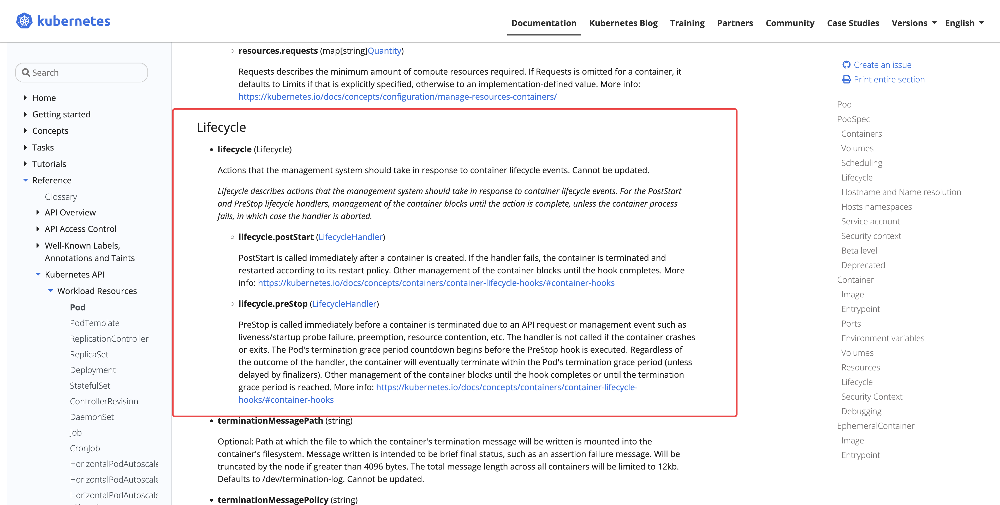

- 官方文档如何查阅
	- 中文版的文档是空的怎么办？
	  collapsed:: true
		- 切换回英文版本，用 google 翻译。
	- 注意查看文档的版本
	- Pod 的生命周期
		- 官方文档： https://kubernetes.io/zh/docs/concepts/workloads/pods/pod-lifecycle/
	- Pod 中 Container lifecycle 的说明
		- 官方文档： https://kubernetes.io/docs/reference/kubernetes-api/workload-resources/pod-v1/#Container
		- {:height 370, :width 716}
- 验证的场景
	- 正常的启动
	- 通过 kubectl delete后自动重启
	- 登录到容器中 kill 1，容易退出
		- 注意： kill -9 1 无效，这个地方有一个引申的知识点 [[为何在容器中 kill -9 1无效？]]
	- liveness 探针执行失败
		- 对比liveness 探针执行成功。
		- 注意调大给容器分配的资源，以便容器快速启动。
		- 观察容器日志，查看启动时间，避免启动过慢导致 liveness 执行失败。
	- 小疑问？
		- Pod  名字没有变化，container 是否发生变化。。
	-