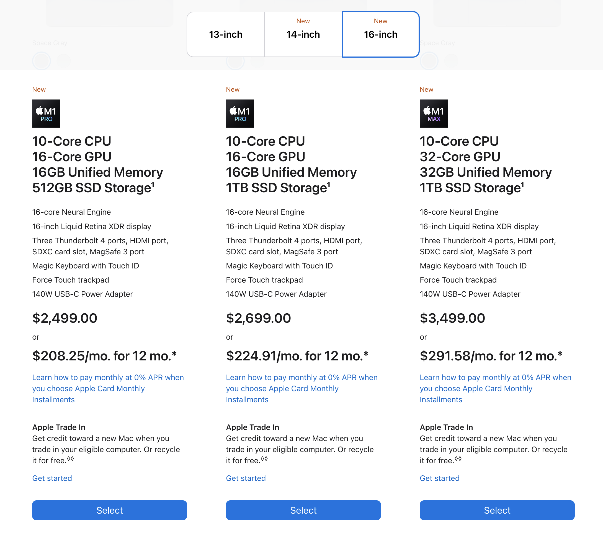
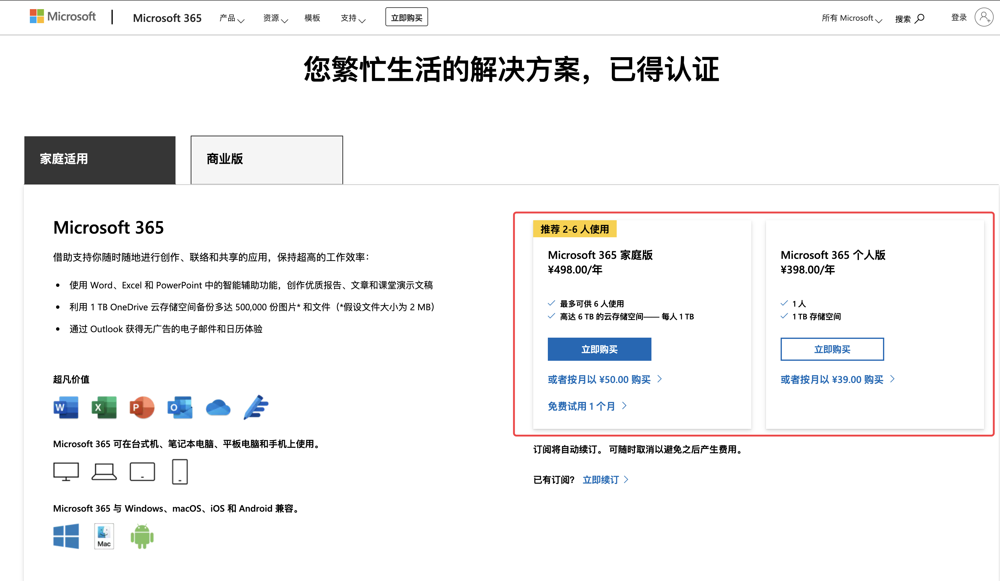

- 
- 举例说明
	- 手机，电脑，车 都会讲配置
	- 抽象一下，某一款产品有很多部件组成，没个部件又有多中规格可供选择，使用不同的规格的部件组成一个产品的组合方案，就叫配置。
- 硬件配置
	- 略。
- **软件配置**
	- 软件除执行业务逻辑的代码外，其中的一个重要组成部分就是配置，配置的作用是用来区别如何给用户提供差异化的服务。
	- 
- 配置的特点
	- 作用的阶段
		- 软件安装时生效
			- 考虑安装的硬件环境
				- 例如：mac 的芯片是 Intel 还是 M1，是否与软件兼容
			- 考虑安装的软件环境
				- 电脑安装的操作系统是 mac OS 还是 windows，决定了你需要使用哪个安装包
				- 不同的操作系统，软件的安装路径也有差异，像 window 有 CDEF...分盘的概念，mac 就没有
			- 如果不配置（当然可以使用默认配置），软件无法完成安装
				- 例如，如果没有指定安装位置，一定是无法安装的
		- 软件启动时生效
			- 常见的配置有，主题（dark，light）， 模式（新手模式，专业模式）
			- 这一类配置用户是可以做更改，更改完成之后立即或者重启软件后生效，更改的频次不高
		- 软件运行某一功能时生效
			- 常见的有，手机软件使用摄像头时的临时授权，读取位置信息等，只有在打开拍照，扫描二维码或者定位时，获取授权，通过授权的方式更改配置
	- 作用的范围
		- 平台/软件级
			- 只跟硬件环境，软件环境以及安装部署方案相关
		- 租户级
			- 对不同租户，配置会有差异，用于控制软件提供的服务包，往往对应普通版，专业版这样的服务分级
		- 用户级
			- 用户的个性化配置，例如接收提醒的手机号，邮箱等
	- 修改的频度
		- 无法修改，除非重新安装，例如安装路径
		- 修改频次低，例如秘钥，周期性低频更换
		- 经常修改。--不建议做成配置
	- 时效性
		- 立即生效
		- 重启后生效
		- 在一定时间范围内生效
	- 被保护的级别
		- 管理员级别
		- 主账号级别
		- 个人级别
	- 配置的实现形式
		- 文件 json,yaml,properties
		- 数据库
		- 配置中心，zk，ectd
- 划重点：**区分一项数据是配置还是业务数据是一个仁者见仁智者见智的事情**