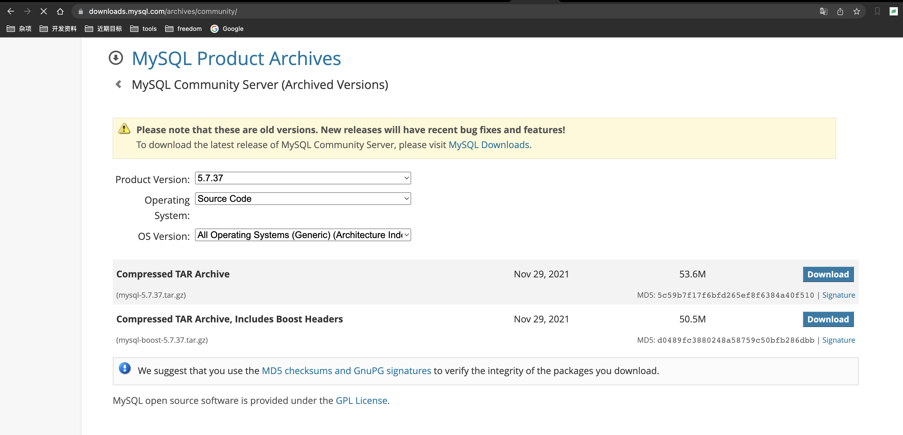
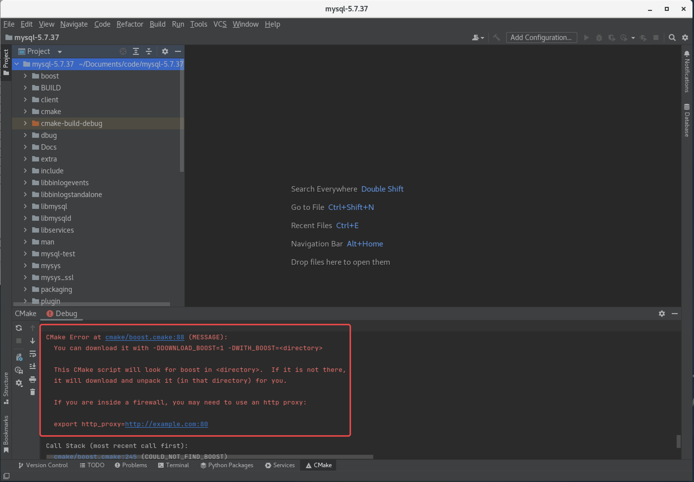
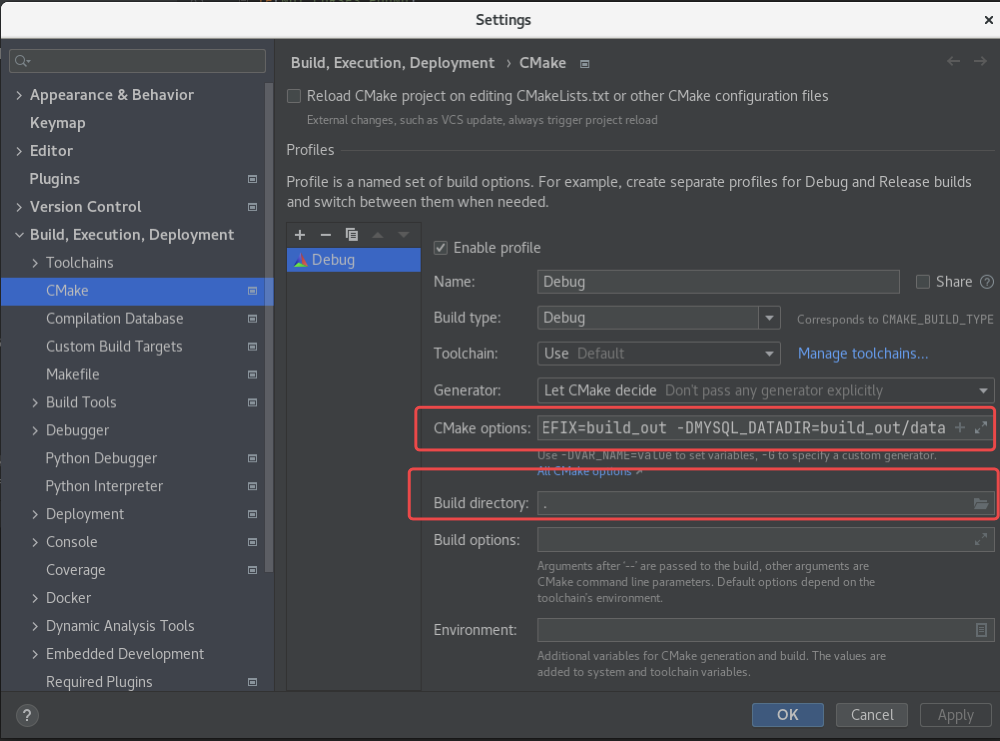
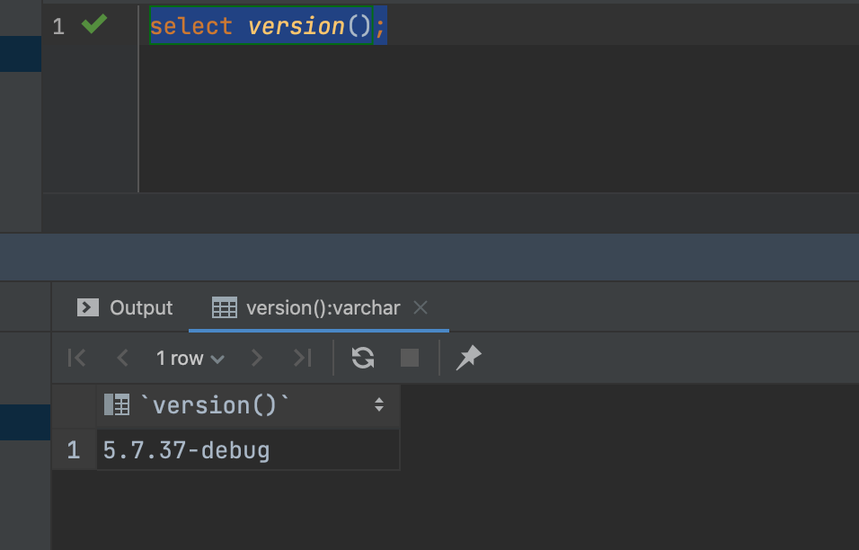
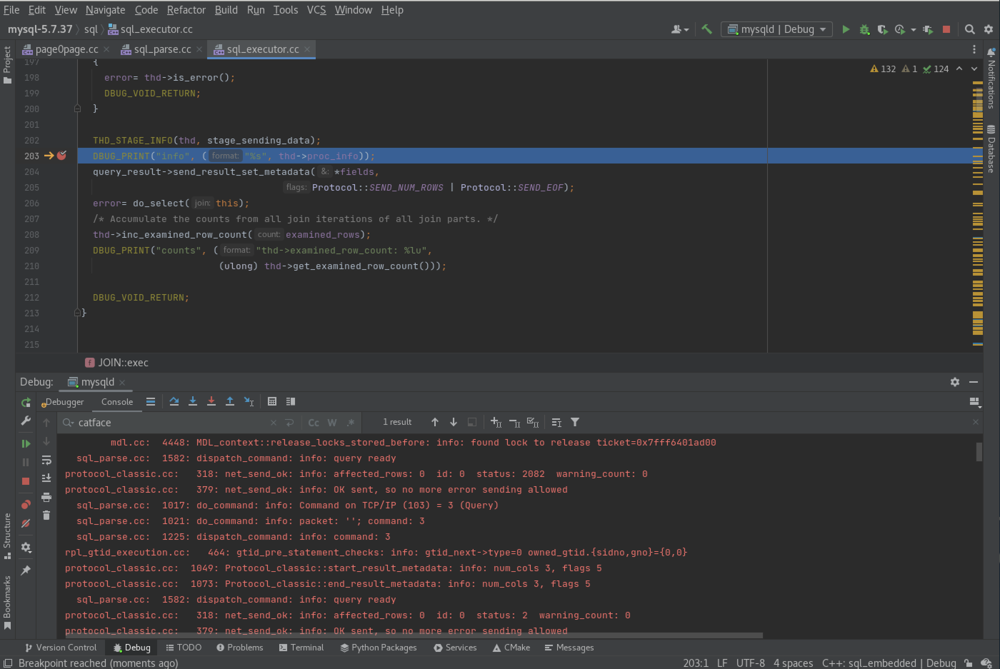

- 官方文档
	- https://dev.mysql.com/doc/refman/5.7/en/compiling-for-debugging.html
- 安装 CentOS 7.9
	- 镜像下载地址： http://mirrors.163.com/centos/7.9.2009/isos/x86_64/CentOS-7-x86_64-DVD-2009.iso
	- 虚拟机配置：
		- 4C
		- 16G （16384M）
		- 100G
	- 需要创建一个非 root 用户来启动 mysql
- 下载MySQL源码
	- {:height 353, :width 716}
	- 仅下载源码
		- https://downloads.mysql.com/archives/get/p/23/file/mysql-5.7.37.tar.gz
	- 带 boost源码
		- https://downloads.mysql.com/archives/get/p/23/file/mysql-boost-5.7.37.tar.gz
- 安装CLion
	- 
	- https://www.jetbrains.com/clion/
	- https://download.jetbrains.com.cn/cpp/CLion-2022.1.1.tar.gz
- CLion 打开源码
	- 在源码目录中新建 build_out/data 目录
		- 
	- 报错处理
		- 问题 1：CMake Error at cmake/boost.cmake:88 (MESSAGE):
			- ```shell
			  CMake Error at cmake/boost.cmake:88 (MESSAGE):
			    You can download it with -DDOWNLOAD_BOOST=1 -DWITH_BOOST=<directory>
			  ```
			- 
			- 解决方案
				- 在 cmake 中配置 boost
				- ```properties
				  . -DWITH_DEBUG=1 -DDOWNLOAD_BOOST=1 -DWITH_BOOST=./boost -DCMAKE_INSTALL_PREFIX=build_out -DMYSQL_DATADIR=build_out/data 
				  ```
				- 
				-
		- 安装 openssl-devel
			- ```shell
			  yum -y install openssl-devel
			  ```
		- 安装 ncurses-devel
			- ```shell
			  yum -y install ncurses-devel
			  ```
- make && make install
- 配置 my.cnf
	- 注意，CentOS 7.9 存在默认的 mysql 配置 /etc/my.cnf ，可将其备份成 /etc/my.cnf.back，新建 /etc/my.cnf，内容如下：
	- ```properties
	  [mysqld]
	  datadir=/home/catface/Documents/code/mysql-5.7.37/build_out/data
	  ##lc-messages-dir用来指定信息路径, 这个是编译之后的路径。路径添加规则见下文。
	  lc-messages-dir=/home/catface/Documents/code/mysql-5.7.37/build_out/share
	  ## 配置字符集和排序规则
	  character-set-server=utf8mb4
	  collation-server=utf8mb4_bin
	  
	  [client]
	  default-character-set=utf8mb4
	  
	  [mysql]
	  default-character-set=utf8mb4
	  ```
- 初始化 mysql
	- ```shell
	  mysqld --initialize --user=catface
	  
	  s_azzcrYE6jr
	  ```
- 配置 mysqld，并启动
	- ```shell
	  --defaults-file=/etc/my.cnf
	  ## 或者
	  --defaults-file=/etc/my.cnf --debug=d,info:F:L
	  ```
- 登录 mysql，修改默认密码
	- ```shell
	  mysql -u root -p
	  
	  alter user 'root'@'localhost' identified by 'catface996';
	  create user 'root'@'%' identified by 'catface996';
	  grant all privileges on *.* to 'root'@'%' with grant option;
	  flush privileges;
	  ```
- 关闭防火墙
	- ```shell
	  ## 临时关闭
	  systemctl stop firewalld.service
	  ## 永久关闭
	  systemctl disable firewalld.service
	  
	  firewall-cmd --state
	  ```
- 远程连接到数据库
- 查看数据库版本
	- ```sql
	  select version();
	  ```
	- 
- 创建 catface996 schema
	- ```sql
	  create schema catface996；
	  ```
- 创建 contact 表
	- ```sql
	  create table if not exists contact
	  (
	      id                bigint                                 not null comment 'ID'
	          primary key,
	      contact_name      varchar(16)                            not null comment '姓名',
	      phone             varchar(16)                            not null comment '电话',
	      province          varchar(16)                            not null comment '省份',
	      city              varchar(16)                            not null comment '城市',
	      county            varchar(16)                            not null comment '区县',
	      address_in_detail varchar(64)                            not null comment '详细地址',
	      created           datetime     default CURRENT_TIMESTAMP not null comment '创建时间',
	      updated           datetime     default CURRENT_TIMESTAMP not null comment '修改时间',
	      remark            varchar(128) default ''                not null comment '备注'
	  )
	      comment '联系人';
	  
	  create index contact_phone_index
	      on contact (phone);
	  ```
- 在sql_executor.cc 203 行处打断点
	- 
- 参考文档：
	- 官方：
		- https://dev.mysql.com/doc/refman/5.7/en/debugging-mysql.html
	- 博客：
		- https://jishuin.proginn.com/p/763bfbd6743e
		- https://www.modb.pro/db/111795
	-
	-