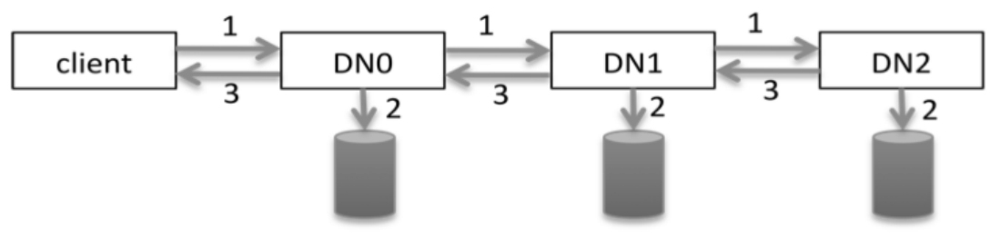

- 一个词来描述分布式系统：分而治之
- 分布式系统的前世今生
- 边界
  collapsed:: true
	- 
- 大前提
  collapsed:: true
	- 软件按照既定的设计方案正常运行的情况下，解决复杂的业务场景。
	- 既定的设计方案**会考虑**
		- 网络异常。
		- 服务器宕机。
		- 进程崩溃等。
	- 既定的世界方案**不考虑**
		- 人为的恶意修改，例如恶意攻击。
		- 代码漏洞。
- 概念
  collapsed:: true
	- 建立在网络之上的软件系统。
		- 软件组件分布在不同的网络计算机上。
		- 软件组件之间的通信通过网络来完成。
- 分布式系统的扩展
  collapsed:: true
	- x轴方向扩展
	  collapsed:: true
		- 解决的问题：
			- 为了解决单机无法满足大量并发请求。
		- 特点：
			- 对同一个应用扩展出多个副本。
			- 需要配置负载均衡将压力分散到不同的副本，可以将请求分发到任意一个副本。
			- 需要应用是无状态的，即可以随时下线，可以随时扩展出新的副本。
		- 瓶颈：
			- 负责管理状态的数缓存或者数据库这一层的处理能力会逐渐达到上线，通用需要可以水平扩展。
	- y轴方向扩展
	  collapsed:: true
		- 解决的问题：
			- 为了解决x周扩展的数据缓存层和数据库层的处理能力的上限，支持数据库的水平扩展。
		- 特点：
			- 按照业务领域拆分成多个应用。
				- 例如在电商系统中，商品详情页可能就是一个独立的子系统，有多层应用服务器、多层缓存机制、多个数据库组成，并且由一个庞大的部门独立维护者。
		- 瓶颈：
			- 即便是按业务领域拆分后，某个极小的领域仍旧有海量数据要管理，数据库仍旧有瓶颈。例如大型电商的订单系统。
	- z轴方向扩展
		- 解决的问题：
		  collapsed:: true
			- 解决拆分的某一个极小业务领域的海量数据无法靠单个数据库承载的问题。
		- 特点：
		  collapsed:: true
			- 对某一领域的数据做分片。
			- 需要有数据读写的分片路由规则。
			- 分片的动态扩展。
		- 瓶颈：
		- 如何把数据保存到多态服务骑上？
			- 1.仍旧视同关系型数据库，做分库分表。这种架构的难点是当分库分表规则发生变化时的数据迁移问题。
			  collapsed:: true
				- 数据迁移：
					- 全量的数据迁移，分片路由算法一般是根据某个id取余。
					- 部分数据的迁移，分片路由算法可以用一致性哈希。
				- 数据查询：
					- 有些复杂查询，会在多个数据库服务器上执行sql，然后合并执行结果，需要处理各种异常。
					- 像分页等查询，涉及到大量数据的归并，存在效率问题。
				- 开源数据库中间件
					- 仅在编码层面解决了面向多数据编程的问题，核心思路仍旧是多个sql在不同的数据库服务器上执行。
				- 最重要的一个难题是，这种架构保证数据的一致性很有挑战。
			- 2.放弃SQL的便利性，采用分布式文件系统保存海量数据。
			  collapsed:: true
				- 可以使用HDFS存储数据，HDFS提供了可靠的数据存储能力和强一致性。
			- 3.在在线服务(OLTP)方面，我们可以采用NoSQL数据库来存储数据。
			- 4.使用NewSQL数据库。NewSQL并没有去掉对SQL的支持，同时具备良好的水平扩展能力、可靠性和可用性。
	- 当系统在z轴上支持水平扩展后，整个系统就彻底成为一个分布式系统。
- 分布式系统现状
  collapsed:: true
	- 目前应用层的分布式技术已经相对成熟，虚拟化技术、容器技术（Docker），网格服务（service mesh）已经成熟并且大面积落地。
	- 相对而言，数据库分布式技术的成熟度远不如应用程程序的分布式技术，大部分公司仍旧以分库分表为主。
	- 无论哪一种数据层的分布式技术，最难的攻克莫过于分布式系统的一致性。
- 分布式系统面临的问题
  collapsed:: true
	- 通信异常：网络本身是不可靠的。
	- 网络分区：网络与网络之间出现无法通信的情况，但是子网内部的网咯是正常的。
	- 节点故障：
	- 三种请求应答状态：成功，失败和超时。
- 分布式式系统的一致性
  collapsed:: true
	- 定义： 分布式数据一致性是指，数据在不同的节点上存在多个副本时，各副本的数据是一致的，即相同副本的数据无差异。
	- 分类：
	  collapsed:: true
		- 强一致性
			- 要求对分布式系统写入A，从分布式系统中读出的也是A。即存在一个全局性的写入，读取的严格先后顺序。
		- 弱一致性
			- 读写一致性： 保证用户能够第一时间读取到自己更改的数据。
			- 单调读一致性： 当前读到的数据，不能比上次到的数据旧，却不要求当前读到的一定是最新的。
			- 因果一致性：当节点A在更新完数据X=10通知到B节点，那么B节点之后针对X的读取和修改都需要基于X=10这个前提下，同时，如果A节点未同步X=10到C节点，C节点在读取X时，不受X=10这个前提限制。
			- 最终一致性：顾名思义，数据在不同的节点间，经过一定的时间后，最终会达成一致。
- 分布式事务
  collapsed:: true
	- 要满足事务的基本特性ACID
	- 分布式事务相对于本地事务而言，表现形式会有所不同。
- 5 大类分布式系统
	- Google 文件系统
	  collapsed:: true
		- 操作与职责
			- 创建元数据，例如文件的位置，大小，名称等交给 master 来处理。
			- 写数据交给 chunk server 来处理，client 直接提交 数据给 chunk server。
			- 通过 primary replica 来控制 chunk server对某个数据文件的并发写入。
		- GFS 松弛一致性
			- 一致性的解释：client 无论从哪个副本读取数据，看到的总是相同的数据，这称为一致性。
			- 元数据的一致性
			- 文件数据的一致性
	- HDFS（Hadoop Distributed File System）
	  collapsed:: true
		- HDFS 的架构
		  
		- HDFS 的 pipeline
		  
		  
		-
	- Google 的 BigTable
	  collapsed:: true
		- BigTable 的数据模型
		  
		- 带时间戳的 BigTable 数据模型
		  
		- 行级原子性
		- BigTable 的架构
			- GFS
			- chubby
				- Google 公司内部的分布式锁服务。
			- client
			- master
				- 负责把一个 tablet 指派给一个 tablet server
			- tablet server
				- BigTable 会为每个 tablet 指定一个 tablet server
			-
		-
	- 文档数据库 MongoDB
		- MongoDB 是一个介于关系型数据库和非关系型数据库之间的产品。
-