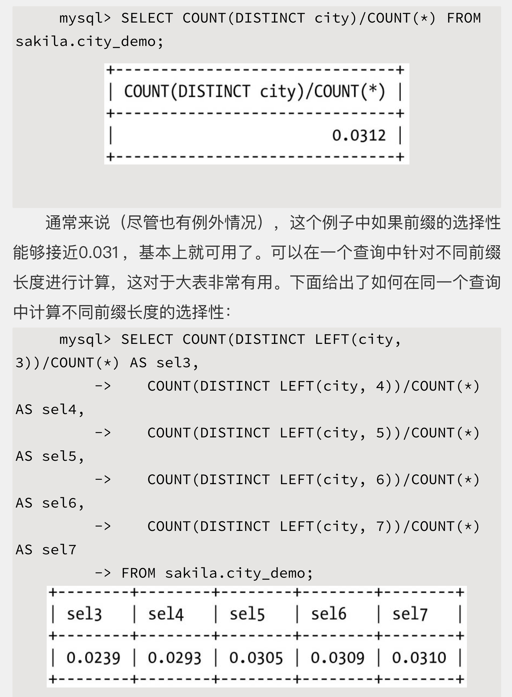
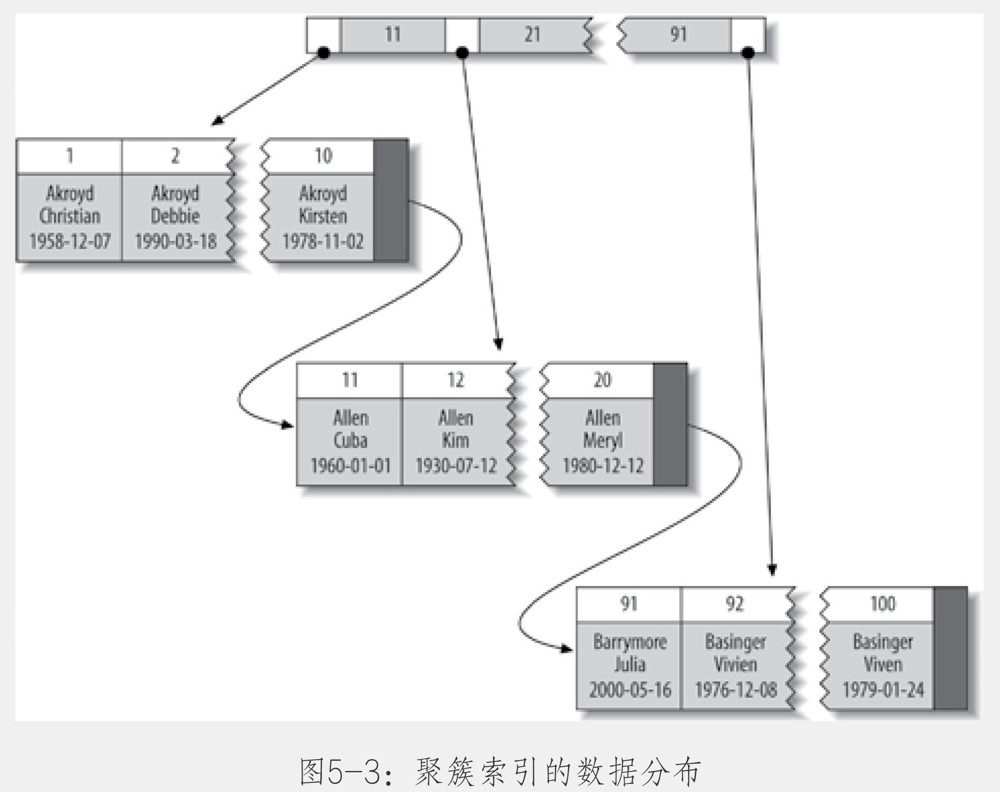
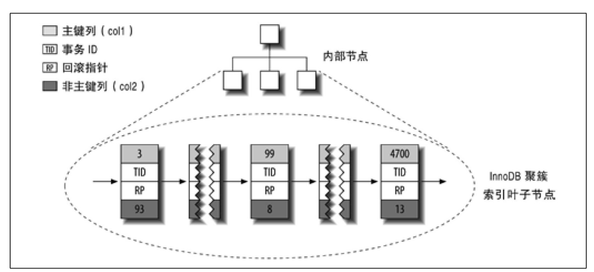
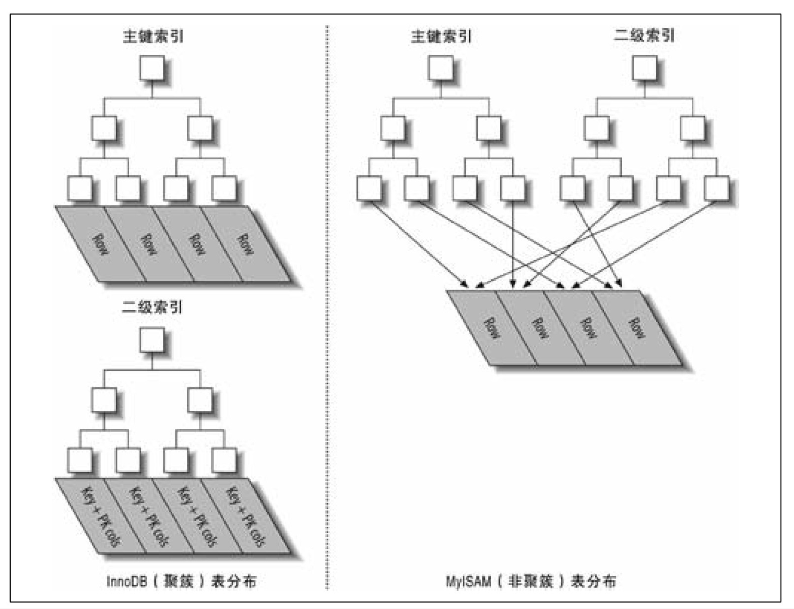

- 索引基础
  collapsed:: true
	- 索引的类型
	  collapsed:: true
		- B-Tree索引
			- B-Tree对索引列是顺序组织存储的，所以很适合查找范围数据。
			- 可以使用B-Tree索引的查询类型：
				- 全值匹配
				- 匹配最左前缀
				- 匹配列前缀
				- 匹配范围值
				- 精确匹配某一列并范围匹配另外一列
					- 遵循最左匹配原则
			- 只访问索引即可完成的查询：
				- 所谓的“索引覆盖”
			- 关于B-Tree索引的限制
				- 如果不是按照索引的最左列开始查找，则无法使用索引。
				- 不能跳过索引的列。
				- 如果查询中有某个列的范围查询，则其右侧的所有列都无法使用索引优化查找。
		- 哈希索引
			- 哈希索引只包含哈希值和行指针，而不存储字段只，所以不能使用索引中的值来避免读取行。
			- 哈希索引数并不是按照索引值顺序存储的，所以也就无法用于排序。
			- 哈希索引也不支持部分索引列匹配查找，因为哈希索引始终是使用索引列的全部内容来计算哈希值的。
			- 哈希索引只支持等值比较查询，包括 =、in、<>
			- 如果哈希冲突多的话，一些索引维护操作的代价也会很高。
			- “自适应哈希索引”，是InnoDB在内存中，基于B-Tree索引智商再创建一个哈希索引，加速哈希查找。
			- 例子：
				- 例如需要存储大量的URL，并且需要根据URL进行查找
					- 使用CRC32来做哈希
					- 避免使用SHA1和MD5  结算出的哈希值长，存储浪费空间，比较运算慢，本身是用来加密的，设计目标是为了计量减少冲突
			-
- 索引的优点
  collapsed:: true
	- 多音大大减少了服务器需要扫描的数据量。
	- 索引可以帮助服务器避免排序和临时表。
	- 索引可以将随机I/O变为顺序I/O。
	- 参考： [[Relational Database Index Design and the Optimizers]]
	- 某个查询的“三星系统”
		- 索引将相关的记录放到一起则获得一星。
		- 如果索引中的数据顺序和查找列中的排列顺序一致则获得二星。
		- 如果索引中的列抱哈了查询中需要的全部列则获得“三星”
	- 索引是最好的解决方案吗？
		- 仅当帮助查找带来的好处大于带来的其他额外工作时，索引才是最有效的。
		- 对于小表，全表扫描效率更高，例如一个Page（16KB）即存储完所有数据。
- 高性能的索引策略
  collapsed:: true
	- 独立的列
	  collapsed:: true
		- 是指索引列不能是表达式的一部分，也不能是函数的参数。
	- 前缀索引和索引选择性
	  collapsed:: true
		- 唯一索引的选择性是1，这是最好的索引选择性，性能也是最好的。
		- 前缀索引应该是的前缀足够长，以使得前缀索引的选择性接近于整个列。换句话说，前缀的“基数”应该接近于完整列的“基数”。
		- 例如
		  collapsed:: true
			- 
		- 缺点：
			- 无法通过前缀索引做ORDER BY和 GROUP BY,也无法使用前缀索引做扫描覆盖。
	- 多列索引
	  collapsed:: true
		- select * from film_actor where actor_id = 1 or film_id = 1 在老版本中，会全表扫描在新版本中会使用两个单独的索引。
		- ```shell
		  mysql> explain select * from sakila.film_actor where film_id = 1 or actor_id=1\G;
		  *************************** 1. row ***************************
		             id: 1
		    select_type: SIMPLE
		          table: film_actor
		     partitions: NULL
		           type: index_merge
		  possible_keys: PRIMARY,idx_fk_film_id
		            key: idx_fk_film_id,PRIMARY
		        key_len: 2,2
		            ref: NULL
		           rows: 29
		       filtered: 100.00
		          Extra: Using union(idx_fk_film_id,PRIMARY); Using where
		  1 row in set, 1 warning (0.00 sec)
		  ```
		- 索引合并策略的缺点：
			- 当服务器出现多个索引做相交操作时（通常有多个AND）条件，通常意味着需要一个包含所有相关列的多列索引，而不是多个独立的单列索引。
			- 当服务器需要对多个索引做联合操作时（通常有多个OR条件），通常需要消耗大量的CPU和内存资源在算法的缓存、排序和合并操作上。特别是当其中有些索引的选择性不高，需要合并扫描返回的大量数据的时候。
			- 更重要的是，优化器不会把这些计算到“查询成本”中，优化器只关系随机页面读取。
			- 可以共通过参数optimizer_switch来关闭索引合并功能。
	- 选择合适的索引顺序
	  collapsed:: true
		- 将选择性最高的列放在最前面，不见得是最好的选择，需要考虑到查询的场景。当不需要考虑排序和分组时，将选择性最高的列放在最前面通常是最好的。
		- 需要考虑基数。
	- 聚簇索引
	  collapsed:: true
		- 聚簇索引并不是一种单独的索引类型，而是一种数据存储方式。
		- 存储结构示意图
		  collapsed:: true
			- 
		- 优先选择主键创建聚簇索引，其次选择非空的唯一索引。
		- 优点
		  collapsed:: true
			- 可以把相关数据保存在一起。
			- 数据访问更快。
			- 使用覆盖索引扫描的查询可以直接使用页节点中的主键值。
		- 缺点
		  collapsed:: true
			- 聚簇数据最大限度地提供了I/O密集型应用的性能，但如果数据全部放在内存中，则访问的顺序就没那么重要了，聚簇索引也就没什么优势了。
			- 插入速度严重依赖插入顺序。
			- 更新聚簇索引列的代价很高，因为会强制InnoDB将每个被更新的行移动到新的位置。
			- 基于聚簇索引的表在插入新行，或者主键被更新导致需要移动行时，可能面临页分裂。
			- 聚簇索引可能导致全表扫描变慢，尤其是行比较西数，或者由于页分裂导致数据存储不连续的时候。
			- 二级索引（非聚簇索引）可能比想想的要更大，因为在二级索引的叶子节点包含了引用行的主键列。
			- 二级索引访问需要两次索引查找，而不是一次。
		- InnoDB的数据分布，在InnoDB中，聚簇索引就是表
		  collapsed:: true
			- 
			- 聚簇索引的每一个叶子节点都包含了主键值、事务ID、用于事务和MVCC的回滚指针以及所有剩余列。
			- 
			-
		- 在InnoDB表中按主键顺序插入行
		  collapsed:: true
			- 代理主键，建议使用自增的整数。
			- 最好避免随机的聚簇索引。
			- 随机主键的缺点
				- 写入的目标页可能已经刷盘到磁盘上并从缓存中移除，或者还没有加载到缓存中，InnoDB在插入之前不得不先找到并从磁盘读取目标页到内存中。这将导致大量的随机I/O。
				- 因为是乱序的，InnoDB不得不频繁地做也分裂操作，以便为新的行分配空间。页分裂会导致移动大量数据，一次插入最少需要修改三个页而不是一个页。
				- 由于频繁的页分裂，页会变得西数并被不规则的填充，所以最终数据会有碎片。
			- 顺序插入，使用自增时的缺点
				- 在高并发的插入场景下，主键的上界会成为“热点”
	- 覆盖索引
	  collapsed:: true
		- 优点
			- 索引条目通常远小于数据行大小，所以如果只需读取索引，那MySQL就会极大的减少数据访问量。索引比数据小，也就更容易全部放到内存中。
			- 因为索引是按照列值顺序存储的（至少在单个页内是如此），所以对I/O密集型的范围查询会比随机从磁盘读取每一行数据的I/O要少的多。
			- 一些存储引擎例如MyISAM在内存中只缓存索引，数据则依赖于操作系统来缓存，因此访问数据需要一次系统调用，这可能导致严重的性能问题。
			- 由于InnoDB的聚簇索引，覆盖索引对InnoDB表特别有用。
		- 在执行计划中，可在Extra列看到“Using index”，此时说明是索引覆盖
			- ```shell
			  mysql> EXPLAIN SELECT store_id, film_id FROM sakila.inventory\G;
			  *************************** 1. row ***************************
			             id: 1
			    select_type: SIMPLE
			          table: inventory
			     partitions: NULL
			           type: index
			  possible_keys: NULL
			            key: idx_store_id_film_id
			        key_len: 3
			            ref: NULL
			           rows: 4581
			       filtered: 100.00
			          Extra: Using index
			  1 row in set, 1 warning (0.00 sec)
			  ```
		- 索引下推 （index condition pushdown）
	- 使用索引扫描来做排序
	  collapsed:: true
		- MySQL有两种方式可以生成有序的结果：
			- 通过排序操作
			- 通过按索引顺序扫描
				- explain出来的type列为“index”说明MySQL使用了索引扫描来做排序。
		- 不会使用索引做排序的查询：
			- order by 字句中的字段的排序方向不一致，因为索引都是正序的
			- order by字句中出现不在索引中的字段
			- order by 子句中的字段要与where字句中的字段需组合成索引的最左前缀
			- 当where中出现范围查询时，order by将不会使用索引扫描
			- 对排序来讲，in 也是范围查询
	- 压缩（前缀压缩）索引
	  collapsed:: true
		- 例如，索引块中的第一个值是“perform”，第二个值是“performance”，那么第二个值的前缀压缩后存储的是类似“7,ance”这样的形式。
		- 优点：
			- 省空间
		- 缺点：
			- 不能做二分查找
			- 正序扫描的速度还不错，倒序扫描很糟糕
	- 冗余和重复索引
	  collapsed:: true
		- **注意，二级索引都有一个隐藏字段，是表的主键，并且该字段是最后一个**
		- 指定字段A为主键或者唯一约束，然后再创建索引（A），索引（A）就是冗余
		- 创建了索引（A，B），再创建索引（A），索引（A）就是冗余索引
		- 创建了索引（A，B），再创建索引（A，ID），其中ID是主键，索引（A，ID）是冗余索引
		- 创建了索引（A，B），再创建索引（B，A），索引不冗余
	- 未使用的索引
	  collapsed:: true
		- 发现就删除
	- 索引和锁
	  collapsed:: true
		- InnoDB在二级索引上使用共享（读）锁，但访问主键索引需要拍他（写）锁。这消除了使用索引覆盖的可能性，并且是的select for update 比lock in share mode或非锁定查询要慢很多。
- 索引案例教学
  collapsed:: true
	- 支持多种过滤条件
		- 可能发生范围查询的列，尽量定义在索引的最右侧
		- 不常用的字段，不要定义到索引中，即便使用到，使用where过滤即可
		- 避免多个条件的in，因为会出现笛卡尔积
	- 避免多个范围条件
		- 当过个范围条件出现时，最多只有一个范围条件可以使用索引
		- 多个等值，即使用in，之后的范围查询是可以使用索引的，虽然在执行计划中，in的explain type也是“range”
	- 优化排序
		- 如果是分页，先根据索引分页，获得主键的集合，再根据主键获取相应的行
		-
- 维护索引和表
  collapsed:: true
	- 找到并修复损坏的表
		- ```shell
		  mysql> check table film_actor;
		  +-------------------+-------+----------+----------+
		  | Table             | Op    | Msg_type | Msg_text |
		  +-------------------+-------+----------+----------+
		  | sakila.film_actor | check | status   | OK       |
		  +-------------------+-------+----------+----------+
		  1 row in set (0.01 sec)
		  
		  mysql>
		  ```
		- 仅针对损坏的时二级索引，如果是系统区域，或者是行数据损坏，就没有办法通过repair table来修复。
	- 更新索引的统计信息
	  collapsed:: true
		- 基于成本的优化
			- 如果索引的统计信息不准确，会导致基于成本的优化出现偏差，可以使用analyze table来重新生成统计信息。
			- ```shell
			  mysql> analyze table film_actor;
			  +-------------------+---------+----------+----------+
			  | Table             | Op      | Msg_type | Msg_text |
			  +-------------------+---------+----------+----------+
			  | sakila.film_actor | analyze | status   | OK       |
			  +-------------------+---------+----------+----------+
			  1 row in set (0.01 sec)
			  ```
			- 生成统计信息的策略
				- Memory引擎根本不存储索引的统计信息
				- MyISAM将索引统计信息存储在磁盘中，ANALYZE TABLE需要进行一次全索引扫描来计算索引基数，在整个过程中需要锁表。
				- 直到MySQL 5.5版本，InnoDB也不在磁盘中存储索引统计信息，而是通过随机的索引访问进行评估并将其存储在内存中。参考： [[Hyperloglog]]
			- 查看索引的基数
				- ```shell
				  mysql> show index from film_actor\G;
				  *************************** 1. row ***************************
				          Table: film_actor
				     Non_unique: 0
				       Key_name: PRIMARY
				   Seq_in_index: 1
				    Column_name: actor_id
				      Collation: A
				    Cardinality: 200
				       Sub_part: NULL
				         Packed: NULL
				           Null:
				     Index_type: BTREE
				        Comment:
				  Index_comment:
				  *************************** 2. row ***************************
				          Table: film_actor
				     Non_unique: 0
				       Key_name: PRIMARY
				   Seq_in_index: 2
				    Column_name: film_id
				      Collation: A
				    Cardinality: 5462
				       Sub_part: NULL
				         Packed: NULL
				           Null:
				     Index_type: BTREE
				        Comment:
				  Index_comment:
				  *************************** 3. row ***************************
				          Table: film_actor
				     Non_unique: 1
				       Key_name: idx_fk_film_id
				   Seq_in_index: 1
				    Column_name: film_id
				      Collation: A
				    Cardinality: 997
				       Sub_part: NULL
				         Packed: NULL
				           Null:
				     Index_type: BTREE
				        Comment:
				  Index_comment:
				  3 rows in set (0.00 sec)
				  ```
		- 基于规则的优化
			- 略
	- 减少索引和数据的碎片
		- 三种碎片数据
			- 行碎片，指的是数据行被存储为多个地方的多个片段中。即使查询只从索引中访问一行记录，行碎片也会导致性能下降。
			- 行间碎片，是指路基上顺序的页或者行，在磁盘上不是顺序存储的。行间碎片对诸如全表扫描和聚簇索引扫描之类的操作有很大的影响，因为这些操作本能够从磁盘顺序存储的数据中获益。
			- 剩余空间碎片，是指页中有大量的空余空间。这导致服务器读取大量不需要的数据，从而造成浪费。
		- 对于MyIASM，三种碎片都会出现，对于InnoDB，不会出现短小的行碎片，InnoDB会移动短小的行并重写到一个片段中。
		- 可以通过执行optimize table或者导出再导入数据的方式整理数据。
- 总结
  collapsed:: true
	- 在使用和编写利用索引的查询时，有如下三个原则始终需要记住：
		- 单行访问是很慢的。
		- 按顺序访问范围数据是很快的。
		- 索引覆盖查询是很快的。
-
-