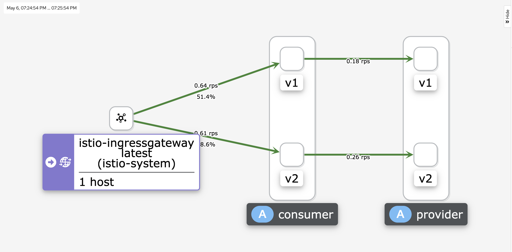
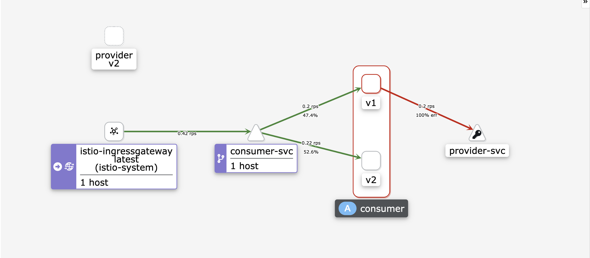

- 大前提
	- 需要读懂代码逻辑的人，不是机器，机器只负责执行。
	- 设计方案在满足业务诉求的前提下，应尽量减少开发人员的认知负担，降低运维成本。
	- 隔离复杂度，无论是面向对象编程，还是面向接口，面向服务，本质都是在化繁为简，分而治之。
	- 奥卡姆剃刀：如无必要，勿增实体。
	- 例如：
		- 相同功能的业务接口，10 个版本的维护成本 **大于** 3个版本的维护成本**大于**1个版本的维护成本。
		- 基于共识或者通识协作成本**小于**个性化的约定协作成本**小于**标新立异的协作成本。
- 方案比对
	- 应用级治理
		- 理想方案
			- 
		- 后端解决方案
			- 
			-
		- 后端&运维解决方案
			- 
			-
			-
	- 接口级治理
		- 
	- 优劣比较
		- 代码可维护性
			- 对实现相同功能的接口调整，无需考虑过多版本的业务逻辑，重点关注业务模型的兼容性。
			- 当接口功能升级时，不对原有接口产生影响。
			- 能及时清理到废弃的接口，减少认知负担和维护成本。
		- 运维可维护性
			- 平滑升级  服务不中断
			- 平滑回滚
			- 平滑清理废弃版本
		- 版本兼容易于管理
			- 方便调用方升级依赖新接口。
			- 方便接口提供方判断废弃版本的使用量，以安排废弃接口下线倒计时。
- 实施样例-应用级-后端&运维解决方案
	- 实施流程
		- 
	- 实施代码介绍
		- 代码地址： https://github.com/catface996/k8s-istio
		- Consumer 代码
			- v1 版本
				- 调用 v1 版本的 provider，返回结果是字符串
			- v2 版本
				- 调用 v2 版本的 provider，返回结果是 json 对象
		- Provider 代码
			- v1 版本
				- v1 版本仅提供  /v1/order/create 接口
			- v2 版本
				- v2 版本仅提供/v2/order/create 接口
		- Deployment 配置
		- Service 配置
		- istio-gateway 配置
			- istio-gateway 绑定 consumer-vs
		- Destination Rule 配置
			- 只需设定 provider 的路由规则
		- Virtual Service 配置
			- 只需设定 provider 的虚拟服务
	- 流量观察
		- ((62638d0b-abac-4fa7-bb9a-8d08efa0a4f6))
		- ((6270bfa9-1172-4762-91d1-3013d8da52ac))
	- 部署 v1 版本并验证
		- 配置 hosts
			- ```shell
			  192.168.162.22 consumer.catface996.com
			  ```
		- 打开 consumer 的 api 文档（浏览器）： http://consumer.catface996.com:31606/doc.html
		- 调用 v1 版本的提交订单，查看返回结果
			- 
	- 错误的示范-未配置流量规则
		- 部署 Provider v2，同时存在 v1 和 v2 的 Provider 版本
			- 
		- Consumer 早于 Provider 升级到 v2 版本
			- 
		- Consumer 和 Provider 同时存在 v1，v2 版本
			- 
	- 正常的示范
		- 还原到 v1 版本
		  collapsed:: true
			- 
		- 部署 Destination Rule
		  collapsed:: true
			- ```shell
			  ## 在 ladder/code/istio/multi-version 目录下执行
			  
			  kubectl apply -f destination-rule.yaml
			  ```
		- 部署 Virtual Service
		  collapsed:: true
			- ```shell
			  ## 在 ladder/code/istio/multi-version 目录下执行
			  
			  kubectl apply -f virtual-service.yaml
			  ```
		- 验证流量流量拓扑，未发生变化
		  collapsed:: true
			- 
		- 升级 Provider 到 v2 版本并验证
		  collapsed:: true
			- ```shell
			  ## 在 ladder/code/istio/multi-version 目录下执行
			  
			  kubectl apply -f provider-dp-v2.yaml
			  ```
			- 
		- 升级 Consumer 到 v2 版本并验证
		  collapsed:: true
			- ```shell
			  ## 在 ladder/code/istio/multi-version 目录下执行
			  
			  kubectl apply -f consumer-dp-v2.yaml
			  ```
			- 
			- 
		- 下线 Consumer v1 版本
		  collapsed:: true
			- ```shell
			  ## 在 ladder/code/istio/multi-version 目录下执行
			  
			  kubectl delete -f consumer-dp-v1.yaml
			  ```
			- 
		- 下线 Provider v1 版本
		  collapsed:: true
			- ```shell
			  ## 在 ladder/code/istio/multi-version 目录下执行
			  
			  kubectl delete -f provider-dp-v1.yaml
			  ```
			- 
			-
	- 错误的示范-已配置流量规则
		- 还原到 v1 版本
		- 在 v1 版本的基础上，未部署 Provider  v2 版本，部署了 Consumer 的 v2 版本
			- 
		- 在 v1 和 v2 全部部署的基础上，未下线 Consumer 的 v1 版本，下线 Provider 的 v1 版本
			- 
-