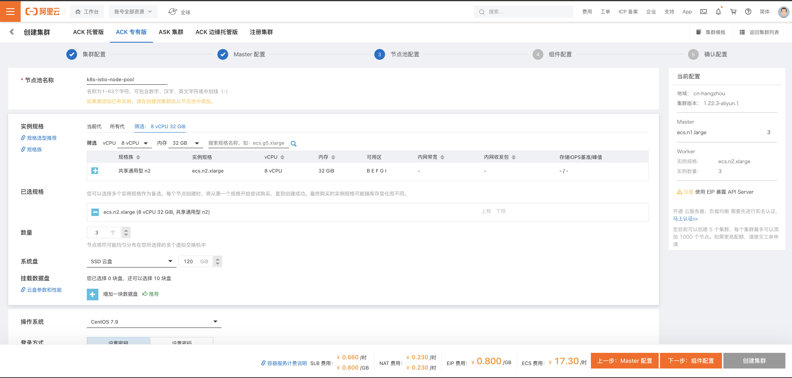
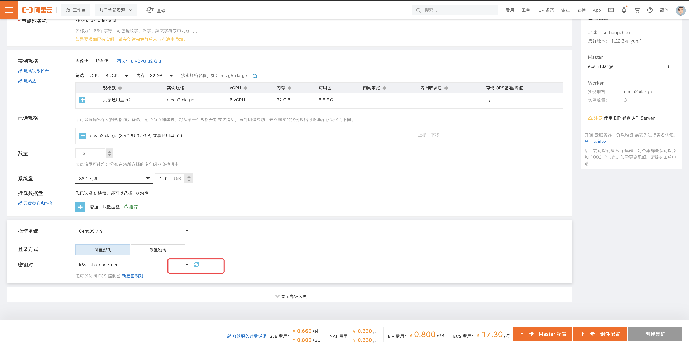
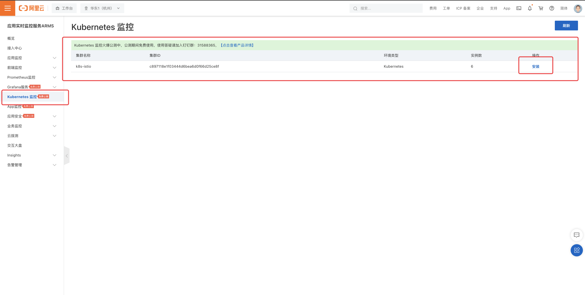

- 官方文档
	- https://help.aliyun.com/product/85222.html
- 登录阿里云
  collapsed:: true
	- 保证阿里云账户有100 块钱。
- 打开容器服务Kubernetes 版
  collapsed:: true
	- 收藏，可以调整顺序
		- 
	- 授权
		- 略
- 创建 Kubernetes 标准版
	- 进入集群列表，点击“创建集群”按钮。
	  collapsed:: true
		- {:height 403, :width 778}
	- 集群配置
		- 选择集群类型，例如：ACK 专有版
		- 填写集群名称，例如： k8s-istio
		- 选择地域，例如：华东一（杭州）
		- 选择付费类型，例如：按量付费
		- 选择 Kubernetes 版本，例如：1.22.3-aliyun.1
			- TODO 引申知识点：[[如何选择 Kubernetes 版本]]
		- 选择容器运行时，例如：Docker 19.03.15
			- TODO 引申知识点： [[如何选择 容器运行时]]
		- 
		- 选择或创建专有网络-本例中选择创建
			- 配置专有网络
				- 填写专有网络名称，例如：k8s-istio-vpc
				- 填写 IPv4 网段，例如：10.0.0.0/8
					- TODO 引申知识点：[[什么是专有网络]]， [[什么是RFC]]
					  :LOGBOOK:
					  CLOCK: [2022-05-08 Sun 18:50:58]--[2022-05-08 Sun 18:50:58] =>  00:00:00
					  :END:
				- 
			- 配置交换机
				- 填写交换机名称，例如：k8s-istio-专有网络交换机
				- 选择可用分区，例如：杭州 可用区 B
				- 配置IPV4网段
					- TODO 引申知识点：[[什么是网段]]
				- 
			- 点击“确定”，创建专有网络
				- 
				- 
				- 
		- 返回创建 Kubernetes 集群配置页，刷新可选专有网络，选择刚创建的专有网络
			- 
			- 
		- 选择网络插件，例如：Flannel
		- 选择虚拟交换机，例如：刚创建的“k8s-istio-专有网络交换机”
		- 选择 IP 节点数量，例如：256
		- 填写 Pod 网络 CIDR，例如：172.25.176.0/20
		- 填写 ServiceCIDR，例如： 192.168.0.0/16
			- TODO 引申知识点： [[CIDR]]
		- 配置 SNAT
		  collapsed:: true
			- TODO 引申知识点：[[SNAT]]
		- 配置 API Server 访问
		- 
		- 选择安全组，例如：自动创建企业级安全组
		- 开启集群删除保护
		- 点击“下一步 节点池配置”
		- 
		-
	- Master 配置
	  collapsed:: true
		- 选择 Mater 实例数量，例如：3
		- 选择实例规格，例如：共享计算型 n1  - 2C -  4G
			- TODO [[如何选择 k8s Master 节点的规格]]
		- 填写系统盘大小，例如：120G
		- 点击“下一步： 节点池配置”，进入节点池配置页面
		- 
	- 节点池配置
	  collapsed:: true
		- 填写节点池名称，例如：k8s-istio-node-pool
		- 选择实例规格，例如：共享通用型 n2  -  8C   -  64G
		  collapsed:: true
			- TODO [[如何选择 k8s  Worker 节点配置]]
		- 填写实例数量，例如：3
		- 填写系统盘大小，例如：120G
		- 选择操作系统，例如：CentOS 7.9
			- 
		- 选择登录方式，例如：设置秘钥
		- 选择或者创建秘钥对-本例选择创建秘钥对
		  collapsed:: true
			- 通过“新建秘钥对”连接，进入密钥对管理页面，点击“创建秘钥对”
				- 
			- 填写秘钥对名称，例如：k8s-istio-node-cert
			- 选择创建类型，例如：自动创建密钥对
			- 点击“确定”，创建密钥对
			  collapsed:: true
				- 
			- 创建完成后，会自动跳转到秘钥列表页，秘钥文件也会自动下载
				- 
		- 返回节点池配置页面，选择刚创建的秘钥对
		  collapsed:: true
			- 
			-
		- 点击“下一步：组件配置”，进入组件配置页面
	- 组件配置
	  collapsed:: true
		- 配置 Ingress
			- 例如：选择Nginx Ingress
			- 选择负载均衡类型，例如：公网
			- 选择负载均衡规格：例如：标准型 I（slb.s2.small）
				- TODO 引申知识点： [[如何选择阿里云负载均衡规格]]
		- 开启服务发现
		- 选择并开启存储插件，例如：CSI
			- TODO 引申知识点： [[如何选择 k8s 集权的存储插件]]
		- 启用监控插件
		- 启用日志服务
		- 启用集群巡检
		- 
		- 点击“下一步：确认配置”，进入确认配置页面
	- 确认配置
	  collapsed:: true
		- 所选配置核查
			- 
		- 依赖检查
			- 依赖检查不通过的，需要去授权，实名或者充值。
			- {:height 354, :width 685}
			- 
			- 
		- 勾选服务协议
		- 点击“创建集群”，会自动跳转到集群管理页面，展示创建的进度。
	- 查看集群创建的进度
	  collapsed:: true
		- 
		- 
		- 
		-
	- 查看集群的详情
	  collapsed:: true
		- 
	- 查看集群的拓扑
	  collapsed:: true
		- 
		- 
		- 
		- 
		- 
		- 
		- 
		- 
		- 
		- 
		- 
- 删除集群
	- 进入集群列表页，对待删除的集群，执行删除操作。
		- 
		- 
		- 
	- 删除日志服务中的 project
		- 
		- 
		-
-