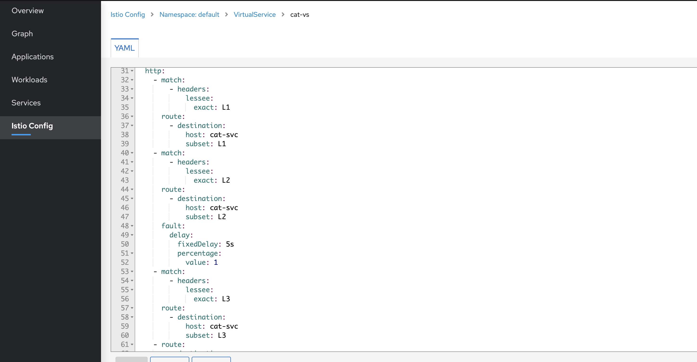

- 目标
	- 实现应用级的租户隔离。
	- 针对不同级别的租户做不同的流量策略。
- 抛砖引玉
	- 横向流量的服务治理：
		- 如何实现网格内服务之间不同 RPC 版本的治理，即东西流量治理。
		- 考量以下几个诉求：
			- 接口提供者，只需要在接口中标注好接口的版本。
			- 接口调用者，只需要指明调用的版本。
			- 标注版本可以通过 header 中携带参数，或者 url 前缀来标注。
			- 假设/v1/order/create 接口版本更新为/v2/order/create
				- Order V1 版本的工作负载继续存在，提供 /v1/order/create 服务，不提供 /v2/order/create
				- Order V2 版本的工作负载新部署，提供/v2/order/create服务，不再提供 /v1/order/create
			- 如何支持平滑发布？
			- 如何判断 Order V1 可以下线？
	- 数据层面的组合隔离：
		- 数据层面的租户隔离，例如 [MyBatis-plus](https://baomidou.com/pages/aef2f2/#tenantlineinnerinterceptor)
		- 线程级别，无法通过 RPC 跨微服务。
		- 只是针对数据隔离，仍旧使用同一个或者同一组的应用，使用同一个数据库。
- 期望的流量拓扑
	- 
- 代码和配置介绍
  collapsed:: true
	- spring cloud gateway 实现的业务网关介绍
		- 源码地址
			- github： https://github.com/catface996/ladder
			- gitee： https://gitee.com/catface996/ladder
		- token 换取 userId
		- 根据 userId 决策gray、prod
		- 根据 userId 决策 L1，L2，L3
	- Deployment 配置介绍
	- Service 配置介绍
	- istio-gateway 配置介绍
	- Destination Rule 配置介绍
	- Virtual Service 配置介绍
- 实施步骤和验证
	- ((62638d0b-abac-4fa7-bb9a-8d08efa0a4f6))
	- ((6270bfa9-1172-4762-91d1-3013d8da52ac))
	- 部署 Deployment
	  collapsed:: true
		- 执行部署命令
			- ```shell
			  ## 部署命令，在 ladder/code/istio/lessee 目录下执行
			  kubectl apply -f deployment.yaml
			  ```
		- 查验部署结果
			- kiali 查看 Workload 列表
				- 
			- kiali 查看 Workload 日志
				- 
				- 
	- 部署 Service
	  collapsed:: true
		- 执行部署命令
			- ```shell
			  ## 部署命令，在 ladder/code/istio/lessee 目录下执行
			  kubectl apply -f service.yaml
			  ```
		- 查看 kiali 面板中的 Service 列表
			- 
	- 部署 istio-gateway
	  collapsed:: true
		- 执行部署命令
			- ```shell
			  ## 部署命令，在 ladder/code/istio/lessee 目录下执行
			  kubectl apply -f biz-gateway-vs-bind-gateway.yaml
			  ```
		- 查验部署结果
			- kiali 查看 Istio Config 中的 Gateway 和 VirtualService
				- 
	- 配置本地 hosts
	  collapsed:: true
		- 配置
			- 
		- ping gateway.catface996.com 验证配置
			- 
	- 访问 sayHello 接口
	  collapsed:: true
		- 执行 curl 访问
			- ```shell
			  curl http://gateway.catface996.com:31606/cat/sayHello
			  
			  ## 实际执行结果
			  ➜  ~ curl http://gateway.catface996.com:31606/cat/sayHello
			  TraceId: 08776c4fc59a5a7d361c973ad591f906  header env(null),lessee(null), I'm cat(L3) --> TraceId: 08776c4fc59a5a7d361c973ad591f906  header env(null),lessee(null), I'm dog(default) --> %
			  ➜  ~ curl http://gateway.catface996.com:31606/cat/sayHello
			  TraceId: ff614908b4841c080752a8eb2a00acbe  header env(null),lessee(null), I'm cat(L2) --> TraceId: ff614908b4841c080752a8eb2a00acbe  header env(null),lessee(null), I'm dog(L1) --> %
			  ➜  ~ curl http://gateway.catface996.com:31606/cat/sayHello
			  TraceId: cb3f2d7c4cc3c9b13748ff202799385f  header env(null),lessee(null), I'm cat(L1) --> TraceId: cb3f2d7c4cc3c9b13748ff202799385f  header env(null),lessee(null), I'm dog(L1) --> %
			  ```
		- 查看 kiali 中的流量图
			- 
		- 查看 kiali 中的 Workload 日志
			- spring-cloud-gateway 日志
				- traceId： 08776c4fc59a5a7d361c973ad591f906
				- 
			- cat-dp-L1 日志
				- traceId： cb3f2d7c4cc3c9b13748ff202799385f
				- 
				- 
			- cat-dp-L2 日志
				- traceId： ff614908b4841c080752a8eb2a00acbe
				- 
				- {:height 322, :width 654}
			- cat-dp-L3 日志
				- traceId： 08776c4fc59a5a7d361c973ad591f906
				- 
				- 
	- 部署 Destination Rule
	  collapsed:: true
		- 执行部署命令
			- ```shell
			  ## 部署命令，在 ladder/code/istio/lessee 目录下执行
			  kubectl apply -f destination-rule.yaml
			  ```
		- kiali 面板中查看 Destination Rule
			- {:height 209, :width 685}
			- 
	- 部署 Virtual Service
	  collapsed:: true
		- 执行部署命令
			- ```shell
			  ## 部署命令，在 ladder/code/istio/lessee 目录下执行
			  kubectl apply -f virtual-service.yaml
			  ```
		- 查看 kiali 面板中的 Virtual Service
			- 
			- 
	- 分别验证 L1，L2，L3 的流量分布及策略
	  collapsed:: true
		- 验证 L1
			- ```shell
			  ## 验证L1
			  curl -H "token:abc" http://gateway.catface996.com:31606/cat/sayHello
			  ```
			- ```shell
			  ## 实际执行结果
			  ➜  ~ curl -H "token:abc" http://gateway.catface996.com:31606/cat/sayHello
			  TraceId: 35b0bc238ddea7aa6fff07b25d2d2ee0  header env(prod),lessee(L1), I'm cat(L1) --> TraceId: 35b0bc238ddea7aa6fff07b25d2d2ee0  header env(prod),lessee(L1), I'm dog(L1) --> %
			  ```
			-
		- 验证 L2
			- ```shell
			  ## 验证L2
			  curl -H "token:def" http://gateway.catface996.com:31606/cat/sayHello -w 'time_total %{time_total}\n'
			  ```
			- ```shell
			  ## 实际执行结果
			  ➜  ~ curl -H "token:def" http://gateway.catface996.com:31606/cat/sayHello -w 'time_total %{time_total}\n'
			  TraceId: 8180d826e37005740ca8524f72179e65  header env(gray),lessee(L2), I'm cat(L2) --> TraceId: 8180d826e37005740ca8524f72179e65  header env(gray),lessee(L2), I'm dog(default) --> time_total 5.031210
			  ➜  ~ curl -H "token:def" http://gateway.catface996.com:31606/cat/sayHello -w 'time_total %{time_total}\n'
			  TraceId: 3162ef89d12f799fe1887ed136ae86b0  header env(gray),lessee(L2), I'm cat(L2) --> TraceId: 3162ef89d12f799fe1887ed136ae86b0  header env(gray),lessee(L2), I'm dog(default) --> time_total 5.031788
			  ```
			- 
		- 验证 L3
			- ```shell
			  ## 验证 L3
			  curl -H "token:ghi" http://gateway.catface996.com:31606/cat/sayHello
			  ```
			- ```shell
			  ## 实际执行结果
			  ➜  ~ curl -H "token:ghi" http://gateway.catface996.com:31606/cat/sayHello
			  TraceId: 647be9053b1296986f58b520871dd706  header env(gray),lessee(L3), I'm cat(L3) --> TraceId: 647be9053b1296986f58b520871dd706  header env(gray),lessee(L3), I'm dog(default) --> %
			  ```
			- 
	- 混合 prod、gray 和 lessee 策略
		- 部署 Deployment
		- 部署 Destination Rule
		- 部署 Virtual Service
		- 验证 L1-prod
		- 验证 L1-gray
- 总结
	- 在集群入口处，部署业务网关，将根据业务参数设置的路由规则转换成 Istio 路由规则的入参，例如：http 请求 header 中的参数。
		- PS：在实际的工作中，除用户主动发起的同步请求外，还有基于用户请求衍生的异步线程，以及触发的消息，还有定时任务为起点的业务链路的路由参数生成策略等。
	- 转换后的通用协议层的路由参数需在整个业务链路中进行传播。