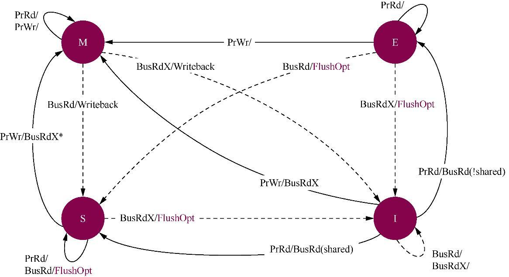

- 第1章 处理器架构
	- 1.1 处理器架构的介绍
		- 1.1.1 精简指令集和复杂指令集
		- 1.1.2 大/小端字节序
		- 1.1.3 一条存储读写指令的读写全过程
			- 经典处理器架构的流水线是5级流水线，分别是取指，译码，执行，数据内存访问和回写。
			- 现代处理器在设计上都采用了超标量架构（superscalar architecture）和乱序（Out of Order）执行结束，极大的提高了处理器计算能力。
- TODO GCC “O0”
- # 内存
	- 不同的机器对子长定义不一样，可能是16bit，可能是32bit，可能是64bit
	- 不同的机器对字节的定义是统一的，都是8bit
	- 单个内存颗粒的位宽有4bit，8bit或者16bit，个别也有32bit的
	- 从内存读取数据时，每次读取一个字，不是一个字节，16bit的子长就读取2字节，32bit子长，就读取4字节，64bit就读取8字节
	- 现代计算机主要是按字节编址的，32位寻址空间的的内存大小就是4G
	- Rank
		- CPU与内存之间的接口位宽是64bit，也就意味着CPU在一个时钟周期内会向内存发送或从内存读取64bit的数据。可是，单个内存颗粒的位宽仅有4bit、8bit或16bit，个别也有32bit的。因此，必须把多个颗粒并联起来，组成一个位宽为64bit的数据集合，才可以和CPU互连。生产商把64bit集合称为一个物理BANK（Physical BANK），简写为P-BANK。为了和逻辑BANK相区分，也经常把P-BANK称为RANK或Physical RANK,把L-BANK则简称为BANK。如果每个内存颗粒的位宽是8bit，应该由8个颗粒并联起来，组成一个RANK（64bit）；同理，如果颗粒的位宽是16bit，应该由4个颗粒组成一个RANK。由此可知：**Rank其实就是一组内存颗粒位宽的集合，也可以叫Chips，在PCB上，往往把一面上的内存颗粒组成一个Rank,另一面是另外一个Rank(假若有的话)，这样也可以将Rank理解内存条的Side(面)**。具体说，当颗粒位宽×颗粒 数=64bits时，这个模组就是有一个RANK。为了保证和CPU的沟通，一个模组至少要有一个RANK。但是，为了保证有一定的内存容量，目前，DDR2内存，经常是采用一个模组两个RANK的架构。“模组构成”中的“R”“RANK”的意思。“2R”是说组成模组的RANK数（Number of ranks of memory installed）是2个。有“1R”和“2R”两种；“模组构成”中的“×8”是颗粒的位宽(bit width)，有×4、×8和×16三种.
	- MESI
		- 目前，ARM或x86等处理器广泛使用MESI协议来维护高速缓存一致性。MESI协议的名字源于该协议使用的修改（Modified，M）、独占（Exclusive，E）、共享（Shared，S）和失效（Invalid，I）这4个状态。高速缓存行中的状态必须是上述4个状态中的1个。MESI协议还有一些变种，如MOESI协议等，部分ARMv7-A和ARMv8-A处理器使用该变种协议。
		- 
		- {:height 398, :width 716}
		- 通常一个高速缓存行的大小为64字节，一般一个长整型为8字节，所以需要8个长整形才能占满64字节的一个缓存行。
		- 高速缓存伪共享
			- 
			- 高速缓存伪共享的解决办法就是让多线程操作的数据处在不同的高速缓存行，通常可以采用高速缓存行填充（padding）技术或者高速缓存行对齐（align）技术，即让数据结构按照高速缓存行对齐，并且尽可能填充满一个高速缓存行大小。
			- 另外，在多CPU系统中，自旋锁的激烈争用过程导致严重的高速缓存行颠簸现象。
			-
- # 参考资料
	- [GCC优化级别](https://zhuanlan.zhihu.com/p/196785332)
	- [官方文档](https://gcc.gnu.org/onlinedocs/gcc/Optimize-Options.html#Optimize-Options)
	- [内存条的组成、编址、寻址和读写方式](https://www.cnblogs.com/yilang/p/11103061.html)
	-
-