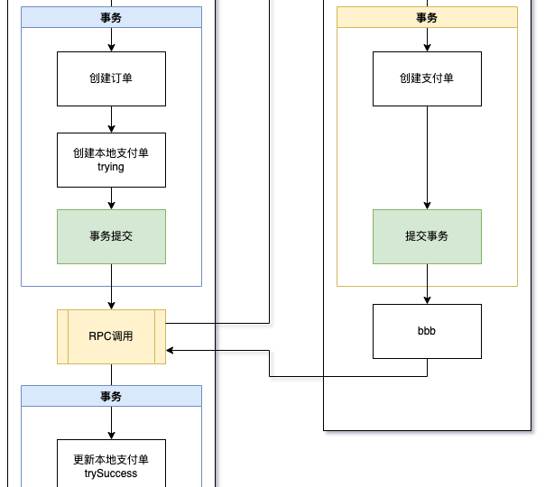

- # 前言
	- **设计问题仁者见仁智者见智，适合自己的就是最好的**
	- 微服务化必然面临本地事务和RPC的一致性挑战
	- 解决分布式系统事务一致性的方法
		- 分布式事务
			- seta
		- 最终一致性
			- 幂等+重试
	- 按照DDD的设计原理，实现一个交易系统的前置准备。
- # 本地事务和RPC一致性
	- **前提：明确获得rpc调用结果，如果调用方未能明确获取rpc服务方的结果，可认为rpc服务成功或者失败**
	- ## rpc调用在事务中
		- ### 创建类，例如：创建订单
			- 1.本地事务成功，rpc成功 （理想情况）✅
				- 本地数据存在，rpc服务提供方数据存在
					- 
			- 2.本地事务失败，rpc失败 （理想情况）✅
				- 本地数据不存在（被回滚），rpc服务提供方数据不存在
					- 
			- 3.本地事务成功，rpc失败 ❓ 可以通过幂等+重试达到最终一致性
				- 本地数据存在，rpc服务提供方数据不存在
				- 可以就本地已经存在的数据，再次发起rpc调用
					- 
			- 4.本地事务失败，rpc成功❓ 无法通过幂等+重试达到最终一致性
				- 本地数据不存在（被回滚），rpc服务提供方数据存在
				- 本地数据不存在，无法发起rpc调用
					- 
		- ### 修改类，例如：确认支付
			- 1.本地事务成功，rpc成功 （理想情况）✅
			- 2.本地事务失败，rpc失败 （理想情况）✅
			- 3.本地事务成功，rpc失败  ❓ 不能通过幂等+重试达到最终一致性
				- 本地数据已变更，rpc服务提供方数据未变更
				- 因为本地数据已变更，无法就本地数据再次发起rpc调用
			- 4.本地事务失败，rpc成功 ❓ 可以通过幂等+重试达到最终一致性
				- 本地数据未变更（已回滚），rpc服务提供方数据已变更
				- 可就本地已回滚的数据，再次发起rpc调用
		- ### 删除类，例如：删除过期未提交的订单
			- 逻辑删除等价于修改
			- 物理删除
				- 1.本地事务成功，rpc成功 （理想情况）✅
				- 2.本地事务失败，rpc失败 （理想情况）✅
				- 3.本地事务成功，rpc失败
					- 本地数据已被删除，rpc数据未被删除
				- 4.本地事务失败，rpc成功
					- 本地数据未被删除（已回滚），rpc数据已被删除
	- ## rpc调用不在事务中
	  collapsed:: true
		- ### 创建类，例如：创建订单
			- 本地事务成功，rpc成功（理想情况）✅
			  collapsed:: true
				- 本地支付单状态为trySuccess，rpc服务提供方支付单状态为trySuccess
				- 本地支付单状态为init，rpc服务提供方支付单状态为trySuccess，可以通过幂等+重试达到最终一致性
				- 
			- 本地事务失败，不调用rpc（理想情况）✅
				- {:height 692, :width 602}
			- 本地事务成功，rpc失败❓，可以通过幂等+重试达到最终一致性
				- 
		- ### 修改类，略
		- ### 删除类，略
- # rpc不在事务中与在事务中的优劣
	- 不在事务中的优势
		- 避免出现本地数据不存在（事务回滚），rpc服务提供方数据存在，导致无法重试来达到最终一致性
		- 将存在与否的一致性，变为状态一致与否的一致性，便于排查问题
	- 不在事务中的劣势
		- 需要本地额外保存rpc服务的镜像数据
- # 代码实现
	- 交易金额
		- 1.00
			- trade存在，pay存在
		- 2.00
			- trade不存在，pay不存在
		- 3.00
			- trade存在，pay不存在
		- 4.00
			- trade不存在，pay存在
				- 只有V1版本会出现，V2版本不会出现
- # TCC
	- ## try
		- 完成资源预占，防止后续进行confim时，无法正常执行
	- ## confirm or cancel
		- confirm，确认预占的资源被消耗，无法再回滚
		- cancel，释放被占用的资源
	- ## 网络调用必有三态问题
		- 明确结果
			- 成功
			- 失败
		- 未知结果
			- 因网络问题无法获得明确的成功与否
	- ## 只对明确的返回结果做状态变更
		- 
		-
	-