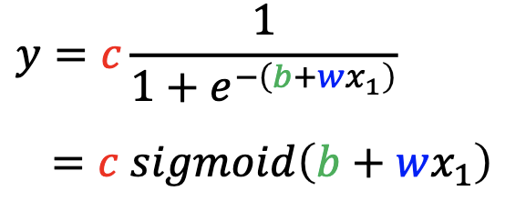

- Lecture 1：Introduction of Deep Learning
	- 视频
		- [youtube](https://www.youtube.com/watch?v=7XZR0-4uS5s)
		- [bilibili](https://www.bilibili.com/video/BV1Wv411h7kN?share_source=copy_web&vd_source=f663bb5b798c599e7c8f6de8e23cc277)
	- 课件
		- 2021
			- _1658380883438_0.pdf)
			- [regression (v16).pptx](../assets/regression_(v16)_1658380861100_0.pptx)
		- 2022
			- _1658374186454_0.pdf)
			- [introduction (v2).pptx](../assets/introduction_(v2)_1658379066545_0.pptx)
			- 
			- 
			- 
			- 
	- 作业
		- 
	- 摘要
		- Machine Learning ≈ Looking for function
			- Different types of Function
			  collapsed:: true
				- input
					- vector
					- matrix
					- sequence
				- output
					- scalar  （regression）
					- discrete value （classification）
					- sequence （generation）
			- How to Find Function
				- 三个步骤
					- Function with Unknown Parameters
						- y = b + wx1
						- x1 是feature
						- w 是权重
						- b 是偏移量
					- Define Loss From Training Data
						- Loss is a function of parameters
						- Loss： how good a set of values is
						- [[MAE]]
						- [[MSE]]
						- [[RMSE]]
						-
					- Optimization
						- 
					- 涉及到的概念
						- Gradient Decent 梯度下降
							- Pick an initial value $w^{0}$
							- Compute $\frac{δL}{δw}\mid w=w^0$
								- 大0，Increase w
								- 小于0，Decrease w
							- Update w iteratively
						- hyperparameters 人工设定的参数
				- Supervised Learning
					- Training Data with Label
				- Self-supervised Learning
		- [[Linear Model]]
			- Model Bias
			- Piecewise Linear Curves = constant + sum of a set  linear
			- Sigmoid FUnction
				- 
				-
			- New Model: More Features
			  collapsed:: true
				- 
			- Activation Function
				- Sigmoid
				- ReLU
			- Optimize
				- SGD
					- Stochastic Gradient Descent
		- lectures
		  collapsed:: true
			- lecture 1
				- [[Supervised Learning]]
			- lecture 2
				- [[Supervised Learning]]
			- lecture 3
				- [[Supervised Learning]]
			- lecture 4
				- [[Supervised Learning]]
			- lecture 5
				- [[Supervised Learning]]
			- lecture 6
				- [[Generative Adversarial Network]]
			- lecture 7
				- [[Self-supervised Learning]]
				- Pre-train
				- Fine-tune
				- Donwstream Tasks
				- Pre-trained Model v.s. Downstream Task
					- Pre-trained Model (Foundation Model)
					- BERT 就是一个Pre-trained Model
			- lecture 8
				- [[Anomaly Detection]]
			- lecture 9
				- [[Explainable AI]]
			- lecture 10
				- [[Model Attack]]
			- lecture 11
				- [[Domain Adaptation]]
			- lecture 12
				- [[Reinforcement Learning]]
			- lecture 13
				- [[Network Compression]]
			- lecture 14
				- [[Life-long Learning]]
			- lecture 15
				- [[Meta Learning]]
- 第二节
- 第三节
- 第四节
- 第五节
- 第六节
- 第七节
- 第八节
- 第九节
- 第十节
- 第十一节
- 第十二节