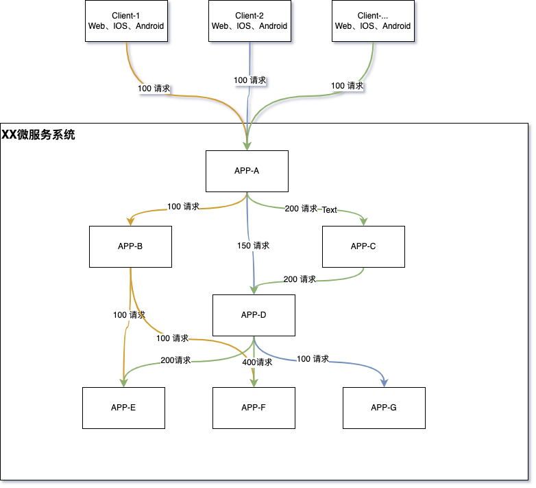
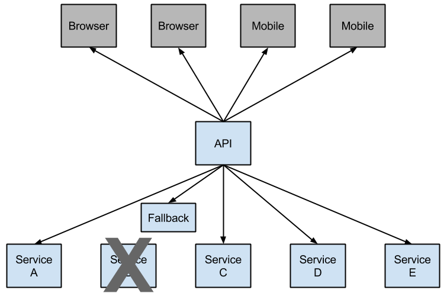
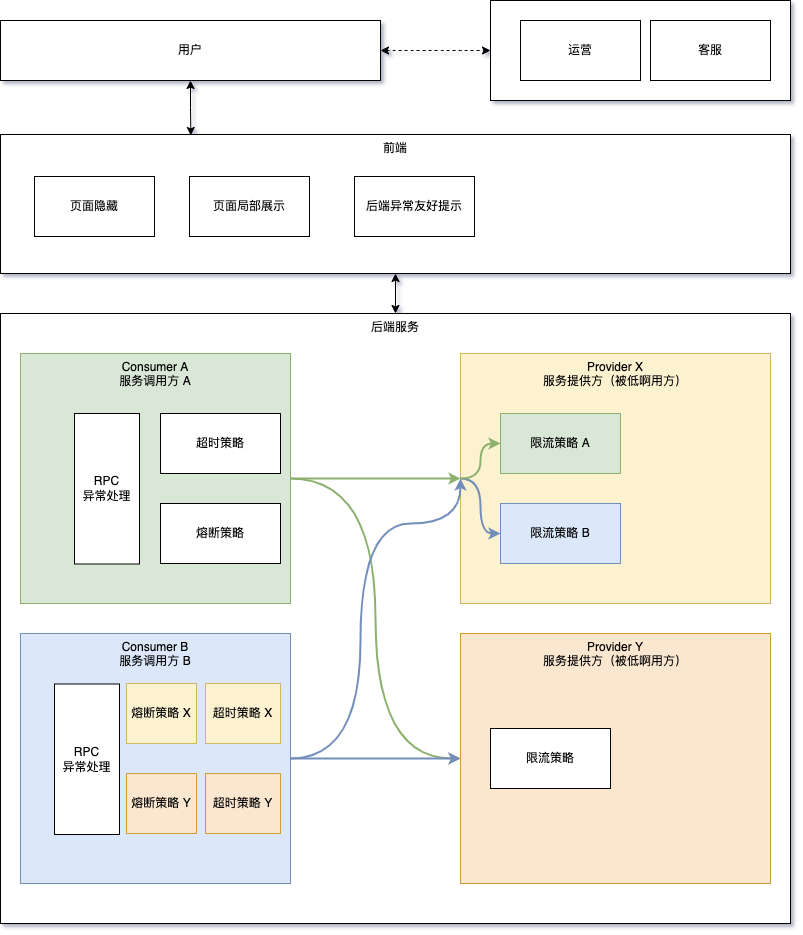

- 服务熔断
  collapsed:: true
	- 解决的问题
		- 解决微服务架构下，系统间调用链路的雪崩，避免造成整个微服务体系崩溃。类似电路过载的保险丝。
		- 技术、架构类问题的解决方案，多数研发和运维参与。
		- 从局部出发，各自解决问题，被动防御。
	- 造成链路调用雪崩的原因
	  collapsed:: true
		- 调用链的某一环节，例如APP-D出现性能瓶颈，导致依赖该环节的前置业务系统长时间无法获得获得响应，无法释放资源，随着请求数量不断增加，占用的资源会越来越多，最终导致整个微服务系统崩溃。
		- 
		-
	- 现有的实现方案
	  collapsed:: true
		- SpringCloud 框架，通过 Hystrix 实现。Hystrix 会监控对微服务的调用情况，当针对某一微服务的调用失败次数达到阈值时（例如 5 秒内 20 次失败），就会启动熔断保护。
			- 
		- Istio envy 熔断
			- ((626d4866-06d3-4145-92c3-536ac71e5cdc))
	- 其他设计考量
		- 如何判被调用的某个微服务是不稳定的？
		- 在某个微服务稳定后，如何退出熔断保护？
- 服务超时
  collapsed:: true
	- 解决的问题
		- 在请求使用某一资源时，请求方有对从发出请求到获得资源的时间长短，有**容忍度的区间上限**。不避免在一件事情上过渡消耗资源，及时止损。
	- 分类
		- 建立连接超时
		- 写入、读取数据超时
	- 举例描述
		- 不超时通俗举例：望夫崖，一等等千千万万载，风雨中，边化作石块。
		- 超时举例：假如非要给这份爱情加上一个期限的话，我希望是一万年。只是超时时间比较长😅
- 服务限流
  collapsed:: true
	- 解决的问题
		- 抽象描述
			- 某个或某类资源**有限**且往往在使用这些资源时是**独占**的，在短时间内出现大量申请（**高并发**）使用资源的请求，会因无法及时分配和回收资源，导致业务阻塞，并进一步加剧使用资源请求的频次和数量，最终导致系统崩溃。
		- 场景
			- 合理，重要的资源申请被淹没。  --急救，重症无法及时获得医疗资源。
			- 频繁处理同一个申请的，浪费资源。 --如果餐厅取号不用手机号，无良食客可以取 n 个2 人桌，3 人桌，5 人桌。
			- 浪费资源申请者的资源。 --排队抢购，排了半天，轮到我买的时候，告诉我，早就卖完了。
	- 现有的实现方案
		- 算法
			- 计数器（ ((626df4fc-daa6-4abb-b950-0c5c5c5d4399)) ）
			- [[滑动时间窗口]]
			- [[令牌桶]]
			- [[漏桶算法]]
- 服务降级
	- 解决的问题
		- 在服务器等硬件资源有限的情况下，或者整个微服务体系能承载的业务量有限的情况下，将某些承载边缘业务的系统资源的部分或者全部，调度给承载核心业务的系统来使用，牺牲边缘业务业务的用户体验，来保障核心业务的可用性。
		- 业务抉择以及技术、架构类解决方案，需要协调运营，客服等一起参与。
		- 从全局视角，统筹解决问题，主动选择。
- 关系与区别
	- 服务降级是业务和技术共同指定的的策略，这个策略的实施依赖于熔断、超时、限流等技术手段实现的业务链路保护机制。
	- 超时是针对发起调用方（Consumer）自身的业务和系统规划指定的对某一微服务的最大容忍度，超时策略由发起调用方制定。不同的调用方，可以针对同一个被调用方设置不同的超时策略。
	- 熔断是发起调用方（Consumer）是在不信任被调用方的稳定性，当被调用方服务不稳定时，避免给被调方雪上加霜，给被调用方恢复的机会。熔断策略由发起调用方制定。不同的调用方，可以针对同一个被调用方设置不同的熔断策略。
	- 限流是服务提供方（即被调用方，Provider），基于自身业务系统的特性，能对外提供的稳定或最大能力。限流策略由服务提供方制定。服务提供方针对不同的调用方，可以设置统一的或者差异化的限流策略。
	- 
	-
- 参考
	- https://zhuanlan.zhihu.com/p/341939685
	-