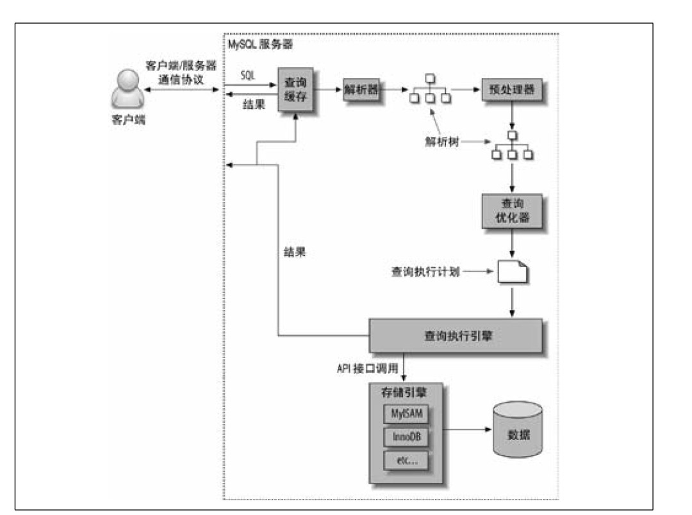
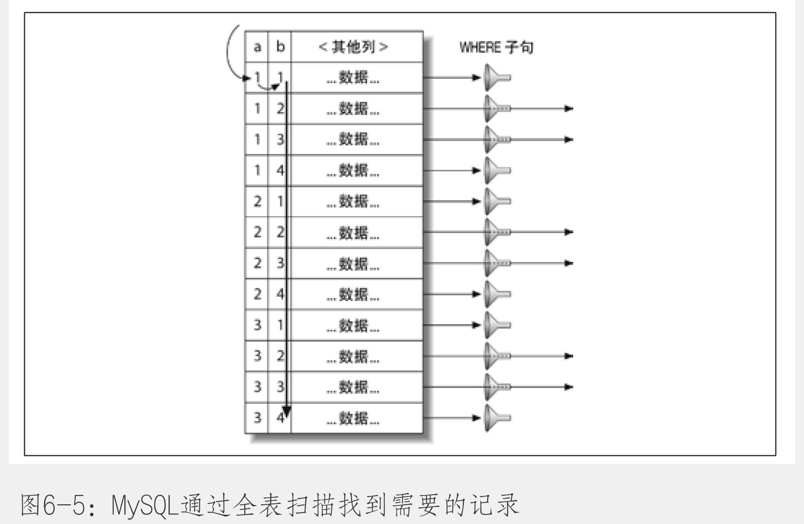
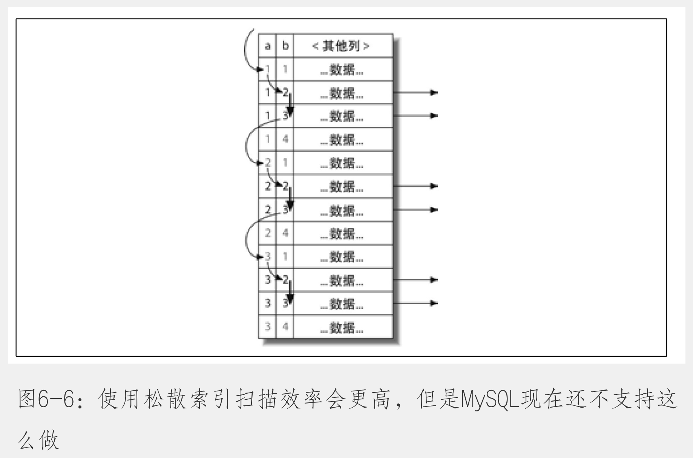

- 为什么查询速度会慢
	- 重复的任务
	- 在网络，CPU计算，生成统计信息和执行计划。锁等待等操作上消耗时间，特别是像底层存储引擎检索数据的调用操作。
- 慢查询基础：优化数据访问
	- 对于低效的查询，我们发现通过下面两个步骤来分析总是很有效：
		- 确认程序是否在检索大量超过需要的数据。
		- 确认MySQL服务器层是否在分析大量超过需要的数据。
	- 是否想数据库请求了不需要的数据
		- 查询不需要的记录
		- 多表关联时返回全部列
		- 总是取出全部列
		- 重复查询相同的数据
	- MySQL是否在扫描额外的记录
		- 响应时间
			- 服务时间
			- 排队时间
		- 扫描的行数
		- 返回的行数
		- 扫描的行数和访问类型
			- 一般MySQL能够使用如下三种方式应用WHERE条件，从好到坏依次为：
				- 在索引中使用where条件来过滤不匹配的记录。这是在存储引擎层完成的。
				- 使用索引覆盖扫描（在Extra列中出现了Using index）来返回记录，直接从索引中过滤不需要的记录并返回命中的结果。这是在MySQL服务器层完成的，但无需再回表查询记录。
				- 从数据表中返回数据，然后过滤不满足条件的记录（在Extra列中出现Using Where）。这在MySQL服务器层完成，MySQL需要先从数据表读取记录，然后过滤。
		- 如果发现查询需要扫描大量的数据但只返回少数的行，那么通常可以尝试下面的技巧去优化：
			- 使用索引覆盖扫描，把所有需要用到的列都放到索引中，这样存储引擎无需回表获取对应行就可以返回结果。
			- 改变库表结构。
			- 重写这个复杂的查询，让MySQL优化器能够以更优的方式执行找个查询。
- 重构查询的方式
	- 一个复杂查询还是多个简单查询
		- 以前总认为网络通信、查询解析优和优化是一件代价很高的事情，对MySQL来说，这是个错误的认识。
	- 切分查询
		- 将一次删除大量数据改为多次删除少量数据。较少锁的占用，避免占用整个事务日志、避免耗尽系统资源，避免阻塞很多小但是很重要的查询。
	- 分解关联查询
		- 优势：
			- 让缓存的效率更高
			- 将查询分解后，执行单个查询可以减少锁的竞争
			- 在应用层做关联，可以容易对数据库进行拆分，更容易做到高性能和扩展
			- 查询本身效率也可能会有提升
			- 可以减少冗余记录的查询
			- 更进一步，这样做相当于在应用中实现了哈希关联，而不是使用MySQL的嵌套循环关联
- 查询执行的基础
	- MySQL查询执行路径
	  collapsed:: true
		- 
	- MySQL客户端/服务器通信协议
		- MySQL客户端和服务器之间的通信协议是“半双工”的，这意味着，在任何一个时刻，要么由服务器向客户端发送数据，要么由客户端向服务器发送数据。
		- 服务端会将所有查询到的数据推送给客户端后，方能释放本次查询的资源。客户端会缓存服务端推送的数据。
	- 查询状态
		- ```shell
		  ## 一个线程，任何时刻都有一个状态，改状态表示MySQL当前正在做什么。
		  show full processlist;
		  ```
		- Sleep
			- 线程正在等待客户端发送新的请求
		- Query
			- 线程正在执行插叙或者正在将结果发送给客户端
		- Locked
			- 在MySQL服务器层，该线程正在等待表锁。在存储引擎级别实现的锁，例如InnoDB的行锁，并不会体现在线程状态中。
		- Analyzing and statistics
			- 线程正在手机存储引擎的统计信息，并生成查询的执行计划。
		- Copying to tmp table [on disk]
			- 线程正在执行查询，并且将其结果集都复制到一个临时表中，这种状态一般要么在做GROPU BY操作，要么是文件排序操作，或者是UNION操作。如果这个状态后面还有个[on disk]标记，那么表示MySQL正在将一个内存临时表放到磁盘上。
		- Sorting result
			- 线程正在对结果集进行排序
		- Sending data
			- 线程可能在多个状态之间传送数据，或者在生成结果集，或者在向客户端返回数据。
	- 查询缓存
		- 在解析一个查询语句之前，如果查询缓存是打开的，那么MySQL会优先检查这个查询是否命中查询缓存中的数据。这个检查是通过一个对大小写敏感的哈希查找实现的。如果检查用户权限通过，MySQL会跳过其他阶段，直接从缓存中拿结果，并返回给客户端。这种情况下，查询不会被解析，不用生成执行计划，不会被执行。
	- 查询优化处理
		- 语法解析器和预处理
		- 查询优化器
		  collapsed:: true
			- MySQL使用基于成本的优化
			- ```shell
			  ## 产看成本
			  select sql_no_cache count(*) from film_actor;
			  show status like 'Last_query_cost';
			  
			  ## 实际执行结果
			  mysql> select sql_no_cache count(*) from film_actor;
			  +----------+
			  | count(*) |
			  +----------+
			  |     5462 |
			  +----------+
			  1 row in set, 1 warning (0.00 sec)
			  
			  mysql> show status like 'Last_query_cost';
			  +-----------------+-------------+
			  | Variable_name   | Value       |
			  +-----------------+-------------+
			  | Last_query_cost | 1103.399000 |
			  +-----------------+-------------+
			  1 row in set (0.00 sec)
			  
			  ## 其中的Value是指，MySQL优化器认为大概需要1103个数据页的随机查找，才能完成上面的查询。
			  ```
			- 优化器在评估成本的时候，并不考虑任何层面的缓存，它假设读取任何数据都需要一次磁盘I/O。
		- 导致MySQL优化器选择错误的执行计划的原因：
		  collapsed:: true
			- 统计信息不准确
				- MySQL依赖存储引擎提供统计信息
			- 执行计划中的成本估算不等同于实际执行的成本
				- 如果页面都是顺序读取或者已经在缓存中，实际执行成本低于估算成本
			- MySQL的最优可能和你想的不一样
			- MySQL不考虑其他并发执行的查询
			- MySQL也并不是任何时候都是基于成本的优化
			- MySQL不会考虑不受其控制的操作成本，例如执行存储过程或者用户自定义函数的成本
			- 优化器有时候无法估算所有可能的执行计划，可能错过实际上最优的执行计划
		- MySQL能处理的优化类型：
		  collapsed:: true
			- 重新定义关联表的顺序
			- 将外连接转化成内连接
			- 使用等价变换规则
			- 优化COUNT()、MIN()和MA()
				- 向min，max可以通过读取B-Tree的第一行或者最后一行来获取，如果MySQL使用了这类优化，explain中可以看到“Select tables optimized away”
				- ```shell
				  mysql> explain select max(film_id) from film_actor\G
				  *************************** 1. row ***************************
				             id: 1
				    select_type: SIMPLE
				          table: NULL
				     partitions: NULL
				           type: NULL
				  possible_keys: NULL
				            key: NULL
				        key_len: NULL
				            ref: NULL
				           rows: NULL
				       filtered: NULL
				          Extra: Select tables optimized away
				  1 row in set, 1 warning (0.00 sec)
				  ```
			- 预估并转化为常数表达式
			- 覆盖索引扫描
			- 子查询优化
			- 提前终止查询
			- 等值传播
			- 列表in（）的比较
		- 数据和索引的统计信息
		  collapsed:: true
			- 存储引擎提供
		- MySQL如何执行关联查询
		  collapsed:: true
			- 通过嵌套循环来实现
		- 执行计划
		  collapsed:: true
			- MySQL会生成一颗指令树，然后通过存储引擎执行完这棵指令树来获取结果。
			- 执行令树是一棵平衡树
		- 关联查询优化器
		  collapsed:: true
			- 目地是为了更少的嵌套循环和回溯操作
			- 当有n个表关联时，需要检查n的阶乘种关联顺序，我们称之为执行计划的“搜索空间”，如果n是10，就有3628800种不同的关联顺序，优化器不可能在一个很大的“搜索空间”中逐一地做成本评估。此时，优化器会以贪婪的方式寻找一个满足优化搜索深度的足够优秀的方案。
		- 排序优化
		  collapsed:: true
			- 两次传输排序（旧版本使用）
				- 读取行指针和需要排序的字段，对其进行排序，然后在根据排序结果读取所需要的数据行。
			- 单次传输排序（新版本使用）
				- 先读取查询所需要的所有列，然后根据给定的列进行排序，最后直接返回结果。
			- 排序是，分配的空间要足够容纳待排序的字段，可能排序使用到的临时空间比表在磁盘上的实际占用空间大很多倍。
			- 在做关联查询时如果需要排序，MySQL会分两种情况处理这样的文件排序
				- 先对第一个关联表做文件排序，然后再关联
					- explain中可以看到Extra字段会有：“Using filesort”
				- 先关联出所有的列，然后在完整结果集上做排序
					- explian中可以看到Extra字段会有：“Using temporary；Using filesort”
		- 查询执行引擎
		  collapsed:: true
			- 执行是通过调用底层的存储引擎来实现。有大量的操作需要通过调用存储引擎实现的接口来完成，这些接口我们称为“handler API”的接口。每个表由一个handler的实例表示。
		- 返回结果给客户端
		  collapsed:: true
			- 一旦服务器端开始生成第一条结果时，就可以开始想客户端逐步返回结果集。
			- 两个好处：
				- 服务器端无需存储太多的结果
				- 让客户端第一时间获得返回的结果
- MySQL查询优化器的局限性
	- 关联子查询
	  collapsed:: true
		- ```shell
		  mysql> explain select * from film where film_id in (select film_id from film_actor where actor_id = 1)\G
		  *************************** 1. row ***************************
		             id: 1
		    select_type: SIMPLE
		          table: film_actor
		     partitions: NULL
		           type: ref
		  possible_keys: PRIMARY,idx_fk_film_id
		            key: PRIMARY
		        key_len: 2
		            ref: const
		           rows: 19
		       filtered: 100.00
		          Extra: Using index
		  *************************** 2. row ***************************
		             id: 1
		    select_type: SIMPLE
		          table: film
		     partitions: NULL
		           type: eq_ref
		  possible_keys: PRIMARY
		            key: PRIMARY
		        key_len: 2
		            ref: sakila.film_actor.film_id
		           rows: 1
		       filtered: 100.00
		          Extra: NULL
		  2 rows in set, 1 warning (0.00 sec)
		  
		  ## mysql 会将上述语句改写为以下语句
		  
		  mysql> explain select * from film where exists ( select * from film_actor where actor_id = 1 and film_actor.f
		  ilm_id = film.film_id)\G
		  *************************** 1. row ***************************
		             id: 1
		    select_type: PRIMARY
		          table: film
		     partitions: NULL
		           type: ALL
		  possible_keys: NULL
		            key: NULL
		        key_len: NULL
		            ref: NULL
		           rows: 1000
		       filtered: 100.00
		          Extra: Using where
		  *************************** 2. row ***************************
		             id: 2
		    select_type: DEPENDENT SUBQUERY
		          table: film_actor
		     partitions: NULL
		           type: eq_ref
		  possible_keys: PRIMARY,idx_fk_film_id
		            key: PRIMARY
		        key_len: 4
		            ref: const,sakila.film.film_id
		           rows: 1
		       filtered: 100.00
		          Extra: Using index
		  2 rows in set, 2 warnings (0.00 sec)
		  ```
	- 如何用好关联子查询
		- 看执行计划，并做QPS验证
	- UNION的限制
		- 每个子查询做条数限制，union后，再整体做条数限制。
	- 索引合并并优化
		- 例如使用了or的查询
	- 等值传递
	- 并行执行
	- 哈希关联
	- 松散索引扫描
	  collapsed:: true
		- 
		- 
		- ```shell
		  mysql> explain select actor_id,max(film_id) from film_actor group by actor_id\G
		  *************************** 1. row ***************************
		             id: 1
		    select_type: SIMPLE
		          table: film_actor
		     partitions: NULL
		           type: range
		  possible_keys: PRIMARY,idx_fk_film_id
		            key: PRIMARY
		        key_len: 2
		            ref: NULL
		           rows: 201
		       filtered: 100.00
		          Extra: Using index for group-by
		  1 row in set, 1 warning (0.00 sec)
		  ```
	- 最大值和最小值优化
		- 可以通过增加LIMIT 1来优化
	- 在同一表上查询和更新
- 查询优化器的提示（hint）
	- HIGH_PRIORITY和LOW_PRIORITY
		- 更改sql的执行优先级
		- **这两个提示只对使用表锁的存储引擎有效，千万不要在InnoDB或者其他有细粒度锁机制和并发控制的引擎中使用**
	- DELAYED
	- STRAIGHT_JOIN
		- 可以放在select之后，也可以放在任何两个关联表的名字之间。
			- 第一个用法是让查询中所有的表按照在语句中出现的顺序进行关联。
			- 第二个用法则是固定其前后两个表的关联顺序。
	- SQL_SMALL_RESULT 和 SQL_BIG_RESULT
		- 结果集很小，可以放在内存中排序；
		- 结果集很大，建议使用磁盘临时表做排序；
	- SQL_BUFFER_RESULT
		- 告诉优化器将查询结果放到一个临时表，然后尽可能块地释放表锁。
	- SQL_CACHE  和 SQL_NO_CACHE
		- 告诉MySQL这个结果集是否应该缓存在查询缓存中。
	- SQL_CALC_FOUND_ROWS
		- 统计行数
	- FOR UPDATE 和 LOCK IN SHARE MODE
	- USE INDEX、IGNORE INDEX 和 FORCE INDEX
- 优化特定类型的查询
	- 优化count()查询
		- count可以统计行数，也可以统计列值的数量
		- 使用近似值
	- 优化关联查询
		- 确保ON或者USING字句中的列上有索引。
		- 确保任何的GROUP BY和ORDER_BY中的表达式只涉及到一个表中的列，这样MySQL才有可能使用索引来优化这个过程
	- 优化子查询
	- 优化GROUP BY和DISTINCT
	- 优化LIMIT分页
		- 本质上，是让MySQL扫描尽可能少的Page
	- 避免重复查询刚刚更新的数据
- 案例学习
	- 基础原则：
		- 尽量少做事，可以的话，不要做任何事情。
		- 尽可能快的完成需要做的事情。
		- 有些查询是无法优化的，考虑使用不同的查询或者不同的策略去实现相同的目的。
- 总结