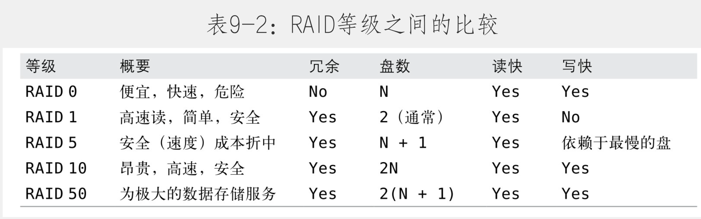
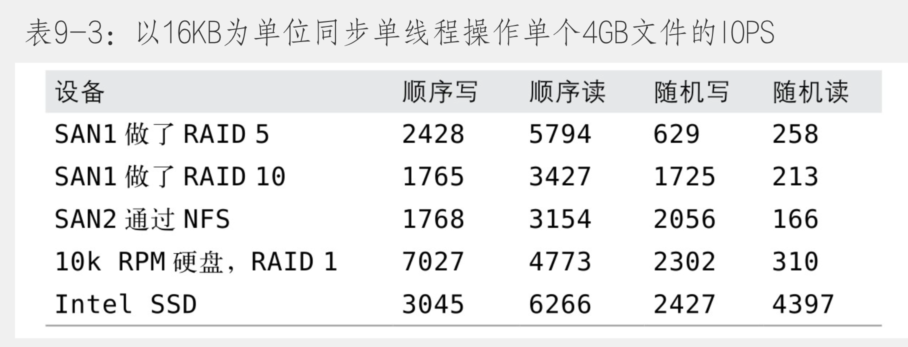

- 什么限制了MySQL的性能
- 如何为MySQL选择CPU
	- 哪个更好：更快的CPU还是更多的CPU
		- 操作系统需要感知超线程
		- 这里说的CPU数量，指的是操作系统上看到的数量
	- 低延时
		- 需要高速CPU
	- 高吞吐
		- 多路CPU
		- 多CPU对MySQL的复制帮助不大
		- 备库的瓶颈是I/O子系统，而不是CPU
		- 多CPU仅对多线程的队列等待有帮助，对锁等待，I/O等待没什么帮助
	- CPU架构
		- 99%以上的MySQL实例都运行在Intel或者AMD芯片的x86架构下。
	- 扩展到多少个CPU核心
		- 逻辑并发问题
		- 内部并发问题
			- 比如信号量、访问InnoDB缓冲池页面的资源争用，等等。可以尝试通过改变服务器的设置、改变操作系统，或使用不同的硬件解决这些问题，但通常只能缓解而无法彻底消灭
- 平衡内存和磁盘资源
	- 空间和时间的局部性原理
	- 从程序员的视角来看，CPU寄存器和告诉缓存都是透明的，并且与硬件架构相关。
	- 设计良好的数据库缓存（例如InnoDB缓冲池），其效率通常超过操作系统的缓存，因为操作体统缓存是为通用任务设计的。
	- 随机I/O和顺序I/O
	  collapsed:: true
		- 顺序I/O 比随机I/O 快
			- 假设磁盘每秒可以做100个随机I/O操作，并且可以完成每秒50M的顺序读，如果每行100字节，随机读可以每秒读取100行，书序读可读取50W行，是随机读的5K倍。
			- 请注意，内存随机访问速度比磁盘随机访问快了2 500倍，而内存中顺序访问只有磁盘10倍的速度。
		- 存储引擎执行顺序读比随机读快
			- 一个随机读一般意味着存储引擎必须执行索引操作。
			- 通过缓存顺序读取可以节省一些工作，但缓存随机读取可以节省更多的工作。换句话说，如果能负担得起，增加内存是解决随机I/O读取问题最好的办法。
	- 缓存，读和写
	  collapsed:: true
		- 缓存是可以被写入的，但是写入迟早要被持久化到磁盘。
		- 多次写入，一次刷新
		- I/O合并
	- 工作集是什么
		- 工作级即应用使用到的数据集，缓存最小单位也是InnoDB中精心挑选聚簇索引非常重要的一个原因。
	- 找到有效的内存/磁盘比例
		- 如果可以把所有的东西放入内存，你就大功告成了，没有必要考虑磁盘和内存的比例。
		- 缓存命中率实际上也会决定使用了多少CPU，所以评估缓存命中率的最好方法是查看CPU使用率。
		- 例如，有10GB的内存，并且缓存未命中率为10%，你可能认为只要增加11%以上的内存，就可以降低缓存的未命中率到0。但实际上，可能要50G内存，才能把未命中率降低到1%。
	- 选择硬盘
		- 内存可以有效平衡磁盘的读取，却无法避免磁盘的写入，例如快速写日志，就不能通过增加大量有效内存来避免磁盘写入。
		- 存储容量
			- 单个磁盘容量不够大，用RAID把小磁盘组合起来是标准做法。
		- 传输速度
		- 访问时间
		- 主轴转速
			- 7200转，1W转，以及1.5W转
		- 物理尺寸
- 固态存储
	- 闪存性能的快速小结：
		- 相比硬盘有更高的随机读写性能。闪存设备通常读明显要比写快。
		- 相比硬盘，有更好的顺序读写西恩呢个。入门级的固态硬盘的顺序读取实际上可能要比传统硬盘慢。
		- 相比传统硬盘更好的支持并发。
	- 闪存概述
		- 存在[[写放大]]问题
		- 闪存技术
			- 单层单元（SLC）
			- 多层单元（MLC）
		- 闪存的基准测试
		- 用SSD做RAID
		- PCIe存储设备
		- 其他类型的固态存储
		- 什么时候改使用闪存
			- 大量随机I/O的业务场景
			- 写入比较多的场景，缓存无法解决频繁的写入。但是像InnoDB日志文件的顺序写，闪存不是一个很好的解决方案。
		- 使用[[Flashcache]]
		- 优化固态存储上的MySQL
			- 增加InnoDB的I/O容量
				- 增加读写线程数到10到15
				- 可在2000到20000的范围内调整innodb_io_capacity
			- 让InnoDB日志文件更大
			- 把一些文件从闪存转移到RAID
				- 闪存写日志文件不见得比RAID组上快
				- 把binLog文件转移到RAID组上也有好处
			- 禁用预读
			- 配置InnoDB刷新算法
			- 禁用双写缓冲的可能
			- 限制插入缓冲大小
				- 在新版本的InnoDB中被称为Change Buffer
- 为备库选择硬件
- RAID性能优化
	- RAID0
		- 成本最低，性能最高
	- RAID1
		- RAID 1在很多情况下提供很好的读性能，并且在不同的磁盘间冗余数据，所以有很好的冗余性。
	- RAID5
		- 奇偶校验代替数据备份，校验数据分布在不同的磁盘上
		- 随机写是昂贵的，因为每次写需要在底层磁盘发生两次读和两次写
	- RAID10
	- 
	- RAID的故障转移、恢复和镜像
	- 平衡硬件RAID和软件RAID
	- RAID配置缓存
		- RAID条带块大小
		- RAID缓存
			- 缓存读取，没啥用，且命中率微乎及微，操作系统和数据库服务器有自己更大的缓存。
			- 缓存预读数据，如果数据库服务器做了自己的智能预读（例如InnoDB的预读），RAID控制器的预读就没什么帮助了。
			- 缓冲写入
				- 可以快得多的返回给主机系统“成功”信号
				- 可以通过累积写操作从而更有效的批量操作
			- 内部操作
				- RAID5的校验
				- 缓存读通常是浪费，缓存写是加速I/O性能的一个重要途径
				- 对于RAID0、RAID1、RAID10应该把控制器缓存100%分配给写入用
				- 除非控制器有电池备份单元（BBU）或者其他非易失性存储，否则不应该启用RAID缓存
- SAN和NAS
	- SAN （Storage Area Network）
		- 像访问硬盘一样访问，通过块接口
	- NAS （Network-Attached Storage）
		- 基于文件协议来访问
	- SAN基准测试
		- 
		- SAN顺序吸入比随机写入性能好
		- SAN读取有传输延时
		- 使用基于NFS或SMB的SAN
	- MySQL在SAN上的性能
		- 哪些工作放在SAN上不合适：
			- 执行大量的随机I/O的单线程任务
			- 备库的存储在SAN上，可能更容易落后于主库
	- 应该用SAN吗
		- 易于备份
		- 简化容量管理
		- 存储整合还是服务器整合
		- 高可用
			- SAN是一个复杂的、神秘的黑盒子，当出问题的时候没人知道该怎样解决
		- 服务器之间的交互
		- 成本
			- SAN不是最佳选择
- 使用多磁盘卷
	- MySQL创建的多种文件类型：
		- 数据和索引文件
		- 事务日志文件
		- 二进制日志文件
		- 常规日志（例如，错误日志、查询日志和慢查询日志）
		- 临时文件和临时表
	- 把事务日志和数据文件放在不同的卷上，这样日志的顺序I/O和数据的随机I/O不会互相影响，前提是考虑好硬件成本。
	- binLog和数据文件分离的真正优势，是减少事故中同时丢失数据和日志文件的可能性。
- 网络配置
	- 延迟和带宽是网络连接的限制因素
	- 对大多数应用程序来说，最大的问题是延时
	- 丢包是一个普遍存在的问题，即使1%的丢包率也足以造成显著的性能下降
	- 损坏或缓慢的DNS解析对许多应用程序都是个问题，对MySQL尤为严重
- 选择操作系统
	- GNU/Linux
- 选择文件系统
	- 首先依赖于操作系统
	- ext3、ext4、XFS、ZFS
	- ext3：
		- data=writeback
			- 这个选项意味着只有元数据写入日志。元数据写入和数据写入并不同步。这是最快的配置，对InnoDB来说通常是安全的，因为InnoDB有自己的事务日志。唯一的例外是，崩溃时恰好导致.frm文件损坏了
		- data=ordered
			- 这个选项也只会记录元数据，但提供了一些一致性保证，在写元数据之前会先写数据，使它们保持一致。这个选项只是略微比writeback选项慢，但是崩溃时更安全。
		- data=journal
			- 此选项提供了原子日志的行为，在数据写入到最终位置之前将记录到日志中。这个选项通常是不必要的，它的开销远远高于其他两个选项。然而，在某些情况下反而可以提高性能，因为日志可以让文件系统延迟把数据写入最终位置的操作。
		- 禁用记录访问时间的选项u
		- 禁用文件的预读行为，因为InnoDB有自己的预读策略，所以文件系统的预读是多余的。
		- 让InnoDB使用O_DIRECT刷新方式
		-
- 选择磁盘队列调度策略
	- Linux默认是完全公平队列（CFQ Completely Fair Queueing）
- 线程
	- 内存交换堆MySQL性能影响是很糟糕的。
- 内存交换分区
	- 禁用交换分区
- 操作系统状态
	- vmstat
	- iostat
- 总结
-