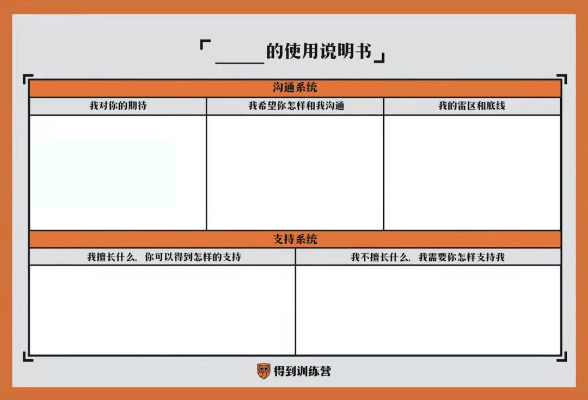

- # 面试候选人注意事项
  
  工作10年,被形形色色的面试官面试过,也面试了形形色色的候选人,总结以下几点
	- ## 问题要有区分度
		- 问题涉及的知识孤立,候选人要么知道,要么不知道,无法就当前问题继续深入的,不是好问题
		- 一个好问题,可以有深度,可以连续问候选人几个为什么? 甄别出"PPT架构师",甄别出是否拿别人的成果.
	- ## 问题是为了甄别出候选人理解和分析问题的能力
		- 一个好的问题,要么考验候选人的智商,要么考验候选人的经验,要么考验候选人的分析问题的思路
		- 一个糟糕的问题,是操作类的问题,人比如:如何实现一个自定义的spring boot starter,这属于操作类的,这类问题纯属考验候选人百度的能力.
	- ## 问题是为了甄别出候选人的智商
		- 考察算法
		- 考察逆向思维能力
		- 考察举一反三，触类旁通，知识迁移的能力
	- ## 问题是为了甄别候选人的主观能动性(自驱力)
		- 多长时间读一本书
		- 一般都在哪些平台学习
		- 最近学到了一个什么知识,能否讲清楚
	- ## 问题为了甄别候选人的担当(主人翁精神)
		- 假定一个场景,例如,线上出问题了,自己不是这个领域的负责人,要怎么来处理这件事,处理这件事会遇到什么困难.
	- ## 问题为了甄别候选人的性格(九型人格之类)
		-
	- ## 问题是为了给候选人传递企业用人的原则(企业文化,使命愿景)
		-
	- ## 要明确公司目前的处境
		- 如果是大公司,不缺人,大可以让候选人自己发挥,问些开放的问题,让候选自己展现实力.
		- 如果是小公司,缺人,没有大公司的薪资和福利的竞争力,就的学会沙里淘金,要引导候选人展开自己,特别是要讲清楚问题的业务场景以及约束,方便候选人收缩问题的范围.
		- 举例:
			- 问: 我们是一家短息服务提供上,如何保证用户能够在5分钟内发送完成500万条短息?
			  这是一个很开放的问题,如果是有行业经验的,会给出一整套解决方案,否则,需要给出提示,比如,从业务模式,客户的服务登记,是否需要实时响应等等...
			- 问: Java Arrays.sort() 用了那两种排序算法?
			  这也是一个尴尬的问题,如果候选人答对了,作为面试官,你如何在深入下去?  还是说,换个问法
			  问: Java Arrays.sort() 用了哪两种排序算法? 如果让你自己来设计,你会选哪些排序算法? 可以从性能,稳定性,业务场景等角度谈谈你选择的理由...
	- ## 问题是为了让候选人讲清楚自己
		- 可以参考一下xx的使用说明书：
		  
- # 候选人如何甄别公司
	- ## 明确各职级的责权利
		- 业务线的后端技术负责人有哪些职责和权利？
		- 后端业务线的负责人如何来保障代码和产品的质量？
		- 后端负责人能否自行选择用单元测试的方式或者代码review的方式来解决代码质量的问题？
		- ...
		- 我遇到过一个技术负责人，要求后所有同学都要写单元测试，在团队规模较小(20人左右)，且团队成员的技术能力参差不齐时，要求业务线的后端负责人达到单元测试代码覆盖率70%是值得商榷的。
			- 1.业务线的后端负责人最清楚团队成员的情况，自然更具针对性的解决方案。
			- 2.技术负责人只需要跟业务线的后端负责人拿结果即可，不应过多干预，
	- ## 有针对性的准备几个场景来了解负责人是否有以下问题
		- 1.事事过问，事事都管
			- 举一些自己在工作中，不希望主管干预，希望自己有发挥空间的事项来跟面试官沟通。
		- 2.工作出错，全怪员工
			- 问下面试官，是否有遇到过线上的事故，如何解决的，如何追责的
		- 3.工作不顺，加大考核
			- 问下面试官，最近遇到的挑战有哪些，特别是管理上的挑战，有没有什么解决方案。
		- 4.只讲个例，不讲比例
		- 5.只会下达，不敢上传
		- 6.有功必抢，有过必推
		- 7.只提要求，不讲责任
		- 8.主管意识，胡说八道
-