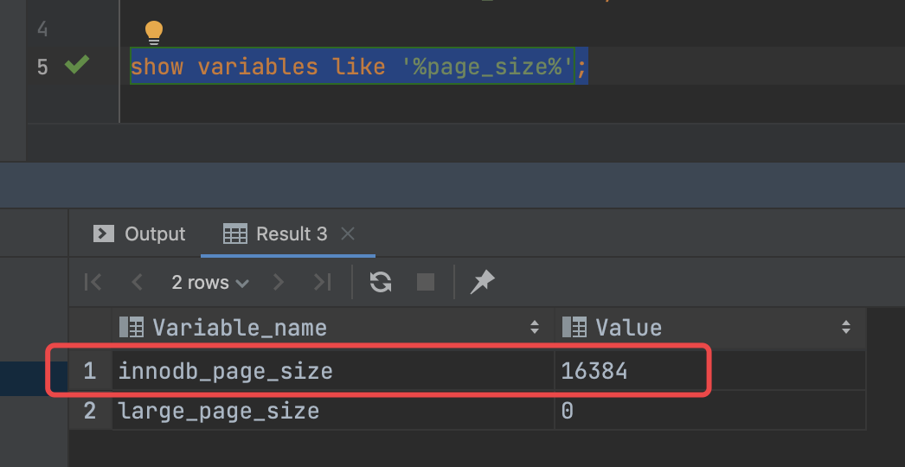

- 影响计算的因子
	- page 的大小
	  collapsed:: true
		- 5.7.37 默认配置为 16KB
		- 
	- page 的空间分布
	- page 的填充因子
	- 存储数据的类型
	  collapsed:: true
		- 存储索引
		- 存储数据行
	- InnoDB Row Format
		- Redundant
			- 定长字段  固定空间，即使存 NULL，也有固定空间消耗
			- 变长字段
		- Compact
		- Dynamic
			- innodb _ large _ prefix 最长前缀
		- Compressed
	- 字符集
	  collapsed:: true
		- utf8 每个字符 3 字节
		- utf8mb4 每个字符 4 字节
	- 固定长度和变长的记录方式
- 问题
	- 为什么要做扩展表？
	- 为什么要用数字主键？