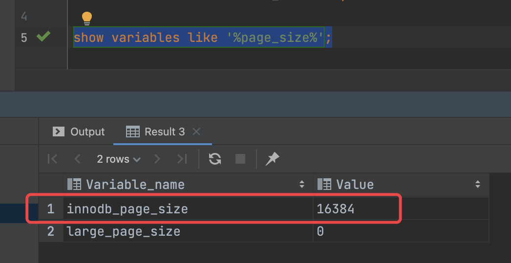

- 影响计算的因子
	- page 的大小
	  collapsed:: true
		- 5.7.37 默认配置为 16KB
		- 
	- page 的空间分布
	- page 的填充因子
	- 存储数据的类型
	  collapsed:: true
		- 存储索引
		- 存储数据行
	- InnoDB Row Format
	  collapsed:: true
		- Redundant
			- 定长字段  固定空间，即使存 NULL，也有固定空间消耗
			- 变长字段
		- Compact
		- Dynamic
			- innodb _ large _ prefix 最长前缀
		- Compressed
	- 字符集
	  collapsed:: true
		- utf8 每个字符 3 字节
		- utf8mb4 每个字符 4 字节
	- 固定长度和变长的记录方式
	- 主键比较耗时
		- 前提：64 位的 CPU 一次可以比较 64 位
		- int 类型，32 位，一次比较
		- bigint 类型，64 位，一次比较
		- 字符比较，utf8，3 byte，一个字符比较一次，理想情况下，长度为 8 个字符的两个字符串比较需要 3 次，如果是 19 个字符的两个字符串，需要比较 3+3+1 =7 次，再假设，平均 3次比较就能出结果
	- CPU，内存，固态硬盘，机械硬盘的读取速度
	  collapsed:: true
		- CPU
			- 时钟周期 0.33 ns  10E-9次方秒
			- 频率 3GHz
		- 内存
			- 内存时钟周期 10ns
			- 频率 100MHz 即0.1GHz
		- 固态硬盘读取速度
			- 一页 4k、8k 需要 50 微秒
		- 机械硬盘读取速度
			- 假设最高 300M/s，粗略估算，读取 16KB 需要  (16kB / (300 * 1024 KB)) * 1秒 = 5.2 E-5 秒 = 0.05 毫秒
			- 最影响机械磁盘读取速度的是磁头的寻道时间，即使性能最好的磁盘，寻道时间大于 1 毫秒
- 问题
	- 为什么要做扩展表？
	- 为什么要用数字主键？
- 估算场景
	- 前提：
		- 索引中，指向下一页的指针占用6 字节（见 mysql 源码），考虑聚集索引
		- 假设每条记录长度为 1KB
		- 不考虑 page 的填充因子
		- 不考page 中的其他空间占用
	- 估算指标：
		- 一层，两层，三层，四层各能管理多少条记录，最大和最小占用的空间，能否完全加载到内存中
	- 场景：
		- 主键是 int 类型，32 位，即 4 字节，最大无符号整数为 4294967296 ，接近 43 亿
			- 索引项总计占用 10 byte，索引页 16K
			- 一层
				- 16 条 占用 16KB
				- 总共占用 16KB 空间
			- 两层
				- 第一层 16 * 1024 byte / 10 byte = 1638 个索引项 占用 16KB
				- 第二层 每页 16KB/1KB=16条记录，总共有 1638 个 page，总计 1638 *16 = 26208 条 ，占用 1638 * 16 KB = 26208 KB 约 25.59MB
				- 总共占用 25.6M 空间，可以将整个聚集索引加载到内存
			- 三层
				- 第一层 16 * 1024 byte / 10 byte = 1638 个索引项，占用 16KB 空间
				- 第二层 每页仍旧是 1638 个索引项，总计 1638 *1638   个索引项 ，占用 16KB * 16384  = 26208KB 约 25.59M
				- 第三层 每页 16KB/1KB=16条记录，总共有  1638 *1638  个 page，总计16 * 1638 * 1638  = 42928704 条，接近 4300 万条，占用 16KB * 1638 * 1638 = 42928704KB 约 40.94GB
				- 总共占用 40.94GB，只能将索引页（第一层，第二层的 page）全部加载到内存，第三层（记录页）部分加载到内存
				- 假设每条记录占用 512 byte
					- 每页有 16 * 1024 byte / 512 byte = 32 条记录，总共有 1638 * 1638 个 page，总计 32 * 1638 * 1638 = 85857408 条记录，约 8500 万条，仍旧是占用 40.94GB
				- 假设只有 2048 万条记录，每条记录 512 byte，根据前面的估算，仍旧是需要三层，因为两层最多存储 16 * 1024 byte / 512 byte * 1638 = 52416条记录，此时可以进考虑第三层的记录页占用的空间大小，20480000 * 512 byte  / 1024 = 10240000 KB 约 9.76GB ，有可能全部加载到内存中
				- 如果每条记录是 512 byte，则三层可管理 8600 万条记录，总共占用 81.9GB
			- 四层
				- 第一层 16 * 1024 byte / 10 byte = 1638 个索引项
				- 第二层 每页仍旧是 1638 个索引项，总计 1638 *1638 = 2683044 个索引项
				- 第三层 每页仍旧是 1638 个索引项，总计  1638 * 1638 *1638 =  4394826072 接近 44 亿 个索引项，此数字大约 32 位无符号整数的最大值，所以，四层时，最多存储 43 亿条记录。此时第三层需要倒推
					- 每个记录页有 16 KB / 1KB = 16条记录，存储 2^32 条记录，总共需要 2^32/16 = 2^28 个记录页
					- 每个记录页都需要一个索引项来指向，所以总共需要 2^28 个索引项
					- 每个索引页能存储 16 * 1024 byte / 10 byte = 1638 个索引项，所以第三层需要 2^28  /  ( 16 * 1024 byte / 10 byte)  = 163840 个索引页，总计  163840 * 16KB = 2621440KB = 2.5GB
					- 2.5GB 可以全部加载到内存中
				- 第四层
					- 可以根据总记录数来推算 2^32 * 1KB = 4096GB = 4TB，只能部分加载到内存中
				- 总共占用，相对记录占用，索引页占用可以忽略，2^32 条记录，每条 1KB，总共占用 4096GB，即 4TB
		- 主键 bigint 类型，64 位，即 8 字节，最大无符号整数为 1.84 E 10 方亿，即 18.4 亿亿
			- 索引项总计占用 byte + 8 byte = 14 byte，索引页 16KB
			- 一层
				- 16条
				- 总共占用 16KB
			- 两层
				- 第一层 16 * 1024 byte / 14 byte = 1170 个索引项
				- 第二层 每页 16KB/1KB = 16条记录，总共 1170 页，总计 16 * 1170  = 18720 条记录，占用 16KB * 1170 = 18720KB 约 18.28M
				- 总共占用 18.28M，可以完全加载到内存中
			- 三层
				- 第一层 16 * 1024 byte / 14 byte = 1170 个索引项
				- 第二层 每页  16 * 1024 byte / 14 byte = 1170  个索引项，总共 1170 个索引页，总计 1170 * 1170  个索引项，1170 个索引占用空间为 16KB * 1170 = 18.28MB，可以完全加载到内存中
				- 第三层 每页 16KB/1KB = 16条记录，总共 1170 * 1170 个记录页，总计 16 * 1170 * 1170 = 21902400 约 2190 万条记录，占用空间 16KB * 1170 * 1170 = 20.88GB，有可能全部加载到内存中，例如 32GB 的物理内存
			- 四层
				- 第一层 16 * 1024 byte / 14 byte = 1170 个索引项
				- 第二层 每页  16 * 1024 byte / 14 byte = 1170  个索引项，总共 1170 个索引页，总计 1170 * 1170  个索引项。
				- 第三层 每页  16 * 1024 byte / 14 byte = 1170  个索引项，总共 1170 个索引页，总计 1170 * 1170 * 1170  个索引项。
				- 第四层  每页 16KB/1KB = 16条记录，总共 1170 * 1170 * 1170 个记录页，总计 1170 * 1170 * 1170 * 16 = 25625808000 约 256 亿条记录
		- 主键类型 varchar(32),采用 utf8（在 mysql 中是 3 byte），实际存储 19 个字符（bigint 的字符串），即 19*3 byte = 57 byte
			- 索引项总计占用 57 byte + 6 byte = 63 byte
			- 一层 16 条
			- 两层
				- 第一层 16 * 1024 byte / 63 byte = 260 个索引项
				- 第二层 每页 16KB / 1KB = 16条记录，有 260 个记录页，总计 16 * 260 = 4160 条记录
			- 三层
				- 第一层 16 * 1024 byte / 63 byte = 260 个索引项
				- 第二层 每页有 16 * 1024 byte / 63 byte = 260 个索引项，有 260 个索引页，总计有 260 * 260 个索引项
				- 第三层 每页有 16KB / 1KB = 16条记录，有 260 * 260 个记录页，总计 16 * 260 * 260 = 1081600 条，约 108 万条
			- 四层
				- 第一层 16 * 1024 byte / 63 byte = 260 个索引项
				- 第二层 每页有 16 * 1024 byte / 63 byte = 260 个索引项，有 260 个索引页，总计有 260 * 260 个索引项
				- 第三层 每页有 16 * 1024 byte / 63 byte = 260 个索引项，有 260  * 260 个索引页，总计有 260 * 260 * 260 个索引项
				- 第四层 每页有 16KB / 1KB = 16条记录，有 260 * 260 * 260个记录页，总计 16 * 260 * 260 * 260 = 281216000 条，约 2.8 亿条记录
			-
	-