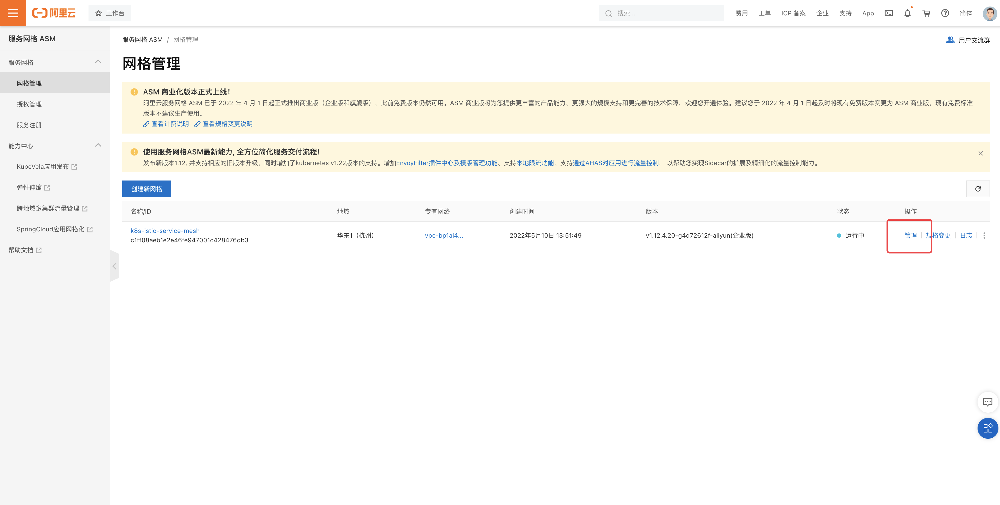
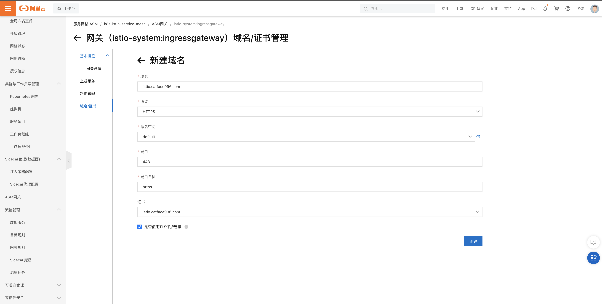

- 目标
	- 使用阿里云 ASM 搭建 Istio 环境
	- 实现 k8s  nginx-ingress和 Istio-ingressgateway 的两种流量策略
		- 
- 创建服务网格
	- 进入网格列表页，点击“创建网格”
	  collapsed:: true
		- 
	- 填写基础信息
	  collapsed:: true
		- 填写网格名称，例如：k8s-istio-service-mesh
		- 选择规格，例如：企业版
		- 选择地域，例如：华东 1（杭州）
		- 选择付费类型，例如：按量付费
		- 截图展示
		  collapsed:: true
			- 
			-
	- 填写 Istio 相关信息
	  collapsed:: true
		- 选择 Istio 版本，例如：v1.12.4
		- 选择专有网络
		- 选择交换机
		- 选择Istio 控制面板访问，例如：简约型
		- 选择ApiServer 访问，例如：简约型
		- 截图展示
		  collapsed:: true
			- 
			-
	- 可观测性配置
	  collapsed:: true
		- 启用链路追踪
		- 开启采集 Prometheus 指标
		- 启用 Kiali
		- 截图展示
		  collapsed:: true
			- 
	- 依赖检查
	  collapsed:: true
		- 如果未开通ASM，需要开通
		  collapsed:: true
			- 
		- 检查通过
		  collapsed:: true
			- {:height 353, :width 685}
	- 服务协议
	  collapsed:: true
		- 勾选服务协议
	- 点击“创建服务网格”
	  collapsed:: true
		- 提示需要开启链路追踪
		  collapsed:: true
			- 
	- 等待创建完成
	  collapsed:: true
		- 
		- 
		-
- 管理服务网格
	- 添加 Kubernetes 集群
		- 在网格列表，点击相应网格实例的“管理”连接，进入网格管理页面
		  collapsed:: true
			- 
			- 
		- 点击左侧菜单栏中的“集群与工作负载管理->Kubernetes集群”，进入Kubernetes 集群列表页
		  collapsed:: true
			- 
		- 添加 Kubernetes 集群，勾选要添加的集群，点击“确定”
		  collapsed:: true
			- 
			-
			- 
			- 等待集群被加入到网格
			- 
		- 启用对 default 命名空间的 istio注入
		  collapsed:: true
			- 
			- 
			-
	- 创建 ASM 网关
		- 填写网关名称，例如：ingressgateway
		- 选择部署的集群，例如：刚加入到网格中的集群
		- 选择网关类型，例如：南北向-入口
		- 选择负载均衡类型，例如：公网访问
		- 新建负载均衡，例如：简约型
		- 端口映射配置，例如：80 和 443
		- 选择资源规格，例如：2核4G
		- 填写网关副本数，例如：2
		- 选择自动创建网关规则，例如：是
		- 高级选项，暂时可以保持默认
		- 截图展示
		  collapsed:: true
			- 
			- 
		- 点击“创建”
	- 配置网关的证书和域名  可后续配置
		- 创建证书
		  collapsed:: true
			- 进入网关管理页面，点击“域名/证书”，选择证书，点击“创建”
				- 
				- 
		- 创建域名
		  collapsed:: true
			- 
			-
	- 配置域名解析到istio-ingressgateway 的 slb ，例如：istio.catface996.com -> xxx.xxx.xxx.xx
- 部署 bookinfo
	- 如果之前的 k8s 集权已经部署，需要重启部署一遍 Deployment，Istio 注入才会生效
- 配置流量策略，验证 Istio
	- 配置网关规则 bookinfo-gateway
	  collapsed:: true
		- {:height 369, :width 716}
		- PS：参考 ladder/code/istio/samples/bookinfo/networking/bookinfo-gateway.yaml文件中的内容
		- ```yaml
		  apiVersion: networking.istio.io/v1alpha3
		  kind: Gateway
		  metadata:
		    name: bookinfo-gateway
		  spec:
		    selector:
		      istio: ingressgateway # use istio default controller
		    servers:
		    - port:
		        number: 80
		        name: http
		        protocol: HTTP
		      hosts:
		      - "istio.catface996.com"
		  ```
	- 配置虚拟服务 bookinfo
	  collapsed:: true
		- PS：参考 ladder/code/istio/samples/bookinfo/networking/bookinfo-gateway.yaml文件中的内容
		- ```yaml
		  apiVersion: networking.istio.io/v1alpha3
		  kind: VirtualService
		  metadata:
		    name: bookinfo
		  spec:
		    hosts:
		    - "*"
		    gateways:
		    - bookinfo-gateway
		    http:
		    - match:
		      - uri:
		          exact: /productpage
		      - uri:
		          prefix: /static
		      - uri:
		          exact: /login
		      - uri:
		          exact: /logout
		      - uri:
		          prefix: /api/v1/products
		      route:
		      - destination:
		          host: productpage
		          port:
		            number: 9080
		  ```
	- 验证 productpage http://istio.catface996.com/productpage
	  collapsed:: true
		- v1，v2，v3 版本会轮流出现
	- 配置目标规则
	  collapsed:: true
		- 注意：需要逐个创建，建议使用 yaml 创建
		- 
		- PS：参考 ladder/code/istio/samples/bookinfo/networking/destination-rule-all.yaml文件中的内容
		- ```yaml
		  ## productpage
		  apiVersion: networking.istio.io/v1alpha3
		  kind: DestinationRule
		  metadata:
		    name: productpage
		  spec:
		    host: productpage
		    subsets:
		    - name: v1
		      labels:
		        version: v1
		  ```
		- ```yaml
		  ## reviews
		  apiVersion: networking.istio.io/v1alpha3
		  kind: DestinationRule
		  metadata:
		    name: reviews
		  spec:
		    host: reviews
		    subsets:
		    - name: v1
		      labels:
		        version: v1
		    - name: v2
		      labels:
		        version: v2
		    - name: v3
		      labels:
		        version: v3
		  ```
		- ```yaml
		  ## ratings
		  apiVersion: networking.istio.io/v1alpha3
		  kind: DestinationRule
		  metadata:
		    name: ratings
		  spec:
		    host: ratings
		    subsets:
		    - name: v1
		      labels:
		        version: v1
		    - name: v2
		      labels:
		        version: v2
		    - name: v2-mysql
		      labels:
		        version: v2-mysql
		    - name: v2-mysql-vm
		      labels:
		        version: v2-mysql-vm
		  ```
		- ```yaml
		  ## details
		  apiVersion: networking.istio.io/v1alpha3
		  kind: DestinationRule
		  metadata:
		    name: details
		  spec:
		    host: details
		    subsets:
		    - name: v1
		      labels:
		        version: v1
		    - name: v2
		      labels:
		        version: v2
		  ```
	- 配置 v1 版本的虚拟服务
	  collapsed:: true
		- 注意：需要逐个创建，建议使用 yaml
		- PS：参考 ladder/code/istio/samples/bookinfo/networking/virtual-service-all-v1.yaml文件中的内容
		- 
		- ```yaml
		  ## productpage
		  apiVersion: networking.istio.io/v1alpha3
		  kind: VirtualService
		  metadata:
		    name: productpage
		  spec:
		    hosts:
		    - productpage
		    http:
		    - route:
		      - destination:
		          host: productpage
		          subset: v1
		  ```
		- ```yaml
		  ## reviews
		  apiVersion: networking.istio.io/v1alpha3
		  kind: VirtualService
		  metadata:
		    name: reviews
		  spec:
		    hosts:
		    - reviews
		    http:
		    - route:
		      - destination:
		          host: reviews
		          subset: v1
		  ```
		- ```yaml
		  ## ratings
		  apiVersion: networking.istio.io/v1alpha3
		  kind: VirtualService
		  metadata:
		    name: ratings
		  spec:
		    hosts:
		    - ratings
		    http:
		    - route:
		      - destination:
		          host: ratings
		          subset: v1
		  ```
		- ```yaml
		  ## details
		  apiVersion: networking.istio.io/v1alpha3
		  kind: VirtualService
		  metadata:
		    name: details
		  spec:
		    hosts:
		    - details
		    http:
		    - route:
		      - destination:
		          host: details
		          subset: v1
		  ```
	- 验证 v1 版本的虚拟服务  http://istio.catface996.com/productpage
	- 部署 review 的 jason v2 版本的 VirtualService
	  collapsed:: true
		- 注意：创建覆盖和新增均报错，先删除，后创建。
		- PS：参考 ladder/code/istio/samples/bookinfo/networking/virtual-service-reviews-test-v2.yaml文件中的内容
		- ```yaml
		  apiVersion: networking.istio.io/v1alpha3
		  kind: VirtualService
		  metadata:
		    name: reviews
		  spec:
		    hosts:
		      - reviews
		    http:
		    - match:
		      - headers:
		          end-user:
		            exact: jason
		      route:
		      - destination:
		          host: reviews
		          subset: v2
		    - route:
		      - destination:
		          host: reviews
		          subset: v1
		  ```
		- 登录 jason 验证，展示的 reviews 是 v2 版本（黑色星星）
	- 启用 HTTPS 访问
		- 在网关中增加域名，绑定证书
		  collapsed:: true
			- {:height 370, :width 716}
			- 
		- 使用 HTTPS 访问  https://istio.catface996.com/productpage