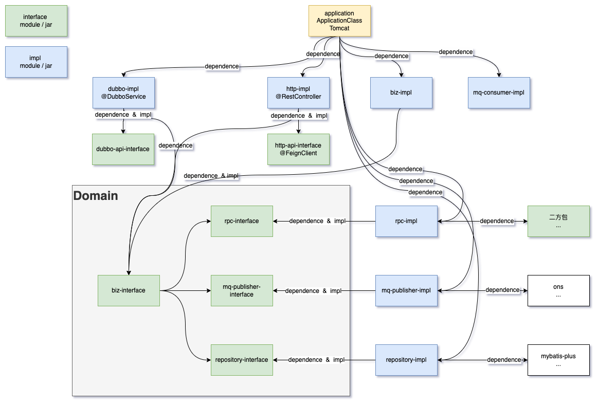

- DDD多层架构
	- ui层
	- 应用层
	- 领域层
	- 基础架构层
- maven工程结构
	- 目录接口
	- module依赖结构
	- jar包依赖结构
	- implement结构
	-
- maven工程结构依赖
  collapsed:: true
	- 
	- module依赖的目的有两种
		- 为了实现 implement
		- 为了调用 call
	- jar包依赖一般情况下是为了调用，少数情况是为了实现
	- 分层是为了规范代码调用，避免出现循环依赖，避免出现职能混乱，避免不必要的技术约定的入侵（例如token，cookie等参数不允许入侵biz-service）
	- 分离interface和impl是为了面向接口编程
	-
	- biz-interface
		- 领域实际上是对能力的定义和抽象，对应到设计图，就是对用例图的代码级定义
	- dubbo-impl、http-impl、mq-consumer
		- 能力暴露，是技术实现层面的实现，是流量入口
	- biz-impl
		- 对应到设计文档，是对业务流程图的实现
	- repository
		- repository-interface是对er图的的定义
		- repository-impl是对er图的实现
	- rpc
		- 是对对应到设计文档时序图中的二方系统生命线
		- rpc-interface是对二方服务的能力定义
		- rpc-impl是对二方服务的具体使用方式的实现
	-