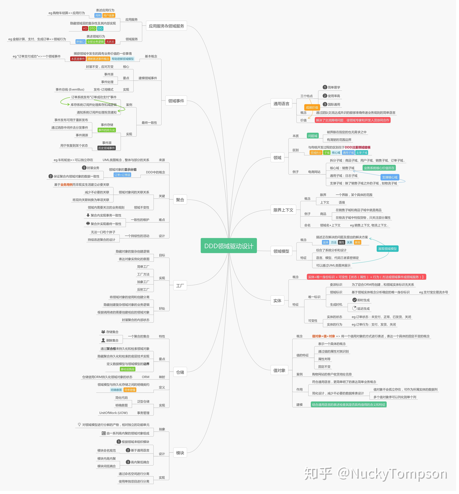
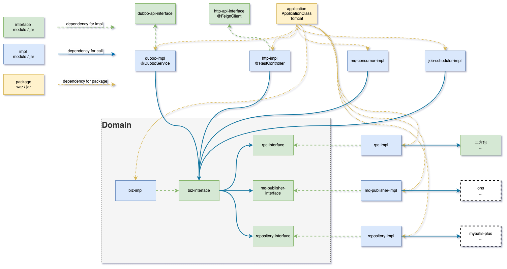
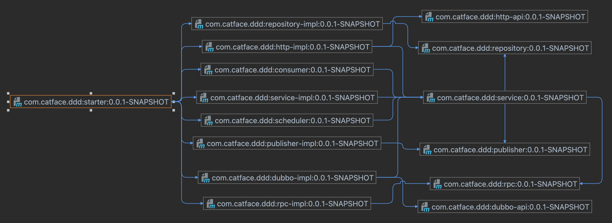
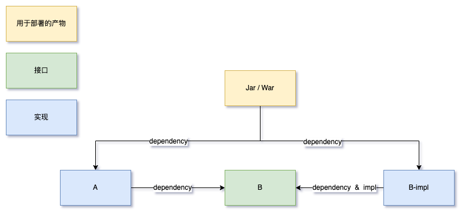

- # 引言
	- 如果你技艺超群，无招胜有招，无需在乎所谓分层，无所谓隔离...
	- 优秀的理念如何平民化，人人用的上，人人用的对
	- 可以通过约定，也可以流程，也可以通过工具来规范DDD的逻辑
		- 工具  优于  流程  优于 约定
	- DDD的作用是简化，而不是复杂化
		- 如何界定什么是复杂，什么是简单
			- 多就是复杂？
				-
			- 少就是简单？
- # DDD俯瞰
	- 
- # 程序设计原则
  collapsed:: true
	- 面向接口编程
	- 最小依赖原则
		- 只依赖定义，不依赖实现
		- 直接最小化依赖，由于间接扩大化依赖
	- 高内聚，低耦合
	- [参考](https://www.jianshu.com/p/6b5e4c9872fe)
- # 为什么要用DDD
  collapsed:: true
	- 发挥业务专家的优势
		- 业务专家不关注底层实现，不关注如何对外暴露能力，只关注业务逻辑
			- 业务逻辑的本质是
				- 模型
				- 能力的定义
				- 对能力的编排
			- 业务逻辑的调整，不影响业务的暴露和基础设施的使用
			- 基础设施的特性不入侵业务流程
				- @Transaction是否可以出现在领域层的代码
	- 能快速替换基础设置
		- 例如：从aws迁移到阿里云，scheduler更换，消息中间件更换
	- 能快速以新的服务暴露方式对外提供服务
		- 例如：dubbo换http
	- 能快速更改rpc的调用昂视
		- 例如： http 调用 换成 dubbo 调用
	- rpc接口变更，请求参数，返回结果等模型变更是否影响领域模型
		- 原则上不该影响，在rpc调用的具体实现的模块做领域模型和rpc模型的转换
	- 支持多云混合部署
		- 不同云服务的同种类型的中间件不完全相同，即基础设施未必完全相同
- # DDD多层架构
  collapsed:: true
	- ui层
	- 应用层
	- 领域层
	- 基础架构层
	- [参考](https://www.jianshu.com/p/f7c1d9fde7a8)
- # maven工程结构
  collapsed:: true
	- 目录接口
	- module依赖结构
	- jar包依赖结构
	- implement结构
	- 代码调用结构
- # 讨论
  collapsed:: true
	- DDD 多层架构、工程目录结构、模块依赖结构是不是一回事儿？maven工程的module必须跟DDD分层一一对应吗？
	- 是不是为了DDD就可抛弃原有的程序设计原则？是否在不抛弃原有设计原则的基础上，做到DDD分层？
	- 为了实现DDD的设计目标，工程结构应该做何种设计，避免出现代码不规范导致的基础设施难以替换？
- # 一个符合DDD的Spring Maven工程结构？
  collapsed:: true
	- 
	- module依赖的目的有三种
		- 为了实现 implement
			- 分离interface和impl是为了面向接口编程，对同一个接口可以有不同的实现
		- 为了调用 call
			- jar包依赖一般情况下是为了调用，少数情况是为了实现
			- 分层是为了规范代码调用，避免出现循环依赖，避免出现职能混乱，避免不必要的技术约定的入侵（例如token，cookie等参数不允许入侵biz-service）
		- 为了打包
	- 各module的用途
		- biz-interface
			- 领域实际上是对能力的定义和抽象，对应到设计图，就是对用例图的代码级定义
		- biz-impl
			- 对应到设计文档，是对业务流程图的实现，是对领域层定义的能力编排
		- dubbo-impl、http-impl、mq-consumer
			- 能力暴露，是技术实现层面的实现，是流量入口
		- repository
			- repository-interface是对Entity的持久化能力定义
			- repository-impl是对持久能力的实现
			  collapsed:: true
				- RDBMS
					- MySQL
					- Oracle
				- NoSQL
					- RDS
					- PolarDB
				- NewSQL
					- TiDB
		- rpc
			- 是对对应到设计文档时序图中的二方系统生命线
			- rpc-interface是对二方服务的能力定义
			- rpc-impl是对二方服务的具体使用方式的实现
				- http FeignClient
				- Dubbo
				- WebService
		- publisher
			- 对领域层事件进行发送的抽象能力定义
			- publisher-impl是对事件发送能力的具体实现
				- rocketmq
				- rabbitmq
				- kafka
				- ...
	- 
- # 屏蔽具体实现的方案（[[依赖倒置]]）
	- 所谓屏蔽实现，即只依赖接口，通过编排接口完成业务流程，不关心接口内部的具体实现。
	- 依赖倒置，是指底层实现上层的接口，底层不可以跨越访问屏障，底层不可以获得调用上层接口权限。
	- {:height 355, :width 747}
- # 废话
  collapsed:: true
	- 考虑全面，多方取舍，方能既要且要还要。
- # 参考资料
  collapsed:: true
	- [领域驱动设计DDD](https://www.cnblogs.com/Leo_wl/p/3866629.html)
	- [领域驱动设计-DDD基础思想](https://zhuanlan.zhihu.com/p/109114670)
	- [领域驱动设计-wiki](https://zh.wikipedia.org/wiki/%E9%A0%98%E5%9F%9F%E9%A9%85%E5%8B%95%E8%A8%AD%E8%A8%88)
	- [DDD模式-从天书到实战](https://zhuanlan.zhihu.com/p/91525839)